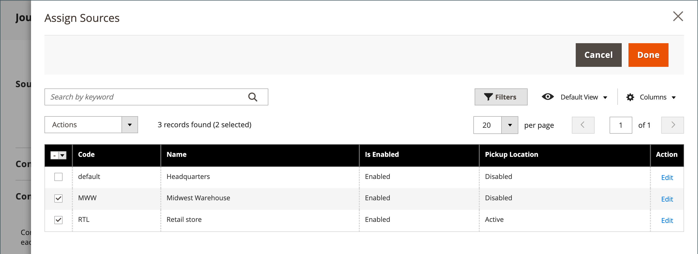

# Magazzino - Assegna origini e quantità

Per i commercianti con più sorgenti che utilizzano [[!DNL Inventory Management]](../inventory-management/introduction.md), scorri verso il basso fino a **Sorgenti** e assegna origini e quantità:

1. Per aggiungere un&#39;origine, fare clic su **[!UICONTROL Assign Sources]**.

1. Sfoglia o cerca le sorgenti e seleziona la casella di controllo accanto alle sorgenti che desideri aggiungere per il prodotto.

   {width="600" zoomable="yes"}

1. Clic **[!UICONTROL Done]** per aggiungere le sorgenti.

1. Per gestire la quantità e lo stato dell&#39;origine, fare clic su **[!UICONTROL Advanced Inventory]** e imposta **[!UICONTROL Manage Stock]** a `Yes`.

1. Imposta **[!UICONTROL Source Item Status]** a `In Stock`.

1. Inserire un importo per aggiornare **[!UICONTROL Qty]** per le scorte esistenti.

1. Per impostare una notifica per le quantità di magazzino, effettuare una delle seguenti operazioni:

   - _Quantità notifica personalizzata_ - Cancella **[!UICONTROL Notify Quantity Use Default]** e immettere un importo in **[!UICONTROL Notify Quantity]**.

   - _Quantità di notifica predefinita_ - Selezionare la **[!UICONTROL Notify Quantity Use Default]** casella di controllo. Commerce verifica e utilizza l’impostazione in [!UICONTROL Advanced Inventory] o configurazione dell’archivio globale.

   {width="600" zoomable="yes"}
