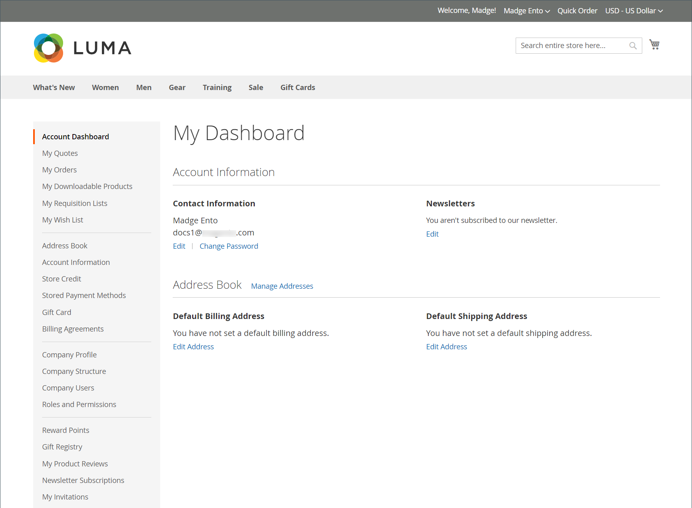

# Account società

Quando incorpori account aziendali B2B nel tuo negozio, puoi semplificare l’esperienza di acquisto aziendale consentendo alle aziende di creare più account secondari con autorizzazioni flessibili in base ai ruoli utente nella loro organizzazione. A seconda dell&#39;azienda, l&#39;amministratore del negozio può modificare le promozioni e i prezzi in base alle esigenze, e creare offerte personalizzate in base alle esigenze e agli ordini. L&#39;aggiunta di un&#39;associazione di account società a un [individuo](../customers/account-create.md) standard consente al cliente di utilizzare i flussi di lavoro di acquisto specifici definiti per la società.

Vantaggi di un account aziendale:

- Offre [utenti aziendali](account-company-users.md) illimitati e la creazione di account aggiuntivi, semplificando gli acquisti aziendali.

- Include il supporto per una gerarchia di account aziendali _smart_ con [ruoli e autorizzazioni](account-company-roles-permissions.md) diversi per l&#39;invio di ordini.

- Fornisce un meccanismo che consente ai commercianti di aumentare le entrate offrendo [credito del negozio aziendale](credit-company.md) come metodo di pagamento.

- Supporta la [gestione](account-company-manage.md) di tutti gli account società nell&#39;amministratore.

## Visualizza account società

Nella griglia _Aziende_ sono elencati tutti gli account società attivi e le richieste in sospeso, indipendentemente dall&#39;impostazione dello stato. Fornisce inoltre gli strumenti per [creare](account-company-create.md) e [gestire](account-company-manage.md) gli account aziendali. Utilizzare i controlli griglia standard per filtrare l&#39;elenco e modificare il layout delle colonne. Per un elenco delle descrizioni delle colonne, vedere la sezione _Descrizioni colonne_ in [Gestione degli account società](account-company-manage.md).

I clienti possono creare un account aziendale dalla vetrina, oppure un commerciante può crearne uno dall’amministratore. Per impostazione predefinita, la possibilità di creare account società dalla vetrina è abilitata. Se consentito dalla configurazione, un visitatore dello store può richiedere di aprire un account aziendale. Dopo l’approvazione dell’account aziendale, l’amministratore dell’azienda può impostare la struttura aziendale e gli utenti con vari livelli di autorizzazione.

Nella barra laterale _Admin_, passa a **[!UICONTROL Customers]** > **[!UICONTROL Companies]**.

{width="700" zoomable="yes"}

La griglia [!UICONTROL Companies] elenca tutte le società indipendentemente dallo stato. L’esempio visualizzato mostra gli account per due società: la società &quot;ACME&quot; e la società &quot;Vandelay&quot;.

## Amministratore società

L&#39;esempio seguente mostra la griglia _Clienti_ con gli account iniziali dell&#39;amministratore della società.

{width="700" zoomable="yes"}

È possibile che la persona che funge da amministratore dell’azienda abbia più ruoli all’interno dell’azienda. Se per l&#39;amministratore della società viene immesso un indirizzo e-mail distinto, la struttura aziendale iniziale include l&#39;amministratore della società più un account utente singolo a nome dell&#39;amministratore della società. In tal caso, l’amministratore della società può accedere all’account come società o come singolo utente.

Dopo aver creato l&#39;account, l&#39;amministratore della società definisce la struttura aziendale di [team](account-company-structure.md), imposta i [utenti della società](account-company-users.md) e stabilisce [ruoli e autorizzazioni](account-company-roles-permissions.md) per ciascuno di essi.

### Imposta la password dell&#39;amministratore della società prima del primo accesso

1. L’amministratore della società trova un messaggio e-mail di benvenuto dallo store.

   {width="500"}

   >[!NOTE]
   >
   >Le destinazioni degli indirizzi e-mail e il contenuto dell&#39;e-mail sono determinati dalle opzioni specificate nella configurazione [opzioni e-mail società](email-company-configuration.md).

1. Segue le istruzioni e fa clic su [!UICONTROL **link**] per impostare la password.

1. Immette una [!UICONTROL **nuova password**] per il proprio account e di nuovo per confermare.

   La password deve includere almeno tre dei seguenti tipi di caratteri:

   - Caratteri minuscoli (abc...)
   - Caratteri maiuscoli (ABC)
   - Numeri (1234567890)
   - Caratteri speciali (!@#$...)

1. Fai clic su [!UICONTROL **Imposta una nuova password**].

   {width="700" zoomable="yes"}

1. Quando viene visualizzata la pagina [!UICONTROL Customer Login], il cliente immette la sua [!UICONTROL **e-mail**] e la sua [!UICONTROL **password**].

1. Fai clic su [!UICONTROL **Accedi**] per accedere al dashboard dell&#39;account.

   {width="700" zoomable="yes"}

## Struttura aziendale

È possibile impostare un conto aziendale per riflettere la struttura dell&#39;attività. Inizialmente, la struttura aziendale include solo l’amministratore della società, ma può essere espansa per includere i team di utenti. Gli utenti possono essere associati a team o organizzati all’interno di una gerarchia di divisioni e suddivisioni all’interno dell’azienda. La struttura è progettata per supportare l&#39;utilizzo di [regole di approvazione](account-dashboard-approval-rules.md) per [ordini fornitore](purchase-order-flow.md) (OA) associati all&#39;account società.

{width="450"}

Nel dashboard degli account dell’amministratore della società, la struttura della società è rappresentata da una struttura ad albero ed è inizialmente costituita solo dall’amministratore della società.

{width="600"}

Al momento della creazione dell’account, l’amministratore della società può utilizzare l’indirizzo e-mail della società o riceverne uno diverso.

Nell&#39;esempio seguente, la struttura aziendale iniziale include l&#39;amministratore della società più un singolo account utente nel nome dell&#39;amministratore della società. Tuttavia, le funzioni di amministratore della società (come la struttura della società e le regole di approvazione) sono disponibili solo quando si accede all’account utente designato come amministratore della società.

{width="600"}
