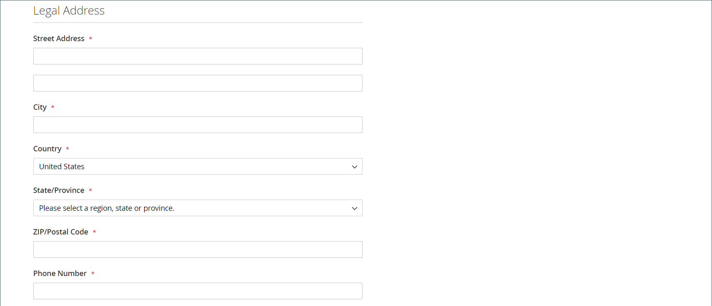

# Creare un account società

Gli account aziendali consentono alle aziende B2B di gestire i loro acquisti, gli utenti e il credito in Adobe Commerce. Questo argomento descrive l’intero processo di creazione, configurazione e attivazione degli account aziendali.

## Panoramica sulla creazione di account società

Gli account aziendali possono essere creati tramite due metodi, ciascuno adatto a scenari aziendali diversi:

* **Registrazione vetrina**: richieste di account self-service da parte delle aziende
* **Creazione amministratore**: configurazione account assistita dalle vendite con dettagli preconfigurati

Tutti gli account aziendali richiedono l’approvazione dell’amministratore prima di diventare attivi, per garantire il controllo e la configurazione corretti.

## Prerequisiti

Prima di creare gli account aziendali, verifica che siano soddisfatti i seguenti requisiti:

* **Requisiti di sistema:**
   * [Le funzionalità B2B sono abilitate](enable-basic-features.md) nell&#39;installazione di Adobe Commerce
   * La registrazione della società è abilitata per la creazione della vetrina
   * Le notifiche e-mail sono configurate per i flussi di lavoro di approvazione

* **Requisiti aziendali:**
   * I processi e i criteri di approvazione sono stabiliti
   * I rappresentanti commerciali sono assegnati (per gli account creati dall’amministratore)
   * I criteri di credito sono definiti (se si utilizza il credito aziendale)
   * Gruppi di clienti e cataloghi condivisi configurati

* **Accesso amministrativo:**
   * Autorizzazioni appropriate per la gestione aziendale
   * Accedere alle sezioni di amministrazione di clienti e società

Il sistema assegna il ruolo di [amministratore società](account-company-admin.md) alla persona che imposta un account società dalla vetrina. Dopo che l’amministratore dello store ha approvato la richiesta di creazione dell’account aziendale nell’amministratore, può impostare una password per l’account e accedere a quest’ultimo.

## Metodo 1: il cliente crea il conto dalla vetrina

**Quando utilizzare questo metodo:**

* È preferibile la registrazione self-service per le aziende
* I clienti hanno a disposizione tutte le informazioni aziendali necessarie
* È sufficiente un flusso di lavoro di approvazione standard
* Non è richiesta alcuna configurazione particolare o precompilazione

>[!IMPORTANT]
>
>Per supportare questo metodo (che consente ai clienti di registrare la propria società dalla vetrina), assicurati che le [funzionalità B2B](enable-basic-features.md) siano abilitate.

1. Nell&#39;angolo superiore destro dell&#39;intestazione della vetrina, il cliente fa clic su **[!UICONTROL Create an Account]** e sceglie **[!UICONTROL Create New Company Account]**.

   {width="700" zoomable="yes"}

   >[!NOTE]
   >
   >Se un visitatore ha effettuato l&#39;accesso a un account utente registrato, può creare un account aziendale passando a _[!UICONTROL Customer Profile]_>**[!UICONTROL Company Structure]**>**[!UICONTROL Create a Company Account]**.

1. Nella sezione _[!UICONTROL Company Information]_, il cliente effettua le seguenti operazioni:

   * Compila i campi obbligatori:

      * **[!UICONTROL Company Name]**
      * **[!UICONTROL Company Email]**

   * Compila i campi rimanenti, come applicabile:

      * **[!UICONTROL Company Legal Name]**
      * **[!UICONTROL VAT/TAX ID]**
      * **[!UICONTROL Reseller ID]**

   {width="700" zoomable="yes"}

1. Completa i campi obbligatori nella sezione _[!UICONTROL Legal Address]_.

   * **[!UICONTROL Street Address]**
   * **[!UICONTROL City]**
   * **[!UICONTROL Country]**
   * **[!UICONTROL State/Province]**
   * **[!UICONTROL ZIP/Postal Code]**
   * **[!UICONTROL Phone Number]**

   {width="700" zoomable="yes"}

1. Nella sezione _[!UICONTROL Company Administrator]_, esegue le operazioni seguenti:

   * Immette **[!UICONTROL Email address]** per l&#39;amministratore della società.

     L’indirizzo e-mail dell’amministratore della società può essere lo stesso dell’indirizzo e-mail della società o un indirizzo e-mail diverso. Se si immette un indirizzo e-mail diverso, oltre all&#39;account amministratore della società verrà creato anche un account utente della società.

   * Immette **[!UICONTROL First Name]** e **[!UICONTROL Last Name]** dell&#39;amministratore della società.

   * Facoltativamente, completa i campi seguenti:

      * **[!UICONTROL Job Title]**
      * **[!UICONTROL Work Phone Number]**
      * **[!UICONTROL Gender]**

   

1. Completa la convalida se reCAPTCHA è abilitato per questa funzione storefront.

1. Al termine delle informazioni, selezionare **[!UICONTROL Submit]**.

   Quando l’esercente approva la richiesta di creazione di un account aziendale, il sistema invia una notifica e-mail all’amministratore della società.

   {width="500"}

   Una volta impostata la password, l&#39;amministratore della società può [accedere](../customers/customer-sign-in.md) all&#39;account.

## Metodo 2: l’esercente crea l’account dall’amministratore

**Quando utilizzare questo metodo:**

* Si preferisce la creazione di account assistiti dalle vendite
* Precompilazione dei dettagli dell&#39;account dalle relazioni commerciali esistenti
* È necessaria una configurazione personalizzata (limiti di credito, prezzi speciali)
* È necessaria l&#39;attivazione immediata senza approvazione del flusso di lavoro

Il processo di creazione di una società dall’amministratore è essenzialmente lo stesso della vetrina, ma con campi aggiuntivi.

{width="700" zoomable="yes"}

1. Nella barra laterale _Admin_, passa a **[!UICONTROL Customers]** > **[!UICONTROL Companies]**.

1. Fare clic su **[!UICONTROL Add New Company]** ed effettuare le seguenti operazioni:

   * Completa i campi obbligatori seguenti:

      * **[!UICONTROL Company Name]**
      * **[!UICONTROL Company Email]**

   * Se non sei pronto per la pubblicazione dell&#39;account, imposta **[!UICONTROL Status]** su `Pending Approval`. (Imposta su `Active` per impostazione predefinita.)

   * Se applicabile, scegliere l&#39;account amministratore di **[!UICONTROL Sales Representative]** che deve gestire l&#39;account.

1. Nella sezione _[!UICONTROL Account Information]_&#x200B;eseguire le operazioni seguenti:

   * Compila i campi seguenti, a seconda dei casi:

      * **[!UICONTROL Company Legal Name]**
      * **[!UICONTROL VAT/TAX ID]**
      * **[!UICONTROL Reseller ID]**

   * Per **[!UICONTROL Comment]**, immettere le informazioni aggiuntive sul cliente che potrebbero essere necessarie.

     I commenti sono visibili solo dall’amministratore.

   {width="700" zoomable="yes"}

1. Quando si crea inizialmente una società, la griglia _[!UICONTROL Company Hierarchy]_&#x200B;appare vuota quando si espande. Dopo aver salvato la società, è possibile includerla in una gerarchia di società. Consulta [Gestione società](manage-companies.md).

1. Nella sezione _[!UICONTROL Legal Address]_, completa i seguenti campi obbligatori:

   * **[!UICONTROL Street Address]**
   * **[!UICONTROL City]**
   * **[!UICONTROL Country]**
   * **[!UICONTROL ZIP/Postal Code]**
   * **[!UICONTROL Phone Number]**

1. Nella sezione _[!UICONTROL Company Admin]_&#x200B;eseguire le operazioni seguenti:

   * Completa i campi obbligatori seguenti:

      * **[!UICONTROL Email]**
      * **[!UICONTROL First Name]**
      * **[!UICONTROL Last Name]**

   * Completa le seguenti parti facoltative del nome, che possono essere applicabili ad alcuni nomi di clienti più di altri e possono essere utilizzate a tua discrezione:

      * **[!UICONTROL Prefix]**
      * **[!UICONTROL Middle Name/Initial]**
      * **[!UICONTROL Suffix]**

   * Se le informazioni sono disponibili, compila i campi rimanenti per descrivere l’amministratore della società:

      * **[!UICONTROL Website]**
      * **[!UICONTROL Job Title]**
      * **[!UICONTROL Work Phone Number]**
      * **[!UICONTROL Gender]**
      * **[!UICONTROL Send Welcome Email From]**

   {width="700" zoomable="yes"}

1. Nella sezione _[!UICONTROL Company Credit]_, che visualizza un riepilogo dell&#39;attività di credito del cliente, completare tutti i campi nella parte inferiore della sezione, a seconda delle necessità:

   * **[!UICONTROL Credit Currency]**
   * **[!UICONTROL Credit Limit]**
   * **[!UICONTROL Allow to Exceed Credit Limit]**
   * **[!UICONTROL Reason for Change]**

   {width="700" zoomable="yes"}

1. Nella sezione _[!UICONTROL Advanced Settings]_&#x200B;eseguire le operazioni seguenti:

   >[!NOTE]
   >
   >L&#39;assegnazione del gruppo di clienti determina quale catalogo condiviso è disponibile per l&#39;azienda e i suoi dipendenti. Per impostazione predefinita, il sistema assegna la società al gruppo di clienti configurato come predefinito.

   * È possibile modificare l&#39;assegnazione **[!UICONTROL Customer Group]** per la società e i relativi dipendenti in un gruppo che ha accesso a un catalogo condiviso diverso o a un gruppo di clienti standard. Il sistema chiede di confermare prima di modificare il gruppo.

     {width="600"}

   * Se si desidera consentire ai dipendenti della società di generare preventivi dal proprio account, impostare **[!UICONTROL Allow Quotes]** su `Yes`.

   * Se si desidera consentire ai dipendenti della società di creare e utilizzare ordini fornitore dal proprio account, impostare **[!UICONTROL Enable Purchase Orders]** su `Yes`.

   * Per modificare **[!UICONTROL Applicable Payment Methods]** disponibili per la società, deselezionare la casella di controllo **[!UICONTROL Use config settings]** e scegliere una delle opzioni seguenti:

     | Opzione | Descrizione |
     |-------------------------------|-----------------------------------------------------------------------------------------------------------------------------------------------------------------------------------------------------------------------------------------|
     | `B2B Payment Methods` | (Impostazione predefinita) Abilita tutti i [metodi di pagamento impostati come predefiniti](../configuration-reference/general/b2b-features.md#default-b2b-payment-methods) per gli ordini B2B. |
     | `All Enabled Payment Methods` | Rende disponibili tutti i [metodi di pagamento abilitati](../configuration-reference/sales/payment-methods.md) per gli account cliente associati all&#39;account società. |
     | `Selected Payment Methods` | Consente di selezionare i metodi di pagamento disponibili per i conti cliente associati al conto società. Per selezionare più metodi di pagamento, tenere premuto il tasto Ctrl (PC) o il tasto Comando (Mac) e selezionare ciascuna opzione. |

     {style="table-layout:auto"}

   * Per modificare **[!UICONTROL Applicable Shipping Methods]** disponibili per la società, deselezionare la casella di controllo **[!UICONTROL Use config settings]** e scegliere una delle opzioni seguenti:

     | Opzione | Descrizione |
     |--------------------------------|----------------------------------------------------------------------------------------------------------------------------------------------------------------------------------------------------------------------------------------------------|
     | `B2B Shipping Methods` | (Impostazione predefinita) Abilita tutti i [metodi di spedizione impostati come predefiniti](../configuration-reference/general/b2b-features.md#default-b2b-shipping-methods) per gli ordini B2B. |
     | `All Enabled Shipping Methods` | Rende disponibili tutti i [metodi di spedizione abilitati](../configuration-reference/sales/delivery-methods.md) per gli account cliente associati all&#39;account società. |
     | `Selected Shipping Methods` | Consente di selezionare i metodi di spedizione disponibili per gli account cliente associati all&#39;account società. Per selezionare più metodi di spedizione, tenere premuto il tasto Ctrl (PC) o il tasto Comando (Mac) e selezionare ciascuna opzione. |

     {style="table-layout:auto"}

1. Al termine, selezionare **[!UICONTROL Save]**.

   Quando la richiesta di creazione di un account aziendale viene approvata dall’esercente, viene inviata una notifica e-mail all’indirizzo e-mail dell’amministratore della società.

   Una volta impostata la password, l&#39;amministratore della società può [accedere](../customers/customer-sign-in.md) all&#39;account.

## Dopo la creazione dell’account

Una volta creato un account aziendale, si verifica il seguente processo:

### &#x200B;1. Flusso di lavoro di approvazione

* **Stato in sospeso**: i nuovi account attendono la revisione dell&#39;amministratore
* **Processo di revisione**: gli amministratori dell&#39;archivio verificano le informazioni aziendali e approvano/rifiutano le richieste
* **Aggiornamenti dello stato** - Le società ricevono notifiche e-mail sulle modifiche dello stato di approvazione

### &#x200B;2. Attivazione account

* **E-mail di benvenuto**: gli amministratori aziendali approvati ricevono le istruzioni di configurazione
* **Impostazione password** - Gli amministratori creano password sicure per l&#39;accesso all&#39;account
* **Accesso iniziale**—Primo accesso al dashboard e alle funzionalità aziendali

### &#x200B;3. Passaggi successivi per gli amministratori aziendali

Dopo l&#39;attivazione, gli amministratori della società devono:

* **[Configurare la struttura aziendale](account-company-structure.md)**—Configurare i reparti e la gerarchia degli utenti
* **[Gestisci utenti società](account-company-users.md)**—Aggiungi dipendenti e assegna ruoli
* **[Imposta ordini di acquisto](purchase-order-flow.md)**—Configura i flussi di lavoro di approvazione se necessario
* **[Verifica impostazioni credito](credit-company.md)**—Comprendere e gestire il credito aziendale (se abilitato)

## Problemi comuni e risoluzione dei problemi

### Problemi di creazione dell’account

**Impossibile inviare il modulo di registrazione**

* Verifica che tutti i campi obbligatori siano stati completati correttamente
* Verifica che gli indirizzi e-mail siano validi e univoci
* Verificare che le funzioni B2B siano abilitate e che la registrazione della società sia consentita
* Cancella la cache del browser e riprova

**Il Nome Della Società Esiste Già**

* Scegli un nome azienda univoco
* Se ritieni che si tratti di un errore, contatta l’amministratore
* Considerare l&#39;aggiunta di un identificatore di ubicazione o di business unit

**Problemi relativi all&#39;indirizzo e-mail**

* Utilizza indirizzi e-mail aziendali anziché personali
* Assicurati che l’e-mail dell’amministratore della società sia accessibile
* Verifica che il dominio non sia bloccato dai filtri e-mail

### Problemi di approvazione e attivazione

**E-Mail Di Approvazione Non Ricevuta**

* Controllare le cartelle di posta indesiderata/indesiderata
* Verifica che l’indirizzo e-mail sia stato immesso correttamente durante la registrazione
* Contattare l&#39;amministratore del punto vendita per verificare manualmente lo stato di approvazione
* Consenti 24-48 ore di elaborazione in giorni lavorativi

**Impossibile Impostare La Password Dopo L&#39;Approvazione**

* Utilizza il collegamento fornito nell’e-mail di approvazione
* Controlla se il collegamento di attivazione è scaduto
* Richiedi un nuovo messaggio e-mail di attivazione all&#39;amministratore

**Problemi Di Accesso Dopo L&#39;Attivazione**

* Verifica di effettuare l&#39;accesso tramite il portale dell&#39;account aziendale corretto
* Verifica che il tuo account sia &quot;Attivo&quot;
* Verificare di utilizzare le credenziali di amministratore della società
* Contatta il supporto se le autorizzazioni sembrano errate

## Best practice per la sicurezza

Durante la creazione e la gestione degli account aziendali:

* **Usa password complesse** - Richiede password complesse per gli amministratori della società
* **Verifica informazioni aziendali**—Convalida dettagli società durante il processo di approvazione
* **Monitoraggio dell&#39;attività dell&#39;account**: verifica regolarmente l&#39;accesso e le autorizzazioni degli utenti aziendali
* **Proteggi dati sensibili**. Assicurati che le informazioni finanziarie e di credito siano protette correttamente

## Riferimento all’interfaccia utente dell’account aziendale

### Barra dei pulsanti

| Pulsante | Descrizione |
|---------------------------|------------------------------------------------------------------|
| [!UICONTROL Back] | Torna alla pagina Società senza salvare le modifiche. |
| [!UICONTROL Reset] | Ripristina i valori originali in tutti i campi con modifiche non salvate. |
| [!UICONTROL Save] | Salva le modifiche all&#39;azienda e mantiene aperto il profilo. |
| [!UICONTROL Save & Close] | Salva le modifiche all&#39;azienda e chiude il profilo. |

{style="table-layout:auto"}

### Descrizioni dei campi

| Campo | Descrizione |
|-----------------------------------|---------------------------------------------------------------------------------------------------------------------------------------------------------------------------------------------------------------------------------------------------------------------------------------------------------------------------------------------------------------------------------------------------------------------------------------------------------------------------------------------------------------------------------------------------------------------------------------------------------------------------------------------------------------------------------------------------------------------------------------------------------------------------------------------------------------------------------------------------------------------------------------------------------------------------------|
| [!UICONTROL Company Name] | Il nome della società viene immesso al momento della creazione dell&#39;account della società e può essere una versione ridotta della ragione sociale completa. |
| [!UICONTROL Status] | (Solo amministratore) indica lo stato corrente dell’account aziendale. Opzioni:  **[!UICONTROL Active]**- L&#39;account società è approvato dall&#39;amministratore dello store. L’amministratore della società e i membri associati possono accedere all’account dalla vetrina e effettuare acquisti. **[!UICONTROL Pending Approval]** - Una richiesta di apertura di un account società è stata inviata, ma non è ancora stata approvata dall&#39;amministratore dello store.  **[!UICONTROL Rejected]**- Richiesta di apertura di un account società inviata, ma non approvata dall&#39;amministratore dello store. Le credenziali di accesso iniziali utilizzate per inviare la richiesta sono bloccate. **&#x200B; Bloccato &#x200B;**- I membri della società possono accedere al catalogo e accedervi, ma non possono effettuare acquisti. L’amministratore dello store potrebbe bloccare un account aziendale che non è in buono stato. Il blocco sull’account può essere rimosso dall’amministratore dello store in qualsiasi momento. |
| [!UICONTROL Company Email] | L’indirizzo e-mail associato all’account aziendale. |
| [!UICONTROL Sales Representative] | (Solo amministratore) L’utente amministratore che è il contatto principale per l’account aziendale. |

{style="table-layout:auto"}

#### [!UICONTROL Account Information]

| Campo | Descrizione |
|---------------------------------|-----------------------------------------------------------------------------------------------------------------------------------------------------------------------------------------------------------------------------------------------------------------------------------------------------------------------------------------------------------------------------------------------------------------------------------------------------------------|
| [!UICONTROL Company Legal Name] | La ragione sociale completa della società. |
| [!UICONTROL VAT / TAX ID] | Il numero [imposta sul valore aggiunto](../stores-purchase/vat.md) assegnato alla società da alcune giurisdizioni a scopo di dichiarazione fiscale. Per configurare l&#39;ID IVA/IVA cliente in modo che venga visualizzato nella vetrina, vedere [Crea nuove opzioni account](../configuration-reference/customers/customer-configuration.md).   **_Note:_** L&#39;amministratore della società e gli altri utenti della società non dispongono di un proprio numero di partita IVA/PARTITA IVA separato nel proprio account cliente. |
| [!UICONTROL Reseller ID] | Numero di rivendita assegnato alla società a scopo di dichiarazione fiscale. |
| [!UICONTROL Comment] | (Solo amministratori) Queste note sull’account aziendale sono da consultare e sono visibili solo dall’amministratore. |

{style="table-layout:auto"}

#### [!UICONTROL Company Hierarchy]

| Campo | Descrizione |
|-----------------------------------|------------------------------------------------------------------------------------------------------------------------------------------------------|
| [!UICONTROL Company ID] | Il numero ID della società. |
| [!UICONTROL Company Name] | Il nome completo della società.  Un `current company indicator` viene visualizzato nella riga società in fase di modifica. |
| [!UICONTROL Company Email] | L’indirizzo e-mail associato all’account aziendale. |
| [!UICONTROL Phone Number] | Il numero di telefono principale della società. |
| [!UICONTROL Country] | Il paese in cui la società è registrata per condurre gli affari. |
| [!UICONTROL State/Province] | Lo stato o la provincia in cui la società è registrata per condurre affari. |
| [!UICONTROL City] | La città in cui la società è registrata per condurre gli affari. |
| [!UICONTROL Group/Shared Catalog] | (Solo amministratori) mostra il [gruppo clienti](../customers/customer-groups.md) o il [catalogo condiviso](catalog-shared.md) assegnato alla società. |
| [!UICONTROL Company Admin] | Nome completo dell&#39;amministratore della società. |
| [!UICONTROL Action] | L’elenco delle azioni possibili per quella riga aziendale. |

{style="table-layout:auto"}

#### [!UICONTROL Legal Address]

| Campo | Descrizione |
|------------------------------|-----------------------------------------------------------------------------|
| [!UICONTROL Street Address] | Indirizzo in cui è registrata la società per la conduzione di affari. |
| [!UICONTROL City] | La città in cui la società è registrata per condurre gli affari. |
| [!UICONTROL Country] | Il paese in cui la società è registrata per condurre gli affari. |
| [!UICONTROL State/Province] | Lo stato o la provincia in cui la società è registrata per condurre affari. |
| [!UICONTROL ZIP/Postal Code] | Il codice postale o ZIP in cui la società è registrata per condurre affari. |
| [!UICONTROL Phone Number] | Il numero di telefono principale della società. |

{style="table-layout:auto"}

#### [!UICONTROL Company Admin]

| Campo | Descrizione |
|--------------------------------------|---------------------------------------------------------------------------------------------------------------------------------------------------------------------------------------------------------------------------------------------------|
| [!UICONTROL Website] | Determina il sito Web a cui appartiene l&#39;amministratore della società. |
| [!UICONTROL Job Title] | Titolo dell&#39;amministratore della società che gestisce l&#39;account della società. |
| [!UICONTROL Work Phone Number] | Numero di telefono dell&#39;amministratore della società che gestisce l&#39;account della società. |
| [!UICONTROL Email] | L’indirizzo e-mail dell’amministratore della società può essere lo stesso dell’indirizzo e-mail della società. Se si immette un indirizzo e-mail diverso, oltre all&#39;account aziendale verrà creato un account individuale separato per l&#39;amministratore della società. |
| [!UICONTROL Prefix] | Se applicabile, il prefisso associato al nome dell&#39;amministratore della società (ad esempio `Mr.`, `Ms.`, `Mrs.` o `Dr.`). A seconda della configurazione, il campo di input potrebbe essere un campo di testo o un elenco. |
| [!UICONTROL First Name] | Nome dell&#39;amministratore della società. |
| [!UICONTROL Middle Name/Initial] | Secondo nome o iniziale dell&#39;amministratore della società. |
| [!UICONTROL Last Name] | Cognome dell&#39;amministratore della società. |
| [!UICONTROL Suffix] | Se applicabile, il suffisso associato al nome dell&#39;amministratore della società (ad esempio `Jr.`, `Sr.` o `III.`). A seconda della configurazione, il campo di input potrebbe essere un campo di testo o un elenco. |
| [!UICONTROL Gender] | Genere dell&#39;amministratore della società. Opzioni: `Male` / `Female` / `Not Specified` |
| [!UICONTROL Send Welcome Email From] | La visualizzazione store da cui il sistema invia l&#39;e-mail di benvenuto. |

{style="table-layout:auto"}

#### [!UICONTROL Company Credit]

| Campo | Descrizione |
|-------------------------------------------|-----------------------------------------------------------------------------------------------------------------------------------------------------------------------------------------|
| [!UICONTROL Credit Currency] | (Solo amministratori) Valuta accettata dal punto vendita per gli acquisti a credito della società. |
| [!UICONTROL Credit Limit] | (Solo amministratori) Limite di credito esteso al conto aziendale. |
| [!UICONTROL Allow to Exceed Credit Limit] | (Solo amministratori) indica se l’azienda dispone dell’autorizzazione per superare il limite di credito. Opzioni: `Yes` / `No` |
| [!UICONTROL Reason for Change] | (Solo amministratori) Una nota che spiega perché alla società è consentito o non è consentito superare il limite di credito. Questo campo è attivo solo se cambia l’autorizzazione per il superamento del limite di credito. |

{style="table-layout:auto"}

#### [!UICONTROL Advanced Settings]

Puoi configurare le impostazioni avanzate per le singole società. Se crei una gerarchia di società, puoi semplificare la configurazione delle impostazioni configurando le impostazioni per la società principale e applicandole a tutte le società secondarie o a quelle selezionate, anziché configurare ogni singola società secondaria. Per ulteriori informazioni, vedere [Gestire la gerarchia della società](manage-company-hierarchy.md).

| Campo | Descrizione |
|------------------------------------------|--------------------------------------------------------------------------------------------------------------------------------------------------------------------------------------------------------------------------|
| [!UICONTROL Customer Group] | (Solo amministratori) mostra il [gruppo clienti](../customers/customer-groups.md) o il [catalogo condiviso](catalog-shared.md) assegnato alla società. |
| [!UICONTROL Allow Quotes] | (Solo amministratore) Determina se i membri della società possono preparare e inviare preventivi negoziabili per conto della società. |
| [!UICONTROL Enable Purchase Orders] | (Solo amministratore) Determina se i membri della società possono inviare ordini come [ordini di acquisto](account-dashboard-my-purchase-orders.md) per conto della società. |
| Metodi di pagamento applicabili | (Solo amministratori) indica i metodi di pagamento disponibili per gli acquisti aziendali. Opzioni: `B2B Payment Methods` / `All Enabled Payment Methods` / `Selected Payment Methods` |
| [!UICONTROL Payment Methods] | (Solo amministratori) diventa attivo se attivi specifici metodi di pagamento. Per rendere disponibili più metodi di pagamento per l&#39;account aziendale, tenere premuto il tasto Ctrl (PC) o il tasto Comando (Mac) e selezionare ciascuna opzione. |
| [!UICONTROL Applicable Shipping Methods] | (Solo amministratori) indica i metodi di spedizione disponibili per gli acquisti aziendali. Opzioni: `B2B Shipping Methods` / `All Enabled Shipping Methods` / `Selected Shipping Methods` |
| [!UICONTROL Shipping Methods] | (Solo amministratori) diventa attivo se attivi specifici metodi di spedizione. Per rendere disponibili più metodi di spedizione per l&#39;account aziendale, tenere premuto il tasto Ctrl (PC) o il tasto Comando (Mac) e selezionare ciascuna opzione. |

{style="table-layout:auto"}

>[!MORELIKETHIS]
>
>* [Abilita funzionalità B2B](enable-basic-features.md): configura funzionalità B2B fondamentali
>* [Struttura account società](account-company-structure.md): organizza utenti e reparti dalla vetrina
>* [Gestisci utenti società](account-company-users.md)—Aggiungi e configura account dipendenti dalla vetrina
>* [Ruolo amministratore società](account-company-admin.md)—Comprendere le responsabilità dell&#39;amministratore
>* [Gestione società](manage-companies.md): panoramica amministrativa della gestione aziendale
>* [Gestione del credito aziendale](credit-company.md)—Imposta e gestisci il credito aziendale dall&#39;amministratore
>* [Flusso di lavoro ordine di acquisto](purchase-order-flow.md) - Configura i processi di approvazione dell&#39;amministratore
>* [Ruoli e autorizzazioni società](account-company-roles-permissions.md) - Controlla i livelli di accesso degli utenti dall&#39;amministratore
>* [Riferimento configurazione B2B](../configuration-reference/general/b2b-features.md)—Impostazioni di sistema dettagliate
