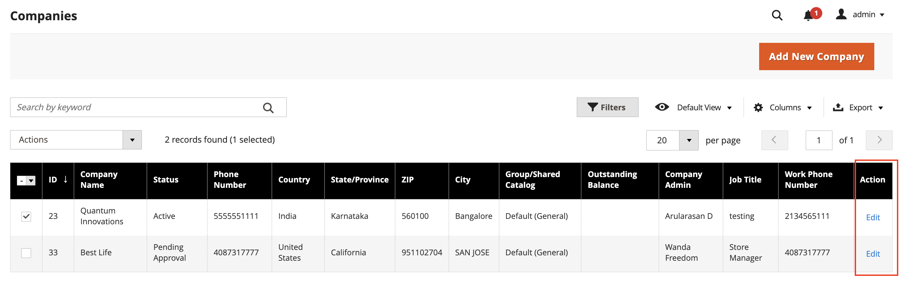

# Assegnare un gruppo di clienti a una società

L’assegnazione di un gruppo di clienti a un’azienda equivale essenzialmente all’assegnazione di un catalogo condiviso. Se il Catalogo condiviso non è abilitato [nella configurazione](enable-basic-features.md), a una società viene assegnato un gruppo di clienti anziché un Catalogo condiviso.

- È possibile assegnare un solo gruppo di clienti o un catalogo condiviso alla volta a una società. Impossibile eliminare un gruppo di clienti associato a un catalogo condiviso.
- La modifica del gruppo di clienti assegnato alla società aggiorna i profili di tutti i membri della società.
- Se l&#39;assegnazione del gruppo di clienti viene cambiata da un catalogo condiviso a un gruppo di clienti normale, i membri della società perdono l&#39;accesso al catalogo condiviso e il catalogo principale diventa disponibile dalla vetrina.
- Dopo aver modificato il gruppo della società, un utente della società deve disconnettersi e accedere allo Storefront per visualizzare i nuovi prezzi nel catalogo.

## Modificare il gruppo di clienti

1. Nella barra laterale _Admin_, passa a **[!UICONTROL Customers]** > **[!UICONTROL Companies]**.

1. Trovare la società nella griglia e fare clic su **[!UICONTROL Edit]** nella colonna _[!UICONTROL Action]_.

   {width="700" zoomable="yes"}

1. Nella pagina dell&#39;azienda, scorri verso il basso ed espandi il  nella sezione **[!UICONTROL Advanced Settings]**.

1. Imposta il **[!UICONTROL Customer Group]** appropriato.

   L&#39;elenco [!UICONTROL Customer Group] include tutti i cataloghi condivisi esistenti, anche se Cataloghi condivisi è disabilitato nella configurazione.

   {width="600"}

1. Quando viene richiesto di confermare, fare clic su **[!UICONTROL Proceed]**.

1. Fare clic su **[!UICONTROL Save]**.
