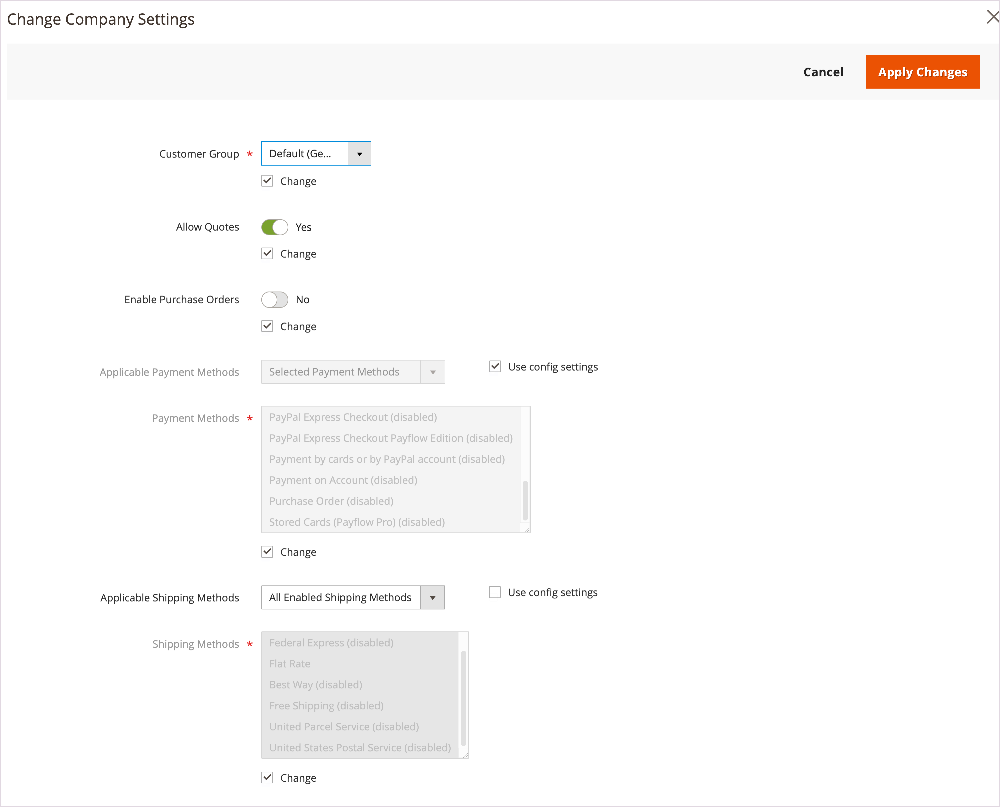

# Gestire gli account aziendali

Nella pagina _[!UICONTROL Companies]_sono elencati tutti gli account società correnti, indipendentemente dallo stato. Tutte le richieste di approvazione in sospeso vengono visualizzate nella parte superiore dell&#39;elenco.

{width="700" zoomable="yes"}

Utilizzare il controllo *[!UICONTROL Columns]* per personalizzare le colonne visualizzate nella griglia. Personalizza le aziende visualizzate nella vista utilizzando le funzionalità di ricerca e filtro.

- Trova aziende nella griglia **Aziende** utilizzando _[!UICONTROL Search]_. La ricerca indicizza le colonne **Nome società**e **Padre**.

- Personalizzare la visualizzazione per includere i record che soddisfano criteri specifici utilizzando [!UICONTROL Filter]. Ad esempio, se il sito B2B è configurato per gestire sia account di una singola società che [gerarchie di società](manage-companies.md), è possibile filtrare per `[!UICONTROL Company Type - Company]` in modo da visualizzare solo singole società o per `[!UICONTROL Company Type - Parent]` in modo da visualizzare solo la società padre per ogni gerarchia.

Applicare un&#39;azione a più record aziendali utilizzando il controllo _[!UICONTROL Actions]_sopra la griglia. Ad esempio, invece di approvare ogni singola richiesta aziendale, puoi selezionare più richieste per attivare gli account in un’unica azione. Le azioni disponibili dipendono dalle [autorizzazioni](../systems/permissions.md) per il ruolo assegnato al tuo account utente amministratore.

## Risorse per il ruolo della società

Le impostazioni delle [risorse ruolo](../systems/permissions-user-roles.md#role-resources) determinano la possibilità di:

- Aggiungi una società
- Eliminare una società
- Applicare un rimborso a saldo
- Visualizza società

Queste risorse ruolo devono essere impostate per il [Ruolo utente](../systems/permissions-user-roles.md) assegnato all&#39;account utente Amministratore.

## Gestisci account società dalla griglia Società

Visualizzare e gestire gli account utente per le società dal menu Amministratore selezionando **[!UICONTROL Customers]** > **[!UICONTROL Companies]** per aprire la pagina *[!UICONTROL Companies]*.

Puoi gestire gli account singolarmente o in gruppi.

- Visualizzare o modificare le impostazioni di configurazione per un singolo account società selezionando **[!UICONTROL Edit]** nella colonna **[!UICONTROL Action]** per il record account società.

  {width="675" zoomable="yes"}

- Visualizzare o modificare un gruppo di account società selezionati utilizzando le opzioni disponibili nel controllo [!UICONTROL Actions]** sopra la griglia.

  {width="675" zoomable="yes"}

Per istruzioni sull’applicazione di ciascuna azione, consulta le sezioni seguenti.

### Attiva account società

1. Dal controllo **[!UICONTROL Actions]**, selezionare **[!UICONTROL Set Active]**.

1. Quando viene richiesto di confermare, fare clic su **[!UICONTROL OK]**.

### Imposta come attivo/inattivo

I clienti con account inattivi non possono effettuare l&#39;accesso o effettuare acquisti dai loro account. Esistono due metodi per impostare un account cliente come attivo o inattivo:

Metodo 1: **Dalla griglia Clienti**

1. Nella barra laterale _Amministratore_, vai a [!UICONTROL **Clienti**] > [!UICONTROL **Tutti i clienti**].

1. Dal menu **[!UICONTROL Actions]**, selezionare una delle opzioni seguenti:

   - **[!UICONTROL Active]**
   - **[!UICONTROL Inactive]**

1. Quando richiesto, selezionare **[!UICONTROL OK]** per applicare la modifica.

Metodo 2: **Dalla pagina di modifica account**

1. Nella barra laterale _Amministratore_, vai a [!UICONTROL **Clienti**] > [!UICONTROL **Tutti i clienti**].

1. Nella griglia individuare il record cliente da modificare.

1. Nella colonna _Azioni_ all&#39;estrema destra, seleziona [!UICONTROL **Modifica**].

1. Selezionare la scheda [!UICONTROL **Informazioni account**].

1. Imposta [!UICONTROL **Cliente attivo**] su `Yes` o `No`.

1. Fai clic su [!UICONTROL **Salva cliente**].

### Blocca account società

Gli utenti associati a un account aziendale bloccato possono effettuare l&#39;accesso e accedere al catalogo, ma non possono effettuare acquisti. Un&#39;azienda con un account che non è in buono stato potrebbe essere temporaneamente bloccata fino a quando la questione non viene risolta.

1. Dal controllo **[!UICONTROL Actions]**, selezionare **[!UICONTROL Block]**.

1. Quando viene richiesto di confermare, fare clic su **[!UICONTROL OK]**.

### Elimina account società

Non è possibile ripristinare gli account società eliminati. Lo stato degli account utente associati alla società è impostato su `Inactive` e l&#39;ID società viene rimosso dai profili degli account utente. Le informazioni sulle attività e sulle transazioni aziendali vengono conservate nel sistema.

1. Dal controllo **[!UICONTROL Actions]**, selezionare **[!UICONTROL Delete]**.

1. Quando viene richiesto di confermare, fare clic su **[!UICONTROL OK]**.

### Modificare le impostazioni aziendali

Aggiorna la configurazione delle [Impostazioni avanzate](account-company-create.md#advanced-settings) per applicare le stesse impostazioni a più società selezionate nella *griglia Aziende*.

>[!NOTE]
>
>Gestisci la configurazione delle impostazioni avanzate per un&#39;organizzazione aziendale con un padre e società figlio associate dalla [visualizzazione Gerarchia società](manage-company-hierarchy.md#change-company-settings).

1. Dal controllo **[!UICONTROL Actions]**, selezionare **[!UICONTROL Change company settings]**.

   Nel modulo *[!UICONTROL Change company settings]*, le impostazioni di configurazione iniziali sono impostate sui valori predefiniti.

1. Per ogni impostazione di configurazione da modificare, selezionare la casella di controllo **[!UICONTROL Change]** per abilitare l&#39;impostazione. Quindi, aggiorna l’impostazione secondo necessità.

   {width="675" zoomable="yes"}

1. Dopo aver aggiornato le impostazioni di configurazione, selezionare **[!UICONTROL Apply Changes]**.

1. Quando richiesto, selezionare **[!UICONTROL Change settings]** per aggiornare la configurazione per le società selezionate.

>[!TIP]
>
>È possibile modificare la configurazione delle impostazioni avanzate per una singola società selezionando **[!UICONTROL Edit]** nella colonna **[!UICONTROL Action]** per il record account società.

### Convertire la valuta del credito

Il credito nei conti delle società selezionate viene convertito nel tasso corrente della valuta selezionata.

1. Dal controllo **[!UICONTROL Actions]**, selezionare **[!UICONTROL Convert Currency]**.

1. Quando viene richiesto di confermare, fare clic su **[!UICONTROL OK]**.

1. Scegliere **[!UICONTROL Credit Currency]** da utilizzare per gli account società selezionati.

   Gli importi vengono ricalcolati in base ai tassi di conversione correnti, se disponibili. Se non disponibile, puoi immettere manualmente i tassi di conversione personalizzati. Il sistema visualizza tutti i calcoli di conversione necessari per la valuta di credito utilizzata dalle società selezionate.

1. Fare clic su **[!UICONTROL Proceed]** per completare la conversione.

## Modificare un account società

Metodo 1: **Modifica rapida**

1. Nella prima colonna selezionare la casella di controllo dell&#39;account società da modificare.

1. Dal controllo **[!UICONTROL Actions]**, selezionare **[!UICONTROL Edit]**.

   Ogni valore che può essere aggiornato viene visualizzato in una casella di testo.

   {width="675" zoomable="yes"}

1. Se necessario, aggiorna uno dei seguenti valori:

   - **[!UICONTROL Company Name]**

   - **[!UICONTROL Company Email]**

   - **[!UICONTROL Phone Number]**

1. Fare clic su **[!UICONTROL Save]**.

Metodo 2: **Modifica completa**

1. Nella griglia individuare il record società da modificare.

1. Selezionare **[!UICONTROL Edit]** dalla colonna _[!UICONTROL Action]_.

1. Apportare le modifiche necessarie alle informazioni aziendali.

   Per le descrizioni dei campi, vedere [Creare un account aziendale](account-company-create.md).

1. Al termine, fare clic su **[!UICONTROL Save]**.

## Assegna un rappresentante commerciale

Il rappresentante commerciale è un [utente amministratore](../systems/permissions.md) che viene assegnato come punto di contatto per un account aziendale e riceve tutti i [messaggi di posta elettronica automatizzati](../b2b/enable-basic-features.md#configure-company-email-options) relativi all&#39;azienda. È possibile assegnare un solo rappresentante commerciale per ogni account aziendale, ma un singolo rappresentante commerciale può gestire più account aziendali. L&#39;account utente Amministratore predefinito viene assegnato come rappresentante commerciale, a meno che non venga assegnato un altro utente Amministratore.

Il nome e l&#39;indirizzo di posta elettronica del rappresentante commerciale assegnato sono visibili ai membri della società dalla pagina Account società e preventivi.

1. Nella barra laterale _Admin_, passa a **[!UICONTROL Customers]** > **[!UICONTROL Companies]**.

1. Trova la società nella griglia e aprila in modalità di modifica.

1. Impostare **[!UICONTROL Sales Representative]** sull&#39;utente amministratore che si desidera assegnare come punto di contatto per la società.

1. Al termine, fare clic su **[!UICONTROL Save]**.

   Il rappresentante commerciale assegnato riceve una notifica e-mail dell&#39;assegnazione.

## Aggiornare un profilo società

Il profilo aziendale può essere gestito dalla vetrina dall’amministratore della società e dall’amministratore di un negozio.

{width="700" zoomable="yes"}

1. Nella barra laterale _Admin_, passa a **[!UICONTROL Customers]** > **[!UICONTROL Companies]**.

1. Trovare la società nella griglia e fare clic su **[!UICONTROL Edit]** nella colonna _[!UICONTROL Action]_.

1. Aggiorna i valori dei campi in ciascuna sezione in base alle esigenze utilizzando le descrizioni dei campi come riferimento.

1. Al termine, fare clic su **[!UICONTROL Save]**.

## Demo account società

Per scoprire come gestire gli account aziendali, guarda questo video:

>[!VIDEO](https://video.tv.adobe.com/v/344447?quality=12)

## Gestione società

Dopo la creazione di una società, gli utenti amministratori con le autorizzazioni appropriate possono utilizzare la sezione [!UICONTROL Company Hierarchy] per creare un&#39;organizzazione della società padre modificando la società padre designata e assegnando società correlate.

Se una società è stata aggiunta a una gerarchia, nella griglia [!UICONTROL Company Hierarchy] vengono visualizzate la società padre e tutte le società assegnate.

Per ulteriori informazioni, vedere [Gestione gerarchia società](manage-company-hierarchy.md).

## Opzioni e colonne società

Le sezioni seguenti forniscono un riferimento per le azioni disponibili, le opzioni e le informazioni visualizzate disponibili per la gestione degli account aziendali.

### Opzioni di controllo delle azioni

| Opzione | Descrizione |
|--------------------------------------|---------------------------------------------------------------------------------------------------------------------------------------------------------------------------------------------------------------------------------------------------------------------------------|
| [!UICONTROL Set Active] | Imposta lo stato di tutti i record società selezionati su `Active`. Gli amministratori della società ricevono istruzioni per impostare le password in modo da poter accedere ai propri account e gestire le società dalla vetrina. |
| [!UICONTROL Block] | Limita i conti aziendali che non sono in buono stato, mantenendo al contempo l’account. I membri della società possono effettuare l&#39;accesso e accedere al catalogo, ma non possono effettuare ordini per conto della società. |
| [!UICONTROL Delete] | Elimina gli account società selezionati. Lo stato degli account utente associati a una società eliminata è impostato su `Inactive` e l&#39;ID società viene rimosso dai profili degli account utente. Le informazioni sulle attività e sulle transazioni aziendali vengono conservate nel sistema. |
| [!UICONTROL Edit] | Consente di modificare alcuni valori del record società selezionato dalla griglia. Per impostazione predefinita, i valori Nome società, E-mail società e Numero di telefono sono disponibili per una modifica rapida. |
| [!UICONTROL Change company settings] | Apre il modulo *Modifica impostazioni società* per aggiornare la configurazione [Impostazioni avanzate](account-company-create.md#advanced-settings) e applicare le modifiche alle società selezionate. |
| [!UICONTROL Convert Credit] | Converte il credito in conto per le società selezionate in base ai tassi della valuta specificata. |

{style="table-layout:auto"}

### Descrizioni delle colonne

#### Layout colonne predefinito

| Colonna | Descrizione |
|-----------------------------------|--------------------------------------------------------------------------------------------------------------------------------------------------------------------------------------------------------------------------------------------------------------------------------------------------------------------------------------------------------------------------------------------------------------------------------------------------------------------------|
| [!UICONTROL Select] | Caselle di controllo utilizzate per selezionare i record aziendali che devono essere oggetto di un&#39;azione o utilizzare il controllo di selezione nell&#39;intestazione di colonna per selezionare/deselezionare tutti. |
| [!UICONTROL ID] | Identificatore numerico univoco assegnato quando viene inviata la richiesta di creazione di una società. |
| [!UICONTROL Company Name] | Il nome della società viene immesso al momento della creazione dell&#39;account della società e può essere una versione ridotta della ragione sociale completa. |
| [!UICONTROL Company Type] | Il tipo di [azienda](manage-companies.md). Opzioni:  **[!UICONTROL Company]**- Per impostazione predefinita, le nuove società vengono create come società singole. **[!UICONTROL Parent]** - La società è una società madre di altre società.  **[!UICONTROL Child]**- Questa società è correlata a una società madre. |
| [!UICONTROL Parent] | Mostra la società padre per questa linea specifica della società. |
| [!UICONTROL Company Email] | L’indirizzo e-mail associato all’account aziendale. |
| [!UICONTROL Phone Number] | Il numero di telefono principale della società. |
| [!UICONTROL Country] | Il paese in cui la società è registrata per condurre gli affari. |
| [!UICONTROL State Province] | Lo stato o la provincia in cui la società è registrata per condurre affari. |
| [!UICONTROL City] | La città in cui la società è registrata per condurre gli affari. |
| [!UICONTROL Group/Shared Catalog] | Il nome della colonna dipende dal fatto che nella configurazione sia abilitato o meno Catalogo condiviso. Opzioni:  **[!UICONTROL Customer Group]**- Se Catalogo condiviso non è abilitato nella configurazione, specifica il nome del [gruppo di clienti](../customers/customer-groups.md) a cui appartiene la società. **[!UICONTROL Shared Catalog]** - Se Catalogo condiviso è abilitato nella configurazione, specifica il nome del catalogo condiviso assegnato al cliente. |
| [!UICONTROL Outstanding Balance] | Saldo rimanente sul conto società. la colonna è vuota se la società non dispone di una cronologia crediti e il limite di credito è zero. |
| [!UICONTROL Company Admin] | Nome e cognome dell&#39;amministratore della società. |
| [!UICONTROL Job Title] | Qualifica dell&#39;amministratore della società. |
| [!UICONTROL Work Phone Number] | Numero di telefono di lavoro dell&#39;amministratore della società. |
| [!UICONTROL Email] | L’indirizzo e-mail dell’amministratore della società. |
| [!UICONTROL Action] | **[!UICONTROL Edit]** - Apre l&#39;account società in modalità di modifica. |

{style="table-layout:auto"}

#### Colonne aggiuntive

Le colonne seguenti sono disponibili modificando il layout [delle colonne](../getting-started/admin-grid-controls.md) della griglia.

| Colonna | Descrizione |
|---------------------------------|--------------------------------------------------------------------------------------------------------------------------------------------------------------------------------------------------------------------------------------------------------------------------------------------------------------------------------------------------------------------------------------------------------------------------------------------------------------------------------------------------------------------------------------------------------------------------------------------------------------------------------------------------------------------------------------------------------------------------------------------------------------------------------------------------------------------------------------------------------------------------------------------------------------------------------------------------------|
| [!UICONTROL Company Legal Name] | La ragione sociale completa della società. |
| [!UICONTROL Street Address] | Indirizzo in cui è registrata la società per la conduzione di affari. |
| [!UICONTROL ZIP] | Il codice postale o ZIP in cui la società è registrata per condurre affari. |
| [!UICONTROL Reseller ID] | Numero di rivendita assegnato alla società a scopo di dichiarazione fiscale. |
| [!UICONTROL VAT/TAX ID] | Il numero [imposta sul valore aggiunto](../stores-purchase/vat.md) assegnato alla società da alcune giurisdizioni a scopo di dichiarazione fiscale. Per configurare l&#39;ID IVA/IVA cliente in modo che venga visualizzato nella vetrina, vedere [Creare nuove opzioni account](../configuration-reference/customers/customer-configuration.md). |
| [!UICONTROL Credit Limit] | Limite di credito esteso al conto della società. |
| [!UICONTROL Credit Currency] | Valuta accettata dal punto vendita per gli acquisti a credito della società. |
| [!UICONTROL Status] | Indica lo [stato](account-company-approve.md) dell&#39;account società. Opzioni:  **[!UICONTROL Active]**- L&#39;account società è approvato dall&#39;amministratore dello store. L’amministratore della società e i membri associati possono accedere all’account dalla vetrina e effettuare acquisti. **[!UICONTROL Pending Approval]** - Una richiesta di apertura di un account società è stata inviata, ma non è ancora stata approvata dall&#39;amministratore dello store.  **[!UICONTROL Rejected]**- Richiesta di apertura di un account società inviata, ma non approvata dall&#39;amministratore dello store. Le credenziali di accesso iniziali utilizzate per inviare la richiesta sono bloccate. **[!UICONTROL Blocked]** - I membri della società possono accedere al catalogo e accedervi, ma non possono effettuare acquisti. L’amministratore dello store potrebbe bloccare un account aziendale che non è in buono stato. Il blocco sull’account può essere rimosso dall’amministratore dello store in qualsiasi momento. |
| [!UICONTROL Gender] | Genere dell&#39;amministratore della società. Opzioni: Maschio / Femmina / Non specificato |
| [!UICONTROL Comment] | Note sull’account aziendale da usare come riferimento e visibili solo dall’amministratore. |

{style="table-layout:auto"}

### Barra dei pulsanti

| Pulsante | Descrizione |
|--------------------------------|---------------------------------------------------------------------------------------------------------------------------------------------------------------------------------------------------------------------------------------------------------------------|
| [!UICONTROL Back] | Torna alla pagina Società senza salvare le modifiche. |
| [!DNL Delete Company] | Elimina l&#39;account società. Lo stato degli account utente associati alla società è impostato su `Inactive` e l&#39;ID società viene rimosso dai profili degli account utente. Le informazioni sulle attività e sulle transazioni aziendali vengono conservate nel sistema. |
| [!DNL Reset] | Ripristina i valori originali in tutti i campi con modifiche non salvate. |
| [!DNL Reimburse Balance] | Consente all&#39;amministratore di rimborsare il saldo dal credito del negozio, indicato dal numero OA. |
| [!DNL Save] | Salva le modifiche all&#39;azienda e mantiene aperto il profilo. |
| [!UICONTROL Save & Close] | Salva le modifiche all&#39;azienda e chiude il profilo. |

{style="table-layout:auto"}

### Descrizioni dei campi

| Campo | Descrizione |
|-----------------------------------|--------------------------------------------------------------------------------------------------------------------------------------------------------------------------------------------------------------------------------------------------------------------------------------------------------------------------------------------------------------------------------------------------------------------------------------------------------------------------------------------------------------------------------------------------------------------------------------------------------------------------------------------------------------------------------------------------------------------------------------------------------------------------------------------------------------------------------------------------------------------------------------------------------------------------------------------------------|
| [!UICONTROL Company Name] | Il nome della società viene immesso al momento della creazione dell&#39;account della società e può essere una versione ridotta della ragione sociale completa. |
| [!UICONTROL Status] | Indica lo [stato](account-company-approve.md) dell&#39;account società. Opzioni:  **[!UICONTROL Active]**- L&#39;account società è approvato dall&#39;amministratore dello store. L’amministratore della società e i membri associati possono accedere all’account dalla vetrina e effettuare acquisti. **[!UICONTROL Pending Approval]** - Una richiesta di apertura di un account società è stata inviata, ma non è ancora stata approvata dall&#39;amministratore dello store.  **[!UICONTROL Rejected]**- Richiesta di apertura di un account società inviata, ma non approvata dall&#39;amministratore dello store. Le credenziali di accesso iniziali utilizzate per inviare la richiesta sono bloccate. **[!UICONTROL Blocked]** - I membri della società possono accedere al catalogo e accedervi, ma non possono effettuare acquisti. L’amministratore dello store potrebbe bloccare un account aziendale che non è in buono stato. Il blocco sull’account può essere rimosso dall’amministratore dello store in qualsiasi momento. |
| [!UICONTROL Company Email] | L’indirizzo e-mail associato all’account aziendale. |
| [!UICONTROL Sales Representative] | L’utente amministratore che è il contatto principale per l’account aziendale. |

{style="table-layout:auto"}

#### [!UICONTROL Account Information]

| Campo | Descrizione |
|---------------------------------|----------------------------------------------------------------------------------------------------------------------------|
| [!UICONTROL Company Legal Name] | La ragione sociale completa della società. |
| [!UICONTROL VAT / TAX ID] | Numero di imposta o [imposta sul valore aggiunto](../stores-purchase/vat.md) assegnato alla società a scopo di dichiarazione fiscale. |
| [!UICONTROL Reseller ID] | Numero di rivendita assegnato alla società a scopo di dichiarazione fiscale. |
| [!UICONTROL Comment] | Queste note sull’account aziendale sono da consultare e sono visibili solo dall’Amministratore. |

{style="table-layout:auto"}

#### [!UICONTROL Company Hierarchy]

| Colonne | Descrizione |
|-----------------------------|------------------------------------------------------------------------------------------------------------------------------------------------------|
| [!UICONTROL Company ID] | Il numero ID della società. |
| [!UICONTROL Company Name] | Il nome completo della società.  Un `current company indicator` viene visualizzato nella riga società in fase di modifica. |
| [!UICONTROL Company Email] | L’indirizzo e-mail associato all’account aziendale. |
| [!UICONTROL Phone Number] | Il numero di telefono principale della società. |
| [!UICONTROL State/Province] | Lo stato o la provincia in cui la società è registrata per condurre affari. |
| [!UICONTROL City] | La città in cui la società è registrata per condurre gli affari. |
| [!UICONTROL Customer Group] | (Solo amministratore) indica il [gruppo di clienti](../customers/customer-groups.md) o il [catalogo condiviso](catalog-shared.md) assegnato alla società. |
| [!UICONTROL Company Admin] | Nome completo dell&#39;amministratore della società. |
| [!UICONTROL Action] | L’elenco delle azioni possibili per quella riga aziendale. |

{style="table-layout:auto"}

#### [!UICONTROL Legal Address]

| Colonne | Descrizione |
|-----------------------------|------------------------------------------------------------------------------------------------------------------------------------------------------|
| [!UICONTROL Street Address] | Indirizzo in cui è registrata la società per la conduzione di affari. |
| [!UICONTROL City] | La città in cui la società è registrata per condurre gli affari. |
| [!UICONTROL Country] | Il paese in cui la società è registrata per condurre gli affari. |
| [!UICONTROL State/Province] | Lo stato o la provincia in cui la società è registrata per condurre affari. |
| [!UICONTROL ZIP/Postal Code] | Il codice postale o ZIP in cui la società è registrata per condurre affari. |
| [!UICONTROL Phone Number] | Il numero di telefono principale della società. |

{style="table-layout:auto"}

#### [!UICONTROL Company Admin]

| Campo | Descrizione |
|--------------------------------------|--------------------------------------------------------------------------------------------------------------------------------------------------------------------------------------------------------------------------------------------------|
| [!UICONTROL Website] | Imposta l&#39;ambito del [sito Web](../getting-started/websites-stores-views.md) per l&#39;account società. Impostazione predefinita: *[!UICONTROL Main Website]*. |
| [!UICONTROL Job Title] | Titolo dell&#39;amministratore della società che gestisce l&#39;account della società. |
| [!UICONTROL Work Phone Number] | Numero di telefono dell&#39;amministratore della società che gestisce l&#39;account della società. |
| [!UICONTROL Email] | L’indirizzo e-mail dell’amministratore della società può essere lo stesso dell’indirizzo e-mail della società. Se si immette un indirizzo e-mail diverso, oltre all&#39;account aziendale viene creato un account individuale separato per l&#39;amministratore della società. |
| [!UICONTROL Prefix] | Se applicabile, il prefisso associato al nome dell&#39;amministratore della società (ad esempio `Mr.`, `Ms.`, `Mrs.` o `Dr.`). A seconda della configurazione, il campo di input potrebbe essere un campo di testo o un elenco. |
| [!UICONTROL First Name] | Nome dell&#39;amministratore della società. |
| [!UICONTROL Middle Name/Initial] | Secondo nome o iniziale dell&#39;amministratore della società. |
| [!UICONTROL Last Name] | Cognome dell&#39;amministratore della società. |
| [!UICONTROL Suffix] | Se applicabile, il suffisso associato al nome dell&#39;amministratore della società (ad esempio `Jr.`, `Sr.` o `III`). A seconda della configurazione, il campo di input potrebbe essere un campo di testo o un elenco. |
| [!UICONTROL Gender] | Genere dell&#39;amministratore della società. Opzioni: `Male` / `Female` / `Not Specified` |
| [!UICONTROL Send Welcome Email From] | Impostare lo storeview da utilizzare per l&#39;invio dell&#39;e-mail di benvenuto al nuovo amministratore della società se non si desidera utilizzare *[!UICONTROL Default Store View]*. |

{style="table-layout:auto"}

#### [!UICONTROL Company Credit]

| Campo | Descrizione |
|-------------------------------------------|--------------------------------------------------------------------------------------------------------------------------------------------------------------------------------|
| [!UICONTROL Credit Currency] | Valuta accettata dal punto vendita per gli acquisti a credito della società. |
| [!UICONTROL Credit Limit] | Limite di credito esteso al conto della società. |
| [!UICONTROL Allow to Exceed Credit Limit] | Indica se l&#39;azienda dispone dell&#39;autorizzazione per superare il limite di credito. Opzioni: Sì / No |
| [!UICONTROL Reason for Change] | Una nota che spiega le circostanze in cui l&#39;azienda può o non può superare il limite di credito. Questo campo è attivo solo se cambia l’autorizzazione per il superamento del limite di credito. |

{style="table-layout:auto"}

#### [!UICONTROL Advanced Settings]

| Campo | Descrizione |
|-----------------------------------------|------------------------------------------------------------------------------------------------------------------------------------------------------------------------------------------------------|
| [!UICONTROL Customer Group] | Indica il [gruppo di clienti](../customers/customer-groups.md) o il [catalogo condiviso](catalog-shared.md) assegnato alla società. |
| [!UICONTROL Allow Quotes] | Determina se i membri della società possono preparare e inviare preventivi negoziabili per conto della società. |
| [!UICONTROL Enable Purchase Orders] | Determina se gli ordini di acquisto sono consentiti per la società. Affinché gli ordini di acquisto funzionino per gli account dei membri della società, l&#39;amministratore della società deve abilitare questa funzione anche nella vetrina. |
| [!UICONTROL Applicable Payment Methods] | Indica i metodi di pagamento disponibili per gli acquisti aziendali. Opzioni: `B2B Payment Methods` / `All Enabled Payment Methods` / `Specific Payment Methods` |
| [!UICONTROL Payment Methods] | (Solo amministratori) diventa attivo se sono indicati metodi di pagamento specifici. Per selezionare più metodi di pagamento, tenere premuto il tasto Ctrl (PC) o il tasto Comando (Mac) e fare clic su ciascuna opzione. |

{style="table-layout:auto"}
