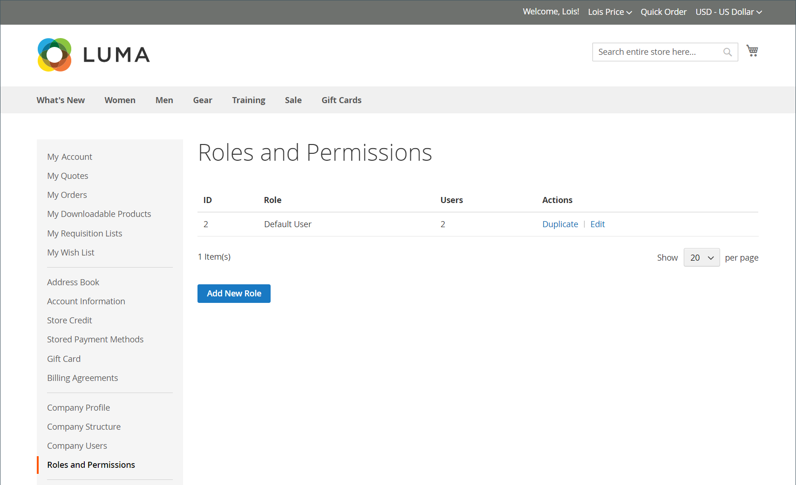

# Ruoli e autorizzazioni aziendali

Puoi impostare i ruoli per gli utenti aziendali con vari livelli di autorizzazione per accedere alle informazioni e alle risorse di vendita. Per impostazione predefinita, l&#39;amministratore della società è un *utente privilegiato* con autorizzazioni complete. La pagina [Accesso negato](../content-design/pages.md#access-denied) viene visualizzata se un utente non dispone dell&#39;autorizzazione per accedere alla pagina.

{width="700" zoomable="yes"}

Il sistema dispone di un ruolo utente predefinito predefinito, che puoi utilizzare *così com&#39;è* o modificare in base alle tue esigenze. Puoi creare tutti i ruoli necessari per adattarli alla struttura aziendale e alle responsabilità organizzative, ad esempio:

- **Utente predefinito**: l&#39;utente predefinito ha accesso completo alle attività relative alle vendite e alle offerte, nonché accesso in sola visualizzazione al profilo aziendale e alle informazioni sul credito.

- **Acquirente senior**: un acquirente senior potrebbe avere accesso a tutte le risorse Vendite e Preventivi e alle autorizzazioni di sola visualizzazione per il profilo aziendale, gli utenti e i team, le informazioni sul pagamento e il credito aziendale.

- **Acquirente assistente**: un acquirente assistente potrebbe disporre dell&#39;autorizzazione per effettuare un ordine utilizzando **[!UICONTROL Checkout with quote]** e per visualizzare ordini, preventivi e informazioni nel profilo aziendale.

## Gestire ruoli e autorizzazioni

Gestisci i ruoli aziendali dall&#39;account vetrina dell&#39;amministratore della società.

**Per aprire ruoli e autorizzazioni:**

1. Accedi alla vetrina come amministratore della società.

1. Nel pannello a sinistra, seleziona **[!UICONTROL Roles and Permissions]**.

1. Completa una delle seguenti attività.

### Creare un ruolo

1. Fare clic su **[!UICONTROL Add New Role]**.

   {width="600" zoomable="yes"}

1. Immettere un **[!UICONTROL Role Name]** descrittivo.

1. In **[!UICONTROL Role Permissions]** eseguire una delle operazioni seguenti:

   - Selezionare la casella di controllo di ogni risorsa o attività a cui gli utenti assegnati al ruolo dispongono dell&#39;autorizzazione di accesso.

   - Selezionare la casella di controllo **[!UICONTROL All]** e deselezionare la casella di controllo di ogni risorsa o attività a cui gli utenti assegnati al ruolo non dispongono dell&#39;autorizzazione di accesso.

1. Fare clic su **[!UICONTROL Save Role]**.

1. Ripeti questi passaggi per creare tutti i ruoli necessari.

### Modificare un ruolo

1. Individuare il ruolo da modificare e fare clic su **[!UICONTROL Edit]** nella colonna **[!UICONTROL Actions]**.

1. Apporta le modifiche necessarie alle impostazioni relative al nome e alle autorizzazioni.

1. Al termine, fare clic su **[!UICONTROL Save Role]**.

### Duplicare un ruolo

1. Individuare il ruolo da duplicare e fare clic su **[!UICONTROL Duplicate]** nella colonna **[!UICONTROL Actions]**.

1. Apporta le modifiche necessarie alle impostazioni relative al nome e alle autorizzazioni.

1. Al termine, fare clic su **[!UICONTROL Save Role]**.

### Eliminare una mansione

1. Nell’elenco dei ruoli, individua il ruolo da eliminare.

   È possibile eliminare solo i ruoli senza utenti assegnati.

1. Fare clic su **[!UICONTROL Delete]** nella colonna **[!UICONTROL Actions]**.

1. Quando viene richiesto di confermare, fare clic su **[!UICONTROL OK]**.

## Azioni per l’elenco dei ruoli {#actions}

| Azione | Descrizione |
| --- | --- |
| [!UICONTROL Duplicate] | Crea una copia del ruolo selezionato. Alla fine è stato aggiunto `- Duplicated` al nome del ruolo duplicato. |
| [!UICONTROL Edit] | Modifica il nome e il set di autorizzazioni. |
| [!UICONTROL Delete] | Elimina il ruolo. È possibile eliminare solo i ruoli senza utenti assegnati. |

{style="table-layout:auto"}

## Autorizzazioni ruolo

Le funzionalità B2B sono gestite da **autorizzazioni** (risorse ACL). Quando un utente della società apre una pagina o esegue un’azione nella vetrina, l’applicazione controlla se il suo ruolo include l’autorizzazione richiesta.

Gli amministratori della società possono aggiornare la configurazione delle autorizzazioni per un ruolo selezionando **[!UICONTROL Edit]** e quindi selezionando o cancellando le autorizzazioni nell&#39;elenco **[!UICONTROL Role Permissions]**.

{width="700" zoomable="yes"}

Assegna queste risorse quando **crei o modifichi un ruolo aziendale** nell&#39;account aziendale. Gli utenti autorizzati a gestire i ruoli possono aprire il modulo per il ruolo e impostare la struttura delle autorizzazioni.

Le autorizzazioni del ruolo sono organizzate in una struttura ad albero, con opzioni principali e subordinate. Selezionando un&#39;opzione principale vengono selezionate automaticamente tutte le opzioni subordinate. Se si cancella un&#39;opzione principale, tutte le opzioni subordinate vengono cancellate automaticamente. È inoltre possibile selezionare o deselezionare le opzioni subordinate singolarmente.

### Tutte le autorizzazioni

| Etichetta di autorizzazione | Descrizione |
| --- | --- |
| Tutti | Nodo principale per **tutte** le autorizzazioni assegnate a questo ruolo vetrina. |

### Autorizzazioni di vendita

| Etichetta di autorizzazione | Descrizione |
| --- | --- |
| Vendite | Elemento padre per la visibilità dell&#39;ordine e del pagamento per gli utenti aziendali. |
| Consenti estrazione | Effettua ordini al pagamento. |
| Usa metodo di pagamento in conto | Utilizza **Paga sul conto** (credito aziendale) al momento dell&#39;estrazione quando è disponibile. |
| Visualizza ordini | Visualizzare gli ordini dell&#39;utente. |
| Visualizza ordini di utenti subordinati | Visualizza gli ordini effettuati dagli utenti sotto questo utente nella gerarchia. |

### Autorizzazioni per le virgolette

Nodo padre nella struttura di autorizzazioni della società: **Virgolette**.

| Etichetta di autorizzazione | Descrizione |
| --- | --- |
| Virgolette | Elemento padre per le azioni di offerta negoziabili della vetrina. |
| Visualizza (virgolette) | Visualizzare i preventivi negoziabili. |
| Richiedi, Modifica, Elimina | Richiedi nuovi preventivi, modifica i preventivi ed elimina i preventivi in base alle regole aziendali. |
| Pagamento con preventivo | Completa il pagamento utilizzando un preventivo approvato. |
| Gestisci preventivi di utenti subordinati | Elemento padre per le azioni sui preventivi dei subordinati. |
| Visualizza (offerte subordinate) | Visualizzare i preventivi dei subordinati. |
| Modifica (virgolette subordinate) | Modifica le virgolette subordinate. |
| Elimina (virgolette subordinate) | Elimina le virgolette subordinate. |

### Modelli di offerta

Nodo padre: **Modelli di preventivo** (in **Preventivi** nella struttura della società).

| Etichetta di autorizzazione | Descrizione |
| --- | --- |
| Modelli di offerta | Funzionalità del modello padre per preventivo nella vetrina. |
| Visualizza (modelli) | Visualizzare i modelli di preventivo. |
| Richiedi, Modifica, Elimina | Crea, aggiorna, annulla e gestisci i modelli di preventivo. |
| Genera preventivi da modelli | Genera preventivi negoziabili da modelli. |
| Gestire i modelli di preventivo degli utenti subordinati | Elemento padre per le azioni modello subordinate. |
| Visualizza (modelli subordinati) | Visualizzare i modelli di preventivo dei subordinati. |
| Modifica (modelli subordinati) | Modificare i modelli di preventivo dei subordinati. |
| Elimina (modelli subordinati) | Eliminare i modelli di preventivo dei subordinati. |

### Approvazioni ordini

Nodo padre: **Approvazioni ordini**. Le autorizzazioni dell’ordine di acquisto e della regola di approvazione sono nidificate sotto questo ramo nella struttura.

### Ordini di acquisto

| Etichetta di autorizzazione | Descrizione |
| --- | --- |
| Approvazioni ordine | Elemento padre per le funzioni di approvazione e ordine fornitore. |
| Visualizza i miei ordini di acquisto | Visualizza gli ordini fornitore creati da questo utente. |
| Visualizza per subordinati | Visualizza gli ordini fornitore per gli utenti al di sotto di questo utente nella gerarchia. |
| Visualizza per tutte le società | Visualizzare gli ordini fornitore in tutta la società. |
| Approva automaticamente gli OA creati all&#39;interno di questo ruolo | Approva automaticamente gli ordini fornitore creati dagli utenti con questo ruolo quando le regole lo consentono. |

### Regole ordine fornitore

| Etichetta di autorizzazione | Descrizione |
| --- | --- |
| Approva ordini di acquisto senza altre approvazioni | Approvare gli ordini di acquisto anche quando normalmente sarebbero necessarie altre approvazioni (in base alle regole di approvazione). |
| Visualizza regole di approvazione | Visualizza regole di approvazione ordine fornitore. |
| Creare, modificare ed eliminare | Crea, modifica ed elimina regole di approvazione. |

### Profilo aziendale e contatti

Autorizzazioni di Storefront per le sezioni del profilo aziendale. Le voci **Modifica** nidificate si applicano solo con l&#39;autorizzazione **Visualizza** sopra di esse nella struttura dei ruoli.

| Etichetta di autorizzazione | Descrizione |
| --- | --- |
| Profilo società | Accedi alle aree del profilo della società come gruppo. |
| Informazioni account (visualizzazione) | Visualizza informazioni account società. |
| Modifica | Modificare le informazioni sull&#39;account della società (in Informazioni account). |
| Indirizzo legale (visualizzazione) | Visualizza l&#39;indirizzo legale della società. |
| Modifica | Modificare l&#39;indirizzo legale della società (sotto Indirizzo legale). |
| Contatti (visualizzazione) | Visualizza contatti società. |
| Informazioni sul pagamento (visualizzazione) | Visualizza le informazioni sul pagamento nel profilo società. |
| Informazioni sulla spedizione (Visualizza) | Visualizza le informazioni sulla spedizione nel profilo della società. |

## Gestione degli utenti aziendali

| Etichetta di autorizzazione | Descrizione |
| --- | --- |
| Gestione utente società | Elemento padre per ruoli e per utenti o team. |
| Visualizza ruoli e autorizzazioni | Visualizzare i ruoli aziendali e le relative autorizzazioni. |
| Gestire ruoli e autorizzazioni | Crea o modifica ruoli e assegna autorizzazioni. |
| Visualizza utenti e team | Visualizzare gli utenti e i team aziendali. |
| Gestione di utenti e team | Aggiungere, modificare o rimuovere utenti e team. |

## Credito società

| Etichetta di autorizzazione | Descrizione |
| --- | --- |
| Credito società | Accedi all’area di credito della società. |
| Visualizza (cronologia crediti) | Visualizzare la cronologia dei crediti della società e le relative informazioni sui saldi. |

## Assegnare un ruolo a un utente della società

Dopo aver definito i ruoli necessari, assegna un ruolo a ciascun utente della società.

**Per assegnare una mansione:**

1. Accedi alla vetrina come amministratore della società.

1. Nel pannello a sinistra, seleziona **[!UICONTROL Company Users]**.

   {width="700" zoomable="yes"}

1. Trovare l&#39;utente nell&#39;elenco e fare clic su **[!UICONTROL Edit]**.

1. Selezionare **[!UICONTROL User Role]** appropriato per l&#39;utente.

   {width="700" zoomable="yes"}

1. Fare clic su **[!UICONTROL Save]**.

>[!MORELIKETHIS]
>
>- [Gestisci utenti società](account-company-users.md)
>- [Struttura account società](account-company-structure.md)
>- [Ruolo di amministratore della società](account-company-admin.md)
>- [Gestione società](manage-companies.md)
>- [Abilita funzionalità B2B](enable-basic-features.md)
