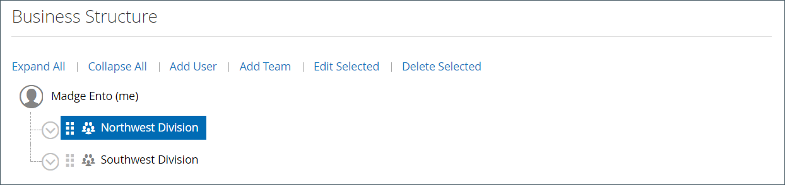
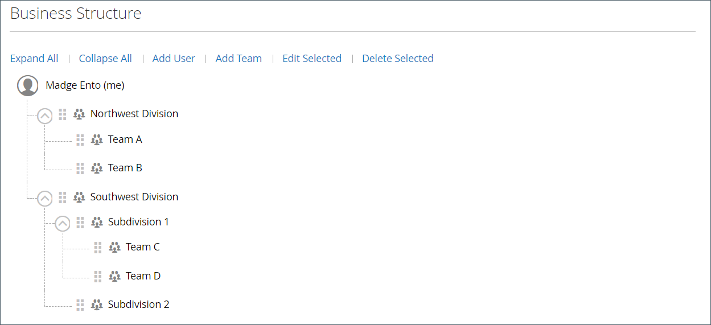
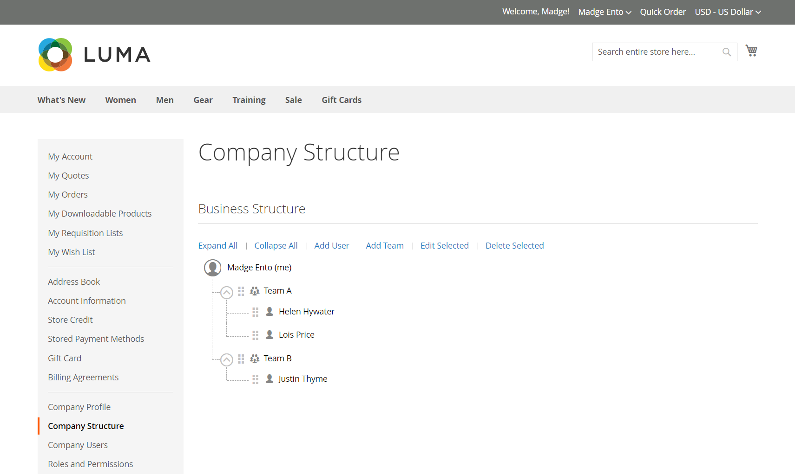

# Company account structure

A company account can be set up to reflect the structure of the business. Initially, the company structure includes only the company administrator, but can be expanded to include teams of users. The users can be associated with teams or organized within a hierarchy of divisions and subdivisions within the company.

{width="500"}

Nel dashboard degli account dell’amministratore della società nella vetrina, la struttura della società è rappresentata da una struttura ad albero ed è inizialmente costituita solo dall’amministratore della società.

{width="700" zoomable="yes"}

Per i commercianti, l&#39;intera struttura aziendale si riflette nelle _Aziende_ e _Clienti_ griglie all&#39;interno dell&#39;Amministratore. Nella griglia Società sono elencate tutte le società indipendentemente dallo stato.

{width="700" zoomable="yes"}

Nell&#39;esempio seguente viene mostrata la griglia [!UICONTROL Customers] con gli account iniziali dell&#39;amministratore della società per ogni società.

{width="700" zoomable="yes"}

Dopo aver creato l&#39;account, l&#39;amministratore della società può definire una struttura aziendale con [team](account-company-structure.md), configurare [utenti aziendali](account-company-users.md) e stabilire [ruoli e autorizzazioni](account-company-roles-permissions.md) per ciascuno di essi.

>[!NOTE]
>
>Quando si aggiungono gli utenti di una società, l’utente della società viene inizialmente aggiunto alla struttura principale della società, subordinata all’amministratore della società. Se l’amministratore della società svolge più ruoli all’interno della società, crea account utente della società separati con un indirizzo e-mail diverso per ciascun ruolo.

## Icone della struttura aziendale

| Icon | Descrizione |
| ---- | ----------------- |
|  | Rappresenta l&#39;amministratore della società nella struttura della società. |
|  | Rappresenta un team nella struttura aziendale. |
|  | Rappresenta un utente nella struttura aziendale. |
|  | Moves a team to another position in the company structure. |
|  | Espande un team nella struttura della società. |
|  | Comprime un team nella struttura aziendale. |

{style="table-layout:auto"}

## Creare team aziendali

La struttura di un conto della società deve riflettere l’organizzazione di acquisto, sia che si tratti di un’organizzazione semplice e piatta o complessa, con team diversi per ogni suddivisione e divisione della società.

Se l&#39;archivio è [configurato](enable-basic-features.md) per consentire alle società di gestire i propri account, la configurazione della struttura della società è una delle prime attività che un amministratore della società deve completare dopo l&#39;approvazione dell&#39;account. Nel conto della società, la struttura della società è rappresentata da una struttura con l’amministratore della società in alto.

{width="450"}

1. L’amministratore della società effettua l’accesso al proprio account.

1. Nel pannello a sinistra, seleziona **[!UICONTROL Company Structure]**.

1. **[!UICONTROL Business Structure]****[!UICONTROL Add Team]**

   - **[!UICONTROL Team Title]****[!UICONTROL Description]**

     The Team Title can be anything that represents the structure of the company, such as a team, office, or division within the company

     {width="700" zoomable="yes"}

   - **[!UICONTROL Save]**

   - Crea tutti i team necessari.

1. Per creare una gerarchia di team, l’amministratore effettua le seguenti operazioni:

   - Seleziona il team padre e fai clic su **[!UICONTROL Add Team]**.

     {width="600" zoomable="yes"}

   - **[!UICONTROL Team Title]****[!UICONTROL Description]**

   - **[!UICONTROL Save]**

1. Repeats these steps to create as many teams, or divisions and subdivisions as needed.

   {width="600" zoomable="yes"}

## Spostare un team

Quando l’amministratore della società lavora con la struttura della società, può trascinare team o divisioni in altre posizioni nella struttura.

1. L&#39;amministratore della società individua il team da spostare.

1. Fa clic e trascina il team in una nuova posizione nella struttura aziendale.

## Eliminare un team

>[!NOTE]
>
>Before deleting a team, it is recommended to make sure that the correct team is selected---deleted teams cannot be restored.

1. The company administrator selects the team to be deleted.

1. **[!UICONTROL Delete Selected]**

1. **[!UICONTROL Delete]**

## Expand or collapse the team structure

Quando l’amministratore della società lavora con la struttura della società, può comprimere o espandere la struttura:

- Fai clic su **[!UICONTROL Collapse All]** o **[!UICONTROL Expand All]**.

- Fai clic su  per comprimere un team oppure su  per espandere un team.

## Assign users to teams

{width="700" zoomable="yes"}

| Controllo | Descrizione |
|--- |--- |
| [!UICONTROL Collapse All / Expand All] | Comprime o espande la struttura ad albero della struttura aziendale |
| [!UICONTROL Add User] | Crea un utente sotto il team corrente |
| [!UICONTROL Add Team] | Crea un team |
| [!UICONTROL Edit Selected / Remove from Structure] | Modifica le informazioni utente o rimuove gli utenti dalla struttura aziendale. Per ulteriori dettagli, vedere [Gestire gli account utente della società](account-company-users.md). |

{style="table-layout:auto"}

1. Nel pannello a sinistra, l&#39;amministratore della società sceglie **[!UICONTROL Company Structure]**.

1. Per assegnare un utente a un team esistente, trascinano () l&#39;utente nel team appropriato.

   {width="700" zoomable="yes"}
