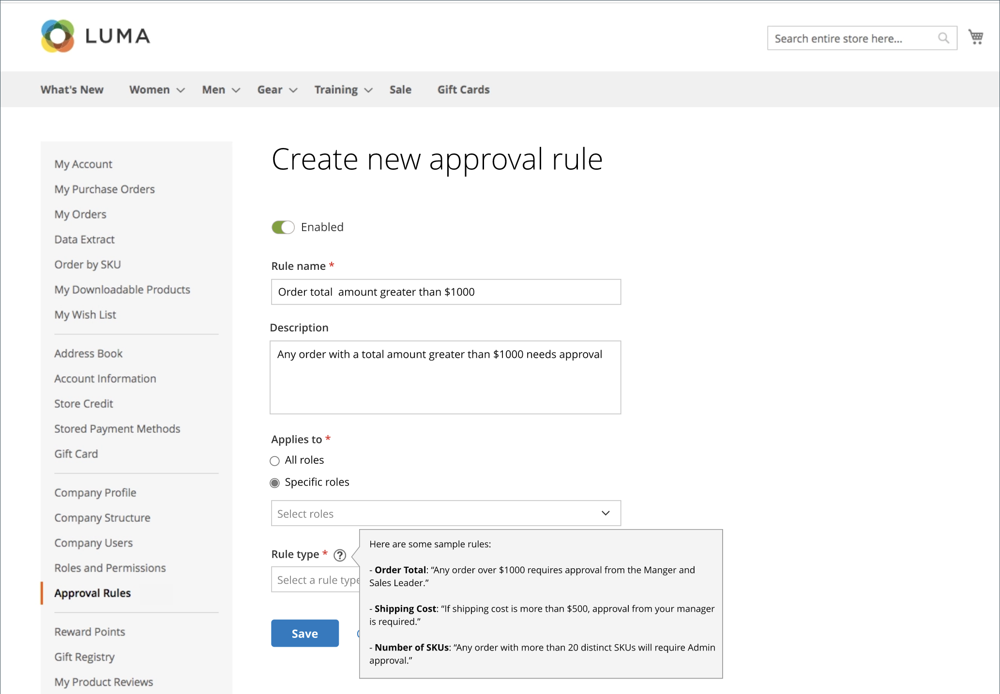
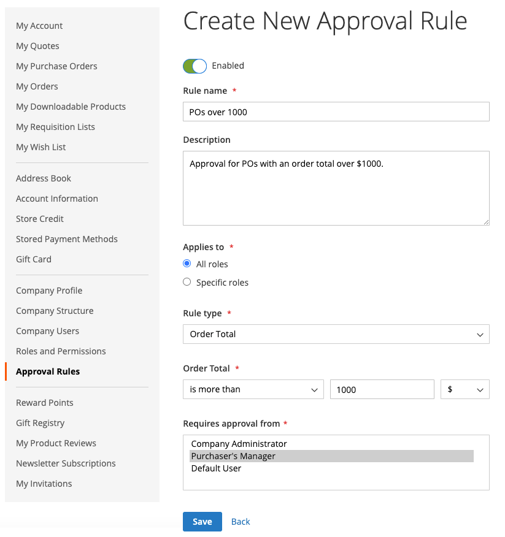
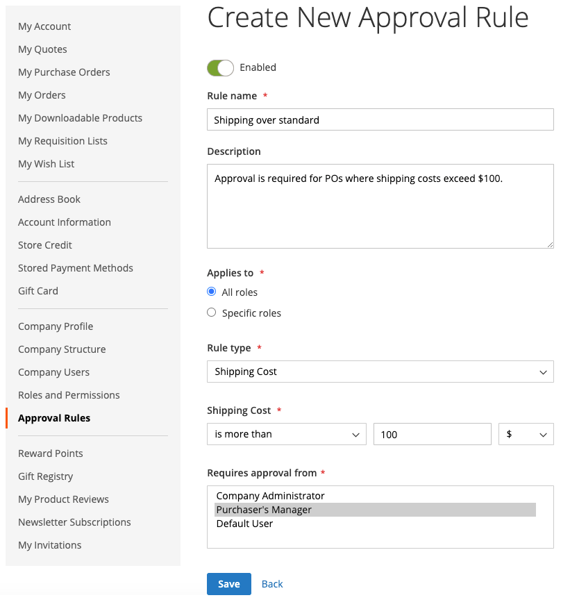

# Regole di approvazione ordini fornitore

La maggior parte delle aziende richiede l&#39;approvazione degli ordini di acquisto. Aggiungendo regole di approvazione per il proprio account aziendale, è possibile controllare chi può creare ordini di acquisto e quanto può spendere. Ad esempio:

* Tutti gli ordini di acquisto inferiori a X vengono approvati automaticamente.
* Gli ordini di acquisto superiori a X ma inferiori a Q devono essere approvati da Y.
* Qualsiasi valore PO superiore a X deve essere approvato da Y e Z.
* Un ordine di acquisto creato da qualsiasi utente a livello di Director o superiore viene approvato automaticamente.

A seconda del ruolo e delle autorizzazioni dell’azienda, gli utenti possono creare, modificare, eliminare o visualizzare le regole di approvazione.

>[!IMPORTANT]
>
>La configurazione della regola di approvazione richiede una [struttura aziendale](account-company-structure.md) definita per specificare l&#39;approvazione da parte del manager del cliente acquirente.

## Metodi di pagamento

I flussi di approvazione degli ordini di acquisto supportano metodi di pagamento sia online che offline. Tutti i metodi di pagamento offline predefiniti sono supportati per le approvazioni degli ordini fornitore. Per i pagamenti online sono supportati i seguenti metodi:

* PayPal Express
* Braintree pagamenti

## Impostazione regola di approvazione

Con le autorizzazioni [ richieste per il ruolo](account-company-roles-permissions.md), i clienti B2B possono impostare regole di approvazione per applicare i criteri aziendali facendo clic su **[!UICONTROL Approval Rules]** nel pannello a sinistra per il proprio account cliente.

{width="700" zoomable="yes"}

Per creare una regola di approvazione, il cliente completa i passaggi seguenti:

1. Fai clic su **[!UICONTROL Add New Rule]** per creare una regola.

1. Se necessario, modifica la regola da **[!UICONTROL Enabled]** a **[!UICONTROL Disabled]**.

   La regola è abilitata come impostazione predefinita, ma un cliente può crearla utilizzando un’impostazione disabilitata e quindi abilitarla in un secondo momento quando è pronto per applicarla.

1. Per **[!UICONTROL Rule name]**, immette un nome breve ma descrittivo per la regola, ad esempio `Orders less than $100`.

   I nomi delle regole devono essere univoci.

1. Per **[!UICONTROL Description]**, immette una spiegazione più lunga della regola.

1. Per **[!UICONTROL Applies to]**, seleziona uno o più ruoli aziendali utilizzati per applicare la regola.

1. Seleziona **[!UICONTROL Rule Type]** e definisce la regola.

   Le sezioni seguenti forniscono una spiegazione dettagliata e un esempio per ogni tipo di regola.

   {width="700" zoomable="yes"}

1. Per **[!UICONTROL Requires approval from]**, seleziona uno o più approvatori richiesti in base al tipo di approvazione.

   >[!NOTE]
   >
   >* Quando si assegna un ruolo come approvatore, accertarsi che in tale ruolo sia presente almeno un utente.
   >* Se sono presenti due o più utenti con lo stesso ruolo approvatore, il creatore dell&#39;ordine fornitore non può approvarlo. In questo caso, l&#39;approvazione manuale è richiesta da qualsiasi altro utente con questo ruolo di approvatore. Tuttavia, se l&#39;opzione `Auto-approve POs created within this role` è impostata nelle [Autorizzazioni ruolo](account-company-roles-permissions.md), l&#39;ordine di acquisto viene approvato automaticamente.
   >* Se esiste un solo utente con il ruolo di approvatore e tale utente è il creatore, l&#39;ordine di acquisto viene sempre approvato automaticamente. L&#39;impostazione dell&#39;autorizzazione `Auto-approve POs created within this role` viene ignorata.

1. Fare clic su **[!UICONTROL Save]**.

### [!UICONTROL Order Total]

Questo tipo di regola viene utilizzato per richiedere un&#39;approvazione OA in base al totale dell&#39;ordine, imposte incluse.

1. Scegli un&#39;opzione **[!UICONTROL Order Total amount]**:

   * `is more than`
   * `is less than`
   * `is more than or equal to`
   * `is less than or equal to`

1. Seleziona il tipo di valuta e immette l&#39;importo.

{width="600" zoomable="yes"}

### [!UICONTROL Shipping Cost]

Questo tipo di regola viene utilizzato per richiedere un&#39;approvazione dell&#39;ordine di acquisto in base alle spese di spedizione richieste da molte aziende.

1. Imposta **[!UICONTROL Shipping cost value]**:

   * `is more than`
   * `is less than`
   * `is more than or equal to`
   * `is less than or equal to`

1. Imposta l&#39;importo di spedizione desiderato.

{width="600" zoomable="yes"}

### [!UICONTROL Number of SKUs]

Questo tipo di regola viene utilizzato per richiedere un&#39;approvazione OA in base al numero di SKU o prodotti univoci nell&#39;ordine. Controlla il numero di tipi di elementi distinti, non il numero di elementi ordinati. Ad esempio, un ordine di acquisto potrebbe includere:

* Due grandi camicie bianche
* Tre camicie bianche medie

Questo esempio specifica cinque elementi, ma due SKU distinti.

1. Imposta il valore **[!UICONTROL Number of SKUs]**:

   * `is more than`
   * `is less than`
   * `is more than or equal to`
   * `is less than or equal to`

1. Imposta la quantità di SKU.

{width="600" zoomable="yes"}

## Modifica regole di approvazione

Per modificare una regola di approvazione esistente, un cliente può completare i seguenti passaggi:

1. Nella barra laterale del proprio account, il cliente seleziona **[!UICONTROL Approval Rules]**.

1. Trova la voce della regola di approvazione da modificare.

1. Clic su **[!UICONTROL Edit]**.

1. Apporta tutte le modifiche necessarie e fa clic su **[!UICONTROL Save]**.

## Elimina regole di approvazione

Per rimuovere una regola di approvazione esistente, un cliente può completare i seguenti passaggi:

1. Nella barra laterale dell&#39;account, seleziona **[!UICONTROL Approval Rules]**.

1. Trova la voce della regola di approvazione da eliminare.

1. Clic su **[!UICONTROL Delete]**.

1. Per confermare l&#39;azione, fa clic su **[!UICONTROL OK]**.

## Demo approvazioni ordini fornitore

Guarda questo video per scoprire di più sulle approvazioni degli ordini d’acquisto:

>[!VIDEO](https://video.tv.adobe.com/v/3410766?quality=12&learn=on&captions=ita)
