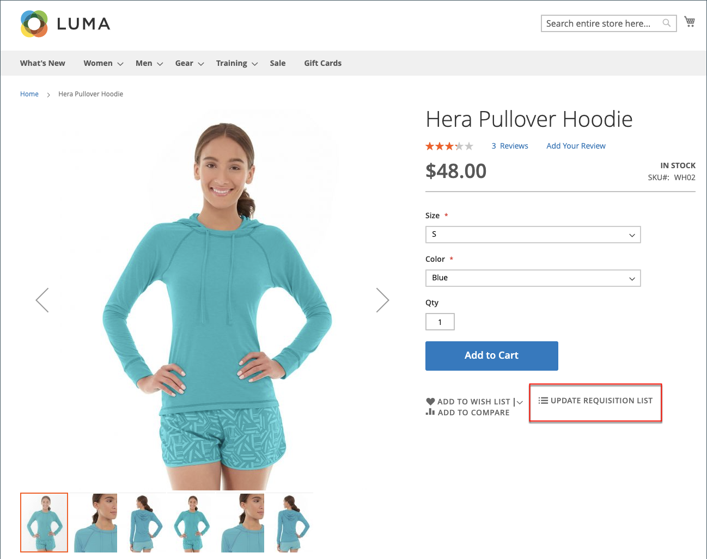

# [!UICONTROL My Requisition Lists]

Il motivo principale per la gestione di un elenco di richieste di acquisto consiste nel facilitare il riordino dei prodotti. I clienti autorizzati possono riordinare facilmente gli articoli da un elenco di richieste di acquisto aggiungendoli al carrello e spostandoli o copiandoli da un elenco a un altro.

{width="700" zoomable="yes"}

## Aprire un elenco di richieste di acquisto

1. Dal dashboard dell’account, il cliente sceglie **[!UICONTROL My Requisition Lists]**.

1. Individua l&#39;elenco delle richieste di acquisto che si desidera aprire e fa clic su **[!UICONTROL View]** ed effettuare una delle seguenti operazioni:

### Aggiungi prodotti al carrello

1. Per selezionare i prodotti da aggiungere, il cliente effettua una delle seguenti operazioni:

   - Seleziona la casella di controllo di ciascun elemento.
   - Clic **[!UICONTROL Select All]**.

1. Entra nel **[!UICONTROL Qty]** da aggiungere al carrello.

1. Per modificare le opzioni di prodotto, effettua le seguenti operazioni:

   - Nell’elemento riga, fa clic su _Modifica_ ().
   - Modifica le opzioni necessarie.
   - Clic **[!UICONTROL Update Requisition List]**.

1. Clic **[!UICONTROL Add to Cart]**.

   {width="700" zoomable="yes"}

### Copia elementi in un altro elenco

1. Il cliente seleziona la casella di controllo di ogni elemento da spostare.

1. Clic **[!UICONTROL Copy Selected]** ed esegue una delle operazioni seguenti:

   - Consente di scegliere un elenco di richieste esistente.
   - Clic **[!UICONTROL Create New Requisition List]**.

### Esportare un elenco

1. Il cliente apre l&#39;elenco delle richieste da esportare.

1. Fa clic su **[!UICONTROL Export]** collegamento.

Adobe Commerce genera e scarica un elenco CSV con `sku` e `qty` valori.

### Sposta elementi in un altro elenco

1. Il cliente seleziona la casella di controllo di ogni elemento da spostare.

1. Clic **[!UICONTROL Move Selected]** ed effettuare una delle seguenti operazioni:

   - Consente di scegliere un elenco di richieste esistente.
   - Clic **[!UICONTROL Create New Requisition List]**.

### Stampare un elenco

1. Nell’angolo superiore destro dell’elenco, il cliente fa clic su **[!UICONTROL Print]**.

1. Verifica il dispositivo di output e fa clic su **[!UICONTROL Print]**.

   {width="500" zoomable="yes"}

### Modifica opzioni prodotto

Per modificare le opzioni prodotto nell’elenco, il cliente effettua le seguenti operazioni:

1. Fa clic su _Matita_ () per aprire la pagina del prodotto.

1. Modifica le opzioni necessarie.

1. Clic **[!UICONTROL Update Requisition List]**.

   {width="700" zoomable="yes"}

Un prodotto nell&#39;elenco delle richieste di acquisto può essere modificato quando:

- Il prodotto ha **[!UICONTROL all options set]** (quando è un [prodotto configurato](../catalog/product-create-configurable.md) nell&#39;elenco delle richieste di acquisto).

  Il prodotto è **[!UICONTROL added to this Requisition List]**.

- Il prodotto è [un prodotto semplice con opzioni](../catalog/settings-advanced-custom-options.md)

- Modifica consentita per il tipo di prodotto.

### Rimuovi elementi

1. Il cliente seleziona la casella di controllo di ogni elemento da rimuovere.

1. Clic **[!UICONTROL Remove Selected]**.

1. Quando viene richiesto di confermare, fa clic su **[!UICONTROL Delete]**.

### Rinominare un elenco

1. Dopo il titolo dell’elenco, il cliente fa clic su **[!UICONTROL Rename]**.

1. Immette un valore diverso **[!UICONTROL Requisition List Name]**.

1. Clic **[!UICONTROL Save]**.

   {width="300"}

### Rimuovere un elenco di richieste di acquisto

1. Il cliente apre l&#39;elenco delle richieste di acquisto da eliminare.

1. Clic **[!UICONTROL Delete Requisition List]**.

1. Quando viene richiesto di confermare, fa clic su **[!UICONTROL Delete]**.

>[!NOTE]
>
>Questa azione non può essere annullata.

## Azioni

| Azione | Descrizione |
|--- |--- |
| [!UICONTROL Rename] | Consente di rinominare l&#39;elenco delle richieste di acquisto e di aggiornare la descrizione. |
| [!UICONTROL Export] | Esporta l&#39;elenco delle richieste in un file CSV. |
| [!UICONTROL Print] | Stampa l&#39;elenco delle richieste di acquisto corrente. |
| [!UICONTROL Select] | Gestisce le selezioni degli elementi da sottoporre a un&#39;azione.  **[!UICONTROL Select All]**- Seleziona tutti gli articoli nell&#39;elenco delle richieste di acquisto. **[!UICONTROL Remove Selected]** - Rimuove tutti gli elementi selezionati dall&#39;elenco delle richieste di acquisto.  **[!UICONTROL Copy Selected]**- Copia tutti gli articoli selezionati in un altro elenco di richieste. |
| [!UICONTROL Add to Cart] | Aggiunge gli articoli selezionati al carrello. |
| [!UICONTROL Update List] | Ricalcola il subtotale per riflettere una modifica della quantità. |
| [!UICONTROL Delete Requisition List] | Elimina l&#39;elenco delle richieste di acquisto dall&#39;account dell&#39;utente della società. |

{style="table-layout:auto"}
