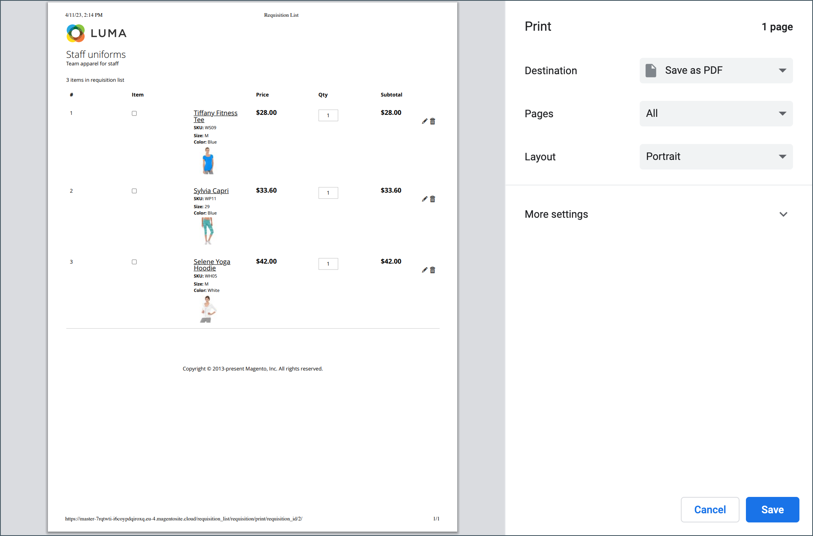
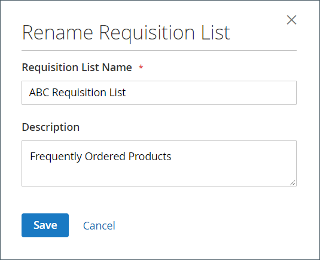

# [!UICONTROL My Requisition Lists]

Il motivo principale per la gestione di un elenco di richieste di acquisto consiste nel facilitare il riordino dei prodotti. I clienti autorizzati possono riordinare facilmente gli articoli da un elenco di richieste di acquisto aggiungendoli al carrello e spostandoli o copiandoli da un elenco a un altro.

{width="700" zoomable="yes"}

## Aprire un elenco di richieste di acquisto

1. Dal dashboard account, il cliente sceglie **[!UICONTROL My Requisition Lists]**.

1. Individua l&#39;elenco di richieste di acquisto che si desidera aprire, fa clic su **[!UICONTROL View]** ed effettua una delle seguenti operazioni:

### Aggiungi prodotti al carrello

1. Per selezionare i prodotti da aggiungere, il cliente effettua una delle seguenti operazioni:

   - Seleziona la casella di controllo di ciascun elemento.
   - Clic su **[!UICONTROL Select All]**.

1. Immette **[!UICONTROL Qty]** da aggiungere al carrello.

1. Per modificare le opzioni di prodotto, effettua le seguenti operazioni:

   - Nell&#39;elemento riga, fa clic sull&#39;icona _Modifica_ ().
   - Modifica le opzioni necessarie.
   - Clic su **[!UICONTROL Update Requisition List]**.

1. Clic su **[!UICONTROL Add to Cart]**.

   {width="700" zoomable="yes"}

### Copia elementi in un altro elenco

1. Il cliente seleziona la casella di controllo di ogni elemento da spostare.

1. Fai clic su **[!UICONTROL Copy Selected]** ed effettua una delle seguenti operazioni:

   - Consente di scegliere un elenco di richieste esistente.
   - Clic su **[!UICONTROL Create New Requisition List]**.

### Esportare un elenco

1. Il cliente apre l&#39;elenco delle richieste da esportare.

1. Fai clic sul collegamento **[!UICONTROL Export]**.

Adobe Commerce genera e scarica un elenco CSV con valori `sku` e `qty`.

### Sposta elementi in un altro elenco

1. Il cliente seleziona la casella di controllo di ogni elemento da spostare.

1. Fai clic su **[!UICONTROL Move Selected]** ed effettua una delle seguenti operazioni:

   - Consente di scegliere un elenco di richieste esistente.
   - Clic su **[!UICONTROL Create New Requisition List]**.

### Stampare un elenco

1. Nell&#39;angolo superiore destro dell&#39;elenco, il cliente fa clic su **[!UICONTROL Print]**.

1. Verifica il dispositivo di output e fa clic su **[!UICONTROL Print]**.

   {width="500" zoomable="yes"}

### Modifica opzioni prodotto

Per modificare le opzioni prodotto nell’elenco, il cliente effettua le seguenti operazioni:

1. Fai clic sull&#39;icona _Matita_ () per aprire la pagina del prodotto.

1. Modifica le opzioni necessarie.

1. Clic su **[!UICONTROL Update Requisition List]**.

   {width="700" zoomable="yes"}

Un prodotto nell&#39;elenco delle richieste di acquisto può essere modificato quando:

- Il prodotto ha **[!UICONTROL all options set]** (quando è un [prodotto configurato](../catalog/product-create-configurable.md) nell&#39;elenco richieste di acquisto).

  Prodotto **[!UICONTROL added to this Requisition List]**.

- Il prodotto è [un prodotto semplice con opzioni](../catalog/settings-advanced-custom-options.md)

- Modifica consentita per il tipo di prodotto.

### Rimuovi elementi

1. Il cliente seleziona la casella di controllo di ogni elemento da rimuovere.

1. Clic su **[!UICONTROL Remove Selected]**.

1. Quando viene richiesto di confermare, fa clic su **[!UICONTROL Delete]**.

### Rinominare un elenco

1. Dopo il titolo dell&#39;elenco, il cliente fa clic su **[!UICONTROL Rename]**.

1. Immette un **[!UICONTROL Requisition List Name]** diverso.

1. Clic su **[!UICONTROL Save]**.

   {width="300"}

### Rimuovere un elenco di richieste di acquisto

1. Il cliente apre l&#39;elenco delle richieste di acquisto da eliminare.

1. Clic su **[!UICONTROL Delete Requisition List]**.

1. Quando viene richiesto di confermare, fa clic su **[!UICONTROL Delete]**.

>[!NOTE]
>
>Questa azione non può essere annullata.

## Azioni

| Azione | Descrizione |
|--- |--- |
| [!UICONTROL Rename] | Consente di rinominare l&#39;elenco delle richieste di acquisto e di aggiornare la descrizione. |
| [!UICONTROL Export] | Esporta l&#39;elenco delle richieste in un file CSV. |
| [!UICONTROL Print] | Stampa l&#39;elenco delle richieste di acquisto corrente. |
| [!UICONTROL Select] | Gestisce le selezioni degli elementi da sottoporre a un&#39;azione.  **[!UICONTROL Select All]**- Seleziona tutti gli elementi nell&#39;elenco delle richieste di acquisto. **[!UICONTROL Remove Selected]** - Rimuove tutti gli elementi selezionati dall&#39;elenco delle richieste di acquisto.  **[!UICONTROL Copy Selected]**- Copia tutti gli elementi selezionati in un altro elenco di richieste di acquisto. |
| [!UICONTROL Add to Cart] | Aggiunge gli articoli selezionati al carrello. |
| [!UICONTROL Update List] | Ricalcola il subtotale per riflettere una modifica della quantità. |
| [!UICONTROL Delete Requisition List] | Elimina l&#39;elenco delle richieste di acquisto dall&#39;account dell&#39;utente della società. |

{style="table-layout:auto"}

## Controlli di impaginazione

I controlli di impaginazione vengono visualizzati nella parte inferiore dell&#39;elenco quando il numero totale di elementi dell&#39;elenco delle richieste di acquisto supera gli elementi selezionati per pagina.

{width="700" zoomable="yes"}

>[!NOTE]
>
> I prodotti che richiedono la tua attenzione (ad esempio, quelli esauriti) vengono visualizzati nella parte superiore dell’elenco se rientrano nella pagina corrente della paginazione. Il numero di prodotti che richiedono attenzione è indicato sopra l’elenco.
> {width="500"}

### Controlli di paginazione della vetrina

| Controllo | Descrizione |
|----------------------------------------------------------------|----------------------------------------------------------------------------------------------------------------------------------------------------------------------------------|
|  | [!UICONTROL Show Per Page] - Determina quanti elementi dell&#39;elenco richieste di acquisto vengono visualizzati per pagina. È possibile scegliere 20, 50, 100, 500 o 1000 elementi dell&#39;elenco delle richieste da visualizzare nella pagina. |
|  | [!UICONTROL Pagination links] - Fornisce collegamenti di navigazione ad altre pagine. |