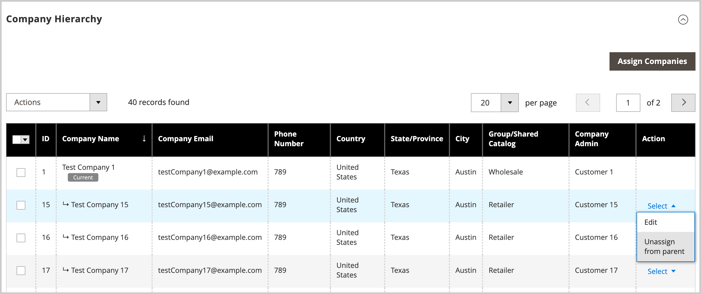

# Gestisci [!UICONTROL Company Hierarchy]

[!BADGE 1.5.0-beta]{type=Informative url="/help/b2b/release-notes.md" tooltip="Disponibile solo per i partecipanti al programma Beta"}

Gli amministratori possono creare [!UICONTROL Company Hierarchy] assegnando società correlate a una società padre designata, che è la società al vertice dell&#39;organizzazione. Se [!UICONTROL Company Type] è `Company`, la società non fa parte di un&#39;organizzazione ed è idonea a diventare una società padre o a essere assegnata a una società padre esistente.

Nell&#39;amministratore si gestiscono le assegnazioni aziendali modificando una società e quindi aggiornando la configurazione [!UICONTROL Company Hierarchy] per assegnare o annullare l&#39;assegnazione delle società.

{width="700"}

>[!NOTE]
>
>Per informazioni dettagliate sulla griglia [!UICONTROL Company Hierarchy], vedere [Descrizioni del campo Gerarchia società](account-company-create.md#company-hierarchy).

## Assegnare società a un&#39;organizzazione

1. Dalla barra laterale _Admin_, passa a **[!UICONTROL Customers]** > **[!UICONTROL Companies]**.

   {width="700" zoomable="yes"}

1. Nella griglia [!UICONTROL Companies] aprire la pagina dei dettagli della società per creare le assegnazioni.

   - Per assegnare altre società a una società padre esistente, selezionare l&#39;azione **[!UICONTROL Edit]** per la società padre.
   - Per creare una società padre, selezionare l&#39;azione **[!UICONTROL Edit]** per la società da designare come padre.

     Impossibile creare una società padre da una società padre o figlio esistente.

1. Nella pagina dei dettagli della società, espandere **[!UICONTROL Company Hierarchy]**.

   {width="700" zoomable="yes"}

   La griglia mostra le assegnazioni esistenti della società, se presenti. La società padre è sempre posizionata nella parte superiore della griglia [!UICONTROL Company Hierarchy]. Il flag `[!UICONTROL Current]` indica la società in fase di modifica.

1. Aggiungere società all&#39;organizzazione padre.

   - Scegliere da un elenco di società disponibili selezionando **[!UICONTROL Assign Companies]**.

   - **Seleziona tutto in questa pagina** oppure seleziona uno o più elementi specifici della società.

   - Selezionare **[!UICONTROL Assign Selected Companies]**.

   - Completare l&#39;assegnazione della società selezionando **[!UICONTROL Assign]**.

     {width="675" zoomable="yes"}

## Annullamento dell’assegnazione di società a una società madre

1. Nella barra laterale _Admin_, passa a **[!UICONTROL Customers]** > **[!UICONTROL Companies]**.

   {width="700" zoomable="yes"}

1. Nella griglia [!UICONTROL Companies], aprire la pagina dei dettagli della società per la società padre selezionando **[!UICONTROL Edit]**.

1. Visualizzare l&#39;elenco delle società assegnate espandendo **[!UICONTROL Company Hierarchy]**.

1. Dalla griglia [!UICONTROL Company Hierarchy], annullare l&#39;assegnazione di una società utilizzando il controllo azione **[!UICONTROL Select]** per scegliere **[!UICONTROL Unassign from parent]**.

   {width="700" zoomable="yes"}

1. Quando richiesto, rimuovere la società assegnata dalla gerarchia selezionando **[!UICONTROL Unassign]**.
