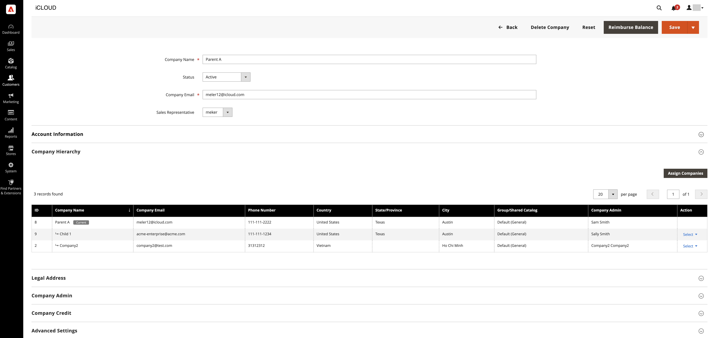

# Gestire [!UICONTROL Company Hierarchy]

[!BADGE 1.5.0-beta]{type=Informative url="/help/b2b/release-notes.md" tooltip="Disponibile solo per i partecipanti ai programmi beta"}

Gli amministratori possono creare un [!UICONTROL Company Hierarchy] assegnando società collegate a una società madre designata, che è la società al vertice della gerarchia organizzativa.

Creare una società padre modificando una società che non è stata assegnata a una [!UICONTROL Company Hierarchy]e l&#39;assegnazione di società correlate.

{width="700"}

Dopo l&#39;assegnazione di una società a una gerarchia, [!UICONTROL Company type] colonna nella **Aziende** grid identifica l’azienda come `Parent` o  `Child` società.  Se il [!UICONTROL Company Type] è `Company`, la società non fa parte di una gerarchia di società ed è idonea a diventare una società madre o a essere assegnata a una società madre esistente.

>[!NOTE]
>
>Per ulteriori informazioni su [!UICONTROL Company Hierarchy] griglia, vedere [Gerarchia società](account-company-create.md#company-hierarchy) descrizioni dei campi.

In Amministratore, puoi gestire le assegnazioni aziendali modificando una società e quindi utilizzando [!UICONTROL Company Hierarchy] sezione del [!UICONTROL Company] per assegnare o annullare l&#39;assegnazione delle società.

## Assegnare società a una società madre

1. Il giorno _Amministratore_ barra laterale, passa a **[!UICONTROL Customers]** > **[!UICONTROL Companies]**.

   {width="700" zoomable="yes"}

1. Nella griglia Società aprire la pagina dei dettagli della società per creare le assegnazioni.

   - Per assegnare altre società a una società padre esistente, selezionare **[!UICONTROL Edit]** azione per la società madre.
   - Per creare una nuova società padre, selezionare **[!UICONTROL Edit]** azione per la società designata come capogruppo.

     Impossibile creare una nuova società padre da una società padre o figlio esistente.

   {width="700" zoomable="yes"}

1. Nella pagina Dettagli società, espandi il **[!UICONTROL Company Hierarchy]** e seleziona **[!UICONTROL Assign Companies]**.

   {width="700" zoomable="yes"}

   Quando si espande questa visualizzazione, è possibile visualizzare le assegnazioni aziendali esistenti, se presenti. La società madre viene sempre visualizzata sopra _[!UICONTROL Company Hierarchy]_griglia con `current company indicator` visualizzato nella riga società in fase di modifica.

1. Le società disponibili per l&#39;assegnazione sono elencate nella griglia. Seleziona le società da assegnare, quindi fai clic su **[!UICONTROL Assign Selected Companies]**.

1. È possibile **Seleziona tutto su questa pagina** oppure un elemento riga società specifico e fai clic su **[!UICONTROL Assign Selected Companies]**.

   {width="700" zoomable="yes"}

1. Quando richiesto, completare l&#39;assegnazione della società selezionando **[!UICONTROL Assign]**.

## Annullamento dell’assegnazione di società a una società madre

1. Il giorno _Amministratore_ barra laterale, passa a **[!UICONTROL Customers]** > **[!UICONTROL Companies]**.

   {width="700" zoomable="yes"}

1. Nella pagina Società aprire la pagina dei dettagli della società per la società padre selezionando la **[!UICONTROL Edit]** azione.

   {width="700" zoomable="yes"}

1. Visualizzare l&#39;elenco delle società assegnate espandendo **[!UICONTROL Company Hierarchy]** a discesa.

1. Dalla griglia della gerarchia della società, annullare l&#39;assegnazione di una società selezionando la **[!UICONTROL Select]** azione per l&#39;azienda, quindi scegliere **[!UICONTROL Unassign from parent]**.

   {width="700" zoomable="yes"}

1. Quando richiesto, rimuovere la società assegnata dalla gerarchia selezionando **[!UICONTROL Unassign]**.
