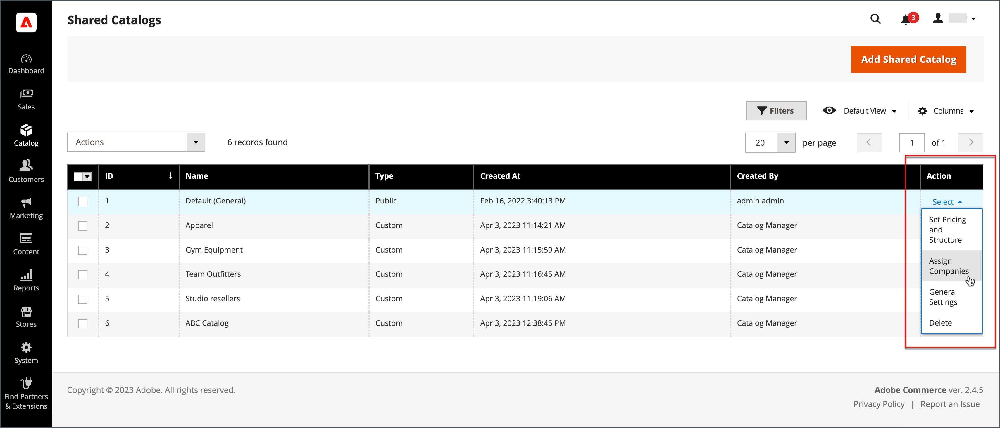

# Assegnare società a un catalogo condiviso

Esistono due modi per assegnare una società a un catalogo condiviso. È possibile effettuare l&#39;assegnazione dalla griglia _[!UICONTROL Shared Catalogs]_oppure modificare la società e assegnare il catalogo condiviso come si sceglie un gruppo di clienti.

{width="700" zoomable="yes"}

## Metodo 1: Assegnare società dal catalogo condiviso

1. Nella barra laterale _Admin_, passa a **[!UICONTROL Catalog]** > **[!UICONTROL Shared Catalogs]**.

1. Per il catalogo condiviso nella griglia in cui si desidera assegnare una società, passare alla colonna **[!UICONTROL Action]** e selezionare **[!UICONTROL Assign Companies]**.

   L&#39;elenco delle società disponibili viene visualizzato nella griglia.

1. Selezionare la società da assegnare al catalogo condiviso, fare clic sul menu **[!UICONTROL Actions]** e scegliere **[!UICONTROL Assign Catalog]**.

   {width="700" zoomable="yes"}

   In alternativa, è possibile fare clic su **[!UICONTROL Assign]** nella colonna **[!UICONTROL Action]** per qualsiasi società non assegnata al catalogo.

1. Ripeti l’operazione per ogni società da assegnare al catalogo condiviso.

   L’azienda viene assegnata al catalogo condiviso.

1. Al termine, fare clic su **[!UICONTROL Save]**.

## Metodo 2: Modificare l’azienda

1. Nella barra laterale _Admin_, passa a **[!UICONTROL Customers]** > **[!UICONTROL Companies]**.

1. Per la società visualizzata nella griglia, passare alla colonna **[!UICONTROL Action]** e fare clic su **[!UICONTROL Edit]**.

   {width="700" zoomable="yes"}

1. Nella pagina dell&#39;azienda, scorri verso il basso ed espandi il  nella sezione **[!UICONTROL Advanced Settings]**.

1. Imposta **[!UICONTROL Customer Group]** sul catalogo condiviso appropriato.

   La modifica dell&#39;assegnazione del catalogo condiviso determina anche la modifica dell&#39;assegnazione del gruppo di clienti per tutti i membri della società.

   {width="600"}

1. Quando viene richiesto di confermare, fare clic su **[!UICONTROL Proceed]** e quindi su **[!UICONTROL Save]**.
