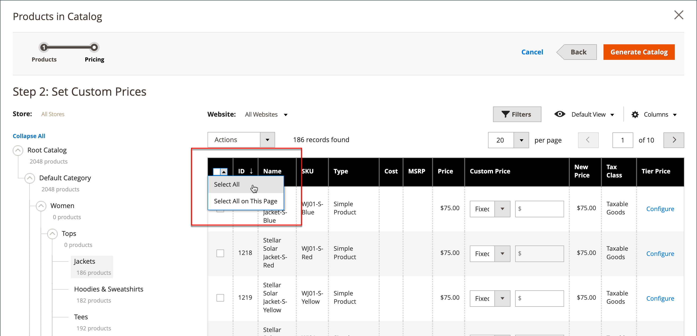
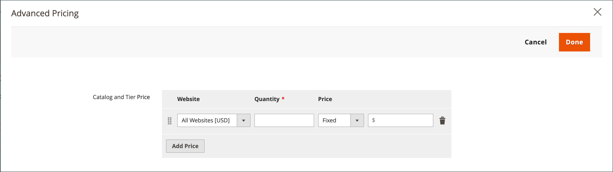

# Impostare la struttura e i prezzi del catalogo condiviso

L&#39;impostazione dei prezzi e della struttura di un catalogo condiviso è un processo in due fasi. La posizione corrente nel processo viene evidenziata con un numero nella barra di avanzamento nella parte superiore della pagina. È possibile visualizzare l&#39;altro passaggio del processo in qualsiasi momento facendo clic sulla barra di avanzamento. Ad esempio, per informazioni sui prezzi personalizzati, puoi tornare alla pagina di selezione del prodotto come riferimento. Fai clic su **[!UICONTROL Products]** nella barra di avanzamento nella parte superiore della pagina, quindi fai clic su **[!UICONTROL Pricing]** per tornare alla pagina dei prezzi personalizzata. Il tuo lavoro non viene perso in questo processo.

{width="700" zoomable="yes"}

Nell&#39;albero delle categorie standard, la categoria principale è il contenitore più in alto ed è indicata come _Categoria predefinita_ nei dati di esempio. Tuttavia, quando i cataloghi condivisi sono abilitati, l&#39;albero delle categorie ha un contenitore esterno denominato _Catalogo principale_. Il catalogo principale include tutte le altre strutture di categorie presenti nel sistema. Per ulteriori informazioni, vedere [Ambito catalogo](../catalog/introduction.md#catalog-scope).

## Passaggio 1: aprire la configurazione della struttura e dei prezzi del catalogo condiviso

1. Nella barra laterale _Admin_, passa a **[!UICONTROL Catalog]** > **[!UICONTROL Shared Catalogs]**

1. Per il catalogo condiviso nella griglia, passare alla colonna _[!UICONTROL Action]_&#x200B;e fare clic su **[!UICONTROL Set Pricing and Structure]**.

   {width="700" zoomable="yes"}

1. La prima volta che il catalogo condiviso viene configurato, fare clic su **[!UICONTROL Configure]** per continuare con i passaggi seguenti.

## Passaggio 2: scegliere i prodotti

Il primo passaggio del processo consiste nella scelta dei prodotti da includere nel catalogo condiviso. Nella pagina di selezione del prodotto sono presenti la [struttura categorie](../catalog/category-create.md) a sinistra e una griglia prodotti sincronizzata a destra. Se si fa clic su una categoria nella struttura, i prodotti della categoria vengono visualizzati nella griglia.

Solo le categorie con i prodotti selezionati vengono visualizzate nella [navigazione superiore](../catalog/navigation-top.md) quando il catalogo condiviso viene visualizzato dalla vetrina. Per impostazione predefinita, nella navigazione in vetrina sono inclusi solo i primi tre livelli di categoria, esclusa la categoria principale.

1. Utilizza il selettore **Store** per impostare l&#39;[ambito](../catalog/introduction.md#product-scope) della configurazione.

   L’ambito della configurazione può essere impostato solo prima che il catalogo condiviso venga salvato per la prima volta. Se successivamente modifichi la selezione del prodotto, il selettore Negozio non è disponibile.

   {width="600" zoomable="yes"}

1. Nell&#39;albero delle categorie eseguire una delle operazioni seguenti:

   - Per includere tutti i prodotti, fare clic su **[!UICONTROL Select all]** o selezionare la casella di controllo della categoria padre.
   - Per includere categorie specifiche di prodotti, seleziona la casella di controllo di ciascuna categoria che desideri includere.
   - Per includere o escludere un singolo prodotto, seleziona o deseleziona la casella di controllo del prodotto.

   La notazione sotto ogni categoria nella struttura mostra il numero di prodotti della categoria attualmente inclusi nel catalogo condiviso. La notazione sotto la [categoria principale](../catalog/category-root.md) mostra il numero totale di prodotti di tutte le categorie attualmente selezionate per il catalogo condiviso.

1. Per visualizzare i prodotti di categoria nella griglia, fare clic sul nome della categoria nella struttura. Quando si seleziona una categoria, si verifica quanto segue:

   - L&#39;interruttore nella prima colonna della griglia è impostato sulla posizione verde _On_ per ogni prodotto selezionato.
   - Se un prodotto è assegnato a più categorie e non è selezionato in una di esse, rimane disponibile nelle altre categorie e anche quando si utilizza [ricerca catalogo](../catalog/search.md).
   - Il sistema imposta automaticamente [Autorizzazioni categoria](../catalog/category-permissions.md) su `Allow` per i prodotti selezionati.

1. Se necessario, utilizzare i filtri e altri controlli griglia per individuare i prodotti che si desidera includere nel catalogo condiviso.

   Puoi selezionare o omettere singoli prodotti facendo clic sull’interruttore nella prima colonna.

   Se selezioni una categoria priva di prodotti, ma collegata a contenuti CMS o a un collegamento esterno, viene visualizzata nella navigazione superiore della vetrina.

   Le impostazioni di categoria effettuate non vengono registrate in modo permanente nel database fino al salvataggio della configurazione. Tuttavia, vengono salvate temporaneamente mentre si lavora sulla struttura e sui prezzi.

1. Fare clic su **[!UICONTROL Next]**.

   {width="600" zoomable="yes"}

## Passaggio 3: impostare i prezzi personalizzati

È possibile impostare prezzi personalizzati per ogni singolo prodotto oppure utilizzare il controllo _[!UICONTROL Action]_&#x200B;per impostare i prezzi personalizzati come quantità o percentuale fissa per più record di prodotto.

- **[!UICONTROL Fixed]**: specifica il prezzo del prodotto finale. Ad esempio, se si immette un prezzo fisso di $10,00, il prezzo nella vetrina della società corrispondente è $10,00.

  >[!NOTE]
  >
  >Il valore minimo tra il prezzo base e il valore fisso inserito viene utilizzato come prezzo finale del prodotto.

  >[!NOTE]
  >
  >**_Le opzioni personalizzabili del prodotto_** a prezzo fisso sono _non_ influenzate dalle regole di prezzo di gruppo, prezzo di livello, prezzo speciale o prezzo di catalogo.

- **[!UICONTROL Percentage]**: determina il prezzo personalizzato in base alla percentuale di sconto. Ad esempio, per offrire uno sconto del 10%, impostare il tipo di prezzo personalizzato su `Percentage` e immettere `10`. Il prezzo personalizzato scontato è il 90% del prezzo del prodotto originale.

Per impostare lo sconto su un importo fisso o su una percentuale per i seguenti tipi di prodotto, utilizzare la colonna _[!UICONTROL Custom Price]_&#x200B;nella griglia:

- [Semplice](../catalog/product-create-simple.md) (incluse varianti di prodotto configurabili)
- [Bundle](../catalog/product-create-bundle.md)
- [Download disponibile](../catalog/product-create-downloadable.md)
- [Virtuale](../catalog/product-create-virtual.md)

La colonna Prezzo personalizzato è vuota per i tipi di prodotti [configurabili](../catalog/product-create-configurable.md) e [raggruppati](../catalog/product-create-grouped.md) e per le [gift card](../catalog/product-gift-card-create.md).

Impossibile modificare la selezione dei prodotti nella griglia dalla pagina _Prezzi personalizzati_. Tuttavia, puoi utilizzare l’indicatore di avanzamento nella parte superiore della pagina per tornare al passaggio precedente e modificare la selezione dei prodotti.

{width="600" zoomable="yes"}

### Applicare un prezzo personalizzato

1. Per un&#39;installazione multisito, impostare **[!UICONTROL Website]** sul sito Web in cui vengono applicati i prezzi personalizzati.

   {width="600" zoomable="yes"}

1. Utilizza uno dei seguenti metodi per selezionare i prodotti a cui applicare il prezzo personalizzato.

   - Utilizzare l&#39;albero delle categorie per selezionare tutti i prodotti di una categoria specifica.
   - Impostare il controllo _[!UICONTROL Mass Actions]_&#x200B;nell&#39;intestazione su `Select All`.
   - Seleziona la casella di controllo dei singoli prodotti.

   Nella griglia vengono visualizzati i prodotti nelle categorie attualmente selezionate ed è possibile utilizzare i controlli standard per trovare i prodotti e filtrare l&#39;elenco.

   {width="600" zoomable="yes"}

1. Imposta **[!UICONTROL Actions]** su uno dei seguenti:

   - `Set Discount` - Applica una percentuale di sconto a tutti i prodotti selezionati. Ogni prezzo del prodotto interessato viene visualizzato come prezzo **_scontato_**.
   - `Adjust Fixed Price` - Applica una percentuale di sconto a prezzo fisso a tutti i prodotti selezionati. Ogni prezzo del prodotto interessato viene visualizzato come prezzo fisso **_adeguato_**.

   {width="600" zoomable="yes"}

1. Quando richiesto, immettere lo sconto o l&#39;adeguamento del prezzo e fare clic su **[!UICONTROL Apply]**.

   {width="400"} 

   {width="400"}

   Lo sconto viene applicato a tutti i prodotti selezionati e la colonna _Prezzo personalizzato_ riflette il tipo di sconto e l&#39;importo applicato.

   {width="600" zoomable="yes"}

### Applicare un prezzo di livello

[La determinazione prezzi a livelli](../catalog/product-price-tier.md) ti consente di offrire uno sconto sulla quantità per i prodotti nel catalogo condiviso. La colonna _Prezzo livello_ della griglia contiene un collegamento alle opzioni _Determinazione prezzi avanzata_ specifiche per il catalogo condiviso. Se il prodotto include già i prezzi dei livelli, il numero di livelli esistenti viene visualizzato tra parentesi dopo il collegamento.

Le istruzioni seguenti mostrano come applicare i prezzi dei livelli a un singolo prodotto. Per applicare i prezzi dei livelli a più prodotti, fare riferimento a [Importa prezzi dei livelli](../systems/data-import-price-tier.md).

1. Per il prodotto nella griglia, passare alla colonna _Prezzo livello_ e fare clic su **[!UICONTROL Configure]**.

   {width="600" zoomable="yes"}

1. Nella pagina _Determinazione prezzi avanzata_, fare clic su **[!UICONTROL Add Price]** ed eseguire le operazioni seguenti:

   {width="600" zoomable="yes"}

   - Impostare **[!UICONTROL Website]** sul sito Web in cui si applica il prezzo del livello.
   - Immettere la quantità del prodotto che deve essere acquistato per ricevere lo sconto.
   - Impostare **[!UICONTROL Price]** su uno dei tipi di sconto seguenti:
      - `Fixed`
      - `Discount`
   - Inserire l&#39;importo dello sconto.
   - Per immettere un altro livello, fare clic su **Aggiungi prezzo** e ripetere il processo per definire il livello successivo.

   {width="600" zoomable="yes"}

1. Al termine, fare clic su **[!UICONTROL Done]**.

   Nella griglia, il numero di livelli viene visualizzato tra parentesi nella colonna _[!UICONTROL Tier Price]_.

   {width="600" zoomable="yes"}

## Salvare la struttura e i prezzi

Al termine della determinazione dei prezzi personalizzata, fare clic su **[!UICONTROL Generate Catalog]** e quindi su **[!UICONTROL Save]**.

Il catalogo condiviso viene ora salvato nel database. Il nome viene visualizzato nella colonna _[!UICONTROL Shared Catalog]_&#x200B;della griglia&#x200B;_[!UICONTROL Products]_. Il passaggio successivo è [assegnare il catalogo condiviso a una società](./catalog-shared-assign-companies.md).
