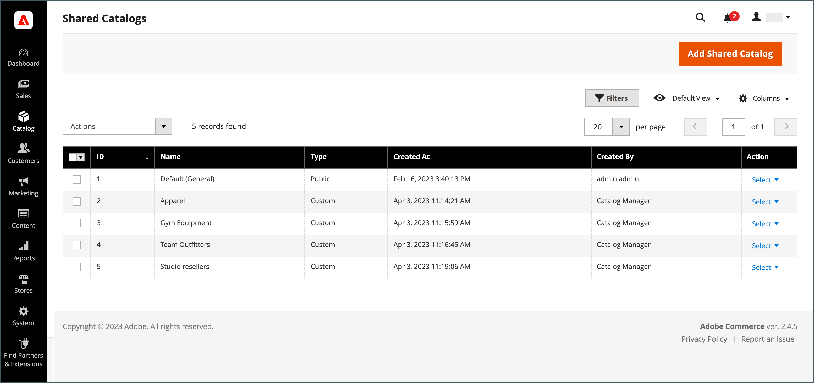

# Panoramica del catalogo condiviso

Adobe Commerce B2B consente di mantenere Gated _condiviso_ cataloghi con prezzi personalizzati per diverse aziende. Oltre allo standard, _primario_, catalogo dei prodotti, consente l&#39;accesso dei clienti a due tipi di cataloghi condivisi con diverse strutture di prezzo.

Se il [Funzione Catalogo condiviso](enable-basic-features.md) è abilitato nella configurazione, il catalogo principale originale rimane visibile dall’amministratore, ma dalla vetrina è visibile solo il catalogo pubblico condiviso predefinito (generale). Inoltre, è possibile creare cataloghi personalizzati visibili solo ai membri di [azienda](account-companies.md) account.

Per `Default (General)` catalogo condiviso pubblico, devi assegnare i prodotti per visualizzare il catalogo nella vetrina. Per impostazione predefinita, è vuoto e non contiene alcun prodotto.

>[!NOTE]
>
>**[Versione 1.3.0 di B2B](release-notes.md#b2b-v130) e versioni successive** — Quando si crea un catalogo condiviso, ogni [autorizzazione categoria](../catalog/category-permissions.md) per il catalogo è impostato su _[!UICONTROL Allow for the Display Product Prices]_e_[!UICONTROL Add to Cart]_ per i gruppi di clienti a cui viene assegnato questo accesso nelle impostazioni di autorizzazione per il catalogo. In precedenza, queste impostazioni venivano impostate automaticamente su `Deny` anche quando le autorizzazioni del catalogo sono state impostate su `Allow`.

>[!IMPORTANT]
>
>Tutti gli esistenti [impostazioni delle autorizzazioni del gruppo](../configuration-reference/catalog/catalog.md#category-permissions) vengono ignorati da **_tutto_** categorie nel catalogo quando **_[!UICONTROL Shared Catalog]_** la funzione è abilitata. [!UICONTROL Shared Catalog] controlla completamente tutte le autorizzazioni di categoria nel catalogo quando questo è abilitato.

Il _[!UICONTROL Shared Catalogs]_fornisce l’accesso agli strumenti utilizzati per gestire i cataloghi condivisi. La pagina è simile allo standard [Admin Workspace](../getting-started/admin-workspace.md), con filtri e controlli delle azioni. Nella griglia sono elencati tutti i cataloghi condivisi, incluso il catalogo condiviso pubblico predefinito e tutti i cataloghi personalizzati impostati.

{width="700" zoomable="yes"}

## Accedere a [!UICONTROL Shared Catalogs] pagina

Il giorno _Amministratore_ barra laterale, vai a **[!UICONTROL Catalog]** > **[!UICONTROL Shared Catalogs]**.

## Controlli delle azioni

Il [azioni, controlli](../getting-started/admin-actions-control.md) nell&#39;angolo in alto a sinistra può essere utilizzato con il controllo azioni di massa per eliminare cataloghi condivisi selezionati che non sono più necessari. Nella griglia, il _[!UICONTROL Actions]_contiene la selezione completa degli strumenti per la gestione dei cataloghi condivisi.

{width="350"}

| Controllo | Descrizione |
|------|-----------|
| [[!UICONTROL Set Pricing and Structure]](catalog-shared-pricing-structure.md) | Determina la selezione dei prodotti e i prezzi personalizzati disponibili nel catalogo condiviso. |
| [[!UICONTROL Assign Companies]](catalog-shared-assign-companies.md) | Determina quali società possono accedere a un catalogo condiviso. |
| [[!UICONTROL General Settings]](catalog-shared-manage.md) | Determina le informazioni di dettaglio del catalogo, tra cui il nome, il tipo di catalogo, la classe fiscale del cliente e la descrizione. |
| [!UICONTROL Delete] | Elimina i cataloghi condivisi selezionati. |

{style="table-layout:auto"}

## Descrizioni delle colonne

| Intestazione | Descrizione |
|--- |--- |
| [!UICONTROL Select] | Seleziona i record di catalogo condiviso per applicare un&#39;azione. Il controllo nell&#39;intestazione può essere utilizzato per selezionare tutti o deselezionare tutti i record di catalogo condivisi nella griglia. Per selezionare un singolo catalogo condiviso, selezionare la casella di controllo. |
| [!UICONTROL ID] | Identificatore numerico univoco assegnato in sequenza al momento della creazione del catalogo. |
| [!UICONTROL Name] | Nome del catalogo condiviso. Per impostazione predefinita, è disponibile il catalogo condiviso predefinito (Generale). |
| [!UICONTROL Type] | Identifica il tipo di catalogo condiviso come:  **[!UICONTROL Public]**: il catalogo condiviso pubblico predefinito viene creato automaticamente quando viene installato Adobe Commerce B2B. Inizialmente viene assegnato al `General` e `Not Logged In` gruppi di clienti ed è visibile agli ospiti e ai singoli clienti connessi che non sono associati a un’azienda. Il sistema supporta un solo catalogo condiviso pubblico alla volta. **[!UICONTROL Custom]** - Un catalogo condiviso personalizzato contiene prezzi visibili solo ai soci connessi degli account società assegnati. Puoi creare tutti i cataloghi condivisi personalizzati necessari. |
| [!UICONTROL Customer Tax Class] | Classe di imposta assegnata al gruppo di clienti corrispondente. Questa colonna non viene visualizzata nella griglia predefinita, ma può essere aggiunta modificando il layout della colonna. |
| [!UICONTROL Created At] | Data e ora di creazione del catalogo condiviso. |
| [!UICONTROL Created By] | Nome e cognome dell&#39;amministratore del negozio che ha creato il catalogo condiviso. |
| [!UICONTROL Action] | Elenca le azioni da applicare ai cataloghi selezionati. Opzioni: `Set Pricing and Structure` / `Assign Companies` / `General Settings` / `Delete` |

{style="table-layout:auto"}
