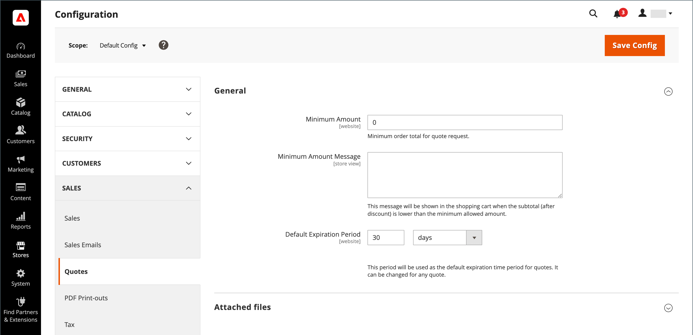

# Configurare le virgolette

Se le virgolette sono abilitate nelle [funzionalità B2B generali](enable-basic-features.md), è possibile configurare il supporto per le virgolette in Amministrazione. La configurazione delle virgolette determina la quantità minima richiesta per le richieste di virgolette, la durata delle virgolette e i formati di file supportati per i file allegati.

>[!NOTE]
>
>Le opzioni di configurazione dei preventivi e la possibilità di utilizzare le funzioni di negoziazione dei preventivi sono controllate utilizzando le [risorse ruolo](../systems/permissions-user-roles.md#role-resources). Queste risorse ruolo devono essere selezionate per il ruolo utente Amministratore assegnato all&#39;account utente Amministratore. Per concedere l&#39;accesso alle funzioni di preventivo nell&#39;amministratore, passare a **[!UICONTROL System]** > _[!UICONTROL Permissions]_>**[!UICONTROL User Roles]**, selezionare il ruolo e passare a [!UICONTROL Sales] > [!UICONTROL Operations] > [!UICONTROL Quotes] nell&#39;albero_ Risorse ruolo _.

1. Nella barra laterale _Admin_, passa a **[!UICONTROL Stores]** > _[!UICONTROL Settings]_>**[!UICONTROL Configuration]**.

1. Nel pannello a sinistra, espandi **[!UICONTROL Sales]** e scegli **[!UICONTROL Quotes]**.

1. Espandere  nella sezione **[!UICONTROL General]** ed effettuare le seguenti operazioni:

   {width="700" zoomable="yes"}

   Per un elenco completo delle opzioni della funzionalità Quotes e delle relative funzioni, vedere [Quotes](../configuration-reference/sales/quotes.md) nel _Riferimento configurazione_.

   - Immettere **[!UICONTROL Minimum Amount]** nel carrello che deve essere soddisfatto prima di poter inviare una richiesta di preventivo.

   - Per **[!UICONTROL Minimum Amount Message]**, immettere il messaggio che si desidera visualizzare quando il totale del carrello acquisti non soddisfa la quantità minima richiesta.

   - Per **[!UICONTROL Default Expiration Period]**, immettere il numero di **[!UICONTROL days]**, **[!UICONTROL weeks]** o **[!UICONTROL months]** che un preventivo deve rimanere valido.

1. Espandere  nella sezione **[!UICONTROL Attached files]** ed effettuare le seguenti operazioni:

   - Per **[!UICONTROL File formats for upload]**, immettere il suffisso di ogni tipo di file supportato per i file allegati a virgolette.

     Immetti ogni suffisso di file in minuscolo e separato da una virgola.

     Per impostazione predefinita, sono supportati i seguenti formati: `doc`, `docx`, `xls`, `xlsx`, `pdf`, `txt`, `jpg`, `png` e `jpeg`

   - Per **[!UICONTROL Maximum file size]**, immettere la dimensione massima in megabyte di un file allegato.

     Il valore immesso potrebbe essere sostituito dall&#39;impostazione del server.

     {width="600" zoomable="yes"}

1. Al termine, fare clic su **[!UICONTROL Save Config]**.
