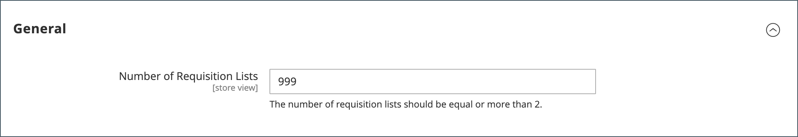

# Configura massimo elenco richieste di acquisto

Quando la funzione Elenco richieste di acquisto è abilitata, i clienti possono creare più elenchi di articoli acquistati di frequente e utilizzarli per l&#39;inserimento degli ordini. È disponibile sia per gli utenti connessi che per gli ospiti. È possibile abilitare gli elenchi di richieste di acquisto quando [configurare le funzioni B2B](enable-basic-features.md).

Un cliente può avere più elenchi che si concentrano su prodotti di fornitori, acquirenti, team, campagne o qualsiasi altra cosa che semplifica i flussi di lavoro comuni. [Funzionalità elenco richieste di acquisto](requisition-lists.md) è simile alla lista dei desideri, con le seguenti differenze:

- L&#39;elenco delle richieste di acquisto non viene cancellato dopo l&#39;invio degli articoli al carrello. Può essere utilizzato più volte.
- L&#39;interfaccia utente per gli elenchi delle richieste di acquisto utilizza una vista compatta per visualizzare molti elementi.

Per impostazione predefinita, i clienti possono gestire fino a 999 elenchi di richieste di acquisto per il proprio conto. Tuttavia, puoi modificare la configurazione e specificare un numero inferiore per ridurre il carico sullo store.

1. Il giorno _Amministratore_ barra laterale, vai a **[!UICONTROL Stores]** > _[!UICONTROL Settings]_>**[!UICONTROL Configuration]**.

1. Nel pannello a sinistra, espandi **[!UICONTROL Customers]** e scegli **[!UICONTROL Requisition Lists]**.

   {width="600" zoomable="yes"}

1. Per **[!UICONTROL Number of Requisition Lists]**, inserire il numero massimo di elenchi di richieste di acquisto che è possibile gestire per ciascun conto cliente.

   Il numero minimo è `2`, e il massimo è `999`.

1. Al termine, fai clic su **[!UICONTROL Save Config]**.
