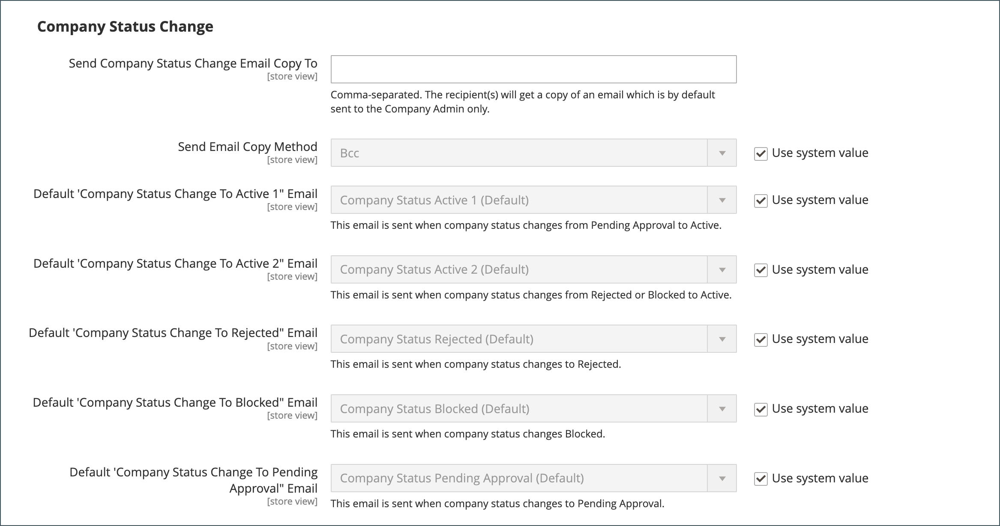
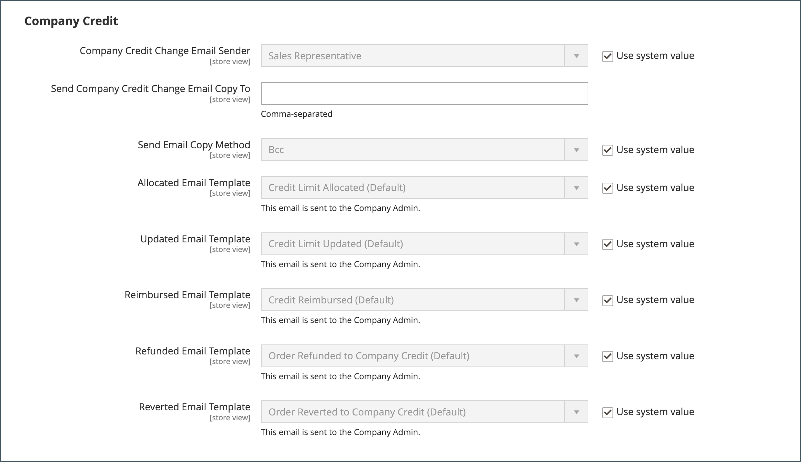

# Configurare le opzioni e-mail aziendali

Il [rappresentante commerciale](account-company-manage.md) assegnato come contatto principale per una società è configurato per impostazione predefinita come mittente di molti messaggi di posta elettronica automatizzati inviati alla società.

1. Nella barra laterale _Admin_, passa a **[!UICONTROL Stores]** > _[!UICONTROL Settings]_>**[!UICONTROL Configuration]**.

1. Nel pannello a sinistra, espandi **[!UICONTROL Customers]** e scegli **[!UICONTROL Company Configuration]**.

1. Se necessario, impostare **[!UICONTROL Store View]** nella visualizzazione archivio per definire l&#39;[ambito](../getting-started/websites-stores-views.md#scope-settings) della configurazione.

1. Completare la sezione **[!UICONTROL Company Registration]**:

   >[!NOTE]
   >
   >Deselezionare la casella di controllo **[!UICONTROL Use system value]** per rendere modificabile il campo.

   - Impostare **[!UICONTROL Company Registration Email Recipient]** sul [contatto archivio](../getting-started/store-details.md#store-email-addresses) che deve ricevere una notifica quando viene ricevuta una nuova richiesta di registrazione società.

   - Nel campo **[!UICONTROL Send Company Registration Email Copy To]**, immettere l&#39;indirizzo di posta elettronica di ogni persona che deve ricevere una copia della notifica di registrazione. Separa più indirizzi e-mail con una virgola.

   - Per determinare la modalità di invio della copia della notifica, impostare **[!UICONTROL Send Email Copy Method]** su una delle opzioni seguenti:

      - `Bcc` - Invia una _copia di cortesia cieca_ includendo il destinatario nell&#39;intestazione della stessa e-mail inviata al cliente. Il destinatario Ccn non è visibile al cliente.
      - `Separate Email` - Invia la copia come messaggio e-mail separato.

   - Se è stato preparato un modello di posta elettronica da utilizzare al posto di quello predefinito, impostare **[!UICONTROL Default Company Registration Email]** sul nome del modello. Per impostazione predefinita, viene utilizzato il modello `Company Registration Request`.

     {width="600" zoomable="yes"}

1. Completare la sezione **[!UICONTROL Customer-Related Emails]**:

   Se hai preparato modelli e-mail alternativi da utilizzare al posto dei predefiniti, scegli il modello da utilizzare per ciascuno dei seguenti elementi:

   - **[!UICONTROL Default 'Sales Rep Assigned' Email]**
   - **[!UICONTROL Default 'Assign Company to Customer' Email]**
   - **[!UICONTROL Default 'Assign Company Admin' Email]**
   - **[!UICONTROL Default 'Company Admin Inactive' Email]**
   - **[!UICONTROL Default 'Company Admin Changed to Member' Email]**
   - **[!UICONTROL Default 'Customer Status Active' Email]**
   - **[!UICONTROL Default 'Customer Status Inactive' Email]**

   {width="600" zoomable="yes"}

1. Completare la sezione **[!UICONTROL Company Status Change]**:

   - Imposta **[!UICONTROL Company Status Change for Email Recipient]** sul [contatto archivio](../getting-started/store-details.md#store-email-addresses) che deve ricevere una notifica quando lo stato di un&#39;azienda cambia.

   - Nel campo **[!UICONTROL Send Company Status Change Email Copy To]**, immettere l&#39;indirizzo di posta elettronica di ogni persona che deve ricevere una copia della notifica di modifica dello stato. Separa più indirizzi e-mail con una virgola.

   - Per determinare la modalità di invio della copia della notifica, impostare **[!UICONTROL Send Email Copy Method]** su una delle opzioni seguenti:

      - `Bcc` - Invia una _copia di cortesia cieca_ includendo il destinatario nell&#39;intestazione della stessa e-mail inviata al cliente. Il destinatario Ccn non è visibile al cliente.
      - `Separate Email` - Invia la copia come messaggio e-mail separato.

   - Se si dispone di un modello di posta elettronica preparato da utilizzare al posto del modello predefinito quando lo stato della società cambia da `Pending Approval` a `Active`, impostare **[!UICONTROL Default 'Company Status Change to Active 1' Email]** su tale modello. Per impostazione predefinita, viene utilizzato il modello `Company Status Active 1`.

   - Se si dispone di un modello di posta elettronica preparato da utilizzare al posto del modello predefinito quando lo stato della società cambia da `Rejected` o da `Blocked` a `Active`, impostare **[!UICONTROL Default 'Company Status Change to Active 2' Email]** su tale modello. Per impostazione predefinita, viene utilizzato il modello `Company Status Active 2`.

   - Se si dispone di un modello di posta elettronica preparato da utilizzare al posto del modello predefinito quando lo stato della società cambia in `Rejected`, impostare **[!UICONTROL Default 'Company Status Change to Rejected' Email]** su tale modello. Per impostazione predefinita, viene utilizzato il modello `Company Status Rejected`.

   - Se si dispone di un modello di posta elettronica preparato da utilizzare al posto del modello predefinito quando lo stato della società cambia in `Blocked`, impostare **[!UICONTROL Default 'Company Status Change to Blocked' Email]** su tale modello. Per impostazione predefinita, viene utilizzato il modello `Company Status Blocked`.

   - Se si dispone di un modello di posta elettronica preparato da utilizzare al posto del modello predefinito quando lo stato della società cambia in `Pending Approval`, impostare **[!UICONTROL Default 'Company Status Change to Pending Approval' Email]** su tale modello. Per impostazione predefinita, viene utilizzato il modello `Company Status Pending Approval`.

     {width="600" zoomable="yes"}

1. Completare la sezione **[!UICONTROL Company Credit Emails]**:

   - Impostare **[!UICONTROL Company Credit Change Email Sender]** sul [contatto archivio](../getting-started/store-details.md#store-email-addresses) che deve ricevere una notifica quando viene apportata una modifica al limite di credito assegnato a una società. Per impostazione predefinita, la notifica viene inviata al _rappresentante commerciale_.

   - Nel campo **[!UICONTROL Send Company Credit Change Email Copy To]**, immettere l&#39;indirizzo di posta elettronica di ogni persona che deve ricevere una copia della notifica di modifica del credito. Separa più indirizzi e-mail con una virgola.

   - Per determinare la modalità di invio della copia della notifica, impostare **[!UICONTROL Send Email Copy Method]** su una delle opzioni seguenti:

      - `Bcc` - Invia una _copia di cortesia cieca_ includendo il destinatario nell&#39;intestazione della stessa e-mail inviata al cliente. Il destinatario Ccn non è visibile al cliente.
      - `Separate Email` - Invia la copia come messaggio e-mail separato.

   - Se hai preparato dei modelli e-mail da utilizzare al posto dei predefiniti, scegli il modello per ciascuna delle seguenti notifiche inviate all’amministratore della società.

      - **[!UICONTROL Allocated Email Template]**
      - **[!UICONTROL Updated Email Template]**
      - **[!UICONTROL Reimbursed Email Template]**
      - **[!UICONTROL Refunded Email Template]**
      - **[!UICONTROL Reverted Email Template]**

   {width="600" zoomable="yes"}

1. Al termine, fare clic su **[!UICONTROL Save Config]**.
