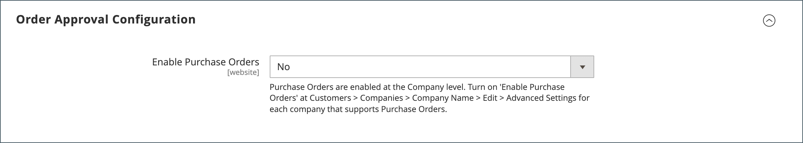

# Abilitare le funzioni B2B

Per impostazione predefinita, tutte le funzioni B2B sono inizialmente disabilitate. L’amministratore dello store può abilitare o disabilitare le funzioni B2B in base alle esigenze degli store di Commerce. Per un elenco completo delle impostazioni di configurazione B2B, vedi [Riferimento configurazione funzionalità B2B](../configuration-reference/general/b2b-features.md).

Quando abiliti il supporto per le aziende dei clienti, vengono abilitate automaticamente ulteriori funzioni B2B:

- [!DNL Shared Catalog]

  Supporta la configurazione personalizzata dei prezzi per diverse società e abilita le autorizzazioni per le categorie per tutti i negozi.

- [!DNL Enable Shared Catalog direct products price assigning]

  Migliora le prestazioni del sito memorizzando nell&#39;indice dei prezzi solo i prodotti assegnati a un catalogo condiviso. Abilitare questa funzione è una best practice per i commercianti che hanno molti cataloghi condivisi, per gestire i prezzi personalizzati per diverse aziende.

- [!DNL B2B Quotes]

  Consente ai venditori e agli acquirenti aziendali di negoziare i prezzi.

- [!DNL B2B default payment and shipping methods]

  Determina la selezione delle opzioni di pagamento e spedizione disponibili per gli acquirenti B2B sul punto vendita.

Le impostazioni di configurazione per queste funzionalità sono visibili solo quando [!DNL Enable Company] è impostato su `Yes`.

Le funzionalità B2B [!DNL Quick Order] e [!DNL Requisition List] possono essere abilitate e disabilitate in modo indipendente.

## Configurare le funzioni B2B

1. Nella barra laterale _Admin_, passa a **[!UICONTROL Stores]** > _[!UICONTROL Settings]_>**[!UICONTROL Configuration]**.

   Se si dispone di un&#39;installazione multisito, impostare il controllo **[!UICONTROL Store View]** nell&#39;angolo superiore sinistro sul sito Web in cui si applica la configurazione.

1. Nel pannello a sinistra in _[!UICONTROL General]_, scegli **[!UICONTROL B2B Features]**:

   Configurazione {width="600"}

   - Consenti ai clienti di gestire i propri account aziendali e abilitare il supporto per ulteriori funzionalità B2B impostando **[!UICONTROL Enable Company]** su `Yes`.

     Quando abiliti il supporto aziendale, il catalogo condiviso, il preventivo B2B, i metodi di pagamento B2B e i metodi di spedizione B2B vengono abilitati automaticamente.

   - Per consentire ai clienti e agli ospiti di effettuare rapidamente gli ordini in base allo SKU o al nome del prodotto, impostare **[!UICONTROL Enable Quick Order]** su `Yes`.

   - Per consentire ai clienti di creare e gestire gli elenchi di richieste di acquisto dal dashboard account, impostare **[!UICONTROL Enable Requisition List]** su `Yes`.

     Puoi anche [configurare il numero massimo di elenchi](configure-requisition-lists.md) che un cliente può avere per il proprio account.

1. Al termine, fare clic su **[!UICONTROL Save Config]**.

## Configurare i metodi di pagamento e di spedizione B2B predefiniti

1. Espandere  nella sezione **[!UICONTROL Default B2B Payment Methods]**.

1. Per stabilire i metodi di pagamento predefiniti per gli ordini B2B, impostare **[!UICONTROL Applicable Payment Methods]** su uno dei seguenti:

   - `All Payment Methods`

   - `Selected Payment Methods`

     Per l&#39;opzione specifica, selezionare **[!UICONTROL Payment Methods]** che si desidera rendere disponibile ai clienti tenendo premuto il tasto Ctrl (PC) o Comando (Mac) mentre si fa clic su ciascuna opzione.

   L&#39;elenco dei [metodi di pagamento](../configuration-reference/sales/payment-methods.md) mostra quali opzioni sono attualmente abilitate o disabilitate nell&#39;archivio. Oltre ai metodi di pagamento standard, l&#39;elenco include anche i seguenti:

   - Non sono richieste informazioni sul pagamento
   - [Pagamento in acconto](#configure-payment-on-account)
   - Account archiviati
   - Schede memorizzate

   {width="600"}

1. Espandere  nella sezione **[!UICONTROL Default B2B Shipping Methods]**.

1. Per specificare i metodi di spedizione predefiniti per gli ordini B2B, impostare **[!UICONTROL Applicable Shipping Methods]** su uno dei seguenti:

   - `All Shipping Methods`
   - `Selected Shipping Methods`

     Per l&#39;opzione specifica, selezionare **[!UICONTROL Shipping Methods]** che si desidera rendere disponibile ai clienti tenendo premuto il tasto Ctrl (PC) o Comando (Mac) mentre si fa clic su ciascuna opzione.

     L&#39;elenco dei metodi di spedizione mostra quali sono attualmente [abilitati o disabilitati](../configuration-reference/sales/delivery-methods.md).

   {width="600"}

1. Al termine, fare clic su **[!UICONTROL Save Config]**.

## Configurare le opzioni e-mail aziendali

Il [rappresentante commerciale](account-company-manage.md#assign-a-sales-representative) assegnato come contatto principale per una società è configurato per impostazione predefinita come mittente di molti messaggi di posta elettronica automatizzati inviati alla società.

1. Nella barra laterale _Admin_, passa a **[!UICONTROL Stores]** > _[!UICONTROL Settings]_>**[!UICONTROL Configuration]**.

1. Nel pannello a sinistra, espandi **[!UICONTROL Customers]** e scegli **[!UICONTROL Company Configuration]**.

1. Se necessario, impostare **[!UICONTROL Store View]** nella visualizzazione archivio per definire l&#39;[ambito](../getting-started/websites-stores-views.md#scope-settings) della configurazione.

1. Completare la sezione **[!UICONTROL Company Registration]**:

   >[!NOTE]
   >
   >Deselezionare la casella di controllo **[!UICONTROL Use system value]** per rendere modificabile il campo.

   - Impostare **[!UICONTROL Company Registration Email Recipient]** sul [contatto archivio](../getting-started/store-details.md#store-email-addresses) che deve ricevere una notifica quando viene ricevuta una nuova richiesta di registrazione società.

   - Per **[!UICONTROL Send Company Registration Email Copy To]**, immettere l&#39;indirizzo di posta elettronica di ogni persona che deve ricevere una copia della notifica di registrazione. Separa più indirizzi e-mail con una virgola.

   - Per determinare la modalità di invio della copia della notifica, impostare **Send Email Copy Method** su una delle opzioni seguenti:

      - `Bcc` - Invia una _copia di cortesia cieca_ includendo il destinatario nell&#39;intestazione della stessa e-mail inviata al cliente. Il destinatario Ccn non è visibile al cliente.
      - `Separate Email` - Invia la copia come messaggio e-mail separato.

   - Se è stato preparato un modello di posta elettronica da utilizzare al posto di quello predefinito, impostare **[!UICONTROL Default Company Registration Email]** sul nome del modello. Per impostazione predefinita, viene utilizzato il modello `Company Registration Request`.

     {width="600"}

1. Completare la sezione **[!UICONTROL Customer-Related Emails]**:

   Se hai preparato modelli e-mail alternativi da utilizzare al posto dei predefiniti, scegli il modello da utilizzare per ciascuno dei seguenti elementi:

   - **[!UICONTROL Default 'Sales Rep Assigned' Email]**
   - **[!UICONTROL Default 'Assign Company to Customer' Email]**
   - **[!UICONTROL Default 'Assign Company Admin' Email]**
   - **[!UICONTROL Default 'Company Admin Inactive' Email]**
   - **[!UICONTROL Default 'Company Admin Changed to Member' Email]**
   - **[!UICONTROL Default 'Customer Status Active' Email]**
   - **[!UICONTROL Default 'Customer Status Inactive' Email]**

   {width="600"}

1. Completare la sezione **[!UICONTROL Company Status Change]**:

   - Per **[!UICONTROL Send Company Status Change Email Copy To]**, immettere l&#39;indirizzo di posta elettronica di ogni persona che deve ricevere una copia della notifica di modifica dello stato. Separa più indirizzi e-mail con una virgola.

   - Per determinare la modalità di invio della copia della notifica, impostare **Send Email Copy Method** su una delle opzioni seguenti:

      - `Bcc` - Invia una _copia di cortesia cieca_ includendo il destinatario nell&#39;intestazione della stessa e-mail inviata al cliente. Il destinatario Ccn non è visibile al cliente.
      - `Separate Email` - Invia la copia come messaggio e-mail separato.

   - Se è stato preparato un modello di posta elettronica da utilizzare quando lo stato della società cambia da `Pending Approval` a `Active`, impostare **[!UICONTROL Default 'Company Status Change to Active 1' Email]** sul nome del modello. Per impostazione predefinita, viene utilizzato il modello `Company Status Active 1`.

   - Se è stato preparato un modello di posta elettronica da utilizzare quando lo stato della società cambia da `Rejected` o da `Blocked` a `Active`, impostare **[!UICONTROL Default 'Company Status Change to Active 2' Email]** sul nome del modello. Per impostazione predefinita, viene utilizzato il modello `Company Status Active 2`.

   - Se è stato preparato un modello di posta elettronica da utilizzare quando lo stato della società cambia in `Rejected`, impostare **[!UICONTROL Default 'Company Status Change to Rejected' Email]** sul nome del modello. Per impostazione predefinita, viene utilizzato il modello `Company Status Rejected`.

   - Se è stato preparato un modello di posta elettronica da utilizzare quando lo stato della società cambia in `Blocked`, impostare **[!UICONTROL Default 'Company Status Change to Blocked' Email]** sul nome del modello. Per impostazione predefinita, viene utilizzato il modello `Company Status Blocked`.

   - Se è stato preparato un modello di posta elettronica da utilizzare quando lo stato della società cambia in `Pending Approval`, impostare **[!UICONTROL Default 'Company Status Change to Pending Approval' Email]** sul nome del modello. Per impostazione predefinita, viene utilizzato il modello `Company Status Pending Approval`.

   {width="600"}

1. Completare la sezione **[!UICONTROL Company Credit Emails]**:

   - Impostare **[!UICONTROL Company Credit Change Email Sender]** sul [contatto archivio](../getting-started/store-details.md#store-email-addresses) che deve ricevere una notifica quando viene apportata una modifica al limite di credito assegnato a una società. Per impostazione predefinita, la notifica viene inviata al _rappresentante commerciale_.

   - Per **[!UICONTROL Send Company Credit Change Email Copy To]**, immettere l&#39;indirizzo di posta elettronica di ogni persona che deve ricevere una copia della notifica di modifica del credito. Separa più indirizzi e-mail con una virgola.

   - Per determinare la modalità di invio della copia della notifica, impostare **Send Email Copy Method** su una delle opzioni seguenti:

      - `Bcc` - Invia una _copia di cortesia cieca_ includendo il destinatario nell&#39;intestazione della stessa e-mail inviata al cliente. Il destinatario Ccn non è visibile al cliente.
      - `Separate Email` - Invia la copia come messaggio e-mail separato.

   - Se hai preparato dei modelli e-mail da utilizzare al posto dei predefiniti, scegli il modello per ciascuna delle seguenti notifiche inviate all’amministratore della società.

      - **[!UICONTROL Allocated Email Template]**
      - **[!UICONTROL Updated Email Template]**
      - **[!UICONTROL Reimbursed Email Template]**
      - **[!UICONTROL Refunded Email Template]**
      - **[!UICONTROL Reverted Email Template]**

   {width="600"}

1. Al termine, fare clic su **[!UICONTROL Save Config]**.

## Configura approvazione ordine

La possibilità di tenere traccia dell&#39;elaborazione degli ordini e degli ordini di acquisto consente agli amministratori della società di controllare le azioni degli acquirenti. La funzionalità di approvazione degli ordini è disponibile quando la funzione ordini fornitore è abilitata da un amministratore del negozio.

1. Nella barra laterale _Admin_, passa a **[!UICONTROL Stores]** > _[!UICONTROL Settings]_>**[!UICONTROL Configuration]**.

1. Nel pannello a sinistra, espandi **[!UICONTROL General]** e scegli **[!UICONTROL B2B Features]**.

1. Espandere  nella sezione **[!UICONTROL Order Approval Configuration]**.

   {width="600"}

1. Per consentire alle società di creare i propri ordini di acquisto, impostare **[!UICONTROL Enable Purchase Orders]** su `Yes`.

1. Al termine, fare clic su **[!UICONTROL Save Config]**.

   La funzione Ordini di acquisto è abilitata a livello di sito Web. Per abilitare questo tipo di ordine per una società, eseguire le stesse operazioni con le impostazioni appropriate in ogni [profilo società](account-company-manage.md).

## Configurare gli ordini fornitore

1. Nella barra laterale _Admin_, passa a **[!UICONTROL Customers]** > **[!UICONTROL Companies]**.

1. Trovare la società nell&#39;elenco e fare clic su **[!UICONTROL Edit]**.

1. Espandere  nella sezione **[!UICONTROL Advanced Settings]**.

1. Imposta **[!UICONTROL Enable Purchase Orders]** su `Yes`.

1. Al termine, fare clic su **[!UICONTROL Save]**.

Dopo l&#39;attivazione, la sezione **[!UICONTROL Approval Rules]** viene visualizzata nella vetrina [Dashboard account](../customers/account-dashboard.md) per un amministratore della società.

>[!NOTE]
>
>L&#39;accesso all&#39;ordine fornitore nella vetrina deve essere concesso dall&#39;amministratore della società in base alle [autorizzazioni per il ruolo utente della società](account-company-roles-permissions.md).

## Configura pagamento in acconto

Payment on Account è un metodo di pagamento offline che consente alle aziende di effettuare acquisti fino al limite di credito specificato nel loro profilo. Il pagamento in conto può essere abilitato a livello globale o per società e viene visualizzato durante l&#39;estrazione solo se abilitato. Quando si utilizza il metodo di pagamento _Pagamento sul conto_, nella parte superiore dell&#39;ordine viene visualizzato un messaggio che indica lo stato del conto. Per configurare questo metodo di pagamento per una società specifica, vedere [Gestione account società](account-company-manage.md).

>[!NOTE]
>
>Il pagamento in conto non è supportato per gli ordini con [più indirizzi di spedizione](../stores-purchase/shipping-settings.md#multiple-addresses) e non compare tra le opzioni di pagamento per questi ordini.

Per abilitare Pagamento in conto per il tuo Negozio:

1. Nella barra laterale _Admin_, passa a **[!UICONTROL Stores]** > _[!UICONTROL Settings]_>**[!UICONTROL Configuration]**.

1. Nel pannello a sinistra, espandi **[!UICONTROL Sales]** e scegli **[!UICONTROL Payment Methods]**.

1. Espandere  nella sezione **[!UICONTROL Payment on Account]**.

   {width="600"}

   >[!NOTE]
   >
   >Se necessario, deselezionare la casella di controllo **[!UICONTROL Use system value]** per modificare le impostazioni.

1. Per consentire il pagamento in acconto, impostare **[!UICONTROL Enabled]** su `Yes`.

1. Immettere un **[!UICONTROL Title]** che identifica il metodo di pagamento durante l&#39;estrazione oppure accettare il titolo predefinito di `Payment on Account`.

1. Se gli ordini in genere attendono l&#39;approvazione, accettare **[!UICONTROL New Order Status]** come `Pending` predefinito fino all&#39;approvazione.

   Se si preferisce, è possibile utilizzare lo stato `Processing` o `Suspected Fraud` per i nuovi ordini con questo metodo di pagamento.

1. Imposta **[!UICONTROL Payment from Applicable Countries]** su uno dei seguenti:

   - `All Allowed Countries` - I clienti di tutti i [paesi](../getting-started/store-details.md#country-options) specificati nella configurazione del tuo negozio possono utilizzare questo metodo di pagamento.
   - `Specific Countries` - Dopo aver scelto questa opzione, viene visualizzato l&#39;elenco _[!UICONTROL Payment from Specific Countries]_. Per selezionare più paesi, tenere premuto il tasto Ctrl (PC) o il tasto Comando (Mac) e fare clic su ciascuna opzione.

1. Impostare **[!UICONTROL Minimum Order Total]** e **[!UICONTROL Maximum Order Total]** sugli importi degli ordini necessari per qualificarsi per questo metodo di pagamento.

   >[!NOTE]
   >
   >Un ordine è qualificato se il totale è compreso tra i valori totali minimi o massimi o corrisponde esattamente a tali valori.

1. Immettere un numero **[!UICONTROL Sort Order]** che imposta la posizione di questo elemento nell&#39;elenco dei metodi di pagamento visualizzato durante l&#39;estrazione.

   Il valore è relativo agli altri metodi di pagamento. (`0` = primo, `1` = secondo, `2` = terzo e così via).

1. Al termine, fare clic su **[!UICONTROL Save Config]**.
