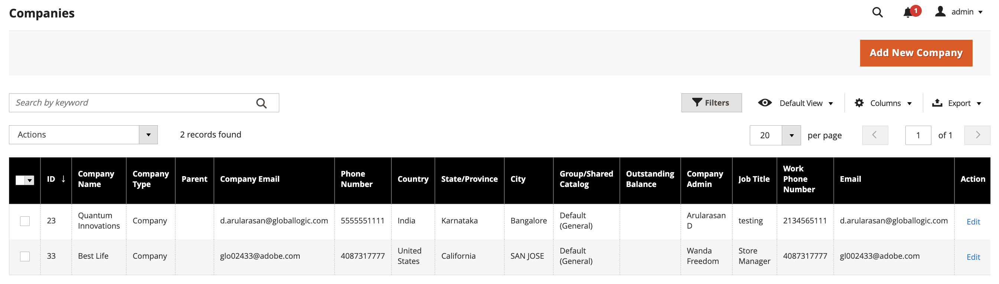

# Gestione società

La gestione aziendale semplifica le operazioni aziendali per le aziende con strutture organizzative complesse. Gli utenti amministratori possono creare una gerarchia di società per riflettere un’organizzazione B2B assegnando le società alla società madre designata. Questa assegnazione consente all&#39;amministratore della società madre di visualizzare e gestire le società all&#39;interno dell&#39;organizzazione.

Avvia le attività di gestione società dalla visualizzazione *[!UICONTROL Companies]*. Dall&#39;amministratore, passa a **[!UICONTROL Customers]** > **[!UICONTROL Companies]**.

{width="700" zoomable="yes"}

La colonna *[!UICONTROL Company Type]* indica se una società è gestita come parte di un&#39;organizzazione o come società separata.

- `Parent` è un&#39;organizzazione aziendale con una o più società assegnate. Una società madre non può essere assegnata come figlio di un&#39;altra società.

- `Child` è una società che è stata assegnata a un&#39;organizzazione. È possibile assegnare una società a una sola società madre.

- `Company` rappresenta una singola azienda. Una singola azienda può diventare parte di un&#39;organizzazione trasformandola in una società madre o assegnandola a una società madre esistente.

Quando si modifica una società padre o figlio, espandere *[!UICONTROL Company Hierarchy]* per visualizzare tutte le società dell&#39;organizzazione. Un flag `Current` indica la società che stai modificando.

{width="700" zoomable="yes"}

## Visualizza e configura [!UICONTROL Company Hierarchy]

Al momento della creazione iniziale della società, la griglia *[!UICONTROL Company Hierarchy]* è vuota. È vuoto anche se l’azienda è una singola azienda.

{width="700" zoomable="yes"}

Se la società è una società madre di un&#39;organizzazione e gli account della società per altre società dell&#39;organizzazione sono già stati configurati in Adobe Commerce, gli utenti amministratori con le autorizzazioni appropriate possono assegnare società e utilizzare la griglia *[!UICONTROL Company Hierarchy]* per completare altre attività di gestione della società:

- Visualizza tutte le società associate alla società padre.
- Dalla pagina dei dettagli di una società padre, assegna più società all’organizzazione.
- Rimuovere un&#39;azienda da un&#39;organizzazione utilizzando l&#39;azione *[!UICONTROL Unassign from parent]*.
- Aggiorna la configurazione *[!UICONTROL Advanced Settings]* per applicare le stesse impostazioni a più società.

Per istruzioni dettagliate, consulta [Gestire la gerarchia aziendale](manage-company-hierarchy.md).

