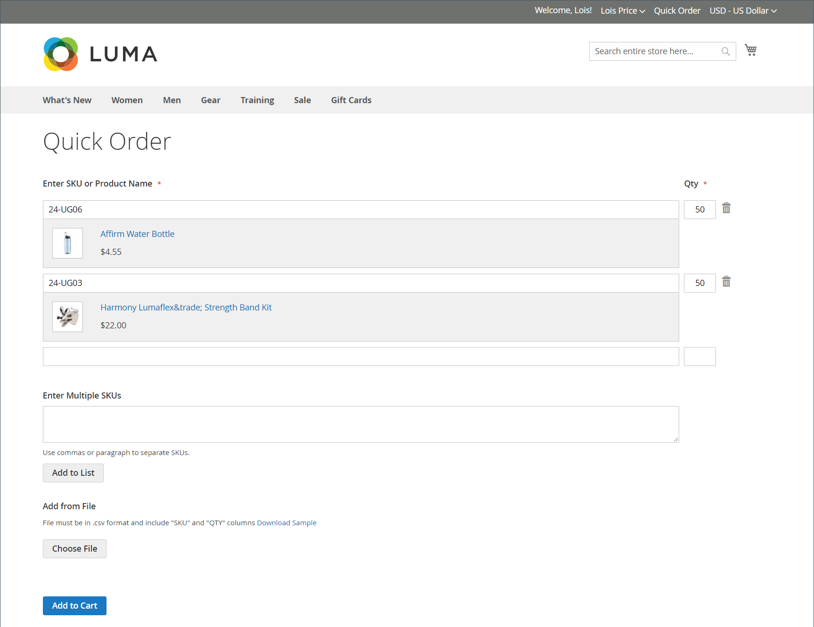

# Ordini rapidi

Il _Ordine rapido_ Questa funzione riduce il processo di ordinazione a diversi clic per i clienti che conoscono il nome del prodotto o lo SKU dei prodotti che desiderano ordinare. Gli ordini con più SKU possono essere immessi manualmente o importati nel modulo Ordine rapido. L’ordine rapido può essere utilizzato dai clienti che hanno effettuato l’accesso ai loro account e dagli ospiti. Quando è attivata, la _Ordine rapido_ nella parte superiore della pagina, accanto al nome del cliente.

{width="700" zoomable="yes"}

## Abilita ordini rapidi per il tuo negozio

1. Il giorno _Amministratore_ barra laterale, vai a **[!UICONTROL Stores]** > _[!UICONTROL Settings]_>**[!UICONTROL Configuration]**.

1. In _[!UICONTROL General]_nel pannello a sinistra, scegli **[!UICONTROL B2B Features]**.

1. Imposta **[!UICONTROL Enable Quick Order]** a `Yes`.

   {width="600" zoomable="yes"}

1. Clic **[!UICONTROL Save Config]**.

1. Quando richiesto, fai clic su [Gestione cache](../systems/cache-management.md) e aggiorna eventuali cache non valide.

## Flussi di lavoro a ordine rapido

I clienti possono specificare i prodotti per gli ordini rapidi utilizzando uno dei metodi seguenti.

### Metodo 1: inserire i singoli prodotti

1. Il cliente fa clic su **[!UICONTROL Quick Order]** collegamento.

1. Seleziona il prodotto per SKU o nome prodotto:

   Per posizionare un **ordine rapido per SKU**, il cliente effettua le seguenti operazioni:

   - Entra nel **[!UICONTROL SKU]**.

   - Clic **[!UICONTROL Add to List]**.

     Lo SKU viene visualizzato nella riga di input, con i dettagli del prodotto riportati di seguito.

     {width="600" zoomable="yes"}

   Per posizionare un **ordine rapido in base al nome del prodotto**, il cliente effettua le seguenti operazioni:

   - Immette i primi caratteri del **[!UICONTROL Product Name]**.

     >[!NOTE]
     >
     >Non utilizzare il _Invio_ chiave per scegliere il nome del prodotto.

   - Quando viene visualizzato l’elenco delle possibili corrispondenze, il cliente fa clic sul prodotto che desidera ordinare.

     {width="700" zoomable="yes"}

1. Entra nel **[!UICONTROL Qty]**.

1. Utilizzando la riga di input successiva, ripete questo processo il numero di volte necessario.

1. Clic **[!UICONTROL Add to Cart]**.

### Metodo 2: immettere più prodotti

1. In **[!UICONTROL Enter Multiple SKUs]** il cliente effettua una delle seguenti operazioni:

   - Immette un SKU per riga

   - Immette tutti gli SKU sulla stessa riga, separati da virgole e senza spazi.

     {width="600" zoomable="yes"}

1. Per aggiungere i prodotti all’elenco, fai clic su **[!UICONTROL Add to List]**.

1. Entra nel **[!UICONTROL Qty]** da ordinare per ogni elemento dell’elenco.

   {width="600" zoomable="yes"}

   >[!NOTE]
   >
   >Se il prodotto dispone delle opzioni richieste, al cliente viene richiesto di scegliere le opzioni. Possono aspettare fino a quando non raggiungono il carrello per aggiungere opzioni di prodotto.

   {width="600" zoomable="yes"}

### Metodo 3: Caricare un elenco di prodotti

1. In _[!UICONTROL Add from File]_, fare clic su **[!UICONTROL Download Sample]**per scaricare un modello di ordine.

   {width="600" zoomable="yes"}

1. Apre il file scaricato.

1. Utilizza il modello per aggiungere gli SKU del prodotto da caricare per l’elenco degli ordini rapidi.

1. Al termine, fai clic su **[!UICONTROL Save]**.

   {width="400" zoomable="yes"}

1. Per caricare il file, fai clic su **[!UICONTROL Choose]** e seleziona il file dal proprio sistema.

   Gli elementi vengono aggiunti all&#39;elenco Ordine rapido.

1. Quando è pronto, fa clic su **[!UICONTROL Add to Cart]**.

Dopo che il cliente ha creato l&#39;ordine rapido, può procedere come di consueto attraverso il pagamento.

{width="700" zoomable="yes"}
