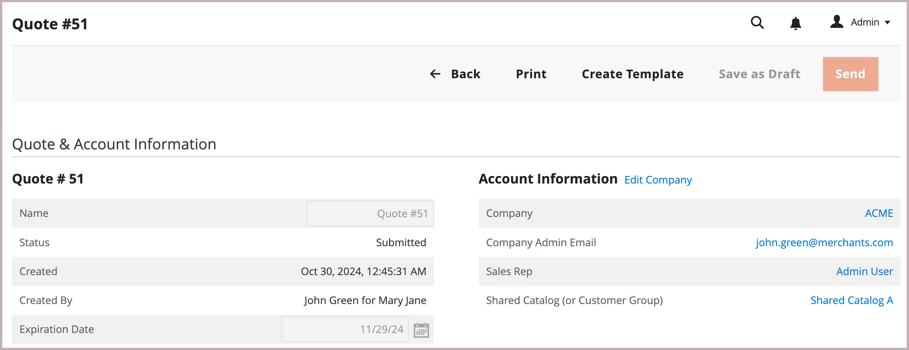

# Creare un modello di preventivo

<!--This topic is linked to from the Commerce Admin quote templates page. If the URL to this topic changes, make sure to add a redirect to prevent the Admin link from returning a 404 error.-->

Negoziare gli sconti per gli ordini ricorrenti creando un modello di preventivo da un preventivo esistente.

{width="700" zoomable="yes"}

Dopo aver creato il modello, il venditore può configurare le opzioni del modello per impostare le soglie di ordine e quantità, adeguare gli sconti a livello di articolo linea e preventivo prima di inviarlo al buyer per avviare il processo di negoziazione.

Una volta che l&#39;acquirente e il venditore hanno raggiunto un accordo, l&#39;acquirente accetta il modello di preventivo. L&#39;acquirente può quindi [generare preventivi collegati e preapprovati](account-dashboard-my-quote-templates.md) in base ai termini del modello di preventivo. Ad esempio, se una società dispone di ordini MRO (manutenzione, riparazioni e operazioni) per sostenere le proprie operazioni aziendali, il buyer o il venditore possono utilizzare un modello di preventivo per aggiungere gli articoli richiesti, negoziare la determinazione dei prezzi e impostare le condizioni per gli ordini ricorrenti mensili. Il buyer può quindi generare preventivi collegati e sottomettere ordini senza richiedere ulteriori negoziazioni.

Per ulteriori dettagli, vedere [Panoramica dei modelli di preventivo](quote-templates-overview.md).
