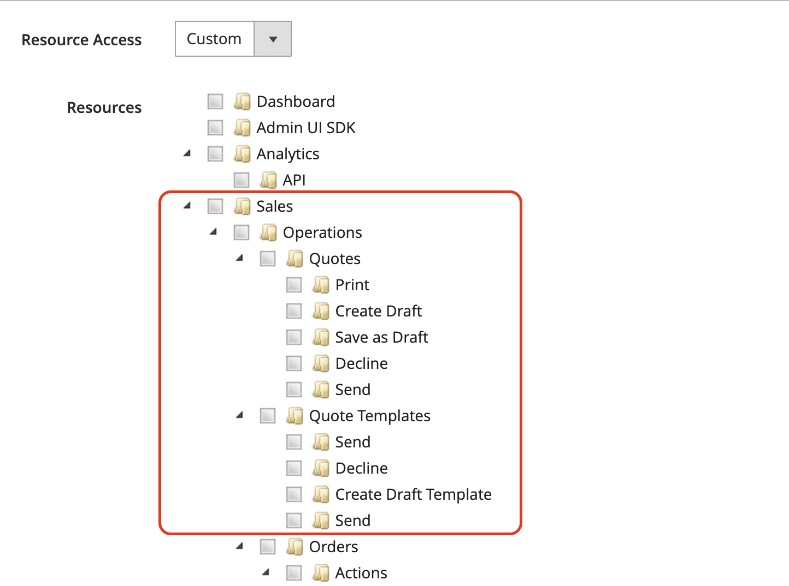

# Offerte negoziabili

Acquirenti e venditori utilizzano i Preventivi per gestire il processo di negoziazione per l&#39;aggiunta di un ordine, l&#39;aggiornamento delle quantità, la richiesta e l&#39;applicazione di sconti e così via, fino al raggiungimento di un accordo. Il processo di negoziazione dei preventivi può essere avviato da un acquirente autorizzato della società o da un rappresentante commerciale della società.

{width="700" zoomable="yes"}

Dopo la creazione del preventivo, il processo di negoziazione inizia quando il buyer o il venditore sottomette il preventivo per la revisione. La griglia _Offerte_ che elenca ogni preventivo ricevuto e mantiene una cronologia della comunicazione tra l&#39;acquirente e il venditore. Utilizza i [controlli area di lavoro](../getting-started/admin-workspace.md) standard per filtrare l&#39;elenco, modificare il layout delle colonne, salvare le visualizzazioni ed esportare i dati.

- Nella vetrina, gli acquirenti inviano il preventivo come [richiesta per negoziare](quote-price-negotiation.md) il prezzo dal carrello. Durante la creazione della richiesta di preventivo, l&#39;acquirente può salvare il preventivo come bozza o inviarlo direttamente al venditore.

- Nell&#39;amministratore, i rappresentanti possono creare preventivi per conto dell&#39;acquirente della società. Durante la creazione del preventivo, il venditore può salvare il preventivo come bozza o inviarlo direttamente al buyer per avviare il processo di negoziazione.

During the negotiation process, the quote can only be updated by the person reviewing and proposing terms for further negotiation.

## Prerequisiti

Negotiable quotes are available only if Adobe Commerce has the following configuration settings:

- [The Adobe Commerce B2B extension is installed](install.md)
- [Configured B2B features](enable-basic-features.md)
   - Enable company accounts
   - Enable B2B quote

## Quote workflow

Quotes can be initiated by the buyer or the seller.

This diagram shows the quote statuses for a buyer and seller (Admin) in the different steps when you initiate a quote.

{width="700" zoomable="yes"}

****

- **** __ __`New` A request for a quote can be modified by the buyer until it is opened by the seller.

  {width="700" zoomable="yes"}

- **** The Sales Representative must update the quote to add products and other information like discounts and notes to the buyer. `draft` In draft state, the quote is visible only to the seller. `Submitted` It cannot be modified by the seller until the buyer sends it back.

  {width="700" zoomable="yes"}

****

Reviewing or negotiating a quote can include changing quantities, removing items, adding line item comments, applying line item or quote discounts (seller), and adding a shipping address (buyer).

- **Il venditore visualizza la richiesta e invia la risposta**. L&#39;amministratore visualizza la richiesta di preventivo. Nella vetrina, lo stato del preventivo cambia in `Pending` e l&#39;acquirente non può apportare alcuna modifica. Il [venditore risponde](quote-price-negotiation.md) offrendo sconti sui prezzi e adeguando le quantità e gli articoli in base alle esigenze, immette un commento e invia nuovamente il preventivo all&#39;acquirente. L&#39;acquirente e il rappresentante commerciale ricevono una notifica via e-mail che informa che il venditore ha risposto.

- **L&#39;acquirente visualizza il preventivo del venditore e invia una risposta**. L&#39;acquirente fa clic sul collegamento nella notifica e-mail per aprire il preventivo oppure apre il preventivo dalla pagina _Preventivi personali_ del dashboard dell&#39;account. Il buyer può lasciare note al venditore a livello di articolo linea o preventivo, modificare le quantità e rimuovere gli articoli.

L&#39;acquirente e il venditore possono continuare il processo di negoziazione fino a quando non viene raggiunto un accordo o il venditore rifiuta il preventivo. Se l&#39;acquirente apporta modifiche al preventivo, ovvero aggiungendo o rimuovendo prodotti o modificando quantità di prodotti, il preventivo deve essere restituito al venditore per la revisione.

- **** After the buyer adds the address, the seller can provide shipping and delivery options. I metodi di spedizione visualizzati dipendono dalla configurazione Storefront.

Se l&#39;acquirente aggiunge un indirizzo di spedizione, l&#39;accordo di negoziazione deve essere rivisto e il venditore può continuare il processo di negoziazione fino a quando non viene raggiunto un accordo o il venditore rifiuta il preventivo.

**Passaggio 3: l&#39;acquirente accetta il preventivo (pagamento)**

L&#39;acquirente accetta il prezzo proposto e procede al pagamento. Impossibile aggiungere ulteriori sconti all&#39;offerta negoziata.

Le opzioni di spedizione sono bloccate al momento del pagamento.

## Stato preventivo

Lo stato del preventivo fornisce informazioni sullo stato corrente del preventivo nel flusso di lavoro del preventivo. Lo stato di un preventivo cambia solo quando un acquirente o un venditore esegue un&#39;azione sul preventivo. Ad esempio, lo stato cambia in ordine se un acquirente seleziona [!UICONTROL Proceed to Checkout] in un preventivo attivo.

- *[!UICONTROL New]* The request can be updated by the buyer until it is opened by the seller.

- **[!UICONTROL Draft]** - Il venditore crea un preventivo provvisorio per un acquirente. Il preventivo non è visibile all&#39;acquirente finché il venditore non aggiunge i dettagli dell&#39;offerta (articoli, quantità, sconto e così via) e non invia il preventivo all&#39;acquirente.

- **[!UICONTROL Open]** - Il venditore ha aperto la richiesta e sta per esaminarla e preparare una risposta

- **[!UICONTROL Submitted]** - Il venditore ha inviato una risposta all&#39;acquirente. Impossibile modificare il record del preventivo durante il processo di negoziazione.

- **[!UICONTROL Client Reviewed]** - L&#39;acquirente ha visualizzato la risposta del venditore e sta preparando una risposta.

- **[!UICONTROL Updated]**

- **[!UICONTROL Ordered]**

- **[!UICONTROL Closed]**

- **[!UICONTROL Declined]** - Il venditore ha rifiutato la richiesta di offerta. Any custom pricing is removed from the quote and the record is locked from further edits.

- **[!UICONTROL Expired]** - L&#39;acquirente non ha risposto alla risposta del venditore entro il periodo di tempo indicato e il preventivo non è più valido.

## Risorse del ruolo B2B per i preventivi dei punti vendita

Le opzioni di configurazione per le offerte sono controllate utilizzando le [risorse ruolo](../systems/permissions-user-roles.md#role-resources). Queste risorse ruolo devono essere impostate per il ruolo utente amministratore assegnato all&#39;amministratore archivio.

Per concedere l&#39;accesso alle funzioni di preventivo nell&#39;amministratore, passare a **[!UICONTROL System]** > _[!UICONTROL Permissions]_>**[!UICONTROL User Roles]**, selezionare il ruolo e passare a [!UICONTROL Sales] > [!UICONTROL Operations] > [!UICONTROL Quotes] nell&#39;albero_ Risorse ruolo _.

{width="700" zoomable="yes"}

## Apply an action

In Amministrazione, gli amministratori e i venditori B2B possono gestire le offerte dalla griglia delle offerte utilizzando il menu [!UICONTROL Actions].

{width="700" zoomable="yes"}

1. Nella barra laterale _Admin_, passa a **[!UICONTROL Sales]** > **[!UICONTROL Quotes]**.

1. Nella prima colonna della griglia selezionare la casella di controllo per ogni record a cui si desidera applicare l&#39;azione.

1. In **[!UICONTROL Actions]** selezionare l&#39;azione da applicare.

### Visualizza un preventivo

1. **[!UICONTROL Actions]****[!UICONTROL View]**

1. 

### View quote activity

[!UICONTROL Comments][!UICONTROL History Log]

1. Open a quote.

1. **[!UICONTROL Negotiation]****[!UICONTROL Comments]****[!UICONTROL History Log]**

   {width="400"}

1. History is also tracked at the line item level.

   {width="400"}

### Decline a request for a quote

`Open`

1. Select each open quote request that you want to decline.

1. _[!UICONTROL Actions]_`Declined`

1. **[!UICONTROL Confirm]**

   {width="400"}
