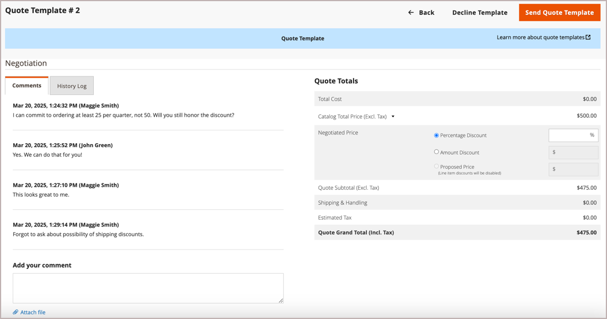
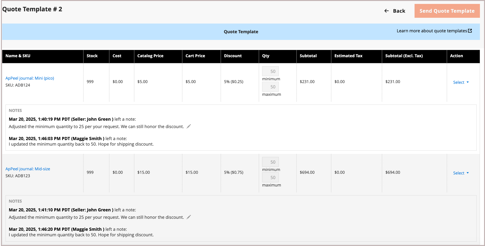
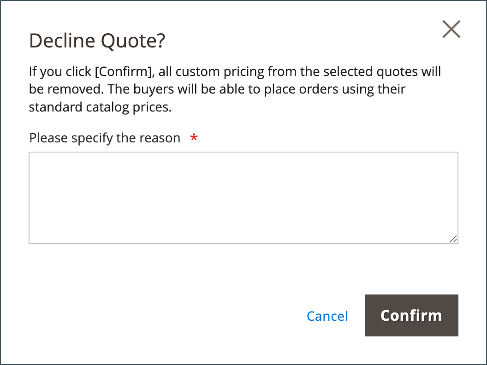

# Offerte negoziabili

Acquirenti e venditori utilizzano i Preventivi per gestire il processo di negoziazione per l&#39;aggiunta di un ordine, l&#39;aggiornamento delle quantità, la richiesta e l&#39;applicazione di sconti e così via, fino al raggiungimento di un accordo. Il processo di negoziazione dei preventivi può essere avviato da un acquirente autorizzato della società o da un rappresentante commerciale della società.

{width="700" zoomable="yes"}

Dopo la creazione del preventivo, il processo di negoziazione inizia quando il buyer o il venditore sottomette il preventivo per la revisione. La griglia _Offerte_ che elenca ogni preventivo ricevuto e mantiene una cronologia della comunicazione tra l&#39;acquirente e il venditore. Utilizza i [controlli area di lavoro](../getting-started/admin-workspace.md) standard per filtrare l&#39;elenco, modificare il layout delle colonne, salvare le visualizzazioni ed esportare i dati.

- Nella vetrina, gli acquirenti inviano il preventivo come [richiesta per negoziare](quote-price-negotiation.md) il prezzo dal carrello. Durante la creazione della richiesta di preventivo, l&#39;acquirente può salvare il preventivo come bozza o inviarlo direttamente al venditore.

- Nell&#39;amministratore, i rappresentanti possono creare preventivi per conto dell&#39;acquirente della società. Durante la creazione del preventivo, il venditore può salvare il preventivo come bozza o inviarlo direttamente al buyer per avviare il processo di negoziazione.

Durante il processo di negoziazione, il preventivo può essere aggiornato solo dalla persona che rivede e propone le condizioni per ulteriori negoziazioni.

## Prerequisiti

I preventivi negoziabili sono disponibili solo se Adobe Commerce dispone delle seguenti impostazioni di configurazione:

- [L’estensione Adobe Commerce B2B è installata](install.md)
- [Funzioni B2B configurate](enable-basic-features.md)
   - Abilita account società
   - Abilita offerta B2B

## Flusso di lavoro preventivo

Le offerte possono essere ordinate dall&#39;acquirente o dal venditore.

Questo diagramma mostra gli stati dei preventivi per un acquirente e un venditore (amministratore) nei diversi passaggi quando si avvia un preventivo.

{width="700" zoomable="yes"}

**Passaggio 1: creazione preventivo (nuovo)**

- **Offerta di richieste dell&#39;acquirente** - L&#39;acquirente [richiede un preventivo](quote-request.md) dal carrello. La richiesta viene visualizzata nell&#39;elenco _Offerte personali_ nel dashboard account dell&#39;acquirente e la notifica e-mail viene inviata al rappresentante commerciale assegnato all&#39;account aziendale. Nell&#39;amministratore, la richiesta viene visualizzata nella griglia _Quotes_, con stato `New`. Una richiesta di preventivo può essere modificata dall&#39;acquirente fino a quando non viene aperta dal venditore.

  {width="700" zoomable="yes"}

- **Rappresentante commerciale** — Un rappresentante commerciale può [creare un preventivo](sales-rep-initiates-quote.md) dall&#39;amministratore per conto di un acquirente aziendale specifico. Il rappresentante commerciale deve aggiornare il preventivo per aggiungere prodotti e altre informazioni, ad esempio sconti e note, all&#39;acquirente. Il rappresentante commerciale può salvare il preventivo come `draft` o inviarlo all&#39;acquirente per avviare la negoziazione. In stato di bozza, il preventivo è visibile solo al venditore. Dopo l&#39;invio del preventivo, lo stato è `Submitted`. Non può essere modificato dal venditore finché l&#39;acquirente non lo rispedisce indietro.

  {width="700" zoomable="yes"}

**Passaggio 2: revisione e negoziazione preventivo (revisione)**

La revisione o la negoziazione di un preventivo può includere la modifica delle quantità, la rimozione di articoli, l&#39;aggiunta di commenti alle voci, l&#39;applicazione di sconti alle voci o ai preventivi (venditore) e l&#39;aggiunta di un indirizzo di spedizione (buyer).

- **Il venditore visualizza la richiesta e invia la risposta**. L&#39;amministratore visualizza la richiesta di preventivo. Nella vetrina, lo stato del preventivo cambia in `Pending` e l&#39;acquirente non può apportare alcuna modifica. Il [venditore risponde](quote-price-negotiation.md) offrendo sconti sui prezzi e adeguando le quantità e gli articoli in base alle esigenze, immette un commento e invia nuovamente il preventivo all&#39;acquirente. L&#39;acquirente e il rappresentante commerciale ricevono una notifica via e-mail che informa che il venditore ha risposto.

- **L&#39;acquirente visualizza il preventivo del venditore e invia una risposta**. L&#39;acquirente fa clic sul collegamento nella notifica e-mail per aprire il preventivo oppure apre il preventivo dalla pagina _Preventivi personali_ del dashboard dell&#39;account. Il buyer può lasciare note al venditore a livello di articolo linea o preventivo, modificare le quantità e rimuovere gli articoli.

L&#39;acquirente e il venditore possono continuare il processo di negoziazione fino a quando non viene raggiunto un accordo o il venditore rifiuta il preventivo. Se l&#39;acquirente apporta modifiche al preventivo, ovvero aggiungendo o rimuovendo prodotti o modificando quantità di prodotti, il preventivo deve essere restituito al venditore per la revisione.

- **L&#39;acquirente aggiunge un indirizzo di spedizione**. L&#39;acquirente può aggiungere un indirizzo di spedizione al preventivo. Dopo che l&#39;acquirente ha aggiunto l&#39;indirizzo, il venditore può fornire le opzioni di spedizione e consegna. I metodi di spedizione visualizzati dipendono dalla configurazione Storefront.

Se l&#39;acquirente aggiunge un indirizzo di spedizione, l&#39;accordo di negoziazione deve essere rivisto e il venditore può continuare il processo di negoziazione fino a quando non viene raggiunto un accordo o il venditore rifiuta il preventivo.

**Passaggio 3: l&#39;acquirente accetta il preventivo (pagamento)**

L&#39;acquirente accetta il prezzo proposto e procede al pagamento. Impossibile aggiungere ulteriori sconti all&#39;offerta negoziata.

Le opzioni di spedizione sono bloccate al momento del pagamento.

## Stato preventivo

Lo stato del preventivo fornisce informazioni sullo stato corrente del preventivo nel flusso di lavoro del preventivo. Lo stato di un preventivo cambia solo quando un acquirente o un venditore esegue un&#39;azione sul preventivo. Ad esempio, lo stato cambia in ordine se un acquirente seleziona [!UICONTROL Proceed to Checkout] in un preventivo attivo.

- *[!UICONTROL New]** - L&#39;acquirente ha inviato una richiesta di preventivo, ma non è stata visualizzata dal venditore. La richiesta può essere aggiornata dall&#39;acquirente fino a quando non viene aperta dal venditore.

- **[!UICONTROL Draft]** - Il venditore crea un preventivo provvisorio per un acquirente. Il preventivo non è visibile all&#39;acquirente finché il venditore non aggiunge i dettagli dell&#39;offerta (articoli, quantità, sconto e così via) e non invia il preventivo all&#39;acquirente.

- **[!UICONTROL Open]** - Il venditore ha aperto la richiesta e sta per esaminarla e preparare una risposta

- **[!UICONTROL Submitted]** - Il venditore ha inviato una risposta all&#39;acquirente. Impossibile modificare il record del preventivo durante il processo di negoziazione.

- **[!UICONTROL Client Reviewed]** - L&#39;acquirente ha visualizzato la risposta del venditore e sta preparando una risposta.

- **[!UICONTROL Updated]** - L&#39;acquirente ha inviato una risposta, ma non è stata visualizzata dal venditore.

- **[!UICONTROL Ordered]** - L&#39;acquirente ha inviato l&#39;ordine in base al preventivo negoziato.

- **[!UICONTROL Closed]** - L&#39;acquirente ha annullato la richiesta di preventivo.

- **[!UICONTROL Declined]** - Il venditore ha rifiutato la richiesta di offerta. Eventuali prezzi personalizzati vengono rimossi dal preventivo e il record è bloccato da ulteriori modifiche.

- **[!UICONTROL Expired]** - L&#39;acquirente non ha risposto alla risposta del venditore entro il periodo di tempo indicato e il preventivo non è più valido.

## Risorse del ruolo B2B per i preventivi dei punti vendita

Le opzioni di configurazione per le offerte sono controllate utilizzando le [risorse ruolo](../systems/permissions-user-roles.md#role-resources). Queste risorse ruolo devono essere impostate per il ruolo utente amministratore assegnato all&#39;amministratore archivio.

Per concedere l&#39;accesso alle funzioni di preventivo nell&#39;amministratore, passare a **[!UICONTROL System]** > _[!UICONTROL Permissions]_>**[!UICONTROL User Roles]**, selezionare il ruolo e passare a [!UICONTROL Sales] > [!UICONTROL Operations] > [!UICONTROL Quotes] nell&#39;albero_ Risorse ruolo _.

{width="700" zoomable="yes"}

## Applicare un’azione

In Amministrazione, gli amministratori e i venditori B2B possono gestire le offerte dalla griglia delle offerte utilizzando il menu [!UICONTROL Actions].

{width="700" zoomable="yes"}

1. Nella barra laterale _Admin_, passa a **[!UICONTROL Sales]** > **[!UICONTROL Quotes]**.

1. Nella prima colonna della griglia selezionare la casella di controllo per ogni record a cui si desidera applicare l&#39;azione.

1. In **[!UICONTROL Actions]** selezionare l&#39;azione da applicare.

### Visualizza un preventivo

1. Nella colonna **[!UICONTROL Actions]** per un record, fare clic su **[!UICONTROL View]**.

1. Per rispondere alla richiesta del cliente, seguire le istruzioni e avviare il processo [negoziazione prezzi](quote-price-negotiation.md).

### Visualizza attività offerta

Visualizzare la sequenza temporale della negoziazione, la comunicazione e altre attività del preventivo da [!UICONTROL Comments] e [!UICONTROL History Log]. Le informazioni includono le modifiche di stato, gli aggiornamenti alle informazioni sul cliente e sulla spedizione, gli aggiornamenti su articolo e prezzo e altre informazioni importanti.

1. Apri un preventivo.

1. Visualizzare i commenti e la cronologia delle negoziazioni dei preventivi scorrendo fino a **[!UICONTROL Negotiation]** e selezionando **[!UICONTROL Comments]** e **[!UICONTROL History Log]**.

   {width="400"}

1. La cronologia viene anche tracciata a livello di elemento riga.

   {width="400"}

### Rifiuta una richiesta di offerta

È possibile rifiutare solo le richieste di preventivo con stato `Open`.

1. Selezionare ogni richiesta di offerta aperta che si desidera rifiutare.

1. Impostare il controllo _[!UICONTROL Actions]_&#x200B;su `Declined`.

1. Quando richiesto, immettere il motivo del rifiuto e fare clic su **[!UICONTROL Confirm]**.

   {width="400"}
