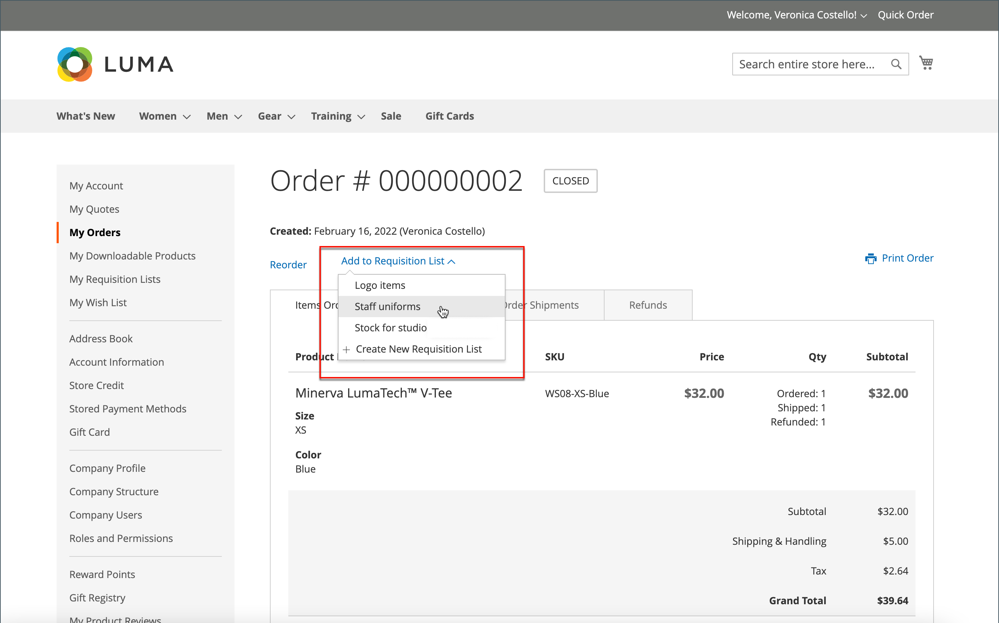

# Elenchi richieste

L&#39;utilizzo di un elenco di richieste consente di risparmiare tempo quando si acquistano prodotti ordinati di frequente, poiché gli articoli vengono aggiunti al carrello direttamente dall&#39;elenco. I clienti possono gestire più elenchi che si concentrano su prodotti di fornitori, acquirenti, team, campagne o qualsiasi altra cosa che semplifichi il loro flusso di lavoro. È disponibile sia per gli utenti connessi che per gli ospiti.

>[!NOTE]
>
>Per abilitare gli elenchi di richieste di acquisto per il tuo archivio, vedi [Abilita funzioni B2B](enable-basic-features.md). Può consentire la gestione di un massimo di 999 elenchi di richieste di acquisto per ciascun conto cliente, a seconda [configurazione](configure-requisition-lists.md).

La funzionalità dell&#39;elenco di richieste è simile a quella degli elenchi di desideri, con le seguenti differenze:

- L&#39;elenco delle richieste di acquisto non viene cancellato dopo l&#39;invio degli articoli al carrello. Può essere utilizzato più volte.
- L&#39;interfaccia utente per gli elenchi delle richieste di acquisto utilizza una visualizzazione compatta per visualizzare molti elementi.

{width="600" zoomable="yes"}

## Creare un elenco di richieste di acquisto dal dashboard dei conti

Un cliente connesso associato a un conto della società può creare un elenco di richieste di acquisto dal proprio dashboard dei conti.

1. Nella barra laterale del loro account, sceglie **[!UICONTROL My Requisition Lists]**.

1. Il giorno _[!UICONTROL Requisition Lists]_pagina, clic **[!UICONTROL Create New Requisition List]**.

1. Entra nel **[!UICONTROL Requisition List Name]** e **[!UICONTROL Description]**.

   {width="300"}

1. Al termine, fai clic su **[!UICONTROL Save]**.

## Creare un elenco di richieste di acquisto da una pagina di prodotto

Un cliente connesso associato a un account società può creare un elenco di richieste di acquisto da una pagina di prodotto. Questo metodo fornisce un semplice collegamento per creare l’elenco e aggiungere il prodotto.

1. Dalla pagina dei dettagli del prodotto, il cliente fa clic su **[!UICONTROL Add to Requisition List]**.

1. Clic **[!UICONTROL Create New Requisition List]**.

1. Entra nel **[!UICONTROL Requisition List Name]** e **[!UICONTROL Description]**.

1. Al termine, fai clic su **[!UICONTROL Save]**.

## Aggiungere prodotti a un elenco di richieste

I clienti possono aggiungere prodotti a un elenco di richieste di acquisto da:

- Pagine prodotto
- Una pagina di catalogo
- Il carrello
- Ordini esistenti

### Da una pagina di dettagli del prodotto

1. Dalla vetrina, il cliente accede alla pagina dei dettagli del prodotto da aggiungere all&#39;elenco delle richieste di acquisto.

1. Clic **[!UICONTROL Add to Requisition List]** ed esegue una delle operazioni seguenti:

   - Consente di scegliere un elenco di richieste esistente.
   - Crea un elenco di richieste.

   {width="700" zoomable="yes"}

### Da una pagina di catalogo

1. Dalla vetrina, il cliente accede alla pagina del catalogo contenente il prodotto da aggiungere all&#39;elenco delle richieste di acquisto.

1. Passa il mouse sopra il prodotto.

1. Clic **[!UICONTROL Add to Requisition List]** ed esegue una delle operazioni seguenti:

   - Consente di scegliere un elenco di richieste esistente.
   - Crea un elenco di richieste.

   {width="700" zoomable="yes"}

### Da un ordine esistente

1. Nella barra laterale del dashboard dell’account, il cliente sceglie **[!UICONTROL My Orders]**.

1. Nella parte superiore dell’ordine, fai clic su **[!UICONTROL Add to Requisition List]** ed esegue una delle operazioni seguenti:

   - Consente di scegliere un elenco di richieste esistente.
   - Crea un elenco di richieste.

   {width="700" zoomable="yes"}

### Dal carrello

1. Sotto l&#39;articolo, il cliente fa clic su **[!UICONTROL Add to Requisition List]** ed esegue una delle operazioni seguenti:

   - Consente di scegliere un elenco di richieste esistente.
   - Crea un elenco di richieste.

   {width="700" zoomable="yes"}

## Visualizza l&#39;elenco di richieste di acquisto aggiornato

Dopo aver effettuato l&#39;accesso al proprio conto, un cliente può utilizzare uno dei metodi seguenti per visualizzare i propri elenchi di richieste di acquisto.

{width="700" zoomable="yes"}

### Dal dashboard account

1. Nella barra laterale del dashboard dell’account, seleziona **[!UICONTROL My Requisition Lists]**.

1. Nell&#39;elenco degli elenchi delle richieste di acquisto, fare clic su **[!UICONTROL View]** nel _Azioni_ colonna.

### Da qualsiasi pagina di vetrina

1. Nella barra dei collegamenti rapidi nella parte superiore della pagina, fa clic sul nome utente corrispondente.

1. Nel menu, seleziona **[!UICONTROL My Requisition Lists]**.
