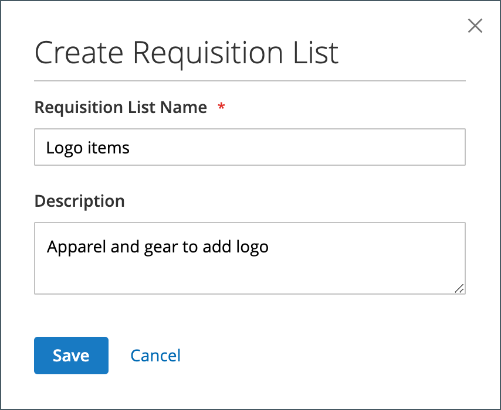
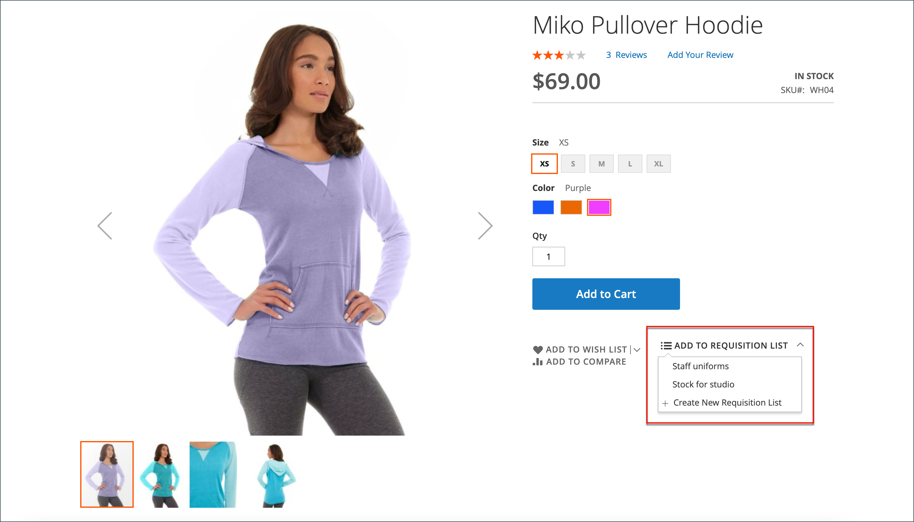
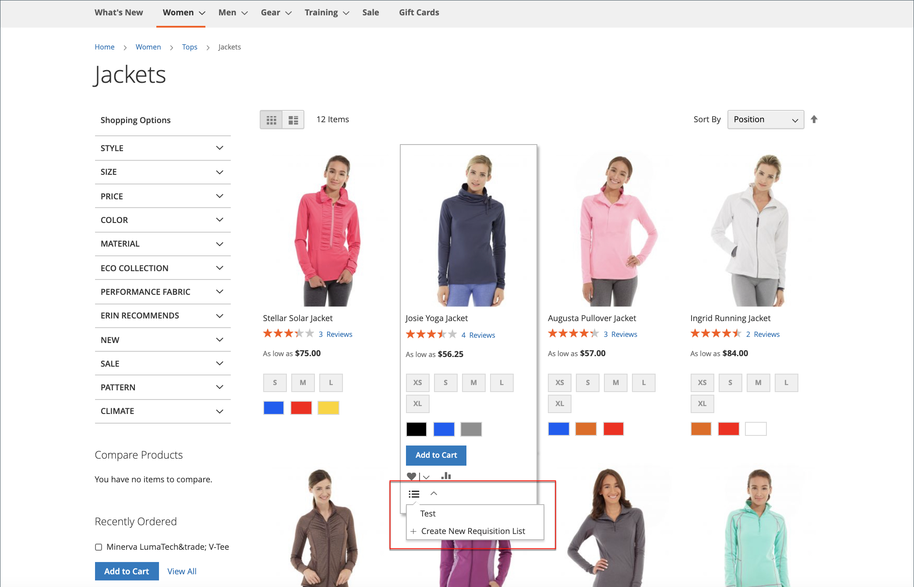

# Elenchi richieste

L&#39;utilizzo di un elenco di richieste consente di risparmiare tempo quando si acquistano prodotti ordinati di frequente, poiché gli articoli vengono aggiunti al carrello direttamente dall&#39;elenco. Gli acquirenti possono gestire più elenchi che si concentrano su prodotti di fornitori, acquirenti, team, campagne o qualsiasi altra cosa che semplifichi il loro flusso di lavoro. La funzionalità elenco richieste di acquisto è disponibile per gli utenti connessi.

>[!NOTE]
>
>Per abilitare gli elenchi di richieste per il tuo archivio, vedi [Abilitare le funzionalità B2B](enable-basic-features.md). È possibile gestire fino a 999 elenchi di richieste di acquisto per ogni account buyer, a seconda della [configurazione](configure-requisition-lists.md).

La funzionalità dell&#39;elenco di richieste è simile a quella degli elenchi di desideri, con le seguenti differenze:

- L&#39;elenco delle richieste di acquisto non viene cancellato dopo l&#39;invio degli articoli al carrello. Può essere utilizzato più volte.
- L&#39;interfaccia utente per gli elenchi delle richieste di acquisto utilizza una visualizzazione compatta per visualizzare molti elementi.

{width="600" zoomable="yes"}

## Creare un elenco di richieste di acquisto dal dashboard dei conti

Un buyer connesso associato a un account della società può creare un elenco di richieste di acquisto dal dashboard del proprio account.

1. Nella barra laterale del proprio account, sceglie **[!UICONTROL My Requisition Lists]**.

1. Nella pagina _[!UICONTROL Requisition Lists]_, fa clic su **[!UICONTROL Create New Requisition List]**.

1. Immette **[!UICONTROL Requisition List Name]** e **[!UICONTROL Description]**.

   {width="300"}

1. Al termine, fa clic su **[!UICONTROL Save]**.

## Creare un elenco di richieste di acquisto da una pagina di prodotto

Un buyer connesso associato a un account società può creare un elenco di richieste di acquisto da una pagina di prodotti. Questo metodo fornisce un semplice collegamento per creare l’elenco e aggiungere il prodotto.

1. Dalla pagina dei dettagli del prodotto, l&#39;acquirente fa clic su **[!UICONTROL Add to Requisition List]**.

1. Clic su **[!UICONTROL Create New Requisition List]**.

1. Immette **[!UICONTROL Requisition List Name]** e **[!UICONTROL Description]**.

1. Al termine, fa clic su **[!UICONTROL Save]**.

## Aggiungere prodotti a un elenco di richieste

Gli acquirenti possono aggiungere prodotti a un elenco di richieste di acquisto da:

- Pagine prodotto
- Una pagina di catalogo
- Il carrello
- Ordini esistenti
- Offerte esistenti

### Da una pagina di dettagli del prodotto

1. Dalla vetrina, il buyer passa alla pagina dei dettagli del prodotto da aggiungere all&#39;elenco delle richieste di acquisto.

1. Fai clic su **[!UICONTROL Add to Requisition List]** ed effettua una delle seguenti operazioni:

   - Consente di scegliere un elenco di richieste esistente.
   - Crea un elenco di richieste.

   {width="700" zoomable="yes"}

### Da una pagina di catalogo

1. Dalla vetrina, il buyer passa alla pagina del catalogo contenente il prodotto da aggiungere all&#39;elenco delle richieste di acquisto.

1. Passa il mouse sopra il prodotto.

1. Fai clic su **[!UICONTROL Add to Requisition List]** ed effettua una delle seguenti operazioni:

   - Consente di scegliere un elenco di richieste esistente.
   - Crea un elenco di richieste.

   {width="700" zoomable="yes"}

### Da un ordine esistente

1. Nella barra laterale del dashboard dell&#39;account, l&#39;acquirente sceglie **[!UICONTROL My Orders]**.

1. All&#39;inizio dell&#39;ordine, fa clic su **[!UICONTROL Add to Requisition List]** ed esegue una delle operazioni seguenti:

   - Consente di scegliere un elenco di richieste esistente.
   - Crea un elenco di richieste.

   {width="700" zoomable="yes"}

### Da un preventivo esistente

Da un preventivo negoziabile, gli acquirenti possono utilizzare l&#39;opzione [!UICONTROL Move to Requisition List] per spostare i prodotti dal preventivo a un elenco di richieste di acquisto esistente. Se non sono presenti elenchi di richieste, l&#39;opzione [!UICONTROL Move to Requisition List] non è disponibile.

1. Nella barra laterale del dashboard dell&#39;account, l&#39;acquirente seleziona **[!UICONTROL My Quotes]**.

1. Individuare e accedere all&#39;offerta desiderata nell&#39;elenco.

1. Nella scheda [!UICONTROL Items Quoted], selezionare il prodotto da spostare.

1. Utilizzando il menu a discesa [!UICONTROL Select] nella colonna [!UICONTROL Actions] per la riga di prodotto, scegli **[!UICONTROL Move to Requisition list]**.

1. Selezionare l&#39;elenco delle richieste per gli articoli selezionati.

1. Fare clic su **[!UICONTROL Move item to Requisition List]**.

Per ulteriori informazioni sulle virgolette B2B, vedere l&#39;argomento [Le mie virgolette](account-dashboard-my-quotes.md).

### Dal carrello

1. Sotto l&#39;elemento, l&#39;acquirente fa clic sul menu **[!UICONTROL Add to Requisition List]** ed esegue una delle operazioni seguenti:

   - Consente di scegliere un elenco di richieste esistente.
   - Crea un elenco di richieste.

   {width="700" zoomable="yes"}

## Visualizza l&#39;elenco di richieste di acquisto aggiornato

Dopo aver effettuato l&#39;accesso al proprio account, un buyer può utilizzare uno dei metodi seguenti per visualizzare i propri elenchi di richieste di acquisto.

{width="700" zoomable="yes"}

### Dal dashboard account

1. Nella barra laterale del dashboard dell&#39;account, seleziona **[!UICONTROL My Requisition Lists]**.

1. Nell&#39;elenco degli elenchi delle richieste di acquisto, fa clic su **[!UICONTROL View]** nella colonna _Azioni_.

### Da qualsiasi pagina di vetrina

1. Nella barra dei collegamenti rapidi nella parte superiore della pagina, fa clic sul nome utente corrispondente.

1. Scegliere **[!UICONTROL My Requisition Lists]** dal menu.
