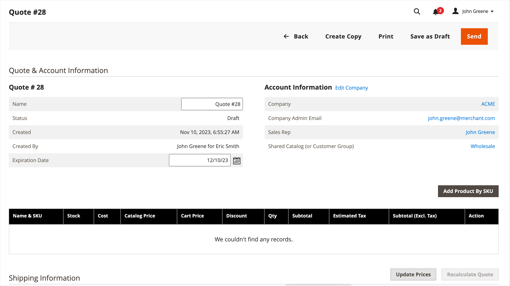
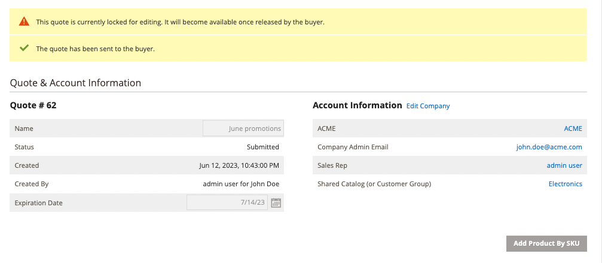

# Avvia un preventivo per un acquirente

Se le virgolette sono abilitate in [Configurazione delle funzioni di vendita](configure-quotes.md), un rappresentante commerciale può avviare il processo di negoziazione con un acquirente della società creando un preventivo dall&#39;amministratore.

- Le proposte di preventivo sono visibili solo al venditore.
- Le ipotesi di offerta possono essere sottomesse solo dopo che il rappresentante commerciale avrà aggiunto articoli, sconti rilevanti e note per creare l&#39;offerta iniziale per l&#39;acquirente.
- Un venditore può creare un preventivo da Preventivi o Griglia clienti.

Il rappresentante commerciale invia il preventivo al buyer per avviare il processo di negoziazione. Consulta [Negoziazione di un preventivo](quote-price-negotiation.md).

## Esperienza nella creazione di offerte da rappresentante commerciale

Un rappresentante commerciale può creare un preventivo dalla tabella Preventivi o Cliente.

>[!NOTE]
>
>Per una demo video di un venditore che crea un preventivo per un acquirente, vedi [Rappresentante commerciale avvia il preventivo](https://experienceleague.adobe.com/docs/commerce-learn/tutorials/b2b/b2b-quote/sales-rep-initiates-quote.html) in _Video e Tutorials di Commerce_.

### Creare un preventivo dalla griglia Preventivo

1. Il rappresentante commerciale accede all’Amministratore come amministratore con [Autorizzazioni delle operazioni di vendita](../systems/permissions.md) per gestire i preventivi.

1. In Admin, vai a [!UICONTROL Quotes] griglia selezionando **[!UICONTROL Sales]** e quindi selezionare **[!UICONTROL Quotes]**.

1. Crea un preventivo per un acquirente.

   - Dalla griglia Preventivi, selezionare **[!UICONTROL Create New Quote]**.

     {width="700" zoomable="yes"}

   - Il giorno [!UICONTROL Create New Quote] , selezionare il cliente (buyer aziendale) per creare l&#39;offerta.

     {width="700" zoomable="yes"}

     Un nuovo preventivo viene visualizzato in `Draft` stato.

     {width="700" zoomable="yes"}

   - Aggiornare il nome del preventivo e modificare la data di scadenza in base alle esigenze.

   - Salvare il preventivo come bozza.

## Prepara il preventivo per l&#39;acquirente

Dopo aver creato l&#39;offerta provvisoria, aggiungere elementi di prodotto, applicare sconti e comunicare con l&#39;acquirente aggiungendo commenti ed eventuali file correlati all&#39;offerta. Quindi, inviare il preventivo all&#39;acquirente per la revisione o salvarlo come bozza.

1. Aggiungere elementi all&#39;offerta selezionando **[!UICONTROL Add Product By SKU]**. Inserire il numero SKU e la quantità, quindi selezionare **[!UICONTROL Add Product]**.

{width="700" zoomable="yes"}

1. Applica sconti riga ai prodotti in base alle esigenze.

   - Dalla sezione [!UICONTROL Select] menu azione, scegli **[!UICONTROL Discount Item]**.

   - Il giorno [!UICONTROL Discount Line item] , selezionare il **[!UICONTROL Discount Type]**.

   {width="700" zoomable="yes"}

   - In [!UICONTROL Discount] immettere il valore per il tipo di sconto. Ad esempio, se hai selezionato uno sconto percentuale, immetti 10 per applicare uno sconto del 10% alla voce.

   - [!BADGE Funzionalità 1.5.0-beta]{type=Informative url="/help/b2b/release-notes.md" tooltip="Disponibile solo per i partecipanti ai programmi beta"}

     Dopo aver confermato la modifica, gli attributi della riga nella griglia del prodotto vengono aggiornati per mostrare l’importo dello sconto applicato. Se lo sconto è bloccato, viene visualizzata un&#39;icona di blocco.

1. Applicare uno sconto a livello di preventivo in base alle esigenze:

   - In [!UICONTROL Quote Totals - Negotiated Price] , selezionare il tipo di sconto, quindi immettere il valore da applicare.

     {width="700" zoomable="yes"}

   La griglia prodotti viene aggiornata per mostrare lo sconto.

1. Aggiungi ulteriori informazioni per l&#39;acquirente.

   In entrata [!UICONTROL Negotiation - Comments], aggiungere una nota e allegare i file di supporto necessari per l&#39;acquirente in [!UICONTROL Negotiation - Comments]

   {width="700" zoomable="yes"}

   Per impostazione predefinita, un [file allegato](configure-quotes.md) può essere fino a 2 MB, in uno qualsiasi dei seguenti formati di file: DOC, DOCX, XLS, XLSX, PDF, TXT, JPG o JPEG, PNG.

1. Elabora il preventivo.

   Salva il preventivo come bozza o invialo all&#39;acquirente.

   Se si invia il preventivo all&#39;acquirente, lo stato cambia in `Submitted`e il preventivo viene bloccato finché l&#39;acquirente non riceve il preventivo, lo stato viene aggiornato a bozza e viene visualizzato un messaggio di conferma:

   {width="700" zoomable="yes"}

L&#39;acquirente riceve una notifica e-mail per rivedere il preventivo. Il preventivo viene bloccato finché il buyer non lo restituisce per ulteriori negoziazioni. Il venditore può visualizzare il preventivo dalla griglia Preventivo o dalla griglia Cliente.

## Visualizza e crea preventivi da griglia clienti

1. In Admin, vai a [!UICONTROL Customer] griglia selezionando **[!UICONTROL Customers]** e quindi selezionare **[!UICONTROL All Customers]**.

1. Seleziona l&#39;ID cliente per un acquirente aziendale.

   {width="700" zoomable="yes"}

1. Seleziona **[!UICONTROL Edit]** per visualizzare le informazioni sul cliente.

1. Creare un preventivo per il cliente selezionando, **[!UICONTROL Create Quote]** e seguendo la procedura per aggiornare il preventivo provvisorio e inviarlo al cliente.

1. Visualizza le offerte dei clienti esistenti selezionando **[!UICONTROL Quotes]**.

   {width="700" zoomable="yes"}

1. Aprire un preventivo selezionando **[!UICONTROL View]**.

Per informazioni dettagliate sulla gestione del processo di negoziazione dei preventivi, vedere [Negoziazione di un preventivo](quote-price-negotiation.md)
