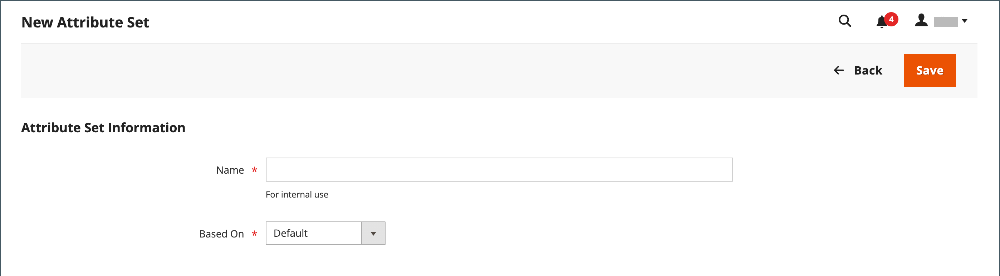
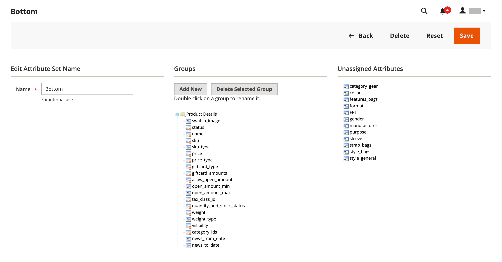

# Set di attributi

Uno dei primi passaggi della creazione di un prodotto consiste nella scelta della serie di attributi da utilizzare come modello per il record di prodotto. La serie di attributi determina i campi disponibili durante l&#39;immissione dei dati e i valori che vengono visualizzati al cliente.

Gli attributi vengono organizzati in gruppi che determinano la posizione in cui vengono visualizzati nel record del prodotto. Il tuo archivio include un set di attributi iniziale (denominato _default_) che include un set di attributi di uso comune. Se si desidera aggiungere solo alcuni attributi, è possibile aggiungerli a questo set di attributi predefinito. Se vendi prodotti che richiedono tipi specifici di informazioni, potrebbe essere meglio creare una serie di attributi dedicata che includa gli attributi specifici necessari per il prodotto.

{width="700" zoomable="yes"}

## Creare un set di attributi

1. Nella barra laterale _Admin_, passa a **[!UICONTROL Stores]** > _[!UICONTROL Attributes]_>**[!UICONTROL Attribute Set]**.

1. Fare clic su **[!UICONTROL Add New Set]**.

   {width="600" zoomable="yes"}

1. Immettere **[!UICONTROL Name]** per il set di attributi.

1. Imposta **[!UICONTROL Based On]** su un set di attributi esistente da utilizzare come modello.

1. Fare clic su **[!UICONTROL Save]**.

   Nella pagina successiva viene visualizzato quanto segue:

   - La colonna sinistra mostra il nome del set di attributi. Il nome è per riferimento interno e può essere modificato in base alle esigenze.
   - Al centro della pagina è riportata la selezione corrente di gruppi di attributi.
   - Nella colonna di destra sono elencati gli attributi selezionati che non sono attualmente assegnati al set di attributi.

1. Per aggiungere un attributo al set, trascinare l&#39;attributo dall&#39;elenco **[!UICONTROL Unassigned Attributes]** nella cartella appropriata nella colonna **[!UICONTROL Groups]**. Per rimuovere un attributo dal set, trascinarlo nell&#39;elenco **[!UICONTROL Unassigned Attributes]**.

   >[!NOTE]
   >
   >Gli attributi di sistema sono contrassegnati con un punto e non possono essere rimossi dall&#39;elenco _[!UICONTROL Groups]_. Tuttavia, possono essere trascinati in un altro gruppo nel set di attributi.

1. Al termine, fare clic su **[!UICONTROL Save]**.

{width="600" zoomable="yes"}

## Creare un gruppo di attributi

1. Nella colonna _[!UICONTROL Groups]_del set di attributi, fare clic su **[!UICONTROL Add New]**.

1. Immettere **[!UICONTROL Name]** per il nuovo gruppo e fare clic su **[!UICONTROL OK]**.

1. Effettua una delle seguenti operazioni:

   - Trascina **[!UICONTROL Unassigned Attributes]** nel nuovo gruppo.
   - Trascinare gli attributi da qualsiasi altro gruppo al nuovo gruppo.
   - Trascinare gli attributi non necessari in **[!UICONTROL Unassigned Attributes]**.

   Il nuovo gruppo diventa una sezione di attributi in qualsiasi prodotto basato sul set di attributi.

## Eliminare un set di attributi

1. Nella barra laterale _Admin_, passa a **[!UICONTROL Stores]** > _[!UICONTROL Attributes]_>**[!UICONTROL Attribute Set]**.

1. Selezionare il set di attributi nell&#39;elenco e aprire in modalità di modifica.

1. Fare clic su **[!UICONTROL Delete]**.

1. Quando viene richiesto di confermare, fare clic su **[!UICONTROL OK]**.
