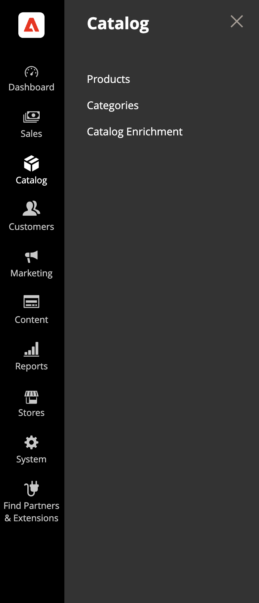
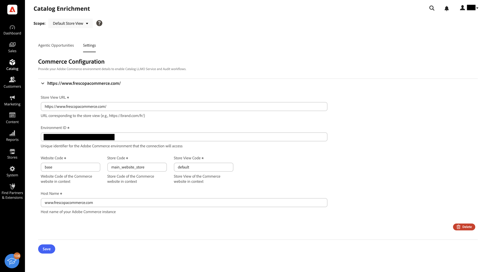
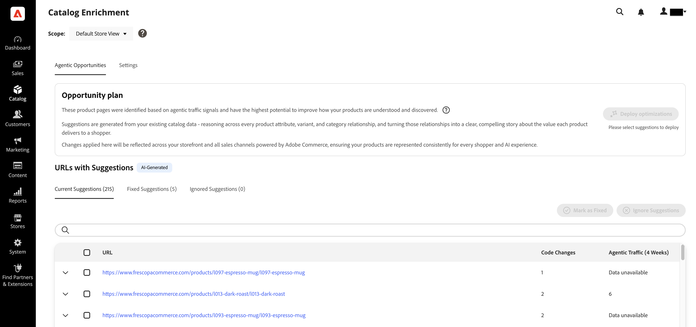
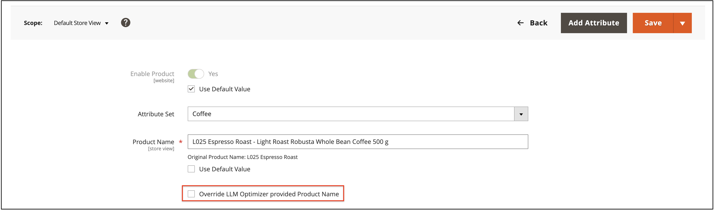
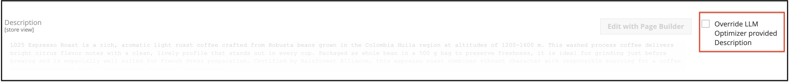

# Arricchimento del catalogo

L&#39;arricchimento del catalogo è una funzionalità nativa di [!DNL Adobe Commerce] che consente di migliorare i nomi dei prodotti e le descrizioni lunghe in modo che il catalogo venga rappresentato in modo più accurato quando gli acquirenti utilizzano LLM e assistenti AI per la ricerca e l&#39;individuazione dei prodotti.

>[!NOTE]
>
>L&#39;arricchimento del catalogo è alimentato da [!DNL Commerce Catalog Agent] e [!DNL Adobe LLM Optimizer] dietro le quinte. Utilizza l’arricchimento come parte del flusso di lavoro del catalogo Commerce. Non puoi gestire un’integrazione LLM Optimizer separata per applicare gli aggiornamenti approvati di nome e descrizione. Per un monitoraggio e un&#39;ottimizzazione LLM più ampi al di fuori di Commerce, consulta la [documentazione del prodotto LLM Optimizer](https://experienceleague.adobe.com/en/docs/llm-optimizer/using/home).

## Come funziona {#how-it-works}

Il catalogo prodotti [!DNL Adobe Commerce] è il sistema di registrazione per i dati dei prodotti: nomi, descrizioni, attributi, prezzi e inventario. [!DNL Adobe Commerce] Storefront MCP (Model Context Protocol) collega i dati live del catalogo alle esperienze Adobe AI. Da lì, l’agente catalogo può identificare le lacune nei nomi dei prodotti e nelle descrizioni lunghe, proporre miglioramenti e riscrivere le modifiche approvate in Commerce in modo da poterle esaminare nell’amministratore Commerce.

Con l’arricchimento del catalogo puoi:

- Identifica le lacune e le incoerenze nei nomi dei prodotti e nelle descrizioni lunghe che influiscono sul modo in cui i moduli LLM interpretano i prodotti.
- Revisione dei miglioramenti suggeriti con contesto di supporto, incluse giustificazioni e confronti prima e dopo.
- Applica gli aggiornamenti approvati direttamente al catalogo Commerce in modo che l’amministratore, la vetrina e altri canali che leggono tali campi rimangano allineati.

Poiché i nomi dei prodotti e le descrizioni lunghe risiedono in Commerce, il miglioramento della copia una sola volta può essere utile per ogni canale che utilizza tali dati di prodotto. Il vantaggio dipende da come e quando i sistemi vengono aggiornati.

| Direzione | Finalità |
| --- | --- |
| Catalogo Commerce -> analisi | I segnali di catalogo e URL alimentano i suggerimenti di arricchimento. |
| Arricchimento -> Catalogo Commerce | Dopo aver approvato un aggiornamento, le modifiche al nome e alla descrizione del prodotto vengono salvate nel catalogo Commerce in modo che l’amministratore e la vetrina riflettano i valori ottimizzati. |

## Per chi è questo {#who-this-is-for}

- Professionisti del marketing digitale e commercianti che desiderano che i dati dei prodotti siano accurati e coerenti nelle risposte basate su LLM.
- Esperti di marketing digitale e merchandising che necessitano di un modo controllato per migliorare la copia del catalogo su larga scala.
- Amministratori Commerce proprietari di integrità del catalogo, processi di amministrazione e integrazioni (API, CSV, PIM) che forniscono attributi di prodotto.

## Prerequisiti {#prerequisites}

I seguenti prerequisiti si applicano quando si ha accesso all’arricchimento del catalogo.

- La vetrina può essere scansionata da bot agentici e orientati verso LLM in cui è necessaria la copertura della scansiona per i suggerimenti in base al catalogo.
- I servizi Commerce richiesti e la connettività al catalogo sono abilitati e integri. Per ulteriori informazioni, consulta [Abilita arricchimento catalogo](#enable-catalog-enrichment).
- [IMS è configurato](https://experienceleague.adobe.com/en/docs/core-services/interface/administration/organizations).
- Hai accesso a [Adobe Admin Console](https://helpx.adobe.com/business/enterprise/plan-your-deployment/basic-concepts/admin-console.html).
- La tua organizzazione ha firmato il rider GenAI, o ha esplicitamente rinunciato, per i servizi di intelligenza artificiale sottostanti.

>[!NOTE]
>
>Come parte della configurazione, Commerce controlla se l’organizzazione ha firmato il gestore GenAI che copre i servizi di intelligenza artificiale dietro l’arricchimento del catalogo. Se non hai ancora firmato il gestore o rinunciato, ti viene richiesto di firmare o aggiornare il gestore prima di poter utilizzare l’arricchimento del catalogo.

## Abilita arricchimento catalogo {#enable-catalog-enrichment}

Prima di rivedere o applicare suggerimenti, rivolgiti al tuo amministratore Commerce o al tuo partner di implementazione per verificare quanto segue:

### Installare le estensioni di Catalog Enrichment e Catalog Services

1. Installa l’estensione di arricchimento del catalogo nell’istanza di Commerce eseguendo il seguente comando:

   ```bash
   composer require magento/module-catalog-enrichment --no-update
   composer update magento/module-catalog-enrichment
   ```

1. Se non hai già installato Catalog Services, [procedi](https://experienceleague.adobe.com/en/docs/commerce/catalog-service/installation#install-the-catalog-service-extension).

   **[!UICONTROL Catalog enrichment]** è ora disponibile nella tua istanza di Commerce.

### Accedere all’arricchimento del catalogo

Dopo aver installato le estensioni di Catalog Enrichment e Catalog Services, la funzionalità di arricchimento del catalogo è disponibile nell&#39;amministratore in **[!UICONTROL Catalog]** > **[!UICONTROL Catalog Enrichment]**.



### Configurare l’arricchimento del catalogo

Configura l&#39;arricchimento del catalogo nella scheda **[!UICONTROL Settings]** in modo che [!DNL Commerce Catalog Agent] possa connettersi all&#39;ambiente [!DNL Adobe Commerce] e presentare suggerimenti in Commerce Admin.

1. In Amministrazione, passa a **[!UICONTROL Catalog]** > **[!UICONTROL Catalog Enrichment]**.
1. Nell&#39;elenco **[!UICONTROL Scope]** nella parte superiore della pagina, selezionare la visualizzazione dello store che si desidera configurare oppure lasciare **[!UICONTROL All Store Views]** per gestire le impostazioni tra le visualizzazioni dello store.
1. Apri la scheda **[!UICONTROL Settings]**.
1. In **[!UICONTROL Commerce Configuration]**, espandere il pannello di visualizzazione archivio con l&#39;etichetta con il relativo URL.

   Fornisci i dettagli dell&#39;ambiente [!DNL Adobe Commerce] per abilitare il servizio Catalog LLM Optimizer e i flussi di lavoro di controllo.

   

1. Immettere i dettagli di connessione richiesti per la visualizzazione archivio.

   - **[!UICONTROL Store View URL]**: URL corrispondente alla visualizzazione archivio, ad esempio `https://brand.example.com/fr/`.
   - **[!UICONTROL Environment ID]**: identificatore univoco per l&#39;ambiente [!DNL Adobe Commerce] a cui la connessione accede.
   - **[!UICONTROL Website Code]**, **[!UICONTROL Store Code]** e **[!UICONTROL Store View Code]**: codici di visualizzazione sito Web, archivio e archivio per il sito Web Commerce. Questi valori devono corrispondere ai codici presenti nell’amministratore Commerce.
   - **[!UICONTROL Host Name]**: nome host dell&#39;istanza [!DNL Adobe Commerce].

1. Fare clic su **[!UICONTROL Save]**.

Dopo il salvataggio, attendere il completamento di qualsiasi processo di sincronizzazione o convalida iniziale prima di basarsi sui risultati del catalogo o del controllo di audit per la visualizzazione archivio. La visualizzazione dei suggerimenti di prodotto nella pagina **[!UICONTROL Catalog Enrichment]** potrebbe richiedere fino a 24 ore.

Per rimuovere una configurazione della visualizzazione archivio, espandere tale voce e fare clic su **[!UICONTROL Delete]**.

#### Descrizioni dei campi {#commerce-connection-fields}

I campi obbligatori sono contrassegnati con un asterisco (*) nel modulo **[!UICONTROL Commerce Configuration]**.

| Campo | Obbligatorio | Descrizione |
| --- | --- | --- |
| URL visualizzazione store | Sì | URL corrispondente alla visualizzazione archivio (ad esempio, `https://brand.example.com/fr/`). |
| ID ambiente | Sì | Identificatore univoco dell&#39;ambiente [!DNL Adobe Commerce] a cui la connessione accede. |
| Codice sito Web | Sì | Codice del sito web Commerce. |
| Codice store | Sì | Codice store del sito Web Commerce. |
| Codice visualizzazione store | Sì | Archivia la visualizzazione del sito Web Commerce. |
| Nome host | Sì | Nome host dell&#39;istanza [!DNL Adobe Commerce]. |

### Rivedere e applicare l’arricchimento del catalogo {#review-and-apply}

Dopo aver abilitato e configurato l&#39;arricchimento del catalogo, i suggerimenti di prodotto vengono visualizzati nella scheda **[!UICONTROL Agentic Opportunities]**. Da qui puoi rivedere i suggerimenti e applicare gli aggiornamenti approvati ai nomi dei prodotti e alle descrizioni lunghe nel catalogo Commerce.

L’arricchimento del catalogo utilizza le seguenti visualizzazioni del flusso di lavoro:

- **[!UICONTROL Current Suggestions]**: elementi nuovi o attivi da rivedere.
- **[!UICONTROL Fixed Suggestions]**: elementi già applicati o risolti.
- **[!UICONTROL Ignored Suggestions]**: elementi esclusi intenzionalmente dall&#39;azione.



### Distribuire i suggerimenti approvati {#review-deploy-catalog}

Per distribuire i suggerimenti approvati:

1. Selezionare **[!UICONTROL Current Suggestions]**.
1. Fai clic sul controllo di espansione per l’URL o la riga SKU per visualizzare il nome del prodotto e gli aggiornamenti della descrizione del prodotto proposti.
1. Rivedi il suggerimento e conferma che corrisponda alla tua strategia di merchandising e SEO.

È possibile modificare un suggerimento prima di distribuirlo o spostarlo in **[!UICONTROL Ignored Suggestions]** se non corrisponde alla strategia.

1. Seleziona la riga per l’URL o lo SKU da aggiornare.
1. Fai clic su **[!UICONTROL Deploy optimizations]** e conferma.

Le modifiche approvate al nome e alla descrizione vengono salvate nel catalogo [!DNL Adobe Commerce] come per gli altri aggiornamenti di prodotto.

>[!IMPORTANT]
>
>Considera ogni aggiornamento applicato come una modifica del catalogo di produzione. Utilizza le tue normali procedure di controllo delle modifiche, staging e controllo qualità. Applica gli aggiornamenti solo dopo che le parti interessate a merchandising e SEO avranno concordato la copia finale.

Dopo aver applicato un aggiornamento, i suggerimenti passano a **[!UICONTROL Fixed Suggestions]** con uno stato **Contrassegnato come Fisso**.

## Verificare l’arricchimento nell’amministratore {#verify-in-admin}

**Per verificare l&#39;arricchimento del catalogo applicato:**

1. Vai a **[!UICONTROL Catalog]** > **[!UICONTROL Products]** nell&#39;amministratore di Commerce.
1. Utilizza i filtri e il selettore **[!UICONTROL Store View]** come necessario (ad esempio, **[!UICONTROL Default Store View]**).
1. Cerca lo SKU.
1. Apri il prodotto in modalità di modifica.

   Il modulo del prodotto riporta il nome e/o la descrizione del prodotto arricchito.

   

1. Facoltativo: selezionare **[!UICONTROL Override Catalog Agent provided Product Name]** se si desidera mantenere un nome immesso manualmente.

   Le sostituzioni manuali influiscono sul modo in cui i suggerimenti rimangono sincronizzati con il catalogo. Per ulteriori informazioni, vedere [Sostituzione manuale in Admin](#manual-override-in-the-admin).

1. Espandere la sezione **[!UICONTROL Content]** e individuare il campo di descrizione.

   La descrizione arricchita viene visualizzata quando hai applicato le modifiche alla descrizione.

   

1. Facoltativo: selezionare **[!UICONTROL Override Catalog Agent provided Description]** se si desidera conservare una descrizione immessa manualmente.

Le sostituzioni manuali influiscono sul modo in cui i suggerimenti rimangono sincronizzati con il catalogo. Per ulteriori informazioni, vedere [Sostituzione manuale in Admin](#manual-override-in-the-admin).

## Verificare l’arricchimento nella vetrina {#verify-storefront}

**Per verificare l&#39;arricchimento nella vetrina:**

1. Cerca lo SKU nella vetrina.
1. Apri la pagina del prodotto.
1. Verifica che il nome e la descrizione del prodotto corrispondano a quelli approvati.

   Potrebbero volerci un po&#39; di tempo prima che l&#39;arricchimento appaia sul vetrina.

1. Verifica che le aree che mostrano la descrizione estesa corrispondano a quelle approvate.
1. Facoltativo: conferma i canali a valle che utilizzano gli stessi attributi del catalogo, se pertinente per il rollout.

## Override, acquisizione e suggerimenti obsoleti {#overrides-ingestion}

Dopo che l’arricchimento del catalogo ha aggiornato il nome o la descrizione di un prodotto, gli stessi campi possono essere modificati da altri sistemi di acquisizione. Alcuni esempi includono chiamate REST API, importazioni CSV e feed PIM.

### Valore originale riacquisito {#original-value-reingested}

Se un processo esterno scrive il nome o la descrizione originale (il valore esistente prima dell’applicazione dell’arricchimento), Commerce continua a rispettare il valore arricchito per quel campo in base alle regole di arricchimento del catalogo. Il suggerimento potrebbe non essere ripristinato automaticamente in base a quella sola acquisizione.

### Nuovo valore riacquisito {#new-value-reingested}

Se il processo esterno invia un nuovo valore che non è una ripetizione del testo di prearricchimento, Commerce rispetta il nuovo valore di catalogo. Ad esempio, il valore arricchito viene sostituito con un nuovo nome da &quot;Scarpe rosse&quot; a &quot;Scarpe rosse iconiche&quot;. Il suggerimento di arricchimento correlato è in genere contrassegnato come *Obsoleto* perché il catalogo live non corrisponde più al contesto del suggerimento.

### Sostituzione manuale in Admin {#manual-override-in-the-admin}

Se si modifica manualmente il nome o la descrizione del prodotto nell&#39;amministratore [!DNL Adobe Commerce]:

- Il valore Admin vince come sistema di registrazione per quella modifica manuale.
- Il suggerimento di arricchimento è contrassegnato come *Obsoleto*.
- Il flusso di lavoro dei suggerimenti torna allo stato originale per l&#39;elemento in modo da poter ridefinire la linea di base o accettare un nuovo suggerimento se l&#39;analisi viene eseguita nuovamente.

Queste regole ti aiutano a capire se l’arricchimento del catalogo, i feed di acquisizione o le modifiche dell’amministratore sono autorevoli quando più canali toccano la stessa SKU.

## Limiti e considerazioni {#limits}

- L’arricchimento si applica solo ai nomi dei prodotti e alle descrizioni lunghe. Non modifica il layout PDP, i widget o altri contenuti della vetrina a livello di pagina.
- Cataloghi di grandi dimensioni e conteggi URL elevati possono influenzare la rapidità con cui viene completata l’analisi e il numero di suggerimenti visualizzati contemporaneamente.
- Suggerimenti significativi presuppongono che i bot rilevanti per LLM possano accedere agli URL del prodotto a cui tieni. Regole robot, autenticazione, blocco geografico e personalizzazione intensiva possono ridurre la copertura.

## Best practice {#best-practices}

- Documentare la proprietà del sistema per il nome e la descrizione del prodotto in modo che i processi PIM o di feed non entrino involontariamente in conflitto con l’arricchimento del catalogo.
- Coordina con i team SEO e brand prima di applicare titoli o descrizioni in blocco.
- Risincronizza o analizza dopo le principali importazioni del catalogo in modo che i suggerimenti riflettano lo stato corrente del catalogo.

## Esempi

Gli esempi seguenti mostrano come l’arricchimento del catalogo trasforma gli attributi tecnici grezzi in copie di prodotto narrative incentrate sull’acquirente che i moduli LLM possono utilizzare per rispondere alle domande di acquisto.

### Esempio: prodotto a base di caffè con attributi tecnici

Un catalogo di Coffee retailer memorizza solo le specifiche tecniche per un prodotto di chicchi di caffè arrosto medio: varietà di chicchi, regione di origine, metodo di elaborazione, livello di arrosto e gamma di altitudine. Questi campi descrivono il prodotto ma non ne comunicano il valore a un acquirente, quindi un assistente AI ha poco da lavorare quando risponde a una domanda come &quot;quale caffè ha un sapore liscio e a basso contenuto acido?&quot;

L’arricchimento del catalogo legge gli attributi tecnici e i motivi attraverso il modo in cui interagiscono per dedurre le caratteristiche rilevanti per l’acquirente:

| Attributo tecnico | Caratteristica dedotta | Ragionamento |
| --- | --- | --- |
| Miele processo, Medium arrosto | Bassa acidità | La mucillagine di frutta lasciata sul fagiolo durante la lavorazione del miele sopprime l&#39;acidità, e la torrefazione media scompone i composti acidi residui. |
| processo del miele, Arabica, arrosto Medium | Aroma di nocciola | Gli zuccheri di frutta della mucillagine si combinano con le note naturali di Arabica, amplificate a media arrostimento. |
| processo del miele, Arabica | Bocca ricca e cremosa | Gli oli assorbiti dalla mucillagine durante l&#39;essiccazione aggiungono viscosità e corpo. |
| Processo del miele, altitudine 900-1200m | Sottotoni in caramello | I fagioli più densi e ad alta quota sviluppano zuccheri più complessi, resi più profondi dalla lavorazione del miele. |

L’arricchimento del catalogo applica le seguenti caratteristiche dedotte alla copia del prodotto:

- **Prima**: &quot;Medium chicchi di caffè arrosto - Arabica, Brasile Minas Gerais, processo del miele, 900-1200m&quot;
- **Dopo**: &quot;I fagioli Arabica coltivati a 900-1200m nel Minas Gerais brasiliano, miele lavorato e medio torrefatto, sviluppano un sapore dolce naturale, cremoso con un carattere di nocciola distinto, sottotoni di caramello, e bassa acidità. Un caffè speciale coerente e avvicinabile, meglio sperimentato attraverso versare sopra.&quot;

Il nome e la descrizione aggiornati vengono salvati direttamente nel catalogo Commerce, pertanto la vetrina, i feed LLM e altri canali che leggono tali campi riflettono tutti la stessa copia arricchita.

### Esempio: configurazione di mobili modulari

Un retailer per mobili vende un divano modulare in cui la descrizione del prodotto elenca solo i codici di configurazione e il nome del fabric, ad esempio `6 Standard Seats + 6 Standard Sides in Sapphire Navy Corded Velvet`. Questa scorciatoia è comprensibile per un cliente di ritorno, ma offre all’assistente di intelligenza artificiale un piccolo contesto sul funzionamento del prodotto o su cosa lo rende resistente o confortevole.

L’arricchimento del catalogo espande gli attributi di configurazione e struttura in una descrizione narrativa che spiega cosa fa ogni componente e perché è importante per l’acquirente:

- **Prima**: &quot;6 Posti Standard + 6 Lati Standard in Velluto Cordato Sapphire Navy&quot;
- **Dopo**: &quot;Questa configurazione include 6 set di inserimento posti standard e 6 inserti laterali standard che funzionano in modo intercambiabile come braccia o schienali, formando gli elementi modulari del layout. Ogni sedile è dotato di Schiuma standard con tre strati ad alta densità progettati per preservare l&#39;sollevamento e resistere alle cadute. La copertina Sapphire Navy Corded Velvet è durevole come è lussuosa, con corde testurizzate che creano un sottile lucentezza e una sensazione morbida e peluche. Le coperture sono cucite a mano per un aspetto preciso e personalizzato e sono lavabili in lavatrice e modificabili, in modo che la sezione possa evolvere con il tuo spazio.&quot;

Poiché la descrizione arricchita viene scritta nuovamente nel catalogo Commerce, è disponibile per i bot AI che scansionano la pagina dei dettagli del prodotto e per qualsiasi canale o feed a valle che consuma i dati del catalogo del prodotto, senza modificare il layout o la progettazione visualizzati dagli acquirenti sulla pagina.
