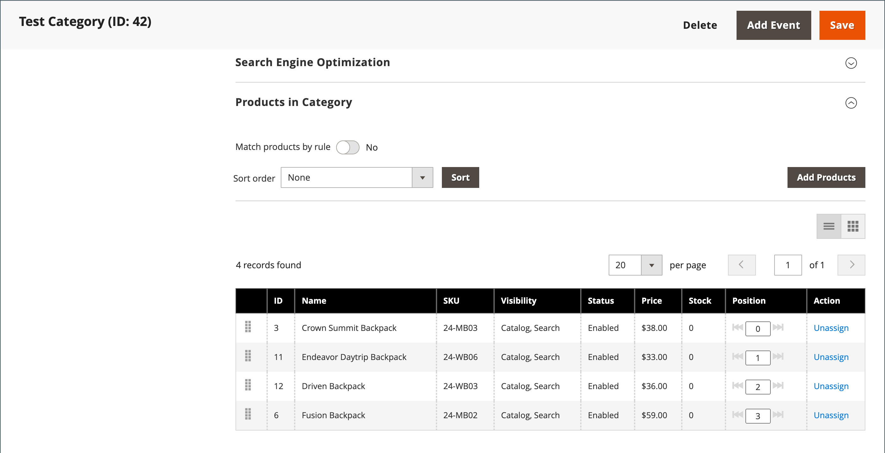

# Cataloghi semplici

>[!IMPORTANT]
>
>L’utilizzo di un catalogo semplice non è più consigliato come best practice. L’utilizzo continuo di questa funzione può causare il deterioramento delle prestazioni e altri problemi di indicizzazione. Una descrizione dettagliata e una soluzione sono disponibili nel [Centro assistenza](https://experienceleague.adobe.com/docs/commerce-knowledge-base/kb/troubleshooting/miscellaneous/slow-performance-slow-and-long-running-crons.html?lang=it).  Le versioni interessate includono:  - Adobe Commerce sull&#39;infrastruttura cloud, 2.3.x e versioni successive - Adobe Commerce (On-Premise), 2.3.x e versioni successive - Magento Open Source, 2.3.x e versioni successive   In qualsiasi versione, alcune estensioni funzionano solo con tabelle flat, creando in tal modo un rischio se si disabilitano le tabelle flat. Se si è certi di disporre di alcune estensioni che utilizzano gli indicizzatori Flat Catalog, è necessario tenere presente questo rischio quando si impostano tali valori su `No`.

In genere, Commerce memorizza i dati del catalogo in più tabelle, in base al modello Entity-Attribute-Value (EAV). Poiché gli attributi del prodotto sono memorizzati in molte tabelle, le query SQL a volte sono lunghe e complesse.

Al contrario, un catalogo semplice crea tabelle al volo, in cui ogni riga contiene tutti i dati necessari su un prodotto o una categoria. Un catalogo flat viene aggiornato automaticamente, ogni minuto o in base al processo cron. L’indicizzazione di cataloghi semplici può anche velocizzare l’elaborazione delle regole dei prezzi di catalogo e carrello. Un catalogo con un massimo di 500.000 SKU può essere indicizzato rapidamente come catalogo semplice.

>[!NOTE]
>
>Prima di abilitare un catalogo flat per un archivio live, assicurati di testare la configurazione in un ambiente di sviluppo.

## Passaggio 1: abilitare il catalogo flat

1. Nella barra laterale _Admin_, passa a **[!UICONTROL Stores]** > _[!UICONTROL Settings]_>**[!UICONTROL Configuration]**.

1. Nel pannello a sinistra, espandi **[!UICONTROL Catalog]** e scegli **[!UICONTROL Catalog]** sotto.

1. Espandere la sezione _Storefront_ ed eseguire le operazioni seguenti:

   - Imposta **[!UICONTROL Use Flat Catalog Category]** su `Yes`. Se necessario, deselezionare la casella di controllo **[!UICONTROL Use system value]**.

   - Imposta **[!UICONTROL Use Flat Catalog Product]** su `Yes`.

   {width="700" zoomable="yes"}

1. Al termine, fare clic su **[!UICONTROL Save Config]**.

1. Quando viene richiesto di aggiornare la cache, fare clic su **[!UICONTROL Cache Management]** nel messaggio di sistema e seguire le istruzioni per aggiornare la cache.

## Passaggio 2: verificare i risultati

Esistono due metodi per verificare i risultati.

### Metodo 1: verificare i risultati per un singolo prodotto

1. Nella barra laterale _Admin_, passa a **[!UICONTROL Catalog]** > **[!UICONTROL Products]**.

1. Apri un prodotto in modalità di modifica.

1. Per **[!UICONTROL Name]**, aggiungere il testo `_TEST` alla fine del nome del prodotto.

1. Fare clic su **[!UICONTROL Save]**.

1. In una nuova scheda del browser, passa alla home page del negozio ed effettua le seguenti operazioni:

   - Cerca il prodotto modificato.

   - Utilizza la navigazione per navigare fino al prodotto nella categoria a esso assegnata.

     Se necessario, aggiorna la pagina per visualizzare i risultati. La modifica verrà visualizzata entro il minuto o in base alla pianificazione di [Cron](../systems/cron.md).

   {width="700" zoomable="yes"}

### Metodo 2: verificare i risultati per una categoria

1. Nella barra laterale _Admin_, passa a **[!UICONTROL Catalog]** > **[!UICONTROL Categories]**.

1. Nell&#39;angolo superiore sinistro verificare che **[!UICONTROL Store View]** sia impostato su `All Store Views`.

   Se richiesto, fare clic su **[!UICONTROL OK]** per confermare.

1. Nell&#39;albero delle categorie selezionare una categoria esistente, fare clic su **[!UICONTROL Add Subcategory]** ed eseguire le operazioni seguenti:

   - Per **[!UICONTROL Category Name]**, immettere `Test Category`.

   - Al termine, fare clic su **[!UICONTROL Save]**.

     {width="600" zoomable="yes"}

   - Espandere  nella sezione **[!UICONTROL Products in Category]** e fare clic su **[!UICONTROL Reset Filter]** per visualizzare tutti i prodotti.

   - Seleziona la casella di controllo di diversi prodotti da aggiungere alla nuova categoria.

   - fare clic su **[!UICONTROL Save]**.

   {width="600" zoomable="yes"}

1. In una nuova scheda del browser passare alla home page del negozio e utilizzare la navigazione del negozio per passare alla categoria creata.

   Se necessario, aggiorna la pagina per visualizzare i risultati. La modifica viene visualizzata entro il minuto o in base alla pianificazione cron.

## Passaggio 3: rimuovere i dati del test

Per rimuovere i dati di test e ripristinare la configurazione originale del catalogo e del nome del prodotto, eseguire le operazioni seguenti.

### Rimuovi la categoria di test

1. Nella barra laterale _Admin_, passa a **[!UICONTROL Catalog]** > **[!UICONTROL Categories]**.

1. Nell&#39;albero delle categorie selezionare la sottocategoria di test creata.

1. Nell&#39;angolo superiore destro fare clic su **[!UICONTROL Delete]**.

1. Quando viene richiesto di confermare, fare clic su **[!UICONTROL OK]**.

   La rimozione di questa categoria non rimuove i prodotti assegnati alla categoria.

### Ripristina il nome del prodotto originale

1. Nella barra laterale _Admin_, passa a **[!UICONTROL Catalog]** > **[!UICONTROL Categories]**.

1. Apri il prodotto di test in modalità di modifica.

1. Rimuovi il testo `_TEST` aggiunto a **[!UICONTROL Product Name]**.

1. Nell&#39;angolo superiore destro fare clic su **[!UICONTROL Save]**.

### Ripristina la configurazione originale del catalogo

1. Nella barra laterale _Admin_, passa a **[!UICONTROL Stores]** > _[!UICONTROL Settings]_>**[!UICONTROL Configuration]**.

1. Nel pannello a sinistra, espandi **[!UICONTROL Catalog]** e scegli **[!UICONTROL Catalog]** sotto.

1. Espandere la sezione _Storefront_ ed eseguire le operazioni seguenti:

   - Imposta **[!UICONTROL Use Flat Catalog Category]** su `No`.

   - Imposta **[!UICONTROL Use Flat Catalog Product]** su `No`.

1. Al termine, fare clic su **[!UICONTROL Save Config]**.

1. Quando richiesto, aggiorna la cache.
