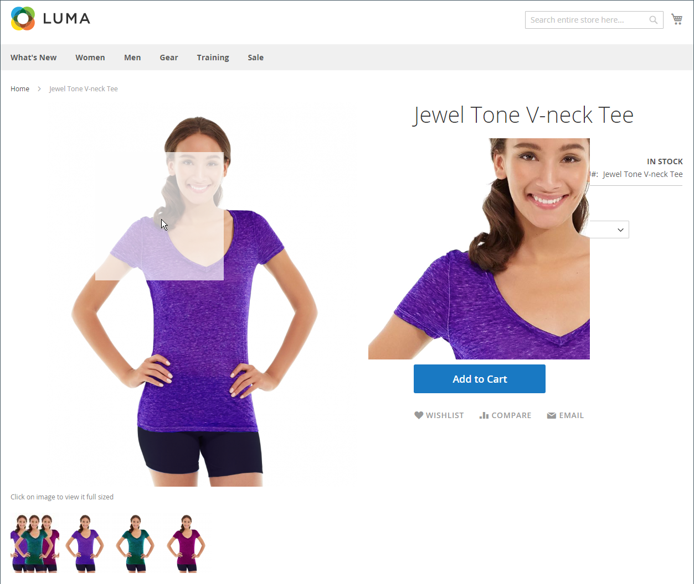

# Immagini e video del catalogo

L&#39;utilizzo di immagini di alta qualità in proporzione uniforme conferisce al catalogo un aspetto professionale e commerciale. Se disponi di un catalogo di grandi dimensioni con diverse immagini per prodotto, puoi facilmente gestire centinaia, se non migliaia, di immagini di prodotto. Prima di iniziare, stabilisci una convenzione di denominazione per i file di immagine e organizzali in modo da poter trovare gli originali, se necessario.

{width="600" zoomable="yes"}

Un’immagine di un singolo prodotto viene riprodotta in diverse dimensioni in tutto il catalogo. La dimensione di visualizzazione del contenitore di immagini sulla pagina è definita nel foglio di stile del tema. Tuttavia, la posizione in cui l&#39;immagine viene visualizzata nell&#39;archivio è determinata dal ruolo assegnato all&#39;immagine. L&#39;immagine del prodotto principale, o immagine _base_, deve essere sufficientemente grande da produrre l&#39;ingrandimento necessario per lo zoom. Oltre all’immagine principale, una versione più piccola della stessa immagine potrebbe comparire negli elenchi dei prodotti o come miniatura nel carrello. Puoi caricare un&#39;immagine con le dimensioni più grandi necessarie oppure utilizzare un&#39;immagine [Adobe Stock](../content-design/adobe-stock.md) e consentire a Commerce di eseguire il rendering delle dimensioni necessarie per ogni utilizzo. È possibile utilizzare la stessa immagine per tutti i ruoli oppure assegnare un&#39;immagine diversa a ciascun ruolo. Per impostazione predefinita, la prima immagine caricata viene assegnata a tutti e tre i ruoli.

## Browser multimediale Storefront

Il browser multimediale sulla pagina del prodotto mostra più immagini, video o campioni relativi al prodotto. Ogni miniatura può mostrare una visualizzazione o una variante diversa del prodotto. L’acquirente può fare clic su una miniatura per sfogliare le risorse multimediali. Anche se la posizione del media browser varia in base al tema, la posizione predefinita è appena sotto l&#39;immagine principale sulla pagina del prodotto. Per i controlli di accessibilità, vedere [Accesso facilitato alla navigazione](../getting-started/navigation-accessibility.md).

{width="700" zoomable="yes"}

### Zoom immagine

Se l&#39;[immagine base](product-image.md) è sufficientemente grande da creare l&#39;effetto di zoom, i clienti possono visualizzare una parte ingrandita dell&#39;immagine al passaggio del mouse. Quando lo zoom è attivato, i clienti possono fare clic sull&#39;immagine principale e spostare il cursore per ingrandire diverse parti dell&#39;immagine. La selezione ingrandita viene visualizzata a destra dell&#39;immagine.

{width="700" zoomable="yes"}

### Scatole luminose e cursori

Esistono molte caselle di luce e cursori di terze parti che puoi utilizzare per migliorare la presentazione delle immagini del prodotto. Cerca estensioni in [Commerce Marketplace](../getting-started/commerce-marketplace.md).

## Risorse per la risoluzione dei problemi

Per assistenza nella risoluzione dei problemi relativi a immagini e video, vedere i seguenti articoli della Knowledge Base di supporto Commerce:

- [Dopo l&#39;installazione, le immagini e i fogli di stile non vengono caricati; vengono visualizzati solo testo, nessuna grafica](https://experienceleague.adobe.com/docs/commerce-knowledge-base/kb/troubleshooting/storefront/after-installing-images-and-stylesheets-do-not-load-only-text-displays-no-graphics.html?lang=it)
- [Le immagini del prodotto non vengono visualizzate nonostante i ruoli immagine di modifica prodotto](https://experienceleague.adobe.com/docs/commerce-knowledge-base/kb/troubleshooting/storefront/product-images-do-not-display-despite-product-edit-image-roles.html?lang=it)
- [Immagini dello store non visualizzate dopo la distribuzione](https://experienceleague.adobe.com/docs/commerce-knowledge-base/kb/troubleshooting/storefront/store-images-not-displayed-after-deployment.html?lang=it)
