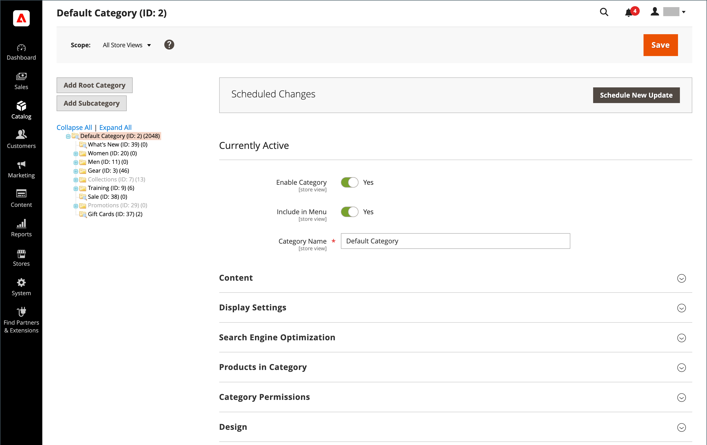

# [!UICONTROL Catalog] menu

Il [!UICONTROL Catalog] fornisce un facile accesso agli strumenti di creazione di prodotti, categoria, gestione dell’inventario e cataloghi condivisi per prezzi personalizzati in [Archivi B2B](https://experienceleague.adobe.com/docs/commerce-admin/b2b/introduction.html).

{width="300" zoomable="yes"}

Il giorno _Amministratore_ barra laterale, fai clic su **[!UICONTROL Catalog]**.

## [!UICONTROL Products]

Crea [products](products-list.md) di ogni tipo e gestisci il tuo inventario.

{width="700" zoomable="yes"}

## [!UICONTROL Categories]

Creare [categoria](categories.md) struttura alla base della navigazione del tuo negozio.

{width="700" zoomable="yes"}

## [!UICONTROL Shared Catalogs]

Per i negozi in cui Adobe Commerce B2B è installato e abilitato, [cataloghi condivisi](https://experienceleague.adobe.com/docs/commerce-admin/b2b/shared-catalogs/catalog-shared.html) consente di rendere i prezzi personalizzati disponibili per diverse aziende.

{width="700" zoomable="yes"}
