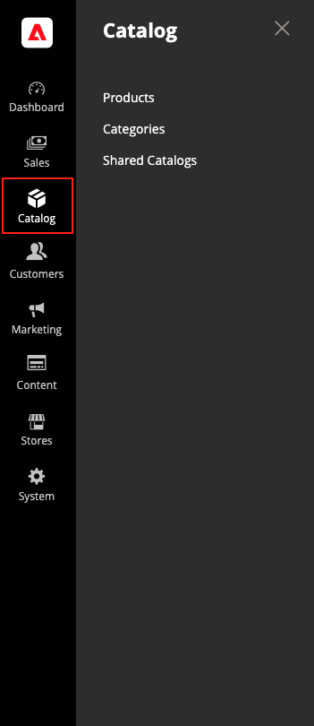
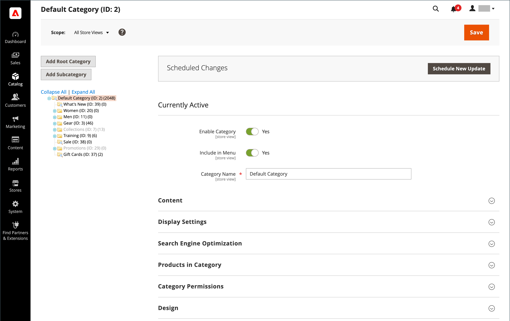

# Menu [!UICONTROL Catalog]

Il menu [!UICONTROL Catalog] consente di accedere facilmente agli strumenti di creazione di prodotti, categoria e gestione dell&#39;inventario e ai cataloghi condivisi per la determinazione dei prezzi personalizzati in [store B2B](https://experienceleague.adobe.com/docs/commerce-admin/b2b/introduction.html).

>[!BEGINTABS]

>[!TAB Adobe Commerce]

[!BADGE Solo PaaS]{type=Informative url="https://experienceleague.adobe.com/en/docs/commerce/user-guides/product-solutions" tooltip="Applicabile solo ai progetti Adobe Commerce on Cloud (infrastruttura PaaS gestita da Adobe) e ai progetti on-premise."}

{width="300" zoomable="yes"}

>[!TAB Adobe Commerce as a Cloud Service]

[!BADGE Solo SaaS]{type=Positive url="https://experienceleague.adobe.com/en/docs/commerce/user-guides/product-solutions" tooltip="Applicabile solo ai progetti Adobe Commerce as a Cloud Service e Adobe Commerce Optimizer (infrastruttura SaaS gestita da Adobe)."}

{width="300" zoomable="yes"}

>[!ENDTABS]

Nella barra laterale _Admin_, fai clic su **[!UICONTROL Catalog]**.

## [!UICONTROL Products]

Crea [prodotti](products-list.md) di ogni tipo e gestisci l&#39;inventario.

{width="700" zoomable="yes"}

## [!UICONTROL Categories]

Crea la struttura [categoria](categories.md) che è alla base della navigazione del tuo archivio.

{width="700" zoomable="yes"}

## [!UICONTROL Shared Catalogs]

Per i negozi in cui è installato e abilitato Adobe Commerce B2B, [i cataloghi condivisi](https://experienceleague.adobe.com/docs/commerce-admin/b2b/shared-catalogs/catalog-shared.html) consentono di rendere disponibili prezzi personalizzati per diverse società.

{width="700" zoomable="yes"}
