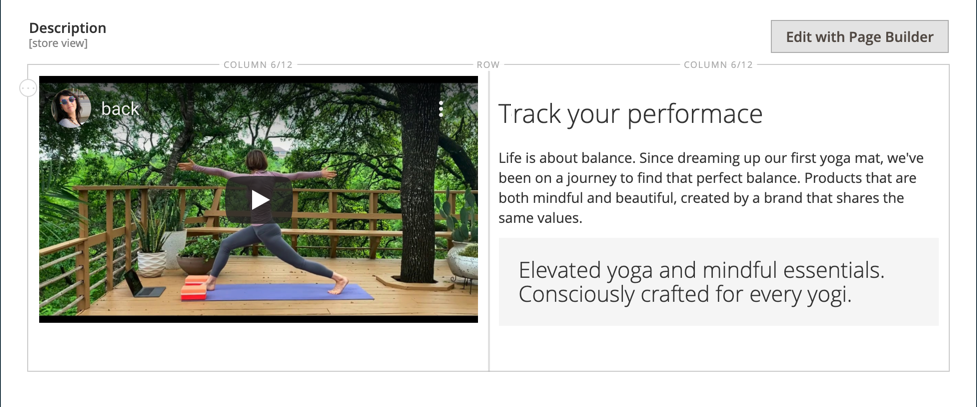
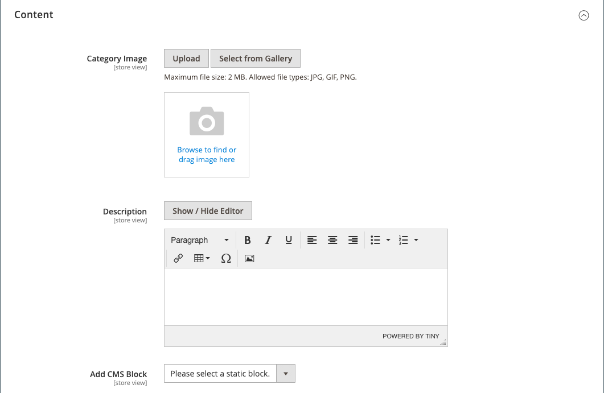

# Categorie - Impostazioni contenuto

Le impostazioni di _[!UICONTROL Content]_&#x200B;determinano la visualizzazione di eventuali contenuti aggiuntivi nella pagina della categoria. Oltre all’elenco dei prodotti della categoria, la pagina può includere un’immagine, una descrizione e un blocco CMS. È possibile utilizzare gli strumenti di contenuto [[!DNL Page Builder]](../page-builder/introduction.md) per definire la descrizione della categoria.

## Aggiungi la descrizione della categoria in [!DNL Page Builder]

1. Apri la categoria in modalità di modifica.

1. Scorri verso il basso ed espandi il  nella sezione **[!UICONTROL Content]**.

   {width="600" zoomable="yes"}

1. In alto a destra nell&#39;area **[!UICONTROL Description]**, fare clic su **[!UICONTROL Edit with Page Builder]**.

1. Utilizza gli strumenti di contenuto [[!DNL Page Builder]](../page-builder/introduction.md) per [modificare qualsiasi testo esistente](../page-builder/text.md) e aggiungere altro contenuto (se necessario).

## Anteprima [!DNL Page Builder]

Quando espandi la sezione _Contenuto_ per una categoria esistente in cui è presente contenuto creato con [!DNL Page Builder], viene visualizzata un&#39;anteprima del contenuto **[!UICONTROL Description]** come apparirebbe nella pagina della categoria. Facendo clic sull&#39;area di contenuto viene aperta l&#39;area di lavoro [!DNL Page Builder], in cui è possibile apportare gli aggiornamenti necessari.

{width="500" zoomable="yes"}

Per impostazione predefinita, questa anteprima di contenuto è abilitata per i moduli di prodotti e categorie. Se le prestazioni risultano ridotte a causa del caricamento dell&#39;anteprima, è possibile disabilitare l&#39;anteprima nelle impostazioni della [configurazione di gestione dei contenuti](../configuration-reference/general/content-management.md#advanced-content-tools).

## Aggiungi la descrizione della categoria nell’editor

Immettere solo caratteri ASCII normali nella casella di testo. Se si incolla testo da un elaboratore di testi, salvarlo innanzitutto come file TXT semplice per rimuovere eventuali caratteri di controllo invisibili.

Per ulteriori informazioni, vedere [Editor WYSIWYG](../content-design/editor.md).

1. Apri la categoria in modalità di modifica.

1. Scorri verso il basso ed espandi il  nella sezione **[!UICONTROL Content]**.

   {width="500" zoomable="yes"}

1. Immettere la categoria **[!UICONTROL Description]** e utilizzare la barra degli strumenti dell&#39;[editor](../content-design/editor.md) per formattare in base alle esigenze.

   È possibile trascinare l&#39;angolo inferiore destro per modificare l&#39;altezza della casella di testo.

## Aggiungere un blocco CMS alla pagina della categoria

1. Nella barra laterale _Admin_, passa a **[!UICONTROL Catalog]** > **[!UICONTROL Categories]**.

1. Nell&#39;albero delle categorie selezionare la categoria che si desidera modificare.

1. Espandere  nella sezione **[!UICONTROL Content]**.

1. Per **[!UICONTROL Add the CMS block]**, selezionare un blocco da aggiungere.

1. Espandere  nella sezione **[!UICONTROL Display Settings]**.

1. Impostare **[!UICONTROL Display Mode]** su uno dei seguenti valori:

   - `Static block only`
   - `Static block and products`

1. Al termine, fare clic su **[!UICONTROL Save]** e rivedere la visualizzazione del blocco nella vetrina (è necessario aggiornare la cache).

## Riferimento per le impostazioni del contenuto

| Impostazione | [Ambito](../getting-started/websites-stores-views.md#scope-settings) | Descrizione |
|--- |--- |--- |
| [!UICONTROL Category Image] | Visualizzazione store | Specifica un&#39;immagine per la parte superiore della pagina della categoria. Metodi:   **[!UICONTROL Upload]**- Carica un file di immagine dal computer locale alla raccolta e lo utilizza come immagine della categoria.  **[!UICONTROL Select from Gallery]** - Richiede di scegliere un&#39;immagine esistente dalla raccolta.    - Trascinare un file di immagine nel riquadro della fotocamera o cercare l&#39;immagine e selezionarla dal file system locale. |
| [!UICONTROL Description] | Visualizzazione store | Specifica una descrizione visualizzata nella pagina della categoria.   **[!UICONTROL Edit with Page Builder]**- Apre l&#39;[[!DNL Page Builder] area di lavoro](../page-builder/workspace.md), in cui è possibile modificare la descrizione.  **[!UICONTROL Show / Hide Editor]** - Attiva o disattiva la visualizzazione tra le modalità editor di WYSIWYG e HTML. |
| [!UICONTROL Add CMS Block] | Visualizzazione store | Aggiunge un [blocco CMS](../content-design/blocks.md) esistente alla pagina della categoria. |

{style="table-layout:auto"}
