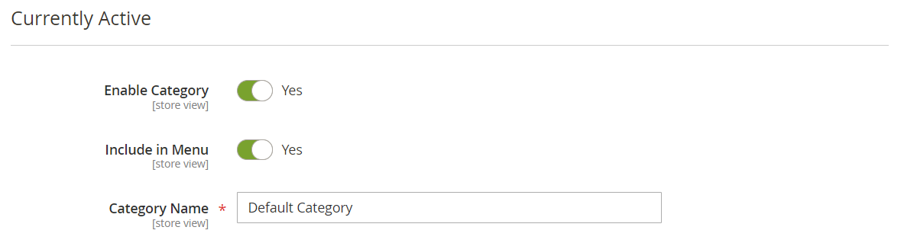

# Creare categorie

La struttura delle categorie del catalogo è simile a una struttura capovolta, con la directory principale in alto. Ogni sezione della struttura può essere espansa e compressa. Qualsiasi categoria disabilitata o nascosta è disabilitata. Le categorie al primo livello (sotto la [radice](category-root.md)) vengono in genere visualizzate come opzioni nel [menu principale](navigation-top.md). Puoi creare tutte le sottocategorie aggiuntive necessarie, in base alla profondità massima del menu impostata nella configurazione. Le categorie possono essere trascinate e rilasciate in altre posizioni nella struttura. Il numero ID categoria viene visualizzato tra parentesi dopo il nome della categoria nella parte superiore della pagina.

Per un sito Web con più [archivi](../stores-purchase/stores.md#add-stores), puoi creare una categoria principale diversa per ogni archivio che definisce il set di categorie utilizzato per la [navigazione superiore](navigation-top.md).

{width="700" zoomable="yes"}

## Best practice

Utilizza queste best practice per pianificare e creare categorie.

### Struttura delle categorie

La struttura delle categorie nel menu principale può influire sulla customer experience e sulle prestazioni. Come best practice, è consigliabile identificare una categoria superiore generale ed evitare di avere altre categorie con lo stesso nome. Ad esempio, anziché avere più categorie per &quot;Bambini&quot; organizzate in reparti diversi, ad esempio `Clothing/Kids`, `Shoes/Kids`, `Accessories/Kids`. Per rendere più efficiente la categoria padre principale `Kids`, è possibile creare le sottocategorie necessarie di seguito. Assicurati di essere coerente con la struttura delle categorie e utilizza lo stesso approccio per tutti i tipi di prodotto nel catalogo.

### Regole aziendali e automazione

Quando si utilizza la logica di business per visualizzare elementi simili in una pagina di catalogo o per impostare una promozione personalizzata, un processo automatizzato o criteri di ricerca, è necessario considerare la struttura delle categorie e i valori degli attributi disponibili. Ad esempio, se specifichi &quot;polo&quot; come categoria principale, i risultati potrebbero includere prodotti misti di genere e non appropriati per l’età. Tuttavia, se si abbina una specifica sottocategoria di polo camicie, i risultati sono più ristretti e più probabile che attragga un cliente specifico. I risultati possono essere ancora più specifici se combinati con altri valori di attributo destinati a un cliente specifico. Considera il numero di prodotti che devono essere filtrati e recuperati quando si fa riferimento a un percorso di categoria specifico. La differenza nei risultati può essere notevole. Considera i diversi risultati restituiti dai seguenti percorsi di categoria:

- `[Category:  All Products/Shirts/Father's Day/Polos/Sale]`
- `[Category Path: Men/Shirts/Polos]`
- `[Child Category: Polos]`

È importante definire chiaramente le relazioni categoriche, ad esempio:

- categoria principale
- sottocategoria
- percorso categoria

Definisci anche le parole chiave e gli attributi associati, ad esempio:

- disponibilità
- prezzo di vendita
- brand
- dimensione
- colore

## Passaggio 1: creare una categoria

1. Nella barra laterale _Admin_, passa a **[!UICONTROL Catalog]** > **[!UICONTROL Categories]**.

1. Impostare **[!UICONTROL Store View]** per determinare dove sarà disponibile la nuova categoria.

1. Nell&#39;albero delle categorie selezionare la categoria padre della nuova categoria.

   Il livello padre è superiore alla nuova categoria.

   Se si inizia dall&#39;inizio senza dati, è possibile che nell&#39;elenco siano presenti solo due categorie: _Categoria predefinita_, ovvero la radice, e _Categoria di esempio_

1. Fare clic su **[!UICONTROL Add Subcategory]**.

## Passaggio 2: Completare le informazioni di base

1. Se si desidera che la categoria sia immediatamente disponibile nell&#39;archivio, impostare **[!UICONTROL Enable Category]** su `Yes`.

1. Per includere la categoria nella [navigazione superiore](navigation-top.md), impostare **[!UICONTROL Include in Menu]** su `Yes`.

1. Immettere **[!UICONTROL Category Name]**.

   {width="500" zoomable="yes"}

1. fare clic su **[!UICONTROL Save]** e continuare.

## Passaggio 3: completare il contenuto della categoria

1. Espandere  nella sezione **[!UICONTROL Content]**.

   {width="600" zoomable="yes"}

1. Per visualizzare un **[!UICONTROL Category Image]** nella parte superiore della pagina, puoi caricare la tua immagine o utilizzare un&#39;immagine esistente in [Archiviazione file multimediali](../content-design/media-storage.md).

   - Per caricare la tua immagine, fai clic su **[!UICONTROL Upload]** e scegli l&#39;immagine che vuoi rappresentare nella categoria.

   - Per utilizzare le immagini di Media Storage, fare clic su **[!UICONTROL Select from Gallery]** e selezionare l&#39;immagine che si desidera rappresentare nella categoria.

   >[!NOTE]
   >
   >All&#39;interno di Media Gallery, è inoltre possibile utilizzare l&#39;[Integrazione Adobe Stock](../content-design/adobe-stock.md) per trovare un&#39;immagine appropriata facendo clic su **[!UICONTROL Search Adobe Stock]**.

1. Per **[!UICONTROL Description]**, immettere il testo o altro contenuto da visualizzare nella pagina di destinazione della categoria.

   Per ulteriori informazioni, vedere [Contenuto categoria](categories-content-settings.md).

1. Per includere un blocco di contenuto nella pagina di destinazione della categoria, scegliere **[!UICONTROL CMS Block]** che si desidera visualizzare.

1. fare clic su **[!UICONTROL Save]** e continuare.

## Passaggio 4: completare le impostazioni dello schermo

1. Espandere  nella sezione **[!UICONTROL Display Setting]**.

   {width="600" zoomable="yes"}

   Per ulteriori informazioni su queste opzioni, vedere [Impostazioni di visualizzazione](categories-display-settings.md).

1. Imposta **[!UICONTROL Display Mode]** su uno dei seguenti:

   - `Products Only`
   - `Static Block Only`
   - `Static Block and Products`

1. Se si desidera che la pagina delle categorie includa la sezione _`Filter by Attribute`_della navigazione a livelli, impostare **[!UICONTROL Anchor]**su `Yes`.

1. Per le opzioni **[!UICONTROL Available Product Listing Sort By]**, selezionare uno o più valori disponibili per consentire ai clienti di ordinare l&#39;elenco. Questa impostazione non è applicabile al [!DNL Live Search] [widget pagina elenco prodotti](https://experienceleague.adobe.com/en/docs/commerce-merchant-services/live-search/live-search-storefront/plp-styling).

   Per impostazione predefinita, sono inclusi tutti i valori disponibili. Deselezionare la casella di controllo **[!UICONTROL Use All]** per modificare le selezioni. Ad esempio, i valori possono includere:

   - `Position`
   - `Product Name`
   - `Price`

1. Per impostare l&#39;ordinamento predefinito per la categoria, scegliere il valore **[!UICONTROL Default Product Listing Sort By]**. Questa impostazione non è applicabile al [!DNL Live Search] [widget pagina elenco prodotti](https://experienceleague.adobe.com/en/docs/commerce-merchant-services/live-search/live-search-storefront/plp-styling).

1. Per modificare l&#39;impostazione predefinita per la navigazione a livelli [passaggio di prezzo](navigation-layered.md#configure-price-navigation), eseguire le operazioni seguenti:

   - Deselezionare la casella di controllo **[!UICONTROL Use Config Settings]**.

   - Inserire il valore da utilizzare come livello di prezzo incrementale per la navigazione su più livelli.

1. Fare clic su **[!UICONTROL Save]** e continuare.

## Passaggio 5: completare le impostazioni di ottimizzazione del motore di ricerca

1. Espandere  nella sezione **[!UICONTROL Search Engine Optimization Settings]**.

   {width="600" zoomable="yes"}

   Per ulteriori informazioni su queste opzioni, vedere [Ottimizzazione del motore di ricerca](categories-search-engine-optimization.md).

1. Completa i [metadati](../merchandising-promotions/meta-data.md) seguenti per la categoria:

   - [!UICONTROL Meta Title]
   - [!UICONTROL Meta Keywords]
   - [!UICONTROL Meta Description]

1. Fare clic su **[!UICONTROL Save]** e continuare.

## Passaggio 6: scegliere i prodotti nella categoria

1. Espandere  nella sezione **[!UICONTROL Products in Category]**.

   {width="600" zoomable="yes"}

   Per ulteriori informazioni su queste opzioni, vedere [Prodotti nella categoria](categories-product-assignments.md).

1. Se necessario, utilizzare i [filtri](../getting-started/admin-grid-controls.md) per trovare i prodotti.

   Per visualizzare tutti i record non ancora inclusi nella categoria, impostare il selettore di record nella prima colonna su `No` e fare clic su **[!UICONTROL Search]**.

1. Nella prima colonna selezionare la casella di controllo relativa a ciascun prodotto da includere nella categoria.

1. Fare clic su **[!UICONTROL Save]** e continuare.

## Passaggio 7: impostare le autorizzazioni per la categoria

{{ee-feature}}

1. Espandere  nella sezione **[!UICONTROL Category Permissions]**.

1. Per un&#39;installazione multisito, scegliere **[!UICONTROL Website]** in cui si applicano le autorizzazioni della categoria.

1. Scegliere **[!UICONTROL Customer Group]** in cui applicare le autorizzazioni della categoria.

    ([solo Adobe Commerce B2B](../b2b/introduction.md)) Se necessario, puoi invece scegliere **[!UICONTROL Shared Catalog]**.

1. Imposta le seguenti autorizzazioni in base alle esigenze:

   - [!UICONTROL Browsing Category]
   - [!UICONTROL Display Product Prices]
   - [!UICONTROL Add to Cart]

1. Per aggiungere un&#39;altra regola di autorizzazione, fare clic su **[!UICONTROL New Permission]** e ripetere il processo.

   {width="600" zoomable="yes"}

## Passaggio 8: completare le impostazioni di progettazione

1. Espandere  nella sezione **[!UICONTROL Design]**.

1. Impostare le impostazioni di progettazione in base alle esigenze:

   - ([Solo Adobe Commerce B2B](../b2b/introduction.md)) Per applicare le impostazioni di progettazione della categoria padre a questa categoria, impostare **[!UICONTROL Use Parent Category Settings]** su `Yes`.

   - Per modificare la struttura delle pagine delle categorie, scegliere **[!UICONTROL Theme]** che si desidera applicare.

   - Per modificare il layout delle colonne delle pagine delle categorie, scegliere **[!UICONTROL Layout]** che si desidera applicare.

   - Per immettere un codice personalizzato, immettere un codice XML valido nella casella **[!UICONTROL Layout Update XML]**.

   - Per utilizzare lo stesso design per le pagine di prodotti, impostare **[!UICONTROL Apply Design to Products]** su `Yes`.

   {width="600" zoomable="yes"}

1.  (solo Magento Open Source) Per pianificare l&#39;aggiornamento della progettazione per un periodo di tempo specifico, eseguire le operazioni seguenti:

   - Espandere la sezione _[!UICONTROL Schedule Design Update]_.

   - Utilizza il calendario () per scegliere le date di aggiornamento pianificato **[!UICONTROL from]** e **[!UICONTROL to]**.

   {width="600" zoomable="yes"}

1. Al termine, fare clic su **[!UICONTROL Save]**.
