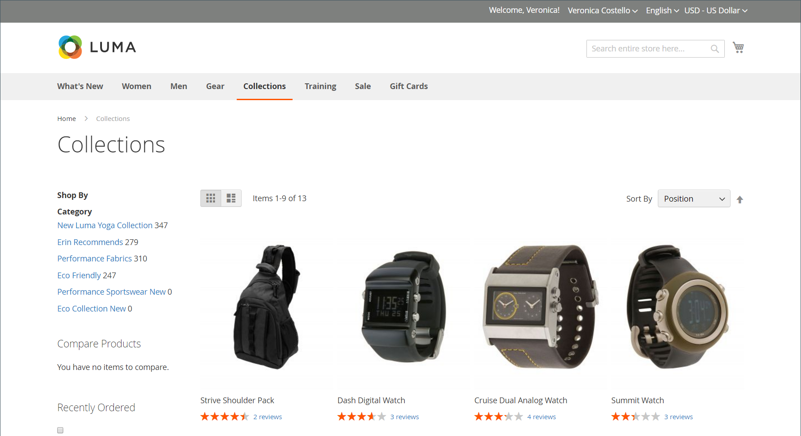

# Autorizzazioni categoria

{{ee-feature}}

L’accesso alle categorie può essere limitato a specifici gruppi di clienti o limitato completamente. Puoi controllare la visualizzazione dei prezzi dei prodotti, determinare quali gruppi di clienti possono aggiungere prodotti al carrello e specificare la pagina di destinazione.

>[!NOTE]
>
>Le autorizzazioni per categoria hanno un ambito globale e, se abilitate, limitano l’accesso a ogni categoria in base alle singole autorizzazioni. Per impostazione predefinita, le autorizzazioni per le categorie non sono abilitate.

Ad esempio, se vendi solo a clienti all&#39;ingrosso, puoi consentire a chiunque di sfogliare il catalogo, ma visualizzare i prezzi e consentire gli acquisti solo per gli acquirenti del gruppo di clienti _All&#39;ingrosso_. Nell’esempio seguente, solo gli utenti connessi hanno accesso alla categoria &quot;Raccolte&quot;. Per gli ospiti, l&#39;opzione &quot;Raccolte&quot; non viene visualizzata nel menu principale.

{width="600" zoomable="yes"}

Quando è attivata, nella pagina Categoria viene visualizzata una nuova sezione _[!UICONTROL Category Permissions]_&#x200B;che consente di applicare l&#39;accesso necessario per ogni categoria. Puoi aggiungere più regole di autorizzazione a ogni categoria per diversi siti web e gruppi di clienti.

## Passaggio 1: configurare le autorizzazioni per le categorie

>[!IMPORTANT]
>
>Tutte le [impostazioni delle autorizzazioni di gruppo](../configuration-reference/catalog/catalog.md#category-permissions) esistenti vengono ignorate da **_tutte_** categorie nel catalogo quando la funzionalità **_[!UICONTROL Shared Catalog]_** è abilitata. [!UICONTROL Shared Catalog] controlla completamente tutte le autorizzazioni di categoria nel catalogo quando è abilitato.

1. Nella barra laterale _Admin_, passa a **[!UICONTROL Stores]** > _[!UICONTROL Settings]_>**[!UICONTROL Configuration]**.

1. Nel pannello a sinistra, espandi **[!UICONTROL Catalog]** e scegli **[!UICONTROL Catalog]** sotto.

1. Espandere  nella sezione **[!UICONTROL Category Permissions]**.

   {width="600" zoomable="yes"}

   Per un elenco dettagliato di queste opzioni, vedere [Autorizzazioni categoria](../configuration-reference/catalog/catalog.md#category-permissions) nel _Riferimento configurazione_.

1. Imposta **[!UICONTROL Enable]** su `Yes`.

1. Completa le altre opzioni in base a ciò che desideri consentire o limitare sul tuo store (vedi le sezioni seguenti).

1. Al termine, fare clic su **[!UICONTROL Save Config]**.

1. Quando viene richiesto di aggiornare la cache, fare clic sul collegamento **[!UICONTROL Cache Management]** nel messaggio di sistema e seguire le istruzioni per aggiornare la cache.

### [!UICONTROL Allow Browsing Category]

Questa opzione è valida per tutte le categorie del [sito Web](../getting-started/websites-stores-views.md).

Per consentire ai membri di un **_gruppo di clienti specifico_** di sfogliare i prodotti di categoria, eseguire le operazioni seguenti:

1. Imposta **[!UICONTROL Allow Browsing Category]** su `Specified Customer Groups`.

1. Nella casella **[!UICONTROL Customer Groups]** selezionare ogni gruppo a cui è consentito sfogliare i prodotti della categoria.

   Per selezionare più gruppi, tenere premuto il tasto Ctrl (PC) o il tasto Comando (Mac) mentre si fa clic su ogni gruppo.

   {width="600" zoomable="yes"}

Per **_limitare l&#39;accesso e reindirizzare a una pagina di destinazione_**, eseguire le operazioni seguenti:

1. Imposta **[!UICONTROL Allow Browsing Category]** su `No, Redirect to Landing Page`.

1. Scegli **[!UICONTROL Landing Page]** dove vengono reindirizzati i visitatori.

   {width="600" zoomable="yes"}

   >[!NOTE]
   >
   >Sebbene l&#39;impostazione _[!UICONTROL Allow Browsing Category]_&#x200B;si applichi a tutte le categorie del sito Web, è possibile configurare una pagina di destinazione diversa per ogni visualizzazione Store.

### [!UICONTROL Display Product Prices]

Questa opzione è valida per tutte le categorie del [sito Web](../getting-started/websites-stores-views.md).

Per consentire solo ai membri di **_gruppi di clienti specifici_** di visualizzare il prezzo dei prodotti della categoria, eseguire le operazioni seguenti:

1. Imposta **[!UICONTROL Display Product Prices]** su `Yes, for Specified Customer Groups`.

1. Nella casella **[!UICONTROL Customer Groups]** selezionare ogni gruppo che può visualizzare il prezzo dei prodotti della categoria.

   Per selezionare più gruppi, tenere premuto il tasto Ctrl (PC) o il tasto Comando (Mac) mentre si fa clic su ogni gruppo.)

   {width="600" zoomable="yes"}

### [!UICONTROL Allow Adding to Cart]

Questa opzione è valida per tutte le categorie del [sito Web](../getting-started/websites-stores-views.md).

Per consentire solo ai membri di **_gruppi di clienti specifici_** di inserire prodotti di categoria nel carrello, eseguire le operazioni seguenti:

1. Imposta **[!UICONTROL Allow Adding to Cart]** su `Yes, for Specified Customer Groups`.

1. Nella casella **[!UICONTROL Customer Groups]** selezionare ogni gruppo che può aggiungere prodotti della categoria al carrello.

   Per selezionare più gruppi, tenere premuto il tasto Ctrl (PC) o il tasto Comando (Mac) mentre si fa clic su ogni gruppo.

   {width="600" zoomable="yes"}

### [!UICONTROL Disallow Catalog Search]

Imposta questa opzione per impedire ai membri di un gruppo di clienti specifico di utilizzare la funzione Ricerca nel catalogo. Si applica a tutte le categorie del [sito Web](../getting-started/websites-stores-views.md).

- Per consentire a **_solo i clienti connessi_** di utilizzare la ricerca nel catalogo, selezionare `NOT LOGGED IN`.

- Per consentire a **_solo gruppi di clienti specifici_** di utilizzare la ricerca nel catalogo, selezionare ogni gruppo da escludere dalla ricerca per categoria.

  Per selezionare più gruppi, tenere premuto il tasto Ctrl (PC) o il tasto Comando (Mac) mentre si fa clic su ogni gruppo.

  {width="600" zoomable="yes"}

## Passaggio 2: applicare le autorizzazioni per le categorie

1. Nella barra laterale _Admin_, passa a **[!UICONTROL Catalog]** > **[!UICONTROL Categories]**.

1. Nell&#39;albero delle categorie selezionare la categoria di destinazione.

1. Espandere  **[!UICONTROL Category Permissions]** nella pagina ed effettuare le seguenti operazioni:

   - Per creare una regola di autorizzazioni, fare clic su **[!UICONTROL New Permission]**.

     {width="600" zoomable="yes"}

   - Scegliere **[!UICONTROL Website]** e **[!UICONTROL Customer Group]** applicabili.

   - Imposta le singole autorizzazioni in base alle esigenze.

   >[!NOTE]
   >
   >Se l&#39;autorizzazione `Browsing Category` = `Deny` è impostata per qualsiasi categoria padre, non viene visualizzata nella [traccia delle breadcrumb](navigation-breadcrumb-trail.md) nella pagina della categoria figlio.

1. Al termine, fare clic su **[!UICONTROL Save]**.

>[!NOTE]
>
>Se sono impostate autorizzazioni **_Consenti_** per `Root Category`, queste verranno applicate automaticamente a tutte le sottocategorie e a tutti i prodotti all&#39;interno di `Catalog`. Se un prodotto è assegnato a più categorie e dispone di autorizzazioni **_Consenti_** per almeno una categoria, disporrà automaticamente delle stesse autorizzazioni **_Consenti_** per tutte le categorie assegnate.
