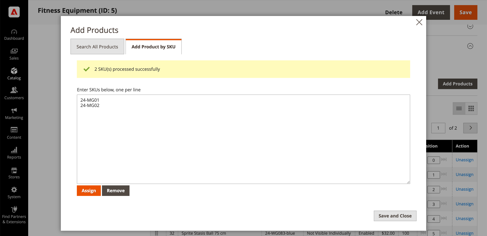

# Aggiungere e rimuovere prodotti di categoria

Dalla sezione [Prodotti nella categoria](categories-product-assignments.md) , un amministratore di store può aggiungere prodotti alla categoria. Questa sezione elenca tutti i prodotti assegnati alla categoria e visualizza **[!UICONTROL Add Product]** quando **[!UICONTROL Match products by rule]** è impostato su `No`.

{width="600" zoomable="yes"}

## Cerca prodotti da aggiungere

1. Il giorno _Amministratore_ barra laterale, vai a **[!UICONTROL Catalog]** > **[!UICONTROL Categories]**.

1. Nell&#39;albero delle categorie a sinistra, scegliere la categoria in cui si desidera aggiungere un prodotto.

1. Espandi  il _Prodotti nella categoria_ sezione.

1. Clic **[!UICONTROL Add Products]**.

1. Utilizzare _Ricerca per parola chiave_ o filtri per trovare i prodotti da aggiungere.

   {width="700" zoomable="yes"}

1. In _[!UICONTROL Assign]_, imposta l’opzione su `Yes` per ogni prodotto che desideri aggiungere.

   Per includere tutti i prodotti visualizzati, fai clic sulla freccia del menu nell’intestazione della colonna e scegli **[!UICONTROL Select All]**.

1. Per applicare le modifiche, fai clic su **[!UICONTROL Save and Close]**.

### Azioni

| Azione | Descrizione |
|--- |--- |
| [!UICONTROL Select All] | Seleziona la casella di controllo di tutti i record dell&#39;elenco. |
| [!UICONTROL Unselect All] | Deseleziona la casella di controllo di tutti i record dell&#39;elenco. |
| [!UICONTROL Select All on This Page] | Seleziona la casella di controllo dei record nella pagina corrente. |
| [!UICONTROL Deselect All on This Page] | Deseleziona la casella di controllo dei record nella pagina corrente. |

{style="table-layout:auto"}

## Aggiungi prodotti per SKU

1. Clic **[!UICONTROL Add Products]**

1. Seleziona la **[!UICONTROL Add Products by SKU]** scheda.

1. Inserisci gli SKU (uno per riga) e fai clic su **[!UICONTROL Assign]**.

   Per ignorare le modifiche, fai clic su **[!UICONTROL Remove]**.

   {width="700" zoomable="yes"}

1. Per applicare le modifiche, fai clic su **[!UICONTROL Save and Close]**.

## Rimuovere prodotti da una categoria

1. Il giorno _Amministratore_ barra laterale, vai a **[!UICONTROL Catalog]** > **[!UICONTROL Categories]**.

1. Nell&#39;albero delle categorie a sinistra, scegliere la categoria che si desidera modificare.

1. Espandi  il _[!UICONTROL Products in Category]_sezione.

1. Trovare i prodotti da rimuovere.

1. In _[!UICONTROL Actions]_, fare clic su **[!UICONTROL Unassign]**.

1. Per applicare le modifiche, fai clic su **[!UICONTROL Save]**.
