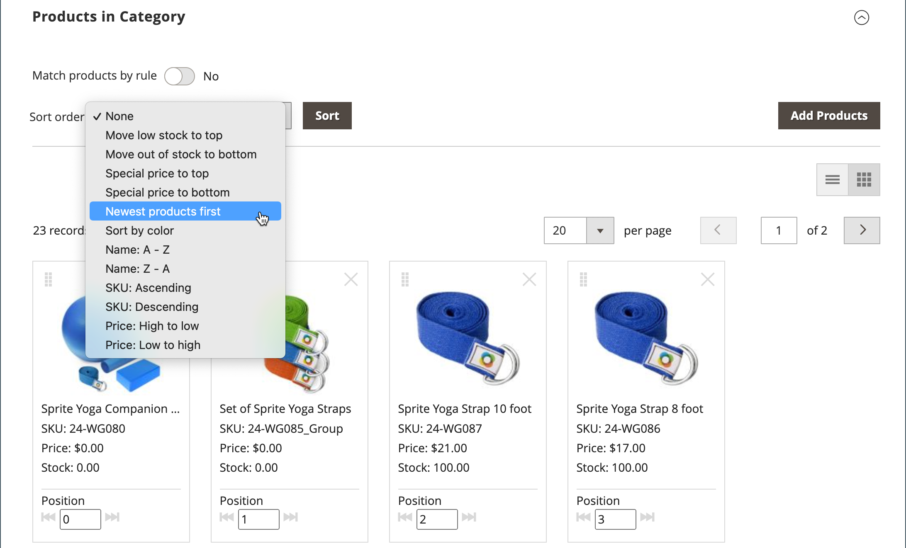

# Ordinare i prodotti di categoria

{{ee-feature}}

La posizione dei prodotti in una categoria può essere specificata manualmente trascinando i prodotti nella posizione desiderata o applicando un ordinamento predefinito. Per impostazione predefinita, i prodotti possono essere ordinati per livello di stock, età, colore, nome, SKU e prezzo. L&#39;ordinamento automatico sostituisce l&#39;ordinamento corrente e reimposta le posizioni di trascinamento impostate manualmente. L&#39;ordinamento dei colori e il livello minimo di scorte che possono essere richiesti per i prodotti da includere nell&#39;elenco sono impostati nella configurazione [Visual Merchandiser](../configuration-reference/catalog/visual-merchandiser.md).

>[!NOTE]
>
>Nelle pagine delle categorie, `Out of stock` prodotti sono sempre visualizzati **_dopo_** `In Stock` prodotti nell&#39;elenco dei prodotti con tutti i tipi di ordinamento.

È possibile impostare le opzioni delle categorie separatamente per ogni [visualizzazione dello store](../stores-purchase/stores.md#add-stores) per determinare la selezione dei prodotti, la loro posizione relativa nell&#39;elenco e gli attributi disponibili per le regole delle categorie. Tuttavia, nel catalogo sono presenti un ordinamento e una posizione di prodotto **_global_** e sono condivisi in tutte le [visualizzazioni dello store](../stores-purchase/store-views.md), gli store e i siti Web.

## Passaggio 1: impostare l’ambito della configurazione

1. Nella barra laterale _Admin_, passa a **[!UICONTROL Catalog]** > **[!UICONTROL Categories]**.

1. Se necessario, scegliere **[!UICONTROL Store View]** in cui applicare le impostazioni.

   Per un&#39;installazione in più store, l&#39;impostazione _[!UICONTROL Store View]_&#x200B;applica l&#39;ordinamento a tutte le visualizzazioni disponibili nell&#39;archivio.

1. Nell&#39;albero delle categorie a sinistra, scegliere la categoria che si desidera modificare.

   {width="700" zoomable="yes"}

## Passaggio 2: ordinare i prodotti

>[!NOTE]
>
>Quando si ordina una categoria in base a un attributo di prodotto, anche i prodotti con gli stessi valori di attributo vengono ordinati in base al rispettivo _[!UICONTROL Product ID]_&#x200B;in ordine crescente.

Nella sezione _[!UICONTROL Products in Category]_, fai clic sull&#39;icona dei riquadri (  ) per visualizzare i riquadri del prodotto in una griglia. Utilizzare il metodo manuale o automatico per ordinare i prodotti.

{width="600" zoomable="yes"}

### Metodo 1: ordinamento manuale

1. Imposta **[!UICONTROL Sort Order]** sulla tua preferenza.

   {width="600" zoomable="yes"}

1. Per applicare il nuovo ordinamento, fare clic su **[!UICONTROL Sort]**.

1. Per salvare l&#39;ordinamento, fare clic su **[!UICONTROL Save Category]**.

1. Quando richiesto, aggiorna eventuali indicizzatori non validi.

### Metodo 2: ordinamento automatico

1. Imposta **[!UICONTROL Match products by rule]** () su `Yes`.

1. Imposta **[!UICONTROL Automatic Sorting]** sulla tua preferenza.

1. Per creare una regola di categoria, seguire le istruzioni del passaggio successivo.

## Passaggio 3: creare una regola di categoria

1. Imposta **[!UICONTROL Match products by rule]** () su `Yes`.

1. Fare clic su **[!UICONTROL Add Condition]**.

1. Scegliere **[!UICONTROL Attribute]** che è la base della condizione.

1. Imposta **[!UICONTROL Operator]** su uno dei seguenti:

   - `Equal`
   - `Not equal`
   - `Greater than`
   - `Greater than or equal to`
   - `Less than`
   - `Less than or equal to`
   - `Contains`

1. Immettere il **[!UICONTROL Value]** appropriato.

   {width="600" zoomable="yes"}

1. Per aggiungere un&#39;altra condizione, fare clic su **[!UICONTROL Add Condition]** e ripetere il processo.

## Passaggio 4: salvare, aggiornare e verificare

1. Al termine, fare clic su **[!UICONTROL Save Category]**.

1. Quando viene richiesto di aggiornare la cache, fare clic su **[!UICONTROL Cache Management]** e aggiornare ogni cache non valida.

1. Nella vetrina, verifica che le regole di selezione, ordinamento e categoria del prodotto funzionino correttamente.

   Se è necessario apportare modifiche, modificarle e riprovare.
