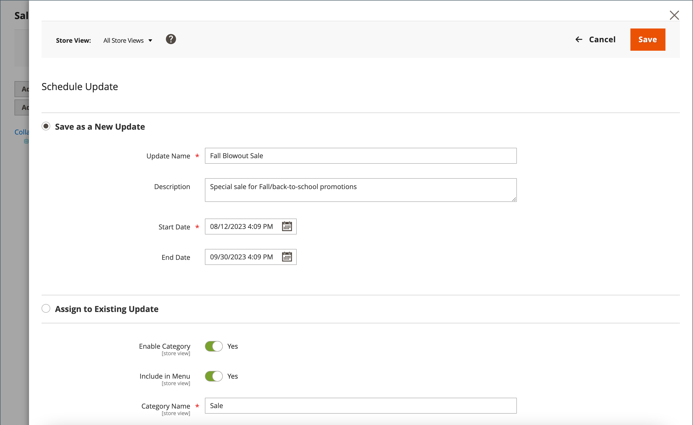

# Modifiche pianificate per le categorie

{{ee-feature}}

Gli aggiornamenti per categoria possono essere applicati secondo programma e raggruppati con altre modifiche al contenuto. Puoi creare una campagna in base alle modifiche pianificate per la categoria o applicare le modifiche a una campagna esistente. Per ulteriori informazioni, consulta [Staging dei contenuti](../content-design/content-staging.md).

>[!NOTE]
>
>Tutti gli aggiornamenti pianificati vengono applicati consecutivamente, il che significa che qualsiasi entità può avere un solo aggiornamento pianificato alla volta. Qualsiasi aggiornamento pianificato viene applicato a tutte le visualizzazioni dello store entro il relativo intervallo di tempo. Di conseguenza, un’entità non può avere più aggiornamenti pianificati per diverse visualizzazioni dello store contemporaneamente. Tutti i valori degli attributi di entità all’interno di tutte le visualizzazioni archivio, che non sono influenzati dall’aggiornamento pianificato corrente, vengono presi dai valori predefiniti e non dal precedente aggiornamento pianificato.

## Pianificare un aggiornamento per una categoria

1. Il giorno _Amministratore_ barra laterale, vai a **[!UICONTROL Catalog]** > **[!UICONTROL Categories]**.

1. Nell&#39;albero delle categorie a sinistra, scegliere la categoria da modificare.

1. In _Modifiche pianificate_ nella parte superiore della pagina, fai clic su **[!UICONTROL Schedule New Update]**.

   {width="600" zoomable="yes"}

1. Con il **[!UICONTROL Save as a New Update]** opzione selezionata, imposta i parametri di base per l&#39;aggiornamento:

   - Per **[!UICONTROL Update Name]**, immetti un nome per la nuova campagna di staging dei contenuti.

   - Inserisci una descrizione **[!UICONTROL Description]** dell’aggiornamento e come deve essere utilizzato.

   - Utilizza il calendario (  ) per scegliere il **[!UICONTROL Start Date]** e **[!UICONTROL End Date]** per la campagna.

   >[!IMPORTANT]
   >
   >Campagna **[!UICONTROL Start Date]** e **[!UICONTROL End Date]** deve essere definito utilizzando **_predefinito_** Fuso orario amministratore, convertito dal fuso orario locale di ciascun sito Web. Ad esempio, con più siti web in fusi orari diversi in cui desideri avviare una campagna basata su un fuso orario USA, devi pianificare un aggiornamento separato per ogni fuso orario locale. È possibile impostare **[!UICONTROL Start Date]** e **[!UICONTROL End Date]** per ogni, che viene convertito dal fuso orario del sito web locale al fuso orario predefinito dell’amministratore.

   {width="600" zoomable="yes"}

1. Apporta le modifiche necessarie all’aggiornamento pianificato.

1. Per visualizzare in anteprima le modifiche, fai clic su **[!UICONTROL Preview]** nella barra dei pulsanti in alto a destra.

1. Al termine, fai clic su **[!UICONTROL Save]**.

## Assegna a un aggiornamento esistente

1. Il giorno _Amministratore_ barra laterale, vai a **[!UICONTROL Catalog]** > **[!UICONTROL Categories]**.

1. Nell&#39;albero delle categorie a sinistra, scegliere la categoria da modificare.

1. In _Modifiche pianificate_ nella parte superiore della pagina, fai clic su **[!UICONTROL Schedule New Update]**.

1. Seleziona **[!UICONTROL Assign to Existing Campaign]**.

1. Nell’elenco, individua la campagna necessaria e fai clic su **[!UICONTROL Select]**.

1. Apporta le modifiche necessarie all’aggiornamento pianificato.

1. Al termine, fai clic su **[!UICONTROL Save]**.
