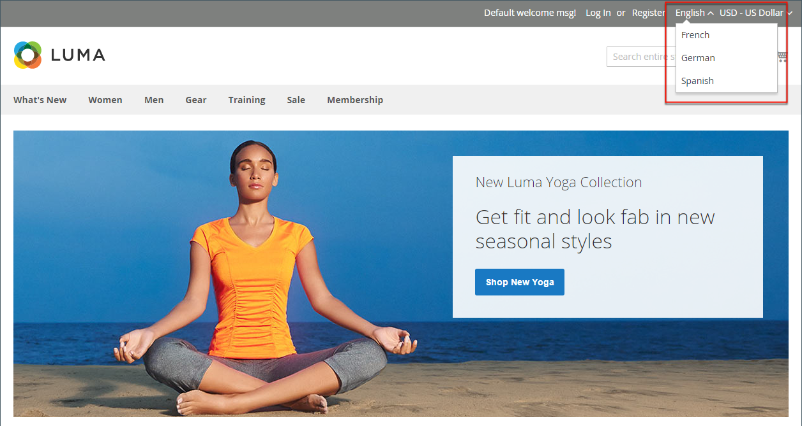

# Introduzione alla gestione del catalogo

Adobe Commerce e Magento Open Source utilizzano il termine _catalogo_ per fare riferimento al database dei prodotti nel suo complesso.

Una delle aree più importanti nella creazione e gestione del negozio è la creazione di prodotti e categorie. L&#39;amministratore fornisce diversi strumenti utili per la configurazione iniziale del negozio e per la manutenzione del negozio e l&#39;ottimizzazione dell&#39;attività.

>[!TIP]
>
>Inventory management per Adobe Commerce e Magento Open Source offre gli strumenti per gestire l’inventario dei prodotti. I commercianti con un singolo punto vendita in più magazzini, magazzini, ubicazioni di prelievo, corrieri diretti e altro ancora possono utilizzare queste funzioni per gestire le quantità per le vendite e gestire le spedizioni per completare gli ordini. Per ulteriori informazioni su queste funzioni e su come utilizzarle per gestire le scorte in più posizioni, vedere [Guida utente di Inventory management](../inventory-management/introduction.md).

## Ambito del catalogo

L’accesso ai dati del catalogo è determinato da diversi fattori, tra cui [ambito](../getting-started/websites-stores-views.md#scope-settings) configurazione del catalogo e la [categoria principale](category-root.md) che è assegnato al negozio. Il catalogo include i prodotti abilitati e disponibili per la vendita e i prodotti attualmente non in vendita.

Nelle vendite, il termine _catalogo_ di solito si riferisce a una selezione curata di prodotti che è disponibile per la vendita. Ad esempio, un negozio potrebbe avere un &quot;Catalogo primaverile&quot; e un &quot;Catalogo autunnale&quot;.

Analogamente al sommario di un catalogo stampato, il menu principale del negozio oppure _navigazione superiore_ — organizza i prodotti per categoria in modo che i clienti possano trovare facilmente ciò che desiderano. Il menu principale si basa su _categoria principale_, che è un contenitore per il menu assegnato all’archivio. Poiché le opzioni di menu specifiche sono definite a livello della vista archivio, ogni vista può avere un menu principale diverso basato sulla stessa categoria principale. All’interno di ogni menu, puoi offrire una selezione curata di prodotti adatti al negozio.

{width="550"}

## Ambito del prodotto

Per le installazioni con più siti Web, store e visualizzazioni, il [ambito](../getting-started/websites-stores-views.md#scope-settings) Questa impostazione determina la posizione in cui i prodotti sono disponibili per la vendita e le informazioni sul prodotto disponibili per ciascuna visualizzazione del negozio. Inizialmente, tutti i prodotti creati vengono pubblicati nella visualizzazione predefinita per siti Web, store e store.

{width="550"}

Se disponi di un solo archivio con la visualizzazione predefinita, puoi eseguirlo in [modalità single store](../getting-started/websites-stores-views.md#single-store-mode) per nascondere le impostazioni dell&#39;ambito. Tuttavia, se lo store dispone di più visualizzazioni, sotto il nome di ciascun campo viene visualizzato un indicatore di ambito.

- Per modificare le informazioni sul prodotto per una visualizzazione specifica, utilizzare _Visualizzazione store_ nell&#39;angolo superiore sinistro per scegliere la visualizzazione. Controlli aggiuntivi diventano disponibili per qualsiasi campo che può essere modificato a livello di visualizzazione punto vendita.

- Per definire l&#39;ambito di un prodotto in un&#39;installazione multisito, vedere [Prodotto nei siti Web](settings-basic-websites.md) sezione delle informazioni sul prodotto.

Il processo di modifica di un prodotto per una visualizzazione store è simile all&#39;aggiunta di un livello di informazioni sul prodotto specifico per la visualizzazione.

È possibile modificare o assegnare prodotti solo per il sito per il quale si dispone delle autorizzazioni, non per tutti i siti a cui il prodotto è assegnato.

Anche se il _Spagnolo_ visualizzazione store è selezionata nell&#39;esempio seguente, le informazioni sul prodotto vengono ancora visualizzate nella lingua originale della visualizzazione store predefinita. Per tradurre le informazioni sul prodotto, devi passare al _Spagnolo_ archiviare la visualizzazione e tradurre i campi di testo, ad esempio il titolo del prodotto, la descrizione e i metadati. Per ulteriori informazioni, consulta [Localizzare i prodotti](../stores-purchase/store-localize.md#localize-products).

## Modificare un prodotto per una visualizzazione diversa

>[!NOTE]
>
>Il _Tutte le visualizzazioni dello store_ l’ambito è disabilitato per gli utenti amministratori che sono limitati a un ambito specifico quando il prodotto viene pubblicato anche al di fuori dell’ambito consentito. Il primo ambito disponibile per la modifica è selezionato per impostazione predefinita perché gli utenti con restrizioni non possono eseguire _globale_ azioni o azioni che influiscono su ambiti ai quali non hanno accesso.

1. Nell&#39;angolo in alto a sinistra, imposta **[!UICONTROL Store View]** alla vista specifica da modificare.

1. Per confermare la modifica dell’ambito, fai clic su **[!UICONTROL OK]**.

1. Aggiorna il campo con il nuovo valore per la vista Store.

   Sotto qualsiasi campo modificabile per la visualizzazione Store viene visualizzata una casella di controllo. Per sostituire il valore predefinito, deseleziona il **Usa valore predefinito** casella di controllo.

   {width="600" zoomable="yes"}

1. Al termine, fai clic su **[!UICONTROL Save]**.

1. Nell&#39;angolo in alto a sinistra, imposta **[!UICONTROL Store View]** torna all&#39;impostazione predefinita.

1. Per verificare la modifica nel tuo archivio, effettua le seguenti operazioni:

   - Nell’angolo in alto a destra, fai clic su _Amministratore_ freccia del menu e scegliere **[!UICONTROL Customer View]**.

     {width="600" zoomable="yes"}

   - Nell&#39;angolo superiore destro del negozio, impostare **[!UICONTROL Language Chooser]** nella visualizzazione punto vendita del prodotto modificato e individuare il prodotto modificato per la visualizzazione.

     {width="700" zoomable="yes"}
