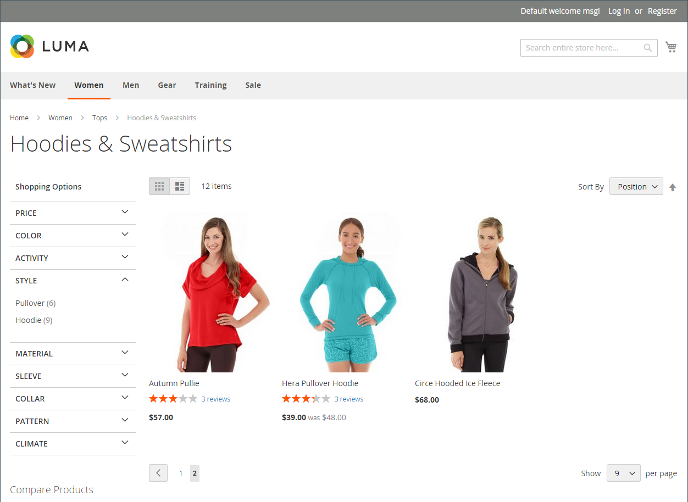
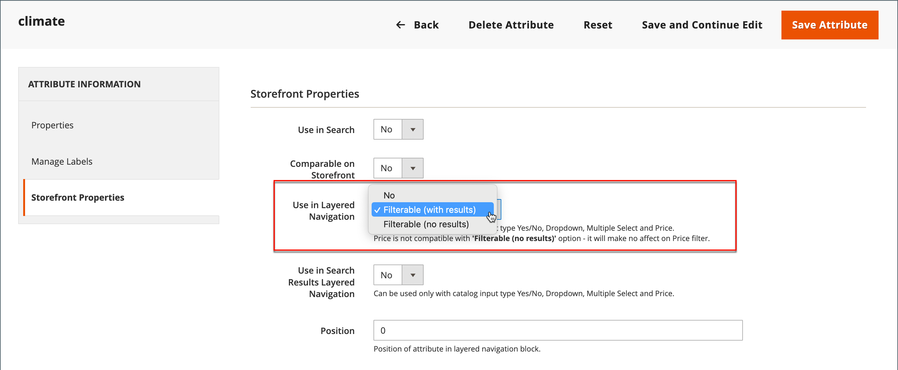

# Navigazione a livelli

>[!NOTE]
>
>La navigazione a livelli standard descritta in questa sezione è diversa dalla navigazione filtrata di Live Search con [facet](https://experienceleague.adobe.com/en/docs/commerce/live-search/live-search-admin/facets/facets).

La navigazione a livelli consente di trovare facilmente i prodotti in base alla categoria, alla fascia di prezzo o a qualsiasi altro attributo disponibile. La navigazione a livelli viene in genere visualizzata nella colonna sinistra dei risultati di ricerca e delle pagine delle categorie e talvolta nella home page. La navigazione standard include un elenco _Acquista per_ di categorie e fascia di prezzo. Puoi configurare la visualizzazione della navigazione su più livelli, compreso il conteggio dei prodotti e la gamma dei prezzi.

{width="700" zoomable="yes"}

## Attributi filtrabili

>[!NOTE]
>
>I requisiti degli attributi filtrabili descritti in questo argomento sono diversi per [Live Search](https://experienceleague.adobe.com/en/docs/commerce/live-search/overview). Per ulteriori informazioni, consulta [Facet](https://experienceleague.adobe.com/en/docs/commerce/live-search/live-search-admin/facets/facets).

La navigazione a livelli può essere utilizzata per cercare i prodotti per categoria o per attributo. Ad esempio, quando un acquirente sceglie la categoria Mens/Short dalla navigazione superiore, i risultati iniziali includono tutti i prodotti della categoria. L’elenco può essere filtrato ulteriormente scegliendo uno stile, un clima, un colore, un materiale, un motivo o un prezzo specifico (o una combinazione di valori). Gli attributi filtrabili vengono visualizzati in una sezione espansa che elenca ogni valore di attributo. Come opzione, l’elenco dei prodotti con risultati corrispondenti può essere configurato per includere prodotti con o senza corrispondenza.

Le proprietà dell’attributo, combinate con il tipo di input del prodotto, determinano gli attributi che possono essere utilizzati per la navigazione su più livelli. La navigazione a livelli è disponibile solo per le categorie [_ancoraggio_](categories-display-settings.md), ma può essere aggiunta anche alle pagine dei risultati di ricerca. La proprietà **Catalog Input Type per il proprietario dell&#39;archivio** di ciascun attributo deve essere impostata su `Yes/No`, `Dropdown`, `Multiple Select` o `Price`. Per rendere gli attributi filtrabili, la proprietà **Use in Layered Navigation** di ciascuno deve essere impostata su `Filterable (with results)` o `Filterable (no results)`.

_Esempio: attributi filtrabili con risultati_

{width="700" zoomable="yes"}

_Esempio: valori campione filtrabili visualizzati senza risultato_

{width="700" zoomable="yes"}

Le istruzioni seguenti mostrano come impostare una navigazione a livelli di base con attributi filtrabili. Per informazioni sulla navigazione avanzata su più livelli con fasce di prezzo, vedere [Navigazione prezzi](navigation-layered.md#configure-price-navigation).

## Passaggio 1: impostare le proprietà dell’attributo

1. Nella barra laterale _Admin_, passa a **[!UICONTROL Stores]** > _[!UICONTROL Attributes]_>**[!UICONTROL Product]**.

1. Sfoglia o utilizza la ricerca filtrata per trovare un attributo nell’elenco e aprirlo in modalità di modifica.

   {width="700" zoomable="yes"}

1. Nel pannello a sinistra, scegli **[!UICONTROL Storefront Properties]** e imposta **[!UICONTROL Use In Layered Navigation]** su uno dei seguenti:

   - `Filterable (with results)` - La navigazione a livelli include solo i filtri per i quali è possibile trovare prodotti corrispondenti. Qualsiasi valore di attributo che già si applica a tutti i prodotti mostrati nell’elenco deve comunque essere visualizzato come filtro disponibile. I valori degli attributi con un conteggio di zero (0) corrispondenze con i prodotti vengono omessi dall’elenco dei filtri disponibili. L’elenco filtrato include solo i prodotti che corrispondono al filtro. L’elenco dei prodotti viene aggiornato solo se i filtri selezionati modificano ciò che viene visualizzato.

   - `Filterable (no results)` - La navigazione a livelli visualizza i filtri per tutti i valori di attributo disponibili e i relativi conteggi di prodotti, anche quando esistono prodotti con zero corrispondenze (0). Se il valore dell’attributo è un campione, il filtro viene visualizzato ma è barrato. Questa opzione non supporta il filtro a livelli di prezzo e non influisce sui filtri di prezzo.

1. Imposta **[!UICONTROL Use In Search Results Layered Navigation]** su `Yes`.

   {width="600" zoomable="yes"}

1. Ripetere questi passaggi per ogni attributo che si desidera includere nella navigazione a livelli.

>[!NOTE]
>
>- Se l&#39;impostazione _[!UICONTROL Use in Search]_è impostata su `No`, l&#39;impostazione_[!UICONTROL Use in Search Results Layered Navigation]_ non viene visualizzata In questo caso, l&#39;attributo product non viene utilizzato nella ricerca, indipendentemente dall&#39;impostazione [!UICONTROL Use in Layered Navigation].
>
>- Il campo [!UICONTROL Position] è oscurato per impostazione predefinita. È necessario salvare l&#39;attributo prima di poter modificare questa impostazione.

## Passaggio 2: rendere la categoria un ancoraggio

1. Nella barra laterale _Admin_, passa a **[!UICONTROL Catalog]** > **[!UICONTROL Categories]**.

1. Nella struttura delle categorie selezionare la categoria in cui si desidera utilizzare la navigazione a livelli.

1. Espandere  della sezione **[!UICONTROL Display Settings]** e impostare **[!UICONTROL Anchor]** su `Yes`.

   {width="600" zoomable="yes"}

1. Fare clic su **[!UICONTROL Save]**.

## Passaggio 3: verificare i risultati

Per verificare l’impostazione, visita il negozio e passa alla categoria dal menu principale. La selezione degli attributi filtrabili viene visualizzata nella navigazione a livelli della pagina della categoria.

Cerca, filtra e controlla i prodotti visualizzati.

## Rimuovere i valori degli attributi filtrabili dalla navigazione a livelli

La navigazione a livelli include filtri per tutti i valori di attributo disponibili e i relativi conteggi di prodotti, inclusi i prodotti con zero (0) corrispondenze di prodotti (come mostrato nell’immagine seguente).

{width="700" zoomable="yes"}

Questo risultato può rendere difficile per i clienti selezionare un prodotto preferito e non è necessario visualizzare i valori degli attributi &#x200B;&#x200B;con 0 prodotti nel front-end.

Per rimuovere i valori degli attributi filtrabili con 0 prodotti dalla navigazione a livelli, attenersi alla procedura descritta di seguito.

1. Nella barra laterale _Admin_, passa a **[!UICONTROL Stores]** > _[!UICONTROL Attributes]_>**[!UICONTROL Product]**.

1. Sfoglia o utilizza la ricerca filtrata per trovare un attributo nell’elenco e aprirlo in modalità di modifica.

1. In _[!UICONTROL Attribute Information]_fare clic su **[!UICONTROL Storefront Properties]**.

1. Per **[!UICONTROL Layered Navigation]**, scegliere `Filterable (with results)`.

   {width="600" zoomable="yes"}

1. Fare clic su **[!UICONTROL Save Attribute]**.

## Navigazione prezzi

>[!NOTE]
>
>La configurazione della navigazione del prezzo descritta in questa sezione è diversa dalla navigazione filtrata di Live Search con [facet](https://experienceleague.adobe.com/en/docs/commerce/live-search/live-search-admin/facets/facets).

La navigazione dei prezzi può essere utilizzata per distribuire i prodotti in base alla fascia di prezzo in una navigazione a più livelli. È inoltre possibile suddividere ogni intervallo in intervalli. Esistono alcuni modi per calcolare la navigazione dei prezzi:

- Automatico (equalizza intervalli prezzi)
- Automatico (Equalizza conteggi prodotti)
- Manuale

>[!BEGINSHADEBOX]

Quando si filtra in base al prezzo in una navigazione a più livelli, Adobe Commerce utilizza il prezzo più basso degli articoli secondari di un prodotto configurabile. Di conseguenza, un prodotto configurabile viene visualizzato solo nella fascia di prezzo più bassa dei suoi prodotti secondari, anche se alcuni prodotti secondari hanno prezzi più elevati.

>[!ENDSHADEBOX]

Con i primi due metodi, i passaggi di navigazione vengono calcolati automaticamente. Il metodo manuale consente di specificare un limite di divisione per gli intervalli di prezzo. L’esempio seguente mostra la differenza tra i passaggi di navigazione del prezzo 10 e 100.

La suddivisione iterativa fornisce la migliore distribuzione dei prodotti tra le fasce di prezzo. Con la suddivisione iterativa, dopo aver scelto l&#39;intervallo tra 0,00 e 99 dollari, il cliente può analizzare in profondità diversi sottogruppi di prezzi. La suddivisione dell&#39;intervallo di prezzi si interrompe quando il numero di prodotti raggiunge la soglia impostata dal limite di divisione intervallo.

## Esempio: Passaggi di navigazione del prezzo

| Prezzo Incrementato di 10 | Prezzo Incrementato di 100 |
|----------|--------|
| 20,00 - 29,99 $ (1) | 0,00 - 99,99 $ (4) |
| $ 30,00 - $ 39,99 (2) | $100 - $199,99 (5) |
| $ 70,00 - $ 79,99 (1) | $400,00 - $499,99 (2) |
| $100,00 - $109,99 (1) | $700,00 e versioni successive (1) |
| $120,00 - $129,99 (2) |   |
| $150,00 - $159,99 (1) |   |
| $180,00 - $189,99 (1) |   |
| $420,00 - $429,99 (1) |   |
| $440,00 - $449,99 (1) |   |
| $710,00 e versioni successive (1) |   |

{style="table-layout:auto"}

## Configurare la navigazione del prezzo

>[!IMPORTANT]
>
>Per visualizzare correttamente i prodotti e i relativi prezzi in base a _filtri di prezzo_ nella navigazione a livelli, assicurarsi che le impostazioni per la visualizzazione del prezzo nella [configurazione IVA](../configuration-reference/sales/tax.md) abbiano lo stesso valore (`Excluding Tax` **o** `Including Tax`). Per _[!UICONTROL Calculation Settings]_, controlla il valore **[!UICONTROL Catalog Prices]**. E per_[!UICONTROL Price Display Settings]_, controlla il valore **[!UICONTROL Display Product Prices in Catalog]**. Se questi hanno valori diversi, i filtri dei prezzi nella navigazione a livelli potrebbero non filtrare e ordinare correttamente i prodotti in base al prezzo.

1. Nella barra laterale _Admin_, passa a **[!UICONTROL Stores]** > _[!UICONTROL Settings]_>**[!UICONTROL Configuration]**.

1. Nel pannello a sinistra, espandi **[!UICONTROL Catalog]** e scegli **[!UICONTROL Catalog]** sotto.

1. Espandi  nella sezione _Navigazione con livelli_.

   Per impostazione predefinita, **[!UICONTROL Display Product Count]** è impostato su `Yes`. Se necessario, deselezionare la casella di controllo **[!UICONTROL Use system value]** per modificare questa impostazione.

   {width="600" zoomable="yes"}

   Per un elenco dettagliato di queste opzioni di configurazione, vedi [Navigazione a livelli](../configuration-reference/catalog/catalog.md#layered-navigation) nella _Guida di riferimento alla configurazione_.

1. Impostare **[!UICONTROL Price Navigation Steps Calculation]** per uno dei metodi delle sezioni seguenti.

1. Al termine, fare clic su **[!UICONTROL Save Config]**.

### Metodo 1: Automatico (equalizza intervalli di prezzi)

Lascia **[!UICONTROL Price Navigation Steps Calculation]** impostato su `Automatic (Equalize Price Ranges)` (impostazione predefinita). Questa impostazione utilizza l’algoritmo standard per la navigazione del prezzo.

### Metodo 2: Automatico (equalizza conteggi prodotti)

>[!TIP]
>
>Se necessario, deselezionare la casella di controllo **[!UICONTROL Use system value]** per modificare le impostazioni.

1. Imposta **[!UICONTROL Price Navigation Steps Calculation]** su `Automatic (equalize product counts)`.

1. Per visualizzare un solo prezzo quando più prodotti hanno lo stesso prezzo, impostare **[!UICONTROL Display Price Interval as One Price]** su `Yes`.

1. Per **[!UICONTROL Interval Division Limit]**, immettere la soglia per il numero di prodotti compresi in un intervallo di prezzi.

   L’intervallo non può essere ulteriormente suddiviso oltre questo limite. Il valore predefinito è `9`.

   {width="600" zoomable="yes"}

### Metodo 3: manuale

>[!NOTE]
>
>Se necessario, deselezionare la casella di controllo **[!UICONTROL Use system value]** per modificare le impostazioni.

1. Imposta **[!UICONTROL Price Navigation Steps Calculation]** su `Manual`.

1. Immettere un valore che determina **[!UICONTROL Default Price Navigation Step]**.

1. Immetti il **[!UICONTROL Maximum Number of Price Intervals]** consentito, fino a `100`.

   {width="600" zoomable="yes"}

## Configurare la navigazione su più livelli

>[!NOTE]
>
>La navigazione a livelli standard descritta in questa sezione è diversa dalla navigazione filtrata di Live Search con [facet](https://experienceleague.adobe.com/en/docs/commerce/live-search/live-search-admin/facets/facets).

La configurazione della navigazione a livelli determina se un conteggio dei prodotti viene visualizzato tra parentesi dopo ogni attributo e la dimensione del calcolo del passaggio utilizzato nella navigazione dei prezzi.

1. Nella barra laterale _Admin_, passa a **[!UICONTROL Stores]** > _[!UICONTROL Settings]_>**[!UICONTROL Configuration]**.

1. Nel pannello a sinistra, espandi la sezione _[!UICONTROL Catalog]_e scegli **[!UICONTROL Catalog]**sotto.

1. Espandere la sezione _[!UICONTROL Layered Navigation]_.

   >[!NOTE]
   >
   >Se necessario, deselezionare la casella di controllo **[!UICONTROL Use system value]** per modificare le impostazioni.

1. Per visualizzare il numero di prodotti trovati per ogni attributo, impostare **[!UICONTROL Display Product Count]** su `Yes`.

1. Imposta **[!UICONTROL Price Navigation Step Calculation]** su `Automatic (equalize price ranges)`.

1. Al termine, fare clic su **[!UICONTROL Save Config]**.
