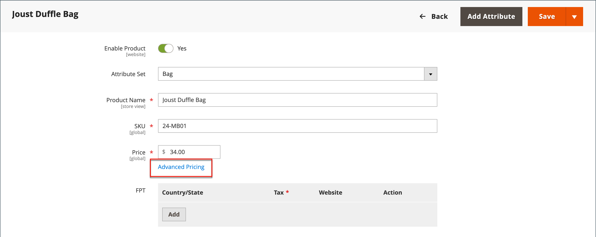

# Prezzi avanzati

Adobe Commerce e Magento Open Source supportano varie opzioni di prezzo che è possibile utilizzare per le promozioni o per soddisfare i requisiti minimi di prezzo pubblicizzati dal produttore. Le modifiche al prezzo del prodotto possono essere apportate secondo il programma o in base alla regola del prezzo applicata a livello di prodotto o nel carrello.

Gestisci i prezzi dei tuoi prodotti con prezzi avanzati per offrire ai clienti tariffe migliori che incoraggino i consumatori a spendere di più, indirizzino il traffico verso il tuo sito e liberino le vecchie scorte.

Le impostazioni di _[!UICONTROL Advanced Pricing]_definiscono le condizioni necessarie per i prezzi speciali disponibili per un gruppo di clienti specifico o un catalogo condiviso. I prezzi avanzati possono essere applicati a prodotti semplici, virtuali, scaricabili e in bundle. Per applicare prezzi scontati ad altri tipi di prodotti, utilizzare una [regola prezzo catalogo](../merchandising-promotions/price-rules-catalog.md). Per ulteriori informazioni, vedere [Ambito prezzo](catalog-price-scope.md).

I dati di determinazione prezzi avanzata vengono sincronizzati con le pagine dei prodotti. Ad esempio, se si aggiorna una quantità di prezzo livello, il sistema aggiorna il valore nella pagina del prodotto.

 (disponibile solo con [Adobe Commerce B2B](./b2b/../introduction.md)) Se si utilizzano cataloghi condivisi, i dati di determinazione prezzi avanzati vengono sincronizzati sia con le pagine dei prodotti che con i cataloghi condivisi. Ad esempio, se aggiorni una quantità di prezzo livello, il sistema aggiorna il valore nel catalogo condiviso e nella pagina del prodotto. Qualsiasi prezzo personalizzato indicato nel catalogo condiviso ha la priorità rispetto alla determinazione dei prezzi per gruppo di clienti. Consulta anche [Impostare i prezzi e la struttura del catalogo condiviso](https://experienceleague.adobe.com/docs/commerce-admin/b2b/shared-catalogs/define/catalog-shared-pricing-structure.html) nella _Guida B2B di Adobe Commerce_.

{width="600" zoomable="yes"}

## Accedere alle opzioni di prezzo avanzate

1. Apri il prodotto in modalità di modifica.

1. In **[!UICONTROL Price]**, fare clic su **[!UICONTROL Advanced Pricing]**.

1. Segui le istruzioni per il tipo di prezzo avanzato necessario.

   - [Prezzo di gruppo](product-price-group.md)

   - [Prezzo speciale](product-price-special.md)

   - [Prezzo livello](product-price-tier.md)

   - [Prezzo minimo annunciato](product-price-minimum-advertised.md)

## Riferimento pagina

### [!UICONTROL Special Price]

Per offrire un prezzo scontato durante un periodo di tempo specificato o una campagna pianificata, immettere il prezzo speciale. Quando è disponibile un prezzo speciale, il prezzo di vendita al dettaglio viene barrato e il prezzo speciale appare di seguito in grassetto.

#### [!UICONTROL Special Price From] date

{{ce-feature}}

| Campo | Descrizione |
| ---- | ----------- |
| [!UICONTROL From] | Imposta la prima data in cui è disponibile il prezzo speciale. È possibile immettere la data o selezionarla dal calendario. |
| [!UICONTROL To] | Imposta l&#39;ultima data in cui è disponibile il prezzo speciale. È possibile immettere la data o selezionarla dal calendario. |

{style="table-layout:auto"}

### [!UICONTROL Cost]

Inserire il costo effettivo dell&#39;articolo.

### [!UICONTROL Customer Group Price]

{width="600" zoomable="yes"}

Imposta prezzi promozionali e di livello per gruppi di clienti specifici.

| Elemento | Descrizione |
| ---- | ----------- |
| [!UICONTROL Website] | Identifica il sito Web in cui si applica la regola del prezzo di gruppo. Questa opzione viene visualizzata solo se l&#39;installazione include più siti Web. |
| [!UICONTROL Customer Group] | (Obbligatorio) Identifica il gruppo di clienti idoneo a ricevere il prezzo dello sconto. Quando si modifica un valore in un campo di gruppo o di catalogo, la riga di prezzo personalizzata corrispondente che corrisponde all&#39;impostazione precedente viene eliminata dal catalogo condiviso.  **[!UICONTROL ALL GROUPS]**- Applica la regola a tutti i gruppi di clienti. **[!UICONTROL NOT LOGGED IN]** - Applica la regola agli ospiti e ai clienti che non hanno effettuato l&#39;accesso ai loro account. |
| [!UICONTROL Quantity] | Specifica la quantità necessaria per ricevere un prezzo livello. |
| [!UICONTROL Price] | (Obbligatorio) Specifica un prezzo di prodotto fisso o scontato per i membri del gruppo di clienti all&#39;interno del sito Web specifico. Opzioni:  **[!UICONTROL Fixed]**- (Predefinito) Il prezzo dello sconto viene immesso come valore decimale fisso. Immettere ad esempio `9.99` come prezzo scontato. **[!UICONTROL Discount]** - Il prezzo dello sconto viene immesso come percentuale (%) del prezzo del prodotto di base. Ad esempio, immettere `10` per uno sconto del 10%. |
|  | Elimina la regola corrente. |
| **[!UICONTROL Add]** | Inserisce un&#39;altra riga per una nuova regola. |

{style="table-layout:auto"}

### [!UICONTROL Catalog and Tier Price]

Imposta prezzi promozionali e di livello per cataloghi condivisi e gruppi di clienti specifici.

{{b2b-feature}}

{width="600" zoomable="yes"}

| Elemento | Descrizione |
|----|-----------|
| [!UICONTROL Website] | Identifica il sito Web in cui si applica la regola del prezzo di gruppo. Questa opzione viene visualizzata solo se l&#39;installazione include più siti Web.  **_Importante:_**ALso selezionare_ Sito Web_ nella configurazione [Ambito prezzo catalogo](catalog-price-scope.md), altrimenti vengono visualizzati i prezzi avanzati impostati per **tutti** siti Web. |
| [!UICONTROL Group or Catalog] | (Obbligatorio) Identifica il gruppo di clienti o il catalogo condiviso idoneo a ricevere il prezzo dello sconto. Quando si modifica un valore in un campo di gruppo o di catalogo, la riga di prezzo personalizzata corrispondente che corrisponde all&#39;impostazione precedente viene eliminata dal catalogo condiviso.  **[!UICONTROL ALL GROUPS]**- Applica la regola a tutti i gruppi di clienti. Il valore non è applicato al catalogo condiviso e le modifiche nei dati di determinazione prezzi avanzata non sono sincronizzate con il catalogo condiviso. **[!UICONTROL NOT LOGGED IN]** - Applica la regola agli ospiti e ai clienti che non hanno effettuato l&#39;accesso ai propri account. **[!UICONTROL Shared Catalogs]**- Applica la regola a un catalogo condiviso specifico. |
| Quantità | Specifica la quantità necessaria per ricevere un prezzo livello. |
| [!UICONTROL Price] | (Obbligatorio) Specifica un prezzo di prodotto fisso o scontato per i membri del gruppo di clienti all&#39;interno del sito Web specifico. Opzioni:  **[!UICONTROL Fixed]**- (Predefinito) Il prezzo dello sconto viene immesso come valore decimale fisso. Immettere ad esempio `9.99` come prezzo scontato. **[!UICONTROL Discount]** - Il prezzo dello sconto viene immesso come percentuale (%) del prezzo del prodotto di base. Ad esempio, immettere `10` per uno sconto del 10%. |
|  | Elimina la regola corrente. |
| **[!UICONTROL Add]** | Inserisce un&#39;altra riga per una nuova regola. |

{style="table-layout:auto"}

### [!UICONTROL Minimum Advertised Price]

Il prezzo minimo pubblicizzato (MAP) per il prodotto.

### [!UICONTROL Display Actual Price]

Determina dove il prezzo effettivo del prodotto è visibile al cliente.

| Elemento | Descrizione |
|----|-----------|
| [!UICONTROL Use Config] | Utilizza l’impostazione di configurazione corrente per la visualizzazione del prezzo. |
| [!UICONTROL On Gesture] | Visualizza il prezzo effettivo del prodotto in un popup, in risposta a _Fai clic per il prezzo_ o _Cos&#39;è?_ collegamento. |
| [!UICONTROL In Cart] | Visualizza il prezzo effettivo del prodotto nel carrello. |
| [!UICONTROL Before Order Confirmation] | Visualizza il prezzo effettivo del prodotto al termine del processo di pagamento, immediatamente prima dell&#39;invio dell&#39;ordine. |

{style="table-layout:auto"}
