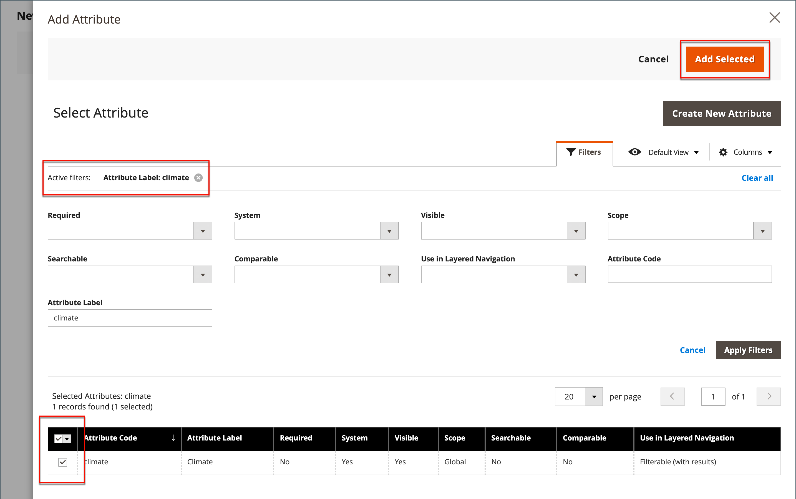

# Aggiungere attributi a un prodotto

Anche se gli attributi vengono gestiti principalmente dal menu [Archivi](../stores-purchase/stores-menu.md), è possibile aggiungere al volo nuovi attributi __ mentre si lavora su un prodotto. Puoi scegliere dall’elenco degli attributi esistenti o creare un attributo. Il nuovo attributo viene aggiunto al [set di attributi](../catalog/attribute-sets.md) su cui è basato il prodotto.

## Passaggio 1: aggiungere un attributo

1. Apri il prodotto in modalità di modifica.

1. Nell&#39;angolo superiore destro fare clic su **[!UICONTROL Add Attribute]**.

   {width="600" zoomable="yes"}

1. Per aggiungere un attributo esistente al prodotto, utilizzare i [controlli filtro](../getting-started/admin-grid-controls.md) per trovare l&#39;attributo nella griglia ed eseguire le operazioni seguenti:

   - Selezionare la casella di controllo nella prima colonna di ogni attributo da aggiungere.

   - Fare clic su **[!UICONTROL Add Selected]**.

   {width="600" zoomable="yes"}

1. Per definire un nuovo attributo, fare clic su **[!UICONTROL Create New Attribute]** e completare gli elementi nel passaggio 2.

## Passaggio 2: descrivere le proprietà dell’attributo di base

{width="600" zoomable="yes"}

1. In _[!UICONTROL Attribute Properties]_, immettere **[!UICONTROL Attribute Label]**&#x200B;per identificare l&#39;attributo.

1. Impostare **[!UICONTROL Catalog Input Type for Store Owner]** sul tipo di [controllo di input](attributes-input-types.md) da utilizzare per l&#39;immissione dei dati.

   Se l&#39;attributo viene utilizzato per un [prodotto configurabile](product-create-configurable.md), scegliere `Dropdown`. Quindi, impostare **[!UICONTROL Required]** su `Yes`.

1. Per i tipi di input `Dropdown` e `Multiple Select`, eseguire le operazioni seguenti:

   - In **[!UICONTROL Values]**, fare clic su **[!UICONTROL Add Value]**.

   - Immettere il primo valore da visualizzare nell&#39;elenco.

     Puoi immettere un valore per l’amministratore e una traduzione del valore per ogni visualizzazione store. Se disponi di una sola visualizzazione store, puoi immettere solo il valore Amministratore, che viene utilizzato anche per la vetrina.

   - Fare clic su **[!UICONTROL Add Value]** e ripetere il passaggio precedente per ogni opzione da includere nell&#39;elenco.

   - Selezionare **[!UICONTROL Is Default]** per utilizzare l&#39;opzione come valore predefinito.

   {width="600" zoomable="yes"}

1. Se si desidera richiedere al cliente di scegliere un&#39;opzione prima di acquistare il prodotto, impostare **[!UICONTROL Required]** su `Yes`.

## Passaggio 3: descrivere le proprietà avanzate (facoltativo)

{width="600" zoomable="yes"}

1. Immettere un **[!UICONTROL Attribute Code]** univoco in caratteri minuscoli e senza spazi.

1. Impostare **[!UICONTROL Scope]** per indicare la posizione nella gerarchia dell&#39;archivio in cui è possibile utilizzare l&#39;attributo.

   Se l&#39;attributo viene utilizzato per un [prodotto configurabile](product-create-configurable.md), scegliere `Global`.

1. Se questo attributo è valido solo per questo prodotto, impostare **[!UICONTROL Unique Value]** su `Yes`.

1. Per eseguire un test di validità dei dati immessi in un campo di testo, impostare **[!UICONTROL Input Validation for Store Owner]** sul tipo di dati che il campo deve contenere.

   Questo campo non è disponibile per i tipi di input con valori selezionati. La convalida di input può essere utilizzata per uno dei seguenti elementi:

   - `Decimal Number`
   - `Integer Number`
   - `Email`
   - `URL`
   - `Letters`
   - `Letters (a-z, A-Z) or Numbers (0-9)`

   {width="500"}

1. Per includere l&#39;attributo come colonna nella griglia Prodotti, impostare **[!UICONTROL Add to Column Options]** su `Yes`.

1. Per filtrare la griglia _[!UICONTROL Products]_&#x200B;in base a questa colonna, impostare **[!UICONTROL Use in Filter Options]**&#x200B;su `Yes`.

## Passaggio 4: immettere l&#39;etichetta del campo

1. Espandere  nella sezione **[!UICONTROL Manage titles]**.

1. Immettere **[!UICONTROL Title]** da utilizzare come etichetta per il campo.

   Se il tuo Negozio è disponibile in diverse lingue, puoi immettere un titolo tradotto per ogni visualizzazione.

   {width="600" zoomable="yes"}

   >[!NOTE]
   >
   > Se prevedi di utilizzare questo attributo come facet in Live Search, devi specificare un’etichetta specifica per lo store. In caso contrario, il nome dell&#39;attributo potrebbe non essere visualizzato correttamente nella pagina di configurazione del facet. Per aggiornare la configurazione, modifica manualmente l&#39;etichetta utilizzando l&#39;opzione [modifica nell&#39;elenco dei facet di Live Search](https://experienceleague.adobe.com/it/docs/commerce/live-search/live-search-admin/facets/facets-add#step-2-edit-facet-properties-optional) nella _Guida a Live Search_.

## Passaggio 5: descrivere le proprietà della vetrina

1. Espandere  nella sezione **[!UICONTROL Storefront Properties]**.

   {width="600" zoomable="yes"}

1. Per rendere disponibile l&#39;attributo per la ricerca, impostare **[!UICONTROL Use in Search]** su `Yes`.

1. Per includere l&#39;attributo in Confronto prodotti, impostare **[!UICONTROL Comparable on Storefront]** su `Yes`.

1. Per includere gli attributi a discesa, a selezione multipla o a prezzo nella navigazione a livelli, impostare **[!UICONTROL Use in Search Results Layered Navigation]** su uno dei seguenti valori:

   - `Filterable (with results)` - La navigazione a livelli include solo i filtri per i quali è possibile trovare prodotti corrispondenti. Qualsiasi valore di attributo che già si applica a tutti i prodotti visualizzati nell’elenco non viene visualizzato come filtro disponibile. Nell’elenco dei filtri disponibili vengono omessi anche i valori degli attributi con un conteggio di zero (0) corrispondenze prodotto.  L&#39;elenco di prodotti filtrato include solo i prodotti che corrispondono al filtro. L’elenco dei prodotti viene aggiornato solo se i filtri selezionati modificano ciò che viene visualizzato.

   - `Filterable (no results)` - La navigazione a livelli include i filtri per tutti i valori di attributo disponibili e i relativi conteggi di prodotti, inclusi i prodotti con zero (0) corrispondenze di prodotto. Se il valore dell’attributo è un campione, viene visualizzato come filtro ma viene barrato.

   >[!NOTE]
   >
   >Quando l&#39;impostazione _[!UICONTROL Use in Search]_&#x200B;è impostata su `No`, l&#39;impostazione&#x200B;_[!UICONTROL Use in Search Results Layered Navigation]_ non viene visualizzata e l&#39;attributo product non viene utilizzato nella ricerca con un valore di impostazione [!UICONTROL Use in Layered Navigation].

1. Per utilizzare l&#39;attributo nella navigazione a livelli nelle pagine dei risultati di ricerca, impostare **[!UICONTROL Use in Search Results Layered Navigation]** su `Yes` e immettere un numero nel campo **[!UICONTROL Position]**.

   Il numero di posizione indica la posizione relativa dell&#39;attributo all&#39;interno del blocco di navigazione a livelli.

   >[!NOTE]
   >
   >Il campo _[!UICONTROL Position]_&#x200B;è oscurato per impostazione predefinita ed è necessario salvare l&#39;attributo prima di poter modificare questa impostazione.

1. Per utilizzare l&#39;attributo nelle regole di prezzo, impostare **[!UICONTROL Use for Promo Rule Conditions]** su `Yes`.

1. Per consentire la formattazione del testo con HTML, impostare **[!UICONTROL Allow HTML Tags on Storefront]** su `Yes`.

   Questa impostazione rende disponibile l’editor di WYSIWYG durante la modifica del campo.

1. Per includere l&#39;attributo nella pagina del prodotto, impostare **[!UICONTROL Visible on Catalog Pages on Storefront]** su `Yes`.

1. Completa le seguenti impostazioni supportate dal tema:

   - Per includere l&#39;attributo negli elenchi di prodotti, impostare **[!UICONTROL Used in Product Listing]** su `Yes`.

   - Per utilizzare l&#39;attributo come parametro di ordinamento per gli elenchi di prodotti, impostare **[!UICONTROL Used for Sorting in Product Listing]** su `Yes`.

1. Al termine, fare clic su **[!UICONTROL Save Attribute]**.
