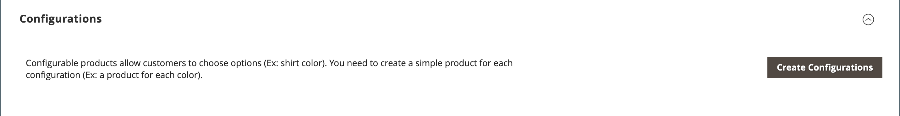

# Impostazioni prodotto - [!UICONTROL Configurations]

Nella sezione _[!UICONTROL Configurations]_&#x200B;sono elencate tutte le varianti esistenti del prodotto e possono essere utilizzate per generare varianti da utilizzare con il tipo di prodotto Configurabile. Per ulteriori informazioni, vedere [Prodotto configurabile](product-create-configurable.md).

{width="600" zoomable="yes"}

{width="600" zoomable="yes"}

## Riferimento campo

| Campo | Descrizione |
|--- |--- |
| [!UICONTROL Image] | Immagine del prodotto |
| [!UICONTROL Name] | Nome univoco di un prodotto |
| [!UICONTROL SKU] | In base al nome del prodotto |
| [!UICONTROL Price] | Prezzo del prodotto |
| [!UICONTROL Quantity] | Quantità di scorte disponibili per ciascun prodotto |
| [!UICONTROL Weight] | Il peso del prodotto |
| [!UICONTROL Status] | Stato prodotto **[!UICONTROL Enabled]** / **[!UICONTROL Disabled]** |
| [!UICONTROL Attributes] | Un set di attributi utilizzati per descrivere un prodotto |
| [!UICONTROL Actions] | Elenca tutte le azioni applicabili ai prodotti selezionati. Azioni:  **[!UICONTROL Choose a different Product]** - Rimuove e sostituisce il prodotto corrente con la nuova selezione.  **[!UICONTROL Disable Product]** / **[!UICONTROL Enable Product]** - Disabilita o abilita il prodotto selezionato.  **[!UICONTROL Remove Product]** - Rimuove il prodotto selezionato dalla configurazione corrente. |

{style="table-layout:auto"}
