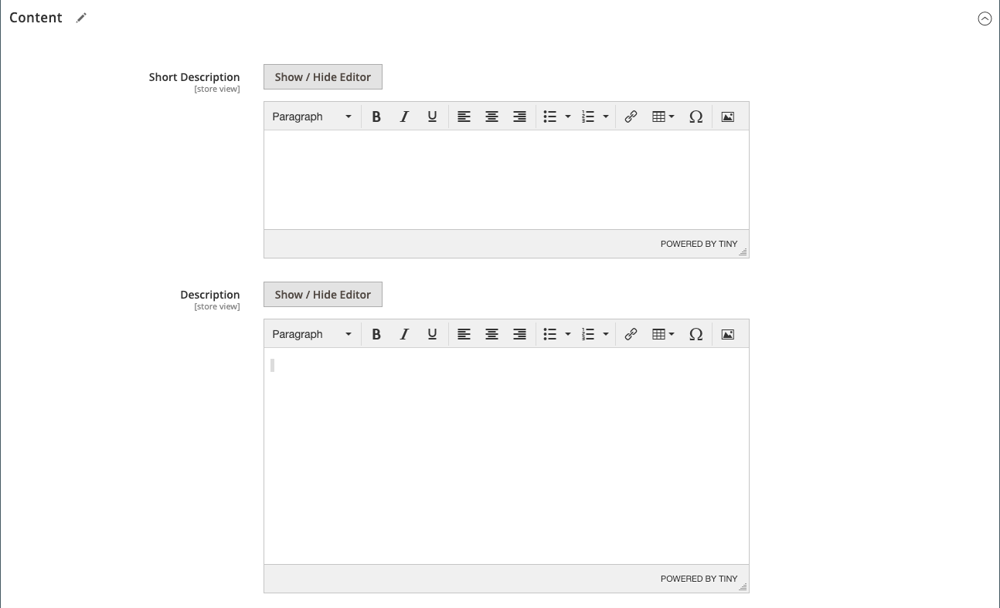

# Impostazioni prodotto - [!UICONTROL Content]

Il _[!UICONTROL Content]_viene utilizzata per immettere e modificare la descrizione principale del prodotto visualizzata nella pagina del prodotto. La breve descrizione può essere utilizzata nella maggior parte dei feed RSS e può anche essere visualizzata nelle inserzioni del catalogo, a seconda di [tema](../content-design/themes.md).

## Aggiungi la descrizione del prodotto in [!DNL Page Builder]

1. Apri il prodotto in modalità di modifica.

1. Scorri verso il basso ed espandi  il **[!UICONTROL Content]** sezione.

   {width="600" zoomable="yes"}

1. Immetti un **[!UICONTROL Short Description]** del prodotto e utilizzare il [barra degli strumenti dell’editor](../content-design/editor.md) per formattare in base alle esigenze.

1. Alla **[!UICONTROL Description]** label, click **[!UICONTROL Edit with Page Builder]**.

1. Utilizza il [[!DNL Page Builder]](../page-builder/introduction.md) strumenti di contenuto per [modifica il testo esistente](../page-builder/text.md) e aggiungi altro contenuto (se necessario).

## [!DNL Page Builder] anteprima

Quando si espande _[!UICONTROL Content]_per un prodotto esistente in cui è presente un contenuto creato con [!DNL Page Builder], visualizza un’anteprima del **[!UICONTROL Description]**contenuto come apparirebbe nella pagina del prodotto. Apri [!DNL Page Builder] in cui è possibile apportare gli aggiornamenti necessari facendo clic su **[!UICONTROL Edit with Page Builder]**.

{width="600" zoomable="yes"}

Per impostazione predefinita, questa anteprima di contenuto è abilitata per i moduli di prodotti e categorie. Se le prestazioni diminuiscono a causa del caricamento dell’anteprima, puoi disabilitare l’anteprima in [Configurazione gestione contenuti](../configuration-reference/general/content-management.md#advanced-content-tools) impostazioni.

## Aggiungi la descrizione del prodotto nell’editor

Se [!DNL Page Builder] è disabilitato per il tuo archivio, utilizza l’editor di testo per aggiungere il contenuto del prodotto. Immettere solo caratteri ASCII normali nella casella di testo. Se si incolla testo da un elaboratore di testi, salvarlo innanzitutto come file TXT semplice per rimuovere eventuali caratteri di controllo invisibili. Per ulteriori informazioni, consulta [Utilizzo dell’editor](../content-design/editor.md).

1. Apri il prodotto in modalità di modifica.

1. Scorri verso il basso ed espandi  il **[!UICONTROL Content]** sezione.

   {width="600" zoomable="yes"}

1. Immetti un **[!UICONTROL Short Description]** del prodotto e del formato, se necessario.

1. Inserisci il prodotto principale **[!UICONTROL Description]** e utilizza la barra degli strumenti dell’editor per formattare in base alle esigenze.

   È possibile trascinare l&#39;angolo inferiore destro per modificare l&#39;altezza della casella di testo.
