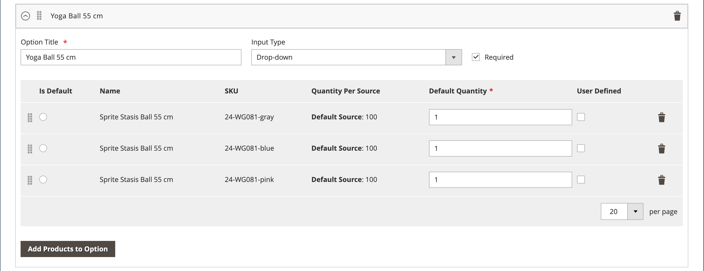
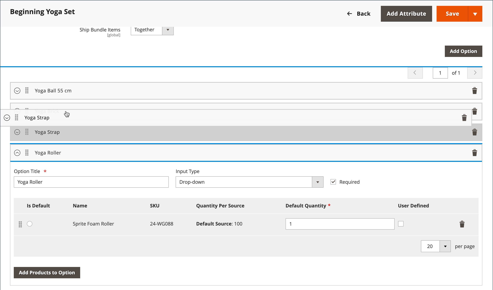
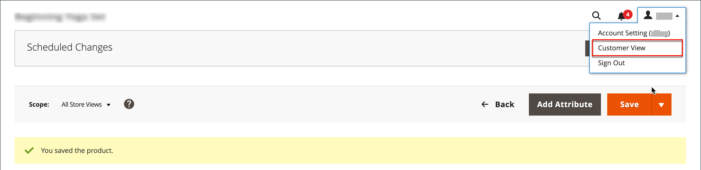
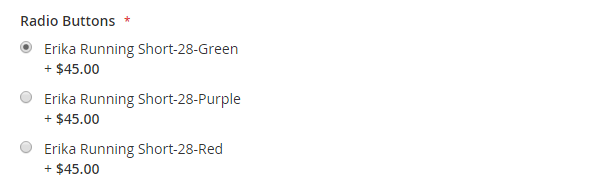

# Prodotto bundle

Un bundle è un _prodotto personalizzato_ personalizzabile. Ogni elemento in un bundle può essere basato su uno dei seguenti tipi di prodotto:

- [Prodotto semplice](product-create-simple.md)
- [Prodotto virtuale](product-create-virtual.md)

{width="700" zoomable="yes"}

Le opzioni vengono visualizzate quando il cliente fa clic su **[!UICONTROL Customize]** o **[!UICONTROL Add to Cart]**. Poiché i prodotti inclusi nel bundle variano, lo SKU, il prezzo e il peso possono essere impostati su un valore dinamico o fisso.

>[!NOTE]
>
>Il prezzo minimo annunciato (MAP) non è disponibile per i prodotti bundle che utilizzano prezzi dinamici.

>[!NOTE]
>
>Il pacchetto principale viene sempre visualizzato automaticamente come prodotto di up-sell per tutti i suoi prodotti secondari.

Se [Acquisto immediato](../stores-purchase/checkout-instant-purchase.md) è disponibile, il pulsante _Acquisto immediato_ viene visualizzato sotto il pulsante _Aggiungi al carrello_ per ogni elemento nel bundle.

{width="600" zoomable="yes"}

Le istruzioni seguenti descrivono come creare un prodotto bundle utilizzando un [modello di prodotto](attribute-sets.md), campi obbligatori e impostazioni di base. Ogni campo obbligatorio è contrassegnato da un asterisco rosso (`*`). Al termine delle nozioni di base, puoi completare le altre impostazioni del prodotto in base alle esigenze.

## Passaggio 1: scegliere il tipo di prodotto

1. Nella barra laterale _Admin_, passa a **[!UICONTROL Catalog]** > **[!UICONTROL Products]**.

1. Nell&#39;angolo superiore destro del menu _[!UICONTROL Add Product]_( {width="25"} ), scegliere **[!UICONTROL Bundle Product]**.

   {width="700" zoomable="yes"}

## Passaggio 2: scegliere la serie di attributi

Per scegliere il [set di attributi](attribute-sets.md) utilizzato come modello per il prodotto, eseguire una delle operazioni seguenti:

- Per **[!UICONTROL Search]**, immettere il nome del set di attributi,
- Nell&#39;elenco, scegliere il set di attributi che si desidera utilizzare.

Il modulo viene aggiornato per riflettere la modifica.

{width="600" zoomable="yes"}

## Passaggio 3: completare le impostazioni richieste

1. Immettere il prodotto **[!UICONTROL Product Name]**.

1. Accettare il valore predefinito **[!UICONTROL SKU]** basato sul nome del prodotto o immettere un valore diverso.

   Per determinare il tipo di SKU assegnato a ciascun elemento del bundle, effettuate le seguenti operazioni:

   - È possibile assegnare automaticamente un **[!UICONTROL Dynamic SKU]** a ogni elemento del bundle aggiungendo un suffisso allo SKU predefinito. Per impostazione predefinita è impostato su `Yes`.

   - Se preferisci assegnare uno SKU univoco per ogni elemento del bundle, imposta **[!UICONTROL Dynamic SKU]** su `No`.

   {width="600" zoomable="yes"}

1. Per determinare il prezzo del bundle, effettuate una delle seguenti operazioni:

   - Per fare in modo che il prezzo rifletta le opzioni scelte dal cliente, impostare **[!UICONTROL Dynamic Price]** su `Yes` e lasciare **[!UICONTROL Price]** vuoto. In questo caso, un prodotto in bundle non ha un proprio prezzo dal catalogo e il prezzo del prodotto è derivato dal prezzo dei singoli prodotti inclusi nel bundle.

   - Per addebitare un prezzo fisso per il bundle, impostare **[!UICONTROL Dynamic Price]** su `No` e immettere **[!UICONTROL Price]** che si desidera addebitare per il bundle.

   >[!NOTE]
   >
   >[!UICONTROL Special Price] e [!UICONTROL Customer Group Price] (prezzo di livello) sono sempre impostati come percentuale di sconto per tutti i tipi di prodotto del bundle.

1. Poiché il prodotto non è ancora pronto per la pubblicazione, impostare **[!UICONTROL Enable Product]** su `No`.

1. Fare clic su **[!UICONTROL Save]** e continuare.

   Quando il prodotto viene salvato, il selettore [Visualizzazione store](introduction.md#product-scope) viene visualizzato nell&#39;angolo superiore sinistro.

1. Scegliere **[!UICONTROL Store View]** in cui il prodotto deve essere disponibile.

   {width="600" zoomable="yes"}

## Passaggio 4: completare le impostazioni di base

1. Se il bundle include la determinazione prezzi fissa, impostare **[!UICONTROL Tax Class]** su uno dei seguenti valori:

   - `None`
   - `Taxable Goods`

   Se il bundle dispone di Dynamic Pricing, l&#39;imposta viene determinata per **_ogni_** elemento del bundle. Se il bundle ha Determinazione prezzi, l&#39;imposta viene determinata per il prodotto del bundle **_intero_**.

1. Prendi nota di quanto segue:

   - **[!UICONTROL Quantity]** non è disponibile perché il valore è determinato per ogni elemento del bundle.

   - Per impostazione predefinita, **[!UICONTROL Stock Status]** è impostato su `In Stock`.

1. Per determinare lo spessore del fascio, effettuate una delle seguenti operazioni:

   - Affinché il peso rifletta le opzioni scelte dal cliente, impostare **[!UICONTROL Dynamic Weight]** impostare `Yes` e lasciare **[!UICONTROL Weight]** vuoto.

   - Per assegnare un peso fisso al bundle, impostare **[!UICONTROL Dynamic Weight]** su `No` e immettere **[!UICONTROL Weight]** del bundle.

   {width="600" zoomable="yes"}

1. Per inserire il prodotto nell&#39;elenco di [nuovi prodotti](../content-design/widget-new-products-list.md), selezionare la casella di controllo **[!UICONTROL Set Product as New]**.

1. Accettare l&#39;impostazione **[!UICONTROL Visibility]** predefinita di `Catalog, Search`.

1. Per assegnare _[!UICONTROL Categories]_&#x200B;al prodotto, fare clic sulla casella **[!UICONTROL Select…]**&#x200B;ed eseguire una delle operazioni seguenti:

   **Scegli una categoria esistente:**

   - Inizia a digitare nella casella fino a trovare una corrispondenza.

   - Selezionare la casella di controllo di ciascuna categoria da assegnare.

   {width="600" zoomable="yes"}

   **Crea una categoria:**

   - Fare clic su **[!UICONTROL New Category]**.

   - Immettere **[!UICONTROL Category Name]** e scegliere **[!UICONTROL Parent Category]**, che ne determina la posizione nella struttura del menu.

   - Fare clic su **[!UICONTROL Create Category]**.

1. Scegliere **[!UICONTROL Country of Manufacture]**.

   Potrebbero essere presenti attributi aggiuntivi che descrivono il prodotto. La selezione varia a seconda del set di attributi e può essere completata in un secondo momento.

## Passaggio 5: aggiungere gli elementi del bundle

La sezione _[!UICONTROL Bundle Items]_&#x200B;viene utilizzata per aggiungere elementi a un tipo di prodotto Bundle e per modificare la selezione corrente di elementi.

{width="600" zoomable="yes"}

1. Scorri verso il basso fino alla sezione _Elementi bundle_ e imposta **[!UICONTROL Ship Bundle Items]** su uno dei seguenti elementi:

   - `Separately`
   - `Together`

   Se selezioni `Together`, a tutti gli elementi del bundle deve essere assegnato lo stesso [source](../inventory-management/sources-manage.md).

1. Fare clic su **[!UICONTROL Add Option]** ed effettuare le seguenti operazioni:

   - Immetti un **[!UICONTROL Option Title]** da utilizzare come etichetta del campo.

   - Imposta **[!UICONTROL Input Type]** su uno dei seguenti:

      - `Drop-down`
      - `Radio buttons`
      - `Checkbox`
      - `Multiple Select`

   - Per rendere obbligatorio il campo, selezionare la casella di controllo **[!UICONTROL Required]**.

   - Fare clic su **[!UICONTROL Add Products to Option]** e selezionare la casella di controllo di ogni prodotto che si desidera includere in questa opzione.

     Se sono presenti molti prodotti, utilizza i filtri elenco e i controlli di impaginazione per trovare i prodotti necessari.

   - Fare clic su **[!UICONTROL Add Selected Products]**.

     {width="600" zoomable="yes"}

   - Dopo la visualizzazione degli elementi nella sezione _Opzioni_, scegliere un elemento come selezione **[!UICONTROL Default]**.

   - Nella colonna _Quantità predefinita_ immettere la quantità di ogni articolo da aggiungere al bundle quando un cliente sceglie l&#39;articolo.

   - Per consentire ai clienti di modificare la quantità di un elemento del bundle, selezionare **[!UICONTROL User Defined]**.

     >[!NOTE]
     >
     >La quantità può essere un valore predefinito o definito dall&#39;utente. Tuttavia, non assegnare la proprietà _[!UICONTROL User Defined]_&#x200B;a tipi di input a selezione multipla o casella di controllo.

     Per impostazione predefinita, la quantità predefinita inclusa in un articolo del bundle non può essere modificata dal cliente. Tuttavia, il cliente può inserire la quantità dell&#39;articolo da includere nel bundle.

     Ad esempio, se la quantità predefinita della sfera di stato dello sprite è impostata su `2` e il cliente ordina `4` di tale opzione del bundle, il numero totale di palle acquistate è `8`.

     {width="600" zoomable="yes"}

1. Ripeti questi passaggi per ogni elemento da aggiungere al bundle.

1. Per modificare l&#39;ordine degli elementi in una sezione bundle, fai clic sull&#39;icona _Sposta_ (  ) all&#39;inizio della riga e trascina l&#39;elemento nella posizione desiderata.

   {width="600" zoomable="yes"}

   L’ordine degli elementi può anche essere modificato nei dati di un prodotto bundle esportato e quindi reimportato nel catalogo. Per ulteriori informazioni, vedere [Importazione prodotti bundle](../systems/data-transfer-bundle-products.md).

   Per avere una migliore visualizzazione del workspace, comprimere prima ogni sezione e quindi trascinarle nella posizione desiderata.

1. Per rimuovere qualsiasi elemento dal bundle, fai clic sull&#39;icona **[!UICONTROL Delete]** (  ).

1. Al termine, fare clic su **[!UICONTROL Save]**.

## Passaggio 6: Completare le informazioni sul prodotto

Scorri verso il basso e completa le informazioni nelle sezioni seguenti, in base alle esigenze:

- [Contenuto](product-content.md)
- [Immagini e video](product-images-and-video.md)
- [Ottimizzazione motore di ricerca](product-search-engine-optimization.md)
- [Prodotti correlati, up-selling e cross-selling](related-products-up-sells-cross-sells.md)
- [Opzioni personalizzabili](settings-advanced-custom-options.md)
- [Prodotti nei siti Web](settings-basic-websites.md)
- [Progettazione](settings-advanced-design.md)
- [Opzioni regalo](product-gift-options.md)

## Passaggio 7: Publish del prodotto

1. Se si è pronti a pubblicare il prodotto nel catalogo, impostare **[!UICONTROL Enable Product]** su `Yes` (  ).

1. Effettuare una delle seguenti operazioni:

   **Metodo 1:** Salvataggio e anteprima

   - Nell&#39;angolo superiore destro fare clic su **[!UICONTROL Save]**.

   - Per visualizzare il prodotto nell&#39;archivio, scegli **[!UICONTROL Customer View]** nel menu _Amministratore_ (  ).

     L’archivio si apre in una nuova scheda del browser.

   {width="600" zoomable="yes"}

   **Metodo 2:** Salvare e chiudere

   Scegliere **[!UICONTROL Save & Close]** dal menu _[!UICONTROL Save]_( {width="25"} ).

## Controlli di input

| Controllo | Descrizione | Esempio |
|--- |--- |--- |
| [!UICONTROL Drop-down] | Visualizza un elenco a discesa di opzioni con il nome e il prezzo del prodotto. È possibile selezionare un solo elemento. | {width="200"} |
| [!UICONTROL Radio Buttons] | Visualizza un pulsante di scelta per ogni opzione, seguito dal nome del prodotto e dal prezzo. È possibile selezionare un solo elemento. | {width="200"} |
| [!UICONTROL Checkbox] | Visualizza una casella di controllo per ogni opzione, seguita dal nome del prodotto e dal prezzo. È possibile selezionare più elementi. | {width="200"} |
| [!UICONTROL Multiple Select] | Visualizza un elenco di opzioni con il nome e il prezzo del prodotto. Per selezionare più elementi, tenere premuto Ctrl (PC) o Comando (Mac) e fare clic su ogni elemento. | {width="200"} |

{style="table-layout:auto"}

## Descrizioni dei campi

| Campo | Descrizione |
|--- |--- |
| [!UICONTROL SKU] | Determina se a ogni elemento viene assegnato uno SKU dinamico o variabile o se per il bundle viene utilizzato uno SKU fisso. Opzioni: `Fixed` / `Dynamic` |
| [!UICONTROL Weight] | Specifica se il peso viene calcolato in base agli elementi selezionati o se è fisso per l&#39;intero bundle. Opzioni: `Fixed` / `Dynamic` |
| [!UICONTROL Price View] | Determina se il prezzo del prodotto viene visualizzato come intervallo, dal meno costoso al più costoso (fascia di prezzo) o con il meno costoso indicato (come basso come). Opzioni: `Price Range` / `As Low As` |
| Articoli del bundle di spedizione | Specifica se i singoli articoli possono essere spediti separatamente. |

{style="table-layout:auto"}

## Stato scorte prodotto del bundle

Lo stato delle scorte dei prodotti del bundle è **_cambiato automaticamente in esaurito_** quando si verifica uno di questi scenari:

- Tutte le opzioni sono facoltative e tutti i prodotti associati sono _esauriti_.

- Alcune opzioni sono obbligatorie e i prodotti associati alle opzioni obbligatorie sono _esauriti_.

Lo stato delle scorte dei prodotti del bundle è **_non modificato automaticamente in Esaurito_** quando si verifica uno dei seguenti scenari:

- Tutte le opzioni sono facoltative e almeno un prodotto associato è _In magazzino_.

- Alcune opzioni sono obbligatorie e almeno un prodotto associato in ogni opzione richiesta è _In magazzino_.

## Aspetti da ricordare

 I clienti possono _creare il proprio_ prodotto bundle.

 Tutti i prodotti secondari vengono assegnati e non assegnati al prodotto bundle **_globalmente_** per tutti i siti Web, gli store e le visualizzazioni dello store contemporaneamente.

 Gli elementi del bundle possono essere prodotti semplici o virtuali senza opzioni personalizzate.

 La visualizzazione prezzo può essere impostata su `Price Range` o `As Low As`.

 possono essere `Fixed` o `Dynamic`.

 La quantità può essere un valore predefinito o definito dall&#39;utente. Tuttavia, non assegnare la proprietà _[!UICONTROL User Defined]_&#x200B;a tipi di input a selezione multipla o casella di controllo.

 Gli elementi del bundle possono essere spediti insieme o separatamente.

 Il prodotto del bundle principale viene sempre visualizzato automaticamente come prodotto di upselling per tutti i suoi prodotti secondari.

 [!UICONTROL Special Price] e [!UICONTROL Customer Group Price] (prezzo di livello) sono sempre impostati come percentuale di sconto per tutti i tipi di prodotto del bundle.
