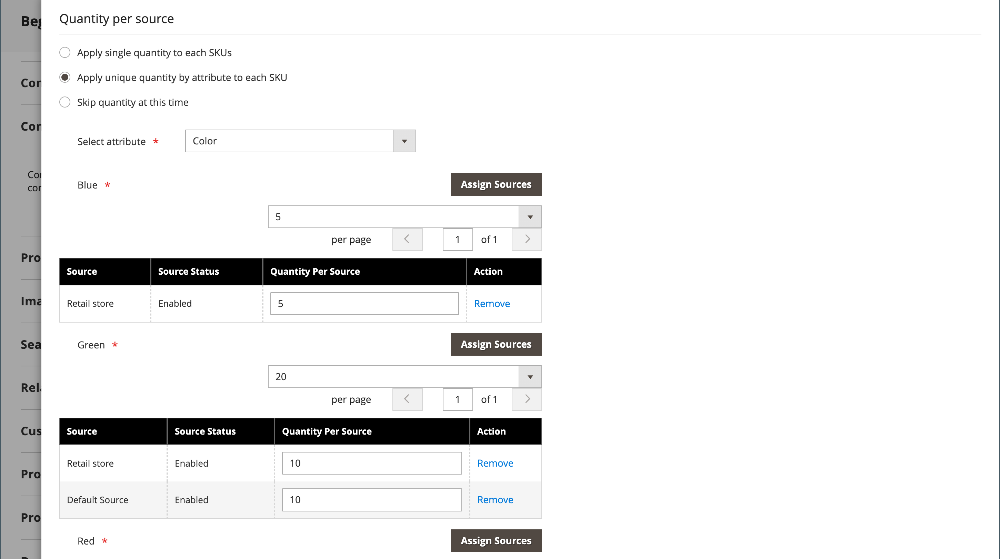

# Prodotto configurabile

Un prodotto configurabile è simile a un singolo prodotto con un elenco a discesa di ogni variante. Ogni voce di elenco è in realtà un prodotto semplice separato con una SKU univoca, che consente di tenere traccia dell’inventario per ogni variante di prodotto. Puoi ottenere un effetto simile utilizzando un prodotto semplice con opzioni personalizzate, ma senza la possibilità di tenere traccia dell’inventario per ogni variante.

Le istruzioni seguenti illustrano il processo di creazione di un prodotto configurabile utilizzando un [modello di prodotto](attribute-sets.md), campi obbligatori e impostazioni di base. Ogni campo obbligatorio è contrassegnato da un asterisco rosso (`*`). Al termine delle nozioni di base, puoi completare le altre impostazioni del prodotto in base alle esigenze.

{width="700" zoomable="yes"}

## Parte 1: Creazione di un prodotto configurabile

Sebbene un prodotto configurabile utilizzi più SKU e la configurazione iniziale possa richiedere un po’ di tempo, alla fine potrai risparmiare tempo. Se prevedi di espandere la tua attività, il tipo di prodotto configurabile è una buona scelta per i prodotti con più opzioni.

Prima di iniziare, prepari un [set di attributi](attribute-sets.md) che include un attributo impostato su uno dei tipi di input consentiti per ogni variante di prodotto. Ad esempio, il set di attributi potrebbe includere attributi a discesa per colore e dimensione.

Le proprietà di ciascun attributo utilizzato per una variante di prodotto configurabile devono avere le seguenti impostazioni:

### Requisiti degli attributi di variazione del prodotto

| Proprietà | Impostazione |
|--- |--- |
| [!UICONTROL Scope] | `Global` |
| [!UICONTROL Catalog Input Type for Store Owner] | Il tipo di input di qualsiasi attributo utilizzato per una variante di prodotto deve essere uno dei seguenti: `Dropdown`, `Visual Swatch`, o `Text Swatch`. |
| [!UICONTROL Values Required] | `Yes` |

{style="table-layout:auto"}

### Passaggio 1: scegliere il tipo di prodotto

1. Il giorno _Amministratore_ barra laterale, vai a  **[!UICONTROL Catalog]** > **[!UICONTROL Products]**.

1. Il giorno _[!UICONTROL Add Product]_( {width="25"} ) nell&#39;angolo superiore destro, scegliere **[!UICONTROL Configurable Product]**.

   {width="700" zoomable="yes"}

### Passaggio 2: scegliere la serie di attributi

Il [set di attributi](attribute-sets.md) determina la selezione dei campi utilizzati nel prodotto. Il set di attributi utilizzato nell&#39;esempio seguente dispone di attributi per colore e dimensioni. Il nome del set di attributi è indicato nella parte superiore della pagina e inizialmente è impostato su `Default`.

1. Per scegliere il set di attributi per il prodotto, fai clic sul campo nella parte superiore della pagina ed effettua una delle seguenti operazioni:

   - Per **[!UICONTROL Search]**, immettere il nome della serie di attributi.
   - Nell&#39;elenco, scegliere il set di attributi che si desidera utilizzare.

   Il modulo viene aggiornato per riflettere la modifica.

1. Per aggiungere un altro attributo al set di attributi, fare clic su **[!UICONTROL Add Attribute]** e seguire le istruzioni in [Aggiunta di un attributo](product-attributes-add.md).

   {width="600" zoomable="yes"}

### Passaggio 3: completare le impostazioni richieste

1. Inserisci il prodotto **[!UICONTROL Product Name]**.

1. Accetta il valore predefinito **[!UICONTROL SKU]** in base al nome del prodotto o immettine un altro.

1. Inserisci il prodotto **[!UICONTROL Price]**.

1. Poiché il prodotto non è ancora pronto per la pubblicazione, imposta **[!UICONTROL Enable Product]** a `No`.

1. click **[!UICONTROL Save]** e continua.

   Quando il prodotto viene salvato, la [Visualizzazione store](introduction.md#product-scope) selettore viene visualizzato nell&#39;angolo superiore sinistro.

1. Scegli la **[!UICONTROL Store View]** dove il prodotto deve essere disponibile.

   {width="600" zoomable="yes"}

### Passaggio 4: completare le impostazioni di base

1. Imposta **[!UICONTROL Tax Class]** a uno dei seguenti elementi:

   - `None`
   - `Taxable Goods`

1. Il **[!UICONTROL Quantity]** è determinato dalle varianti del prodotto, quindi puoi lasciarlo vuoto.

1. Lascia **[!UICONTROL Stock Status]** come impostato.

   Lo stato del magazzino di un prodotto configurabile è determinato da ciascuna configurazione associata. Poiché il prodotto è stato salvato senza immettere una quantità, la **[!UICONTROL Stock Status]** è impostato su `Out of Stock`.

   >[!NOTE]
   >
   >Il **Stato Stock** del prodotto configurabile è un **_semi-manualmente_** impostazione controllata. È parzialmente controllata dallo stato delle scorte dei suoi prodotti secondari. Fa parte di un **_più criteri_** il calcolo dello stato delle scorte, descritto nel [Configurare lo stato del magazzino](#configure-the-stock-status) sezione.

1. Inserisci il prodotto **[!UICONTROL Weight]**.

>[!NOTE]
>
>Un prodotto configurabile deve avere sempre un peso. Se si seleziona **[!UICONTROL This item has no weight]** dall’elenco a discesa, viene automaticamente modificato in **[!UICONTROL This item has weight]** dopo aver salvato il prodotto.

1. Accetta il valore predefinito **[!UICONTROL Visibility]** impostazione di `Catalog, Search`.

1. Per inserire il prodotto nell’elenco di [nuovi prodotti](../content-design/widget-new-products-list.md), seleziona la **[!UICONTROL Set Product as New]** casella di controllo.

1. Per assegnare le categorie al prodotto, fare clic su **[!UICONTROL Select…]** ed effettuare una delle seguenti operazioni:

   **Scegli una categoria esistente**:

   - Inizia a digitare nella casella fino a trovare una corrispondenza.

   - Selezionare la casella di controllo della categoria da assegnare.

   {width="600" zoomable="yes"}

   **Creare una categoria**:

   - Clic **[!UICONTROL New Category]**.

   - Inserisci il **[!UICONTROL Category Name]** e scegli la **[!UICONTROL Parent Category]**, che ne determina la posizione nella struttura del menu.

   s- Clic **[!UICONTROL Create Category]**.

1. Scegli la **[!UICONTROL Country of Manufacture]**.

   Potrebbero essere presenti attributi aggiuntivi utilizzati per descrivere il prodotto. La selezione varia in base al set di attributi e può essere completata in un secondo momento.

### Passaggio 5: salvare e continuare

Ora è il momento giusto per salvare il tuo lavoro. Nell’angolo superiore destro, fai clic su **[!UICONTROL Save]**. Nella serie di passaggi successiva, imposterai le configurazioni per ogni variante del prodotto.

## Parte 2: aggiunta di configurazioni

L’esempio seguente mostra come aggiungere configurazioni per tre colori e tre dimensioni. In tutto, nove semplici prodotti sono creati con SKU univoci per coprire ogni possibile combinazione di varianti. Per impostazione predefinita, il nome del prodotto e lo SKU per ogni variante si basano sul valore dell’attributo e sul nome del prodotto principale o sullo SKU.

La barra di avanzamento nella parte superiore della pagina mostra la posizione in cui ti trovi durante il processo e ti guida attraverso ogni passaggio.

### Passaggio 1: scegliere gli attributi

1. Continuando dall&#39;alto, scorri verso il basso fino al _[!UICONTROL Configurations]_e fai clic su **[!UICONTROL Create Configurations]**.

   {width="600" zoomable="yes"}

1. Selezionare la casella di controllo di ogni attributo che si desidera includere come configurazione.

   Per questo esempio, `color` e `size` sono selezionati.

   {width="600" zoomable="yes"}

   L’elenco include tutti gli attributi del set di attributi che possono essere utilizzati in un prodotto configurabile.

1. Per aggiungere un attributo, fare clic su **[!UICONTROL Create New Attribute]** ed effettuare le seguenti operazioni:

   - Completa le proprietà dell’attributo.

   - Clic **[!UICONTROL Save Attribute]**.

   - Selezionare la casella di controllo per l&#39;attributo.

1. Nell’angolo superiore destro, fai clic su **[!UICONTROL Next]**.

### Passaggio 2: immettere i valori degli attributi

1. Per ogni attributo, seleziona la casella di controllo dei valori applicabili al prodotto.

   {width="600" zoomable="yes"}

1. Per ridisporre gli attributi, acquisire _Riordina_ (  ) e spostare la sezione in una nuova posizione.

   L’ordine determina la posizione degli elenchi a discesa sulla pagina del prodotto.

1. Nella barra di avanzamento, fai clic su **[!UICONTROL Next]**.

### Passaggio 3: configurare immagini, prezzo e quantità

Questo passaggio determina le immagini, il prezzo e la quantità di ciascuna configurazione. Le opzioni disponibili sono le stesse per ciascuno di essi ed è possibile sceglierne solo una. Puoi applicare la stessa impostazione a tutte le SKU, applicare un’impostazione univoca a ciascuna SKU o saltare le impostazioni per il momento.

Scegliere le opzioni di configurazione applicabili.

Utilizza uno dei seguenti metodi per configurare **[!UICONTROL images]**:

**Metodo 1:** Applicare un singolo set di immagini a tutti gli SKU

1. Seleziona **[!UICONTROL Apply single set of images to all SKUs]**.

1. Individuare le immagini che si desidera includere nella raccolta prodotti o trascinarle nella casella.

{width="600" zoomable="yes"}

**Metodo 2:** Applicare immagini univoche per ogni SKU

Poiché l’immagine del prodotto principale è già caricata, puoi utilizzare questa opzione per caricare un’immagine di ciascun colore. Puoi aggiungere un’immagine diversa che viene visualizzata nel carrello quando qualcuno acquista l’articolo con un colore specifico.

1. Seleziona **[!UICONTROL Apply unique images by attribute to each SKU]**.

1. Seleziona la **[!UICONTROL Attribute]** che le immagini illustrano, ad esempio `color`.

1. Per ogni valore di attributo, individua le immagini da utilizzare per la configurazione o trascinale nella casella.

   Se trascinate l&#39;immagine in una casella di valore, questa viene visualizzata anche nelle sezioni relative agli altri valori. Per eliminare un&#39;immagine, fare clic sul pulsante _Cestino_ ().

   {width="600" zoomable="yes"}

Utilizza uno dei seguenti metodi per configurare **[!UICONTROL prices]**:

>[!NOTE]
>
>Un prodotto configurabile non ha un proprio prezzo nel catalogo. Il prezzo del prodotto configurabile è derivato dal relativo [!UICONTROL In Stock] prodotti secondari.

**Metodo 1:** Applica lo stesso prezzo a tutti gli SKU

1. Se il prezzo è lo stesso per tutte le varianti, seleziona **[!UICONTROL Apply single price to all SKUs]**.

1. Inserisci il **[!UICONTROL Price]**.

   {width="600" zoomable="yes"}

**Metodo 2:** Applica un prezzo diverso per ogni SKU

1. Se il prezzo è diverso per ciascun prodotto o per alcune varianti, selezionare **[!UICONTROL Apply unique prices by attribute to each SKU]**.

1. Seleziona la **[!UICONTROL Attribute]** questa è la base della differenza di prezzo.

1. Inserisci il **[!UICONTROL Price]** per ogni valore di attributo.

   In questo esempio, la dimensione XL costa di più.

   {width="600" zoomable="yes"}

Utilizza uno dei seguenti metodi per configurare **[!UICONTROL Quantity]**:

**Metodo 1:** Applica la stessa quantità a tutti gli SKU

Se la quantità è la stessa per tutti gli SKU, selezionare **[!UICONTROL Apply single quantity to each SKU]** e specifica la quantità.

_esercenti da fonte singola_ - Inserisci il **[!UICONTROL Quantity]**.

_Merchant multi-sorgente che utilizzano [Inventory management](../inventory-management/introduction.md)_ - Assegnare origini e aggiungere quantità per tutte le varianti prodotto generate:

1. Seleziona la **[!UICONTROL Apply single quantity to each SKU]** opzione.

1. Per aggiungere un&#39;origine, fare clic su **[!UICONTROL Assign Sources]**.

1. Individuare o cercare un&#39;origine da aggiungere. Seleziona la casella di controllo accanto alle origini che desideri aggiungere per il prodotto.

1. Inserire un importo scorte disponibili per origine.

   {width="600" zoomable="yes"}

**Metodo 2:** Applica quantità diversa per attributo

_esercenti da fonte singola_ - Inserisci il **[!UICONTROL Quantity]**.

_Merchant multi-sorgente che utilizzano [Inventory management](../inventory-management/introduction.md)_ - Assegnare origini e aggiungere quantità per tutte le varianti prodotto generate:

1. Se la quantità è diversa per ogni SKU, selezionare **[!UICONTROL Apply unique quantity by attribute to each SKU]**.

1. Inserisci il **[!UICONTROL Quantity]** per ciascuno.

   {width="600" zoomable="yes"}

Al termine della configurazione di immagini, prezzo e quantità, fai clic su **[!UICONTROL Next]** nell’angolo superiore destro.

### Passaggio 4: generare le configurazioni di prodotto

Attendi che l’elenco dei prodotti venga visualizzato ed effettua una delle seguenti operazioni:

- Se si è soddisfatti delle configurazioni, fare clic su **[!UICONTROL Generate Products]**.

- Per apportare correzioni, fare clic su **[!UICONTROL Back]**.

{width="600" zoomable="yes"}

Le varianti di prodotto correnti vengono visualizzate nella parte inferiore della _Configurazione_ sezione.

{width="600" zoomable="yes"}

### Passaggio 5: aggiungere immagini del prodotto

1. Scorri verso il basso ed espandi  il _[!UICONTROL Images and Videos]_sezione.

1. Fai clic su _Fotocamera_ affianca e sfoglia l’immagine principale che desideri utilizzare per il prodotto configurabile.

Per ulteriori informazioni, consulta [Immagini e video](product-images-and-video.md).

### Passaggio 6: Completare le informazioni sul prodotto

Scorri verso il basso e completa le informazioni nelle sezioni seguenti, in base alle esigenze:

- [Contenuto](product-content.md)

- [Prodotti correlati, up-selling e cross-selling](related-products-up-sells-cross-sells.md)

- [Ottimizzazione motore di ricerca](product-search-engine-optimization.md)

- [Opzioni personalizzabili](settings-advanced-custom-options.md)

- [Prodotti nei siti Web](settings-basic-websites.md)

- [Progettazione](settings-advanced-design.md)

- [Opzioni regalo](product-gift-options.md)

### Passaggio 7: pubblicare il prodotto

1. Se sei pronto per pubblicare il prodotto nel catalogo, imposta **[!UICONTROL Enable Product]** a `Yes` ed effettuare una delle seguenti operazioni:

   - **Metodo 1:** Salva e visualizza in anteprima

      - Nell’angolo superiore destro, fai clic su **[!UICONTROL Save]**.

      - Per visualizzare il prodotto nel tuo negozio, scegli **[!UICONTROL Customer View]** il _Amministratore_ (  ).

     L’archivio si apre in una nuova scheda del browser.

     {width="600" zoomable="yes"}

   - **Metodo 2:** Salva e chiudi

     Il giorno _[!UICONTROL Save]_( {width="25"} ), scegliere **[!UICONTROL Save & Close]**.

### Passaggio 8: configurare le miniature del carrello

Se disponi di un’immagine diversa per ogni variante, puoi impostare la configurazione in modo da utilizzare l’immagine corretta per la miniatura del carrello acquisti.

1. Il giorno _Amministratore_ barra laterale, vai a **[!UICONTROL Stores]** > _[!UICONTROL Settings]_>**[!UICONTROL Configuration]**.

1. Nel pannello a sinistra, espandi **[!UICONTROL Sales]** e scegli **[!UICONTROL Checkout]** sotto.

1. Espandi  il _[!UICONTROL Shopping Cart]_sezione.

1. Imposta **[!UICONTROL Configurable Product Image]** a `Product Thumbnail Itself`.

1. Al termine, fai clic su **[!UICONTROL Save Config]**.

   {width="600" zoomable="yes"}

## Configurare lo stato del magazzino

Lo stato delle scorte del prodotto configurabile è diverso dallo stato delle scorte del prodotto semplice, dove rappresenta direttamente la disponibilità del prodotto. Per un prodotto configurabile, lo stato del magazzino fa parte di un **_più criteri_** calcolo stato scorte.

### Panoramica

I principi fondamentali delle relazioni di stato delle scorte sono i seguenti:

- Quando si modifica il **[!UICONTROL Stock Status]** del prodotto configurabile come `Out of Stock` e fai clic su **[!UICONTROL Save]**, è **_non controllato_** dagli stati di stock dei suoi prodotti secondari. Viene sempre visualizzato come `Out of Stock` in Admin (Amministratore) e su Storefront.

- Quando si imposta **[!UICONTROL Stock Status]** del prodotto configurabile come `In Stock` e fai clic su **[!UICONTROL Save]**, è **_controllato solo parzialmente_** in base agli stati delle scorte dei suoi prodotti secondari, che si riflettono nell’Admin e nello Storefront.

### Descrizione dettagliata

Il _Stato Stock_ del prodotto configurabile è parzialmente controllata dallo stato Stock dei suoi prodotti secondari e in base a quanto segue **_più criteri_** calcoli stato scorte:

#### Solo con origine/magazzino di default:

- Se lo stato del magazzino del prodotto configurabile è **_manualmente_** imposta su `Out of Stock` da parte di un utente amministratore, un’importazione di file o una chiamata API, rimane come `Out of Stock` su entrambi i **_Amministratore_** e **_Vetrina_** fino a quando  **_manualmente_** è stato modificato in `In stock` da un utente amministratore, da un’importazione file o da una chiamata API. Non può essere controllata dallo stato delle scorte dei suoi prodotti secondari.

- Se lo stato del magazzino del prodotto configurabile è **_manualmente_** imposta su `In Stock` da una chiamata API, importazione file o utente amministratore, il suo stato stock è **_automaticamente_** controllata dallo stato delle scorte dei suoi prodotti secondari su entrambi i **_Amministratore_** e **_Vetrina_**.

>[!NOTE]
>
>Le scorte e le fonti personalizzate fanno parte del [Inventory management](../inventory-management/sources-stocks.md) e si consiglia vivamente di utilizzare questo strumento esclusivamente per la gestione dell’archivio e dell’origine. Le funzioni di origine e magazzino di default fanno parte della `CatalogInventory` , che ora è diventato obsoleto.

#### Con almeno una sorgente/scorta personalizzata:

- Se il valore di Stato scorte del prodotto configurabile è **_manualmente_** imposta su `Out of Stock` da parte di un utente amministratore, un’importazione di file o una chiamata API, rimane come `Out of Stock` su entrambi i **_Amministratore_** e **_Vetrina_** fino a quando **_manualmente_** è stato modificato in `In Stock` da un utente amministratore, da un’importazione file o da una chiamata API. It **_non può_** essere controllata dallo stato delle scorte dei suoi prodotti secondari.

- Se il valore di Stato scorte del prodotto configurabile è **_manualmente_** imposta su `In Stock` da una chiamata API, importazione file o utente amministratore, il suo stato stock è **_automaticamente_** controllata dallo stato delle scorte dei suoi prodotti secondari sulla **_Vetrina_** solo.

- Se il valore di Stato scorte del prodotto configurabile è **_manualmente_** imposta su `In Stock` da parte di un utente amministratore, un’importazione di file o una chiamata API, rimane come `In Stock` nel **_Amministratore_** fino a quando **_manualmente_** è stato modificato in `Out of Stock` da un utente amministratore, da un’importazione file o da una chiamata API. It **_non può_** essere controllata dallo stato delle scorte dei suoi prodotti secondari.

## Aspetti da ricordare

- Un prodotto configurabile consente all’acquirente di scegliere le opzioni tra tipi di input a discesa, a selezione multipla, campione visivo e campione di testo. Ogni opzione è un prodotto separato e semplice.

- [Stato Stock](../inventory-management/sources-stocks.md) per un prodotto configurabile è un’impostazione controllata semi-manualmente. È diverso dallo stato delle scorte del prodotto semplice, dove rappresenta direttamente la disponibilità del prodotto. Per un prodotto configurabile, lo stato delle scorte fa parte di un calcolo dello stato delle scorte basato su più criteri.

- I prodotti secondari configurabili possono essere prodotti semplici o virtuali **senza opzioni personalizzate**. Per rendere virtuali prodotti secondari personalizzati, è necessario selezionare `Тhis item has no weight` per **[!UICONTROL Weight]** per ciascuno di essi.

- Un prodotto configurabile non ha un proprio prezzo nel catalogo. Il prezzo del prodotto configurabile è derivato dal relativo [!UICONTROL In Stock] prodotti secondari.

- Gli attributi utilizzati per le varianti di prodotto devono avere un ambito globale e il cliente deve scegliere un valore. Gli attributi della variante di prodotto devono essere inclusi nella serie di attributi utilizzata come modello per il prodotto configurabile.

- Il set di attributi utilizzato come modello per un prodotto configurabile deve includere gli attributi che contengono i valori necessari per ogni variante di prodotto.

- L’immagine miniatura nel carrello può essere impostata in modo da visualizzare l’immagine dal record del prodotto configurabile o dalla variante di prodotto.

- [Attributi campione](swatches.md#create-swatches-for-products) può essere configurato in modo da non visualizzare le immagini di prodotto semplici corrispondenti quando il campione viene selezionato impostando **[!UICONTROL Update Product Preview Image]** valore opzione a `No` nella pagina di modifica degli attributi in Admin.

- Il tema controlla il comportamento della Galleria immagini quando un utente passa da una configurazione di prodotto all&#39;altra. Il comportamento predefinito per _Vuoto_ Il tema consiste nell’eseguire l’override delle immagini del prodotto configurabili principale con la variante di prodotto selezionata. Per il tema Luma, il comportamento predefinito consiste nell’anteporre le immagini delle varianti di prodotto selezionate alle immagini del prodotto configurabili principale.
