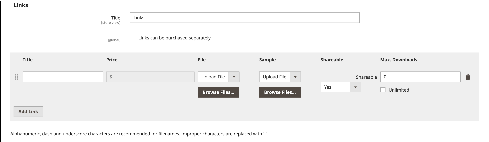

# Prodotto scaricabile

Un prodotto scaricabile può essere qualsiasi cosa sia possibile consegnare come file, ad esempio un eBook, musica, video, applicazione software o aggiornamento. È possibile offrire un album in vendita e vendere ogni singola canzone. Puoi anche utilizzare un prodotto scaricabile per distribuire una versione elettronica del catalogo dei prodotti.

Poiché il download è disponibile solo dopo l’acquisto, puoi fornire esempi, ad esempio un estratto da un libro, un clip da un file audio o un trailer da un video. Un esempio è qualcosa che il cliente può provare prima di acquistare il prodotto. I file che rendi disponibili per il download possono essere caricati sul tuo server o da un altro server.

{width="700" zoomable="yes"}

I prodotti scaricabili possono essere configurati in modo da richiedere che il cliente acceda a un account per ricevere il collegamento oppure possano essere inviati tramite e-mail e condivisi con altri utenti. Lo stato dell’ordine prima che il download diventi disponibile, i valori predefiniti e altre opzioni di consegna sono impostati nella configurazione. Quando pianifichi le aggiunte al catalogo scaricabili, tieni presente quanto segue:

- I prodotti scaricabili possono essere caricati sul server o collegati a da un altro server su Internet.

- Puoi determinare quante volte un cliente può scaricare un prodotto.

- Ai clienti che acquistano un prodotto scaricabile può essere richiesto di effettuare l’accesso prima di procedere al pagamento.

- La consegna di un prodotto scaricabile può essere effettuata quando l&#39;ordine è nello stato `Pending` o `Invoiced`.

- Poiché i prodotti scaricabili non vengono spediti, il passaggio _Spedizione_ dell&#39;estrazione viene ignorato quando il carrello contiene solo il prodotto scaricabile.

## Configurare le opzioni di download

Le impostazioni di configurazione scaricabili determinano i valori predefiniti e le opzioni di consegna per i prodotti scaricabili e specificano se gli ospiti possono acquistare i download.

1. Nella barra laterale _Admin_, passa a **[!UICONTROL Stores]** > _[!UICONTROL Settings]_>**[!UICONTROL Configuration]**.

1. Nel pannello a sinistra, espandi **[!UICONTROL Catalog]** e scegli **[!UICONTROL Catalog]** sotto.

1. Espandere  nella sezione _[!UICONTROL Downloadable Product Options]_.

   {width="700" zoomable="yes"}

   Per un elenco dettagliato di queste opzioni di configurazione, vedi [_Opzioni di prodotto scaricabili_](../configuration-reference/catalog/catalog.md#downloadable-product-options) nella _Guida di riferimento alla configurazione_.

1. Per determinare lo stato del processo dell&#39;ordine quando il download diventa disponibile, impostare **[!UICONTROL Order Item Status to Enable Downloads]** su una delle seguenti opzioni:

   - `Pending`
   - `Invoiced`

1. Per impostare un limite predefinito per il numero di download che un singolo cliente può effettuare, immettere il numero per **[!UICONTROL Default Maximum Number of Downloads]**.

1. Imposta **[!UICONTROL Shareable]** su uno dei seguenti:

   - `Yes` - Consente ai clienti di inviare ad altri tramite e-mail il collegamento per il download.
   - `No` - Impedisce ai clienti di condividere il collegamento di download con altri utenti richiedendo ai clienti di accedere ai propri account per accedere ai collegamenti di download.

1. Per **[!UICONTROL Default Sample Title]**, immettere l&#39;intestazione che si desidera visualizzare sopra la selezione dei campioni.

   {width="400"}

1. Per **[!UICONTROL Default Link Title]**, immettere il testo predefinito che si desidera utilizzare per i collegamenti di download.

1. Se si desidera aprire il collegamento di download in una nuova finestra del browser, impostare **[!UICONTROL Opens Links in New Window]** su `Yes`.

   Questa impostazione viene utilizzata per mantenere aperta la finestra del browser per il tuo store.

1. Per determinare la modalità di distribuzione del contenuto scaricabile, impostare **[!UICONTROL Use Content Disposition]** su uno dei seguenti valori:

   - `Attachment` - Fornisce il collegamento per il download tramite e-mail come allegato.
   - `Inline` - Fornisce il collegamento di download come collegamento in una pagina Web.

1. Se si desidera richiedere agli acquirenti la registrazione per un account cliente e l&#39;accesso prima di acquistare un download, impostare **[!UICONTROL Disable Guest Checkout if Cart Contains Downloadable Items]** su `Yes`.

1. Al termine, fare clic su **[!UICONTROL Save Config]**.

## Creare un prodotto scaricabile

Le istruzioni seguenti illustrano il processo di creazione di un prodotto scaricabile utilizzando un [modello di prodotto](attribute-sets.md), campi obbligatori e impostazioni di base. Ogni campo obbligatorio è contrassegnato da un asterisco rosso (`*`). Al termine delle nozioni di base, puoi completare le altre impostazioni del prodotto in base alle esigenze.

>[!NOTE]
>
>I nomi dei file scaricabili possono includere lettere e numeri. È possibile utilizzare un trattino o un carattere di sottolineatura per rappresentare uno spazio tra le parole. Eventuali caratteri non validi nel nome del file vengono sostituiti da un carattere di sottolineatura.

### Passaggio 1: scegliere il tipo di prodotto

1. Nella barra laterale _Admin_, passa a **[!UICONTROL Catalog]** > **[!UICONTROL Products]**.

1. Scegliere `Downloadable Product` dal menu _[!UICONTROL Add Product]_( {width="25"} ) nell&#39;angolo superiore destro.

   {width="700" zoomable="yes"}

### Passaggio 2: scegliere la serie di attributi

I dati di esempio includono un [set di attributi](attribute-sets.md) denominato _Downloadable_ con campi speciali per i prodotti scaricabili. Puoi utilizzare un modello esistente o crearne un altro prima di salvare il prodotto.

Per scegliere la serie di attributi utilizzata come modello per il prodotto, effettuare una delle seguenti operazioni:

- Per **[!UICONTROL Search]**, immettere il nome del set di attributi.

- Nell&#39;elenco, scegliere il set di attributi `Downloadable`.

Il modulo viene aggiornato per riflettere la modifica.

{width="600" zoomable="yes"}

### Passaggio 3: completare le impostazioni richieste

1. Immettere **[!UICONTROL Product Name]**.

1. Accettare **[!UICONTROL SKU]** predefinito basato sul nome del prodotto o immetterne un altro.

1. Immettere il prodotto **[!UICONTROL Price]**.

1. Poiché il prodotto non è ancora pronto per la pubblicazione, impostare **[!UICONTROL Enable Product]** su `No`.

1. fare clic su **[!UICONTROL Save]** e continuare.

   Quando il prodotto viene salvato, il selettore [Visualizzazione store](introduction.md#product-scope) viene visualizzato nell&#39;angolo superiore sinistro.

1. Scegliere **[!UICONTROL Store View]** in cui il prodotto deve essere disponibile.

   {width="600" zoomable="yes"}

### Passaggio 4: completare le impostazioni di base

1. Imposta **[!UICONTROL Tax Class]** su uno dei seguenti:

   - `None`
   - `Taxable Goods`

1. Immettere il **[!UICONTROL Quantity]** del prodotto in magazzino.

   Prendi nota di quanto segue:

   - Per impostazione predefinita, **[!UICONTROL Stock Status]** è impostato su `Out of Stock`.

   - Poiché i prodotti scaricabili non sono spediti, il campo **[!UICONTROL Weight]** non viene utilizzato. Se abiliti questa funzione, diventerà un [prodotto semplice](product-create-simple.md) e il _prodotto scaricabile?Impossibile utilizzare la scheda_.

   >[!NOTE]
   >
   >Se abiliti [Inventory management](../inventory-management/introduction.md), gli esercenti di Source singoli impostano la quantità in questa sezione. Gli esercenti Multi Source aggiungono origini e quantità nella sezione Origini. Consulta la seguente sezione _Assegnare origini e quantità (Inventory management)_.

1. Accettare l&#39;impostazione **[!UICONTROL Visibility]** predefinita di `Catalog, Search`.

1. Per inserire il prodotto nell&#39;elenco [ dei nuovi prodotti](../content-design/widget-new-products-list.md), selezionare la casella di controllo **[!UICONTROL Set Product as New]**.

1. Per assegnare _[!UICONTROL Categories]_al prodotto, fare clic sulla casella **[!UICONTROL Select…]**ed eseguire una delle operazioni seguenti:

   **Scegliere una categoria esistente**:

   - Inizia a digitare nella casella fino a trovare una corrispondenza.

   - Selezionare la casella di controllo di ciascuna categoria da assegnare.

   **Crea una categoria**:

   - Fare clic su **[!UICONTROL New Category]**.

   - Immettere **[!UICONTROL Category Name]** e scegliere **[!UICONTROL Parent Category]**, che ne determina la posizione nella [struttura menu](category-root.md).

   - Fare clic su **[!UICONTROL Create Category]**.

1. Imposta **[!UICONTROL Format]** su uno dei seguenti:

   - `Download`
   - `DVD`

   Se necessario, è possibile modificare l&#39;[attributo](attribute-product-create.md) per aggiungere altri valori.

   Potrebbero essere presenti attributi aggiuntivi che descrivono il prodotto. La selezione varia in base al set di attributi e può essere completata in un secondo momento.

#### Assegna origini e quantità ([!DNL Inventory Management])

{{$include /help/_includes/inventory-assign-sources.md}}

### Passaggio 5: completare le informazioni scaricabili

Scorrere verso il basso, espandere  nella sezione _[!UICONTROL Downloadable Information]_e selezionare la casella di controllo **[!UICONTROL Is this downloadable product?]**.

Se abilitata, la sezione _[!UICONTROL Downloadable Information]_è composta da due parti. La prima parte descrive ogni collegamento di download e la seconda descrive ogni file di esempio. Il valore predefinito per molte di queste opzioni può essere impostato nella [configurazione](#configure-the-download-options).

{width="600" zoomable="yes"}

#### Completa i collegamenti

1. Nella sezione _[!UICONTROL Links]_, immetti **[!UICONTROL Title]**che desideri utilizzare come intestazione per i collegamenti di download.

1. Se applicabile, selezionare la casella di controllo **[!UICONTROL Links can be purchased separately]**.

1. Fare clic su **[!UICONTROL Add Link]** ed effettuare le seguenti operazioni:

   - Immettere **[!UICONTROL Title]** e **[!UICONTROL Price]** del download.

   - Per entrambi i file **[!UICONTROL File]** e **[!UICONTROL Sample]**, scegliere uno dei seguenti metodi di distribuzione per i download:

      - `Upload File` - Scegliere questo metodo per caricare il file di distribuzione sul server. Individua il file e selezionalo per il caricamento.
      - `URL` - Scegliere questo metodo per accedere al file di distribuzione da un URL. Immettere l&#39;URL completo del file di download.

   >[!NOTE]
   >
   >Non è possibile utilizzare collegamenti a risorse esterne come prodotti scaricabili. I domini di collegamento validi sono predefiniti a livello di programmazione nel file `env.php` (vedi [riferimento env.php](https://experienceleague.adobe.com/docs/commerce-operations/configuration-guide/files/config-reference-envphp.html) nella _Guida alla configurazione_).

   - Imposta **[!UICONTROL Shareable]** su uno dei seguenti:

      - `No` - Richiede ai clienti di accedere ai propri account per accedere al collegamento di download.

      - `Yes` - Invia il collegamento per e-mail, che i clienti possono condividere con altri.

      - `Use Config` - Utilizza il metodo specificato nella configurazione di [Opzioni prodotto scaricabili](../configuration-reference/catalog/catalog.md).

   - Effettuare una delle seguenti operazioni:

      - Per limitare i download per cliente, immettere il numero massimo per **[!UICONTROL Max. Downloads]**.
      - Per consentire download illimitati, selezionare la casella di controllo **[!UICONTROL Unlimited]**.

   {width="600" zoomable="yes"}

1. Per aggiungere un altro collegamento, fare clic su **[!UICONTROL Add Link]** e ripetere i passaggi seguenti.

#### Completa gli esempi

1. Nella sezione _[!UICONTROL Samples]_, immetti **[!UICONTROL Title]**che desideri utilizzare come intestazione per i campioni.

1. Per completare le informazioni per ogni campione, fare clic su **[!UICONTROL Add Link]**.

   {width="600" zoomable="yes"}

1. Completa il collegamento come segue:

   - Immettere il **[!UICONTROL Title]** del singolo campione.

   - Scegliere uno dei seguenti metodi di distribuzione:

      - `Upload File` - Scegliere questo metodo per caricare il file di distribuzione sul server. Individua il file e selezionalo per il caricamento.
      - `URL` - Scegliere questo metodo per accedere al file di distribuzione da un URL. Immettere l&#39;URL completo del file di download.

   - Per aggiungere un altro esempio, fare clic su **[!UICONTROL Add Link]** e ripetere i passaggi seguenti.

   - Per modificare l&#39;ordine dei campioni, afferrare l&#39;icona _Cambia ordine_ (  ) e trascinare il campione in una nuova posizione.

### Passaggio 6: Completare le informazioni sul prodotto

Scorri verso il basso e completa le informazioni nelle sezioni seguenti, in base alle esigenze:

- [Contenuto](product-content.md)
- [Immagini e video](product-images-and-video.md)
- [Ottimizzazione motore di ricerca](product-search-engine-optimization.md)
- [Prodotti correlati, up-selling e cross-selling](related-products-up-sells-cross-sells.md)
- [Opzioni personalizzabili](settings-advanced-custom-options.md)
- [Prodotti nei siti Web](settings-basic-websites.md)
- [Progettazione](settings-advanced-design.md)
- [Opzioni regalo](product-gift-options.md)

### Passaggio 7: Publish del prodotto

Se si è pronti a pubblicare il prodotto nel catalogo, impostare **[!UICONTROL Enable Product]** su `Yes` ed eseguire una delle operazioni seguenti:

**Metodo 1:** Salvataggio e anteprima

- Nell&#39;angolo superiore destro fare clic su **[!UICONTROL Save]**.

- Per visualizzare il prodotto nell&#39;archivio, scegli **[!UICONTROL Customer View]** nel menu _Amministratore_ (  ).

  L’archivio si apre in una nuova scheda del browser.

  {width="600" zoomable="yes"}

**Metodo 2:** Salva e chiudi

Scegliere **[!UICONTROL Save & Close]** dal menu _[!UICONTROL Save]_( {width="25"} ).

## Esperienza vetrina

Nel dashboard dell&#39;account cliente, la pagina _[!UICONTROL My Downloadable Products]_è collegata a ogni ordine di prodotti scaricabili. I download diventano disponibili dal conto del cliente quando l&#39;ordine è completato.

{width="700" zoomable="yes"}

Nella tabella seguente sono descritti i valori di _Prodotti scaricabili_:

| Colonna | Descrizione |
|--- |--- |
| [!UICONTROL Order#] | L&#39;[ordine](../stores-purchase/orders.md) in cui è stato acquistato il prodotto scaricabile. Fornisce un collegamento ai dettagli dell’ordine. |
| [!UICONTROL Date] | Data di creazione ordine. |
| [!UICONTROL Title] | Il nome del prodotto scaricabile acquistato con l’ordine. Fornisce un collegamento al prodotto scaricabile. |
| [!UICONTROL Status] | Stato elaborazione ordine. |
| [!UICONTROL Remaining Downloads] | Numero di download disponibili del prodotto scaricato. |

_**Per scaricare un file di prodotto dal dashboard account**_

1. Nel dashboard account, il cliente sceglie **[!UICONTROL My Downloadable Products]**.

1. Trova l’ordine nell’elenco e fa clic sul collegamento dopo il titolo.

1. Nell&#39;angolo inferiore destro della finestra di download, fai clic sull&#39;icona _download_.

1. Individua il file nel percorso di download e lo salva nel percorso desiderato.
