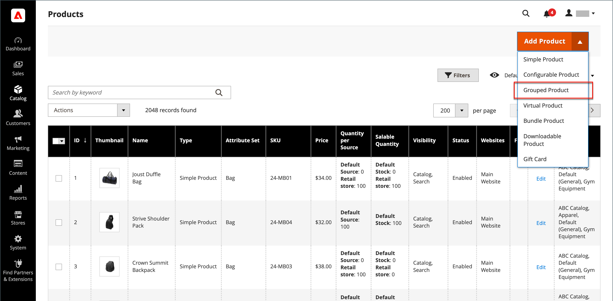

# Prodotto raggruppato

Un prodotto raggruppato è costituito da semplici prodotti autonomi presentati come un gruppo. Puoi offrire varianti di un singolo prodotto o raggrupparle per stagione o tema. Presentare un prodotto raggruppato può incentivare i clienti ad acquistare articoli aggiuntivi. Un prodotto raggruppato offre un modo semplice per offrire varianti di un prodotto e elencarle tutte sulla stessa pagina.

Ad esempio, è possibile vendere flatware open stock e elencare ogni tipo di utensile utilizzato in un luogo formale. Alcuni potrebbero ordinare più forchette per insalata, forchette di pesce, forchette per la cena, coltelli per la cena, coltelli per il pesce, coltelli per il burro, cucchiai da minestra e cucchiai da dessert. Altri clienti potrebbero ordinare una semplice forchetta, un coltello e un cucchiaio. I clienti possono ordinare qualsiasi numero di ogni elemento come desiderano.

Anche se vengono presentati come un gruppo, ogni prodotto del gruppo viene acquistato come un articolo separato. Nel carrello, ogni articolo e la quantità acquistata vengono visualizzati come una riga distinta.

Le istruzioni seguenti illustrano il processo di creazione di un prodotto raggruppato utilizzando un [modello di prodotto](attribute-sets.md), campi obbligatori e impostazioni di base. Ogni campo obbligatorio è contrassegnato da un asterisco rosso (`*`). Al termine delle nozioni di base, puoi completare le altre impostazioni del prodotto in base alle esigenze.

{width="700" zoomable="yes"}

## Passaggio 1: scegliere il tipo di prodotto

1. Il giorno _Amministratore_ barra laterale, vai a **[!UICONTROL Catalog]** > **[!UICONTROL Products]**.

1. Il giorno _[!UICONTROL Add Product]_( {width="25"} ) nell&#39;angolo superiore destro, scegliere **[!UICONTROL Grouped Product]**.

   {width="700" zoomable="yes"}

## Passaggio 2: scegliere la serie di attributi

Per scegliere il [set di attributi](attribute-sets.md) utilizzato come modello per il prodotto, eseguire una delle operazioni seguenti:

- Per eseguire la ricerca, immettere il nome del **[!UICONTROL Attribute Set]**.
- Nell&#39;elenco, scegliere il set di attributi che si desidera utilizzare.

Il modulo viene aggiornato per riflettere la modifica.

{width="600" zoomable="yes"}

Se gli attributi necessari non esistono, puoi aggiungere nuovi attributi durante la creazione di un prodotto:

- Nell’angolo superiore destro, fai clic su **[!UICONTROL Add Attribute]**.
- Definire un nuovo attributo (vedere [Aggiunta di un attributo a un prodotto](product-attributes-add.md)).

  {width="600" zoomable="yes"}

Per aggiungere un attributo esistente al prodotto, utilizza [controlli filtro](../getting-started/admin-grid-controls.md) per trovare l&#39;attributo nella griglia ed eseguire le operazioni seguenti:

- Selezionare la casella di controllo nella prima colonna di ogni attributo da aggiungere.
- Clic **[!UICONTROL Add Selected]**.

## Passaggio 3: completare le impostazioni richieste

1. Inserisci il **[!UICONTROL Product Name]**.

1. Accetta il valore predefinito **[!UICONTROL SKU]** in base al nome del prodotto o immettine un altro.

   Nota che **[!UICONTROL Quantity]** non è disponibile perché il valore è derivato dai singoli prodotti che compongono il gruppo.

1. Poiché il prodotto non è ancora pronto per la pubblicazione, imposta **[!UICONTROL Enable Product]** a `No` (  ).

1. Clic **[!UICONTROL Save]** e continua.

   Quando il prodotto viene salvato, il nome del prodotto viene visualizzato nella parte superiore della pagina e [Visualizzazione store](introduction.md#product-scope) selettore viene visualizzato nell&#39;angolo superiore sinistro.

1. Scegli la **[!UICONTROL Store View]** dove il prodotto deve essere disponibile.

   {width="600" zoomable="yes"}

## Passaggio 4: completare le impostazioni di base

1. Accetta **[!UICONTROL Stock Status]** impostazione di `In Stock`.

1. Da assegnare **[!UICONTROL Categories]** al prodotto, fai clic su **[!UICONTROL Select…]** ed effettuare una delle seguenti operazioni:

   **Scegli una categoria esistente:**

   - Inizia a digitare nella casella fino a trovare una corrispondenza.

   - Selezionare la casella di controllo della categoria da assegnare.

   **Creare una categoria:**

   - Clic **[!UICONTROL New Category]**.

   - Inserisci il **[!UICONTROL Category Name]** e scegli la **[!UICONTROL Parent Category]**, che ne determina la posizione nella struttura del menu.

   - Clic **[!UICONTROL Create Category]**.

1. Accetta **[!UICONTROL Visibility]** impostazioni di `Catalog, Search`.

1. Per inserire il prodotto in [elenco di nuovi prodotti](../content-design/widget-new-products-list.md), scegli il **[!UICONTROL Set Product as New]** **[!UICONTROL from]** e **[!UICONTROL to]** date nel calendario.

1. Scegli la **[!UICONTROL Country of Manufacture]**.

   Potrebbero essere presenti singoli attributi aggiuntivi che descrivono il prodotto. La selezione varia a seconda del set di attributi e può essere completata in un secondo momento.

## Passaggio 5: aggiungere prodotti al gruppo

1. Scorri verso il basso fino a **[!UICONTROL Grouped Products]** e fai clic su **[!UICONTROL Add Products to Group]**.

   {width="600" zoomable="yes"}

1. Se necessario, utilizzare [filtri](../getting-started/admin-grid-controls.md) per trovare i prodotti da includere nel gruppo.

1. Nell&#39;elenco selezionare la casella di controllo di ogni elemento che si desidera includere nel gruppo.

   >[!NOTE]
   >
   >Solo i prodotti semplici, scaricabili e virtuali senza opzioni configurabili possono essere raggruppati come prodotti secondari. Altri tipi di prodotto non vengono visualizzati nell&#39;elenco di selezione.

   {width="600" zoomable="yes"}

1. Per aggiungerli al gruppo di prodotti, fai clic su **[!UICONTROL Add Selected Products]**.

   I prodotti selezionati vengono visualizzati nel _[!UICONTROL Grouped Products]_sezione.

   Per commercianti multi-sorgente con [Inventory management](../inventory-management/sources-stocks.md), la griglia include **[!UICONTROL Quantity per Source]** colonna con ciascuna origine e quantità di scorte di magazzino assegnate.

   {width="600" zoomable="yes"}

1. Immetti un **[!UICONTROL Default Quantity]** per uno qualsiasi degli elementi.

1. Per modificare l’ordine dei prodotti, acquisisci _Cambia ordine_ icona (  ) nella prima colonna e trascinare il prodotto nella nuova posizione nell&#39;elenco.

1. Per rimuovere un prodotto dal gruppo, fai clic su **[!UICONTROL Remove]**.

## Passaggio 5: Completare le informazioni sul prodotto

Compila le informazioni nelle sezioni seguenti secondo necessità:

- [Contenuto](product-content.md)
- [Immagini e video](product-images-and-video.md)
- [Ottimizzazione motore di ricerca](product-search-engine-optimization.md)
- [Prodotti correlati, up-selling e cross-selling](related-products-up-sells-cross-sells.md)
- [Opzioni personalizzabili](settings-advanced-custom-options.md)
- [Prodotti nei siti Web](settings-basic-websites.md)
- [Progettazione](settings-advanced-design.md)
- [Opzioni regalo](product-gift-options.md)

## Passaggio 6: pubblicare il prodotto

1. Se sei pronto per pubblicare il prodotto nel catalogo, imposta **[!UICONTROL Enable Product]** a `Yes`.

1. Effettuare una delle seguenti operazioni:

   **Metodo 1:** Salva e visualizza anteprima

   - Nell’angolo superiore destro, fai clic su **[!UICONTROL Save]**.

   - Per visualizzare il prodotto nel tuo negozio, scegli **[!UICONTROL Customer View]** il _Amministratore_ (  ).

     L’archivio si apre in una nuova scheda del browser.

     {width="700" zoomable="yes"}

   **Metodo 2:** Salva e chiudi

   - Il giorno _[!UICONTROL Save]_( {width="25"} ), scegliere **[!UICONTROL Save & Close]**.

## Passaggio 7: configurare le miniature del carrello (facoltativo)

Se hai un’immagine diversa per ciascun prodotto del gruppo, puoi impostare la configurazione in modo da utilizzare l’immagine corretta per la miniatura del carrello acquisti.

1. Il giorno _Amministratore_ barra laterale, vai a **[!UICONTROL Stores]** > _[!UICONTROL Settings]_>**[!UICONTROL Configuration]**.

1. Nel pannello a sinistra, espandi **[!UICONTROL Sales]** e scegli **[!UICONTROL Checkout]**.

1. Espandi  il **[!UICONTROL Shopping Cart]**.

   Per un elenco dettagliato di queste opzioni di configurazione, vedi [Carrello](../configuration-reference/sales/checkout.md#shopping-cart) nel _Riferimento configurazione_.

1. Imposta **[!UICONTROL Grouped Product Image]** a `Product Thumbnail Itself`.

   {width="600" zoomable="yes"}

   Se necessario, deselezionare la **[!UICONTROL Use system value]** per impostare questa opzione.

1. Clic **[!UICONTROL Save Config]**.

## Aspetti da ricordare

- Un prodotto raggruppato è essenzialmente una raccolta di semplici prodotti associati.

- I prodotti secondari raggruppati possono essere prodotti semplici, scaricabili o virtuali **[!UICONTROL without custom options]**.

- Ogni articolo acquistato viene visualizzato singolarmente nel carrello, anziché come parte del gruppo.

- L’immagine miniatura nel carrello può essere impostata in modo da visualizzare l’immagine dal prodotto principale raggruppato o dal prodotto associato.
