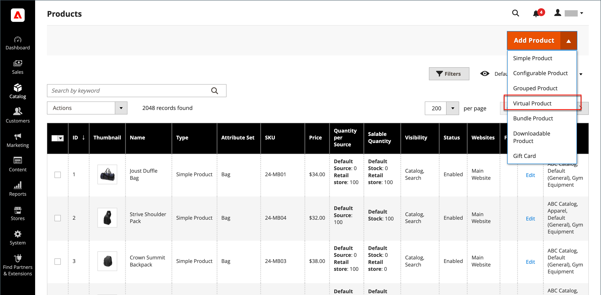

# Prodotto virtuale

I prodotti virtuali, o beni digitali, rappresentano elementi non tangibili come appartenenze, servizi, garanzie o abbonamenti e download digitali di libri, musica, video o altri prodotti. I prodotti virtuali possono essere venduti singolarmente o inclusi nel [Prodotto Raggruppato](product-create-grouped.md), [Prodotto configurabile](product-create-configurable.md), o [Prodotto bundle](product-create-bundle.md) tipi di prodotto.

A parte l&#39;assenza del _[!UICONTROL Weight]_, il processo di creazione di un prodotto virtuale e di un prodotto semplice è lo stesso. Le istruzioni seguenti illustrano il processo di creazione di un prodotto virtuale utilizzando un [modello di prodotto](attribute-sets.md), campi obbligatori e impostazioni di base. Al termine delle nozioni di base, puoi completare le altre impostazioni del prodotto in base alle esigenze.

>[!NOTE]
>
>PayPal ha dichiarato obsoleto il supporto per la vendita di beni digitali tramite PayPal Express Checkout. Si consiglia di utilizzare uno dei seguenti [Pagamenti PayPal Standard](../stores-purchase/paypal-payments-standard.md) o qualsiasi altro gateway di pagamento PayPal per elaborare qualsiasi ordine che includa prodotti virtuali.

{width="700" zoomable="yes"}

## Passaggio 1: scegliere il tipo di prodotto

1. Il giorno _Amministratore_ barra laterale, vai a **[!UICONTROL Catalog]** > **[!UICONTROL Products]**.

1. Il giorno _[!UICONTROL Add Product]_( {width="25"} ) nell&#39;angolo superiore destro, scegliere **[!UICONTROL Virtual Product]**.

   {width="700" zoomable="yes"}

## Passaggio 2: scegliere la serie di attributi

Per scegliere il [set di attributi](attribute-sets.md) utilizzato come modello per il prodotto, eseguire una delle operazioni seguenti:

- Fai clic su nella **[!UICONTROL Attribute Set]** e immettere tutto o parte del nome della serie di attributi.

- Nell&#39;elenco visualizzato scegliere il set di attributi che si desidera utilizzare.

Il modulo viene aggiornato per riflettere la modifica.

{width="600" zoomable="yes"}

## Passaggio 3: completare le impostazioni richieste

1. Inserisci il **[!UICONTROL Product Name]**.

1. Accetta il valore predefinito **[!UICONTROL SKU]** in base al nome del prodotto o immettine un altro.

1. Inserisci il prodotto **[!UICONTROL Price]**.

1. Poiché il prodotto non è ancora pronto per la pubblicazione, imposta **[!UICONTROL Enable Product]** a `No`.

1. Clic **[!UICONTROL Save]** e continua.

   Quando il prodotto viene salvato, la [Visualizzazione store](introduction.md#product-scope) selettore viene visualizzato nell&#39;angolo superiore sinistro.

1. Scegli la **[!UICONTROL Store View]** dove il prodotto deve essere disponibile.

   {width="600" zoomable="yes"}

## Passaggio 4: completare le impostazioni di base

1. Imposta **[!UICONTROL Tax Class]** a uno dei seguenti elementi:

   - `None`
   - `Taxable Goods`

1. Inserisci il **[!UICONTROL Quantity]** del prodotto in magazzino ed effettuare le seguenti operazioni:

   - Accetta il valore predefinito **[!UICONTROL Stock Status]** impostazione di `In Stock`.

     Poiché un prodotto virtuale non viene spedito, il **[!UICONTROL Weight]** non è utilizzato.

   - Accetta il valore predefinito **[!UICONTROL Visibility]** impostazione di `Catalog, Search`.

   >[!NOTE]
   >
   >Se si abilita [Inventory management](../inventory-management/introduction.md), gli esercenti con una sola origine impostano la quantità in questa sezione. I commercianti con più origini aggiungono origini e quantità nella sezione Origini. Vedi quanto segue _Assegna origini e quantità (Inventory management)_ sezione.

1. Da assegnare **[!UICONTROL Categories]** al prodotto, fai clic su **[!UICONTROL Select…]** ed effettuare una delle seguenti operazioni:

   **Scegli una categoria esistente**:

   - Inizia a digitare nella casella fino a trovare una corrispondenza.

   - Selezionare la casella di controllo della categoria da assegnare.

   **Creare una categoria**:

   - Clic **[!UICONTROL New Category]**.

   - Inserisci il **[!UICONTROL Category Name]** e scegli la **[!UICONTROL Parent Category]**, che ne determina la posizione nella struttura del menu.

   - Clic **[!UICONTROL Create Category]**.

   Potrebbero essere presenti singoli attributi aggiuntivi che descrivono il prodotto. La selezione varia in base al set di attributi e può essere completata in un secondo momento.

### Assegna origini e quantità ([!DNL Inventory Management])

{{$include /help/_includes/inventory-assign-sources.md}}

## Passaggio 5: Completare le informazioni sul prodotto

Compila le informazioni nelle sezioni seguenti secondo necessità:

- [Contenuto](product-content.md)
- [Immagini e video](product-images-and-video.md)
- [Ottimizzazione motore di ricerca](product-search-engine-optimization.md)
- [Prodotti correlati, up-selling e cross-selling](related-products-up-sells-cross-sells.md)
- [Opzioni personalizzabili](settings-advanced-custom-options.md)
- [Prodotti nei siti Web](settings-basic-websites.md)
- [Progettazione](settings-advanced-design.md)
- [Opzioni regalo](product-gift-options.md)

>[!NOTE]
>
>Il _[!UICONTROL Is this downloadable product?]_è disattivata per impostazione predefinita. L&#39;abilitazione di questa funzione per un prodotto virtuale rende il prodotto [Download disponibile](product-create-downloadable.md#downloadable-product).

## Passaggio 6: pubblicare il prodotto

1. Se sei pronto per pubblicare il prodotto nel catalogo, imposta **[!UICONTROL Enable Product]** a `Yes`.

1. Effettuare una delle seguenti operazioni:

   - **Metodo 1:** Salva e visualizza in anteprima

      - Nell’angolo superiore destro, fai clic su **[!UICONTROL Save]**.

      - Per visualizzare il prodotto nel tuo negozio, scegli **[!UICONTROL Customer View]** il _Amministratore_ (  ).

     L’archivio si apre in una nuova scheda del browser.

     {width="600" zoomable="yes"}

   - **Metodo 2:** Salva e chiudi

     Il giorno _[!UICONTROL Save]_({width="25"} ), scegliere **[!UICONTROL Save & Close]**.

## Aspetti da ricordare

- I prodotti virtuali sono utilizzati per prodotti non tangibili come servizi, abbonamenti e garanzie.

- I prodotti virtuali sono molto simili ai prodotti semplici, ma privi di peso.

- Le opzioni di spedizione non vengono visualizzate durante il pagamento a meno che non sia presente un prodotto tangibile nel carrello.
